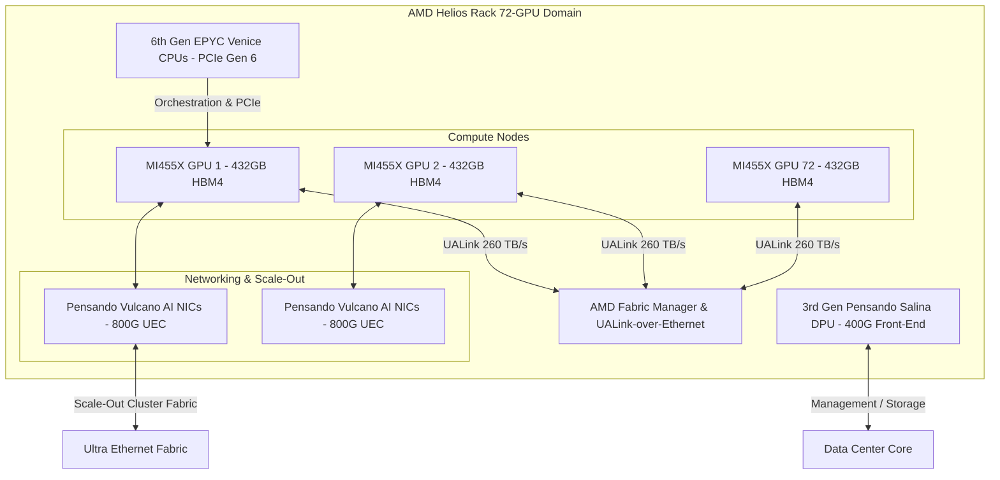

# **AMD's Helios Gambit: Inside the Open-Standards 72-GPU Rack Challenging Nvidia's Closed-Loop Monopoly**

##

At AMD’s "Advancing AI 2026" summit in San Francisco, CEO Dr. Lisa Su unveiled the company's most aggressive architectural play yet: AMD Helios, a fully integrated, liquid-cooled, Open Compute Project (OCP) standard rack. Packing 72 Instinct MI455X GPUs, Venice EPYC CPUs, and Pensando networking, Helios represents AMD's attempt to commoditize rack-scale AI infrastructure and break NVIDIA’s lucrative lock on the enterprise AI data center. 

But behind the marketing fanfare lies a hyper-dense battleground of thermal engineering, silicon packaging, and software compilation layers. 

#### Architectural Specs: CDNA 5, Venice, and the Pensando Stack
The Helios rack is structured as an Open Rack Wide platform, co-designed to meet OCP standards. The absolute core of its compute density is the **AMD Instinct MI455X GPU**, built on the new **CDNA 5 architecture**. In a bid to bypass TSMC’s capacity bottlenecks, AMD utilizes a multi-chiplet configuration combining TSMC’s advanced **2nm (N2)** and **3nm (N3P)** process nodes, totaling a staggering 320 billion transistors.

*   **HBM4 Memory Density & Bandwidth:** Each MI455X GPU is loaded with **432 GB of HBM4 memory** distributed across 12 physical stacks. AMD delivers a peak memory bandwidth of **23.3 TB/s per GPU**. At the rack level, Helios aggregates a massive **31 TB of HBM4 memory** with 1.6 PB/s of total memory throughput.
*   **FLOPs and Compute Efficiency:** Under the OCP MXFP4 data type, a single Helios rack delivers up to **2.9 exaFLOPS** of peak matrix compute, scaling down to **1.4 exaFLOPS under MXFP8**. Each MI455X GPU is rated for up to 40 PFLOPS of FP4 compute.
*   **EPYC "Venice" Orchestration:** Orchestrating this massive compute array are AMD’s 6th Gen EPYC "Venice" server processors. Built on the Zen 6 microarchitecture, these CPUs feature up to 256 cores, 16-channel DDR5 memory support, and PCIe Gen 6 lanes to feed data to the GPUs.
*   **Networking Stack:** For scale-out clustering, Helios integrates AMD Pensando **Vulcano 800G AI NICs** supporting the Ultra Ethernet Consortium (UEC) transport protocol, delivering 2.4 Tbps of network bandwidth per GPU. The front-end management, storage, and security are offloaded to 3rd Gen Pensando **Salina DPUs** running at 400G.

#### Interconnect Battle: UALink vs. NVLink
The biggest differentiator for Helios is AMD's rejection of proprietary scale-up fabrics. Nvidia's NVL72 relies on its closed-source NVLink switch network, which enforces a steep margin premium. AMD, conversely, has built Helios around the **Ultra Accelerator Link (UALink)** standard.

Helios uses **UALink-over-Ethernet (UALoE)** via an open AMD Fabric Manager. The system establishes a unified 72-GPU memory-sharing domain with **260 TB/s of aggregate intra-rack bandwidth**. By leveraging Ethernet physical layers, hyperscalers can avoid custom optical components and proprietary transceivers, significantly lowering the total cost of ownership (TCO).

#### Comparing Helios, Blackwell, and Rubin NVL72
AMD has positioned Helios as a direct competitor to Nvidia's upcoming **Vera Rubin NVL72** platform, bypassing the current-generation Blackwell NVL72 on key metrics.

| Metric | Nvidia Blackwell NVL72 | Nvidia Rubin NVL72 (Vera) | AMD Helios (MI455X) |
| :--- | :--- | :--- | :--- |
| **GPU Memory Type** | HBM3e | HBM4 | HBM4 |
| **Memory per GPU** | 192 GB | 288 GB | 432 GB |
| **Peak Bandwidth** | 8.0 TB/s | 22.0 TB/s | 23.3 TB/s |
| **Peak FP4 / MXFP4** | 1.4 ExaFLOPS | ~2.5 ExaFLOPS (Est.) | 2.9 ExaFLOPS |
| **Interconnect** | NVLink 5 (Proprietary) | NVLink 6 (Proprietary) | UALink (Open OCP) |

By shipping 432 GB of HBM4 per GPU, AMD offers **50% more memory capacity** than Nvidia's Rubin (Vera) NVL72 (288 GB) and more than double Blackwell's capacity. For developers running frontier LLMs with multi-hundred-billion parameter sizes, this high capacity allows entire models or larger context windows to sit in active memory, eliminating off-chip latency bottlenecks.

#### The Strategic Partnerships: Anthropic, Azure, and Cerebras
The hardware announcement is backed by deep-pocketed software and cloud agreements:
1.  **Anthropic's 2 GW Bet:** In a massive validation, Anthropic has committed to deploying up to **2 gigawatts (GW)** of compute capacity powered by Helios racks. The first gigawatt is scheduled to go online in the first half of 2027. To cement the deal, AMD has committed to a strategic equity investment of up to **$5 billion** in Anthropic.
2.  **Microsoft Azure Scaling:** Microsoft announced it will deploy Helios at scale within Azure's infrastructure to run high-throughput inference for its agentic AI workloads, diversifying its reliance on Nvidia.
3.  **Cerebras Disaggregated Inference:** AMD and Cerebras are partnering to build a disaggregated system. In this architecture, AMD Helios handles massive-scale prompt processing and long context window retrieval, while the Cerebras Wafer-Scale Engine (WSE) handles ultra-fast, low-latency token generation.

#### The Software Moat: ROCm 7 vs. CUDA
The hardware specs are impressive, but Nvidia’s ultimate moat is **CUDA**. For years, developers complained that writing code for AMD was a frustrating exercise in translation. George Hotz, founder of tiny corp, famously ranted in 2023: *"AMD's Kernel will never be good for machine learning... the driver is still very unstable, and when it crashes or hangs we have no way of debugging it."*

AMD’s answer is **ROCm 7** and the newly announced **ROCm.ai** platform. Rather than forcing developers to rewrite CUDA code, AMD is focusing upstream on compilation layers like **OpenAI Triton** and **PyTorch**. Since modern AI workloads are increasingly written in PyTorch, JAX, or Python-level Triton, the underlying hardware instruction sets are abstracted away. ROCm 7 features **AOTriton** (Ahead-of-Time Triton) to compile highly optimized kernels for attention mechanisms automatically.

Furthermore, Anthropic’s engineering team is entering a multi-year collaboration with AMD. Anthropic will use its Claude models to co-optimize workloads on ROCm, effectively acting as an outsourced compiler optimization team for AMD.

#### Financial Analyst and Community Sentiment
The community and market reactions represent a classic clash of philosophies:
*   **Open-Source Optimism:** On Reddit and X.com, developers are celebrating. An open rack standard means companies are not forced to buy Nvidia’s proprietary switches, cables, and optics. 
*   **Financial Skepticism:** Wall Street is more cautious. In early 2026, Dylan Patel of *SemiAnalysis* raised red flags about potential manufacturing delays for the MI455X due to HBM4 packaging yields, predicting that first production tokens wouldn't generate until Q2 2027. While Lisa Su disputed these reports as "BS" and maintains that Helios is on target for H2 2026, the market remains sensitive to any production slippage. If AMD cannot deliver these units in volume by late 2026, Nvidia will extend its market lead.

***

# 4. Highlight

## 4.1 Key Questions
1. How does AMD's Helios bypass TSMC's bottlenecking packaging limits to achieve 23.3 TB/s of bandwidth?
2. Can the open UALink interconnect successfully chip away at Nvidia's proprietary NVLink ecosystem margins?
3. Will AMD's $5 billion strategic partnership with Anthropic finally close the ROCm vs. CUDA software optimization gap?

## 4.2 Highlight Text
AMD’s Helios rack-scale AI platform is a direct shot at Nvidia’s NVL72 monopoly. Integrating 72 Instinct MI455X GPUs built on the CDNA 5 architecture, Helios boasts a massive 432GB of HBM4 memory per GPU and up to 2.9 exaFLOPS under OCP MXFP4. By rejecting proprietary switches for open-standard UALink-over-Ethernet and Pensando Vulcano 800G NICs, AMD is bidding to dramatically lower hyperscaler TCO. Supported by a milestone 2 GW deployment deal with Anthropic and Azure integration, AMD is leveraging PyTorch/Triton in ROCm 7 to dismantle the CUDA moat once and for all.

## 4.3 Hashtags
#AMDAI #HeliosPlatform #InstinctMI455X #ROCm7 #AIInfrastructure #Semiconductors #NvidiaRubin
