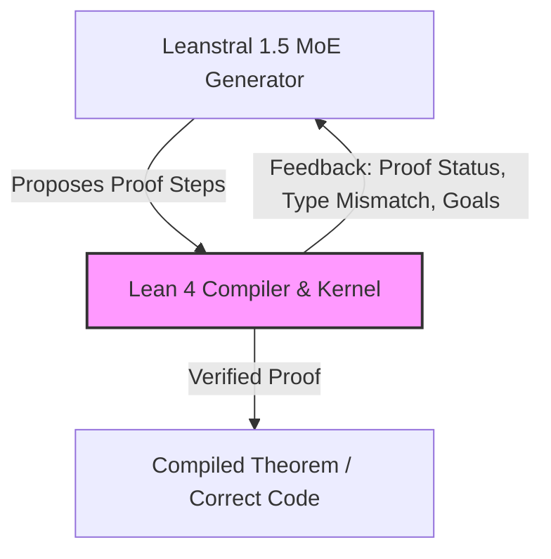

# **Beyond Code Gen: Mistral’s Leanstral 1.5, Neural-Symbolic Loops, and the Frontier of Formal Mathematics**

##

On July 2, 2026, Mistral AI released Leanstral 1.5 under an Apache 2.0 license, signaling a major shift in the open-source AI landscape. Titled *"Leanstral 1.5: Proof Abundance for All,"* the release represents a departure from traditional "vibe-coding" models that optimize for syntactic plausibility. Instead, Leanstral is a Mixture-of-Experts (MoE) system designed to interact directly with the Lean 4 compiler loop, aiming to bring formal mathematical verification and automated theorem proving to mainstream software engineering.

Historically, formal verification was an academic exercise reserved for high-stakes domains like aerospace and hardware design. With Leanstral 1.5, Mistral is attempting to democratize this process, demonstrating state-of-the-art capabilities on competitive mathematics and finding zero-day bugs in production-grade open-source repositories.

### The Neural-Symbolic Architecture of Leanstral 1.5

At the core of Leanstral 1.5 is a sparse Mixture-of-Experts (MoE) architecture containing **119 billion total parameters**, with **6.5 billion active per token**. During inference, sparse routing gates dynamically route tokens to specialized expert networks. This keeps computational costs manageable while allowing the model to hold a vast corpus of mathematical lemmas and programming semantics.

Leanstral 1.5 addresses the "long proof" challenge with a **256k token context window**. In formal mathematics, proofs are rarely self-contained; they import massive dependency trees from Lean’s standard mathematical library, **Mathlib**. When compiling a theorem, the model must maintain context across thousands of lines of imports, type definitions, and helper lemmas. A 256k context window allows Leanstral to ingest entire files and their immediate dependencies, reducing the need for aggressive retrieval-augmented generation (RAG) pruning that can strip crucial type information.

The model’s training methodology represents a shift toward reinforcement learning (RL) in closed-loop environments:
1. **Supervised Fine-Tuning (SFT):** Pre-training on formal proofs and code translation data.
2. **Reinforcement Learning with CISPO:** Mistral trained Leanstral using a specialized RL algorithm called **CISPO** (Constrained Iterative Self-Play Optimization). In this phase, Leanstral 1.5 acts as an agent in a multi-turn theorem-proving loop, interacting directly with the Lean 4 compiler. The compiler’s type checker acts as a non-hallucinating verifier: if the compiler rejects a proof step, the model receives immediate negative feedback and must backtrace and propose an alternative proof path.

This neural-symbolic loop addresses Yann LeCun’s critique of pure autoregressive LLMs. LeCun has argued that autoregressive LLMs cannot truly reason because they lack an internal world model or planning engine. By tying Leanstral to the Lean 4 compiler, Mistral has provided the model with a symbolic planning engine. The LLM handles the creative search space, while the compiler enforces logic.

### Benchmark Saturation and PutnamBench Domination

Leanstral 1.5's benchmark results show significant improvements over general-purpose models:
*   **miniF2F:** The model has fully saturated this high school-level olympiad math benchmark, achieving **100%** correctness.
*   **PutnamBench:** Out of 672 notoriously difficult undergraduate problems, Leanstral 1.5 solved **587**, a major leap from earlier models that struggled to solve even a fraction.
*   **FATE-H & FATE-X:** On the Formal Algebra Theorem Evaluation benchmarks, which evaluate advanced algebra, Leanstral 1.5 scored **87%** on FATE-H (Master’s level) and **34%** on FATE-X (PhD-level). 

These benchmarks show that Leanstral avoids the hallucinations common in general-purpose models like GPT-4 or Claude 3.5 Sonnet, which often write plausible-looking mathematical steps that contain subtle logical errors. 

Terence Tao, a Fields Medalist and advocate for Lean formalization, remarked on the broader transition: *"We are seeing the transition from mathematics as a purely manual craft to a hybrid, compiler-verified discipline. The ability of AI to explore search spaces and immediately verify them against a kernel changes how we construct proofs."*

### The Mathlib Bottleneck and the "Unformalized Math" Debate

Despite its capabilities, Leanstral 1.5 has sparked intense debate on Hacker News and Reddit. A central conflict focuses on whether compiler-integrated agents are bottlenecked by the current boundaries of Lean's **Mathlib**.

Because Leanstral relies on the Lean compiler to verify its outputs, it can only prove concepts that can be expressed in Lean 4. If a mathematical concept has not been formalized in Mathlib, the model cannot reference it. Skeptics argue that this limits the model’s ability to discover *novel* mathematics. 

One Reddit user in r/LocalLLaMA commented: *"Leanstral is incredibly good at filling in the gaps of known math, but it's fundamentally a conservative agent. It cannot invent a new mathematical paradigm because it lacks the vocabulary to express it until humans write the Lean definitions first."*

Conversely, proponents argue that the bottleneck is temporary. Leonardo de Moura, the creator of Lean and Chief Architect of the Lean Focused Research Organization (FRO), has emphasized that scaling the formalization of Mathlib will unlock new capabilities. As Mathlib grows, the model's search space expands.

### Real-World Software Engineering: Code Verification in the Wild

Beyond pure mathematics, Mistral is positioning Leanstral 1.5 as a tool for software security. Mistral evaluated the model by scanning 57 open-source repositories. The pipeline used **Aeneas**, a tool that translates Rust code into Lean 4 formal specifications.

Once the Rust code was translated to Lean 4, Leanstral 1.5 acted as an autonomous agent. It navigated files, generated formal specifications, and attempted to prove that the code met these specifications. 

The evaluation yielded:
*   **47 properties flagged** as violated.
*   **11 genuine bugs identified**, **5** of which were previously unreported zero-day vulnerabilities.

A notable example was a critical integer overflow in the `datrs/varinteger` Rust library's zigzag decoding function. The expression `(value + 1)` would overflow when the input was `Std.U64.MAX`. In debug mode, this caused a panic; in release mode, it resulted in silent data corruption. Leanstral 1.5 identified the edge case and proposed a verified patch.

On Hacker News, this case study generated debate. Some users noted that the bug had been independently reported shortly before Mistral's blog post, and argued that a standard property-based testing framework or fuzzer could have caught it. However, verification advocates pointed out that while fuzzers rely on probabilistic execution, Leanstral's proof guarantees that the bug is eliminated under all possible inputs.

### Market Implications and the Apache 2.0 Impact

Mistral’s decision to release Leanstral 1.5 under an Apache 2.0 license, alongside its free API endpoint (`labs-leanstral-1-5`), is a strategic move. By open-sourcing the weights on Hugging Face, Mistral allows enterprises to run formal verification pipelines locally. This is highly relevant for safety-critical industries like defense, medical devices, aerospace, and cryptography, where exporting proprietary code to closed APIs is not an option.

As compiler-integrated agents like Leanstral mature, the tech industry may shift from "write code, then test" to "write specifications, then generate proven code." While the developer community debates the immediate practicality of formal verification, Leanstral 1.5 shows that the integration of symbolic compilers and neural networks is moving out of research labs and into production environments.

***

# 4. Highlight

## 4.1 Key Questions
1. How does Leanstral 1.5 integrate a neural network with a symbolic compiler (Lean 4) to eliminate hallucinations?
2. Does Leanstral's dependency on Lean's Mathlib library limit its capability to discover novel, unformalized mathematics?
3. Can compiler-integrated proof agents scale to replace traditional fuzzing and property-based testing in enterprise software engineering?

## 4.2 Highlight Text
Mistral AI's Leanstral 1.5 is a Mixture-of-Experts (MoE) model (119B total parameters, 6.5B active) designed for formal proof verification. By integrating directly with the Lean 4 compiler, Leanstral 1.5 creates a closed neural-symbolic feedback loop that eliminates logical hallucinations. The model saturated the miniF2F benchmark and solved 587/672 PutnamBench problems. Beyond math, using Aeneas to translate Rust code into Lean 4, it verified real-world codebases, uncovering zero-day bugs like an integer overflow in `datrs/varinteger`. Released under Apache 2.0, it challenges closed-source code generation by democratizing compiler-verified engineering.

## 4.3 Hashtags
#AI #FormalVerification #Lean4 #MistralAI #Mathlib #SoftwareSecurity
