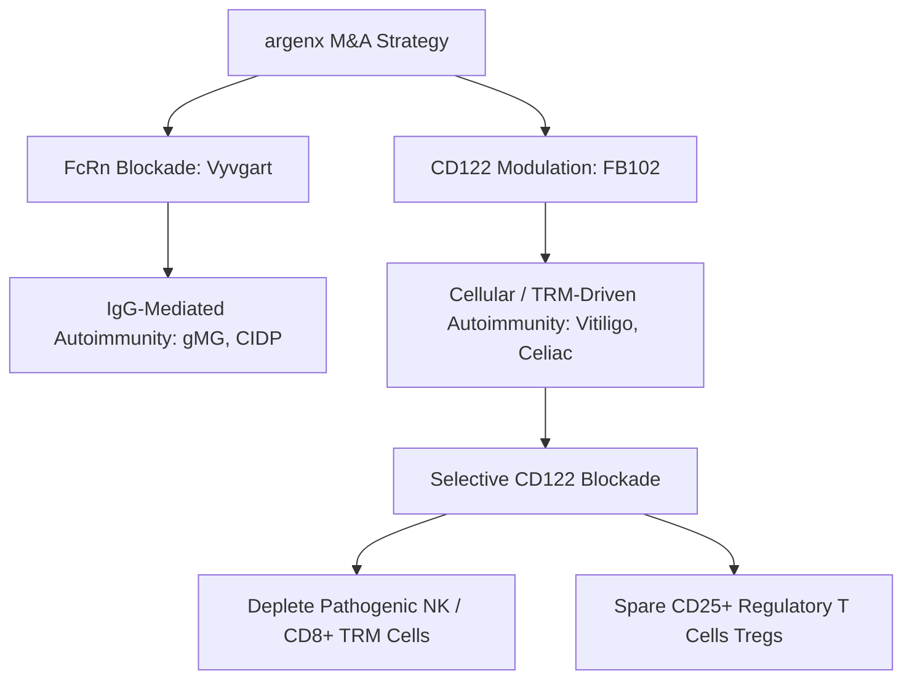

# **Beyond Vyvgart: Inside Argenx’s $2.2B CD122 Bet on Forte Biosciences and the Search for Autoimmune Remission**

###

Yesterday’s blockbuster announcement that **argenx (NASDAQ: ARGX)** is acquiring **Forte Biosciences (NASDAQ: FBRX)** for $77 per share in cash—a transaction valued at approximately $2.2 billion—sends a clear signal to the biopharma world: the race for next-generation, target-selective immunology therapies has entered a new phase. 

The deal represents an 86% premium over Forte’s volume-weighted average price since the biotech released its positive Phase 1b clinical data for its lead asset, **FB102**, on July 9, 2026. For argenx, which has built its empire on the blockbuster FcRn-blocker Vyvgart (efgartigimod), this all-cash acquisition marks a major pivot. While Vyvgart reigns supreme in IgG-mediated, antibody-driven diseases like generalized myasthenia gravis (gMG) and chronic inflammatory demyelinating polyneuropathy (CIDP), the acquisition of FB102 brings argenx directly into the cellular immunology arena, targeting T-cell and Natural Killer (NK) cell-mediated pathology.



#### The Molecular Architecture: Demystifying the CD122 / IL-15 / IL-2 Axis
At the core of the transaction is FB102, a first-in-class monoclonal antibody targeting **CD122**, the beta ($\beta$) subunit shared by interleukin-2 (IL-2) and interleukin-15 (IL-15) receptors. 

To understand why argenx shelled out $2.2 billion for this molecule, we must look at the cellular biology of chronic inflammatory conditions like vitiligo and celiac disease. Both diseases are driven by **tissue-resident memory T cells (TRMs)**—highly specialized, long-lived T cells that nest in tissues and refuse to leave. In vitiligo, CD8+ TRMs localize to the epidermis and destroy pigment-producing melanocytes. In celiac disease, gluten exposure triggers an IL-15 cascade that activates CD8+ intraepithelial lymphocytes (IELs) and NK cells, which systematically destroy the gut's mucosal lining. 

TRMs and pathogenic NK cells are highly dependent on IL-15 signaling for their survival, homeostatic proliferation, and cytotoxic function. IL-15 signals through a heterotrimeric receptor complex consisting of IL-15R$\alpha$, CD122 (IL-2/15R$\beta$), and CD132 (the common gamma chain, $\gamma_c$). By binding to CD122, FB102 blocks the assembly of the functional signaling complex, starving TRM and NK cells of survival signals and inducing targeted apoptosis in these pathogenic populations.

However, the real engineering feat of FB102 lies in its **regulatory T cell (Treg) sparing design**. 

Traditional immunosuppressants act like a carpet bomb, depleting all T cells and leaving patients vulnerable to opportunistic infections. CD122 is also expressed on Tregs, which are vital for maintaining immune tolerance. However, Tregs constitutively express high levels of **CD25** (the IL-2 receptor $\alpha$ subunit), allowing them to form the high-affinity heterotrimeric IL-2 receptor (CD25/CD122/CD132). 

FB102 is biophysically tuned to block the "medium-affinity" dimeric IL-2/IL-15 receptor (CD122/CD132) found on effector T cells and NK cells, while leaving the high-affinity trimeric receptor on Tregs largely unaffected. This ensures that while pathogenic effector cells are shut down, the body's natural immunological "brakes" (Tregs) remain intact.

| Receptor Subtype | Subunits | Primary Cells | FB102 Action |
| :--- | :--- | :--- | :--- |
| **High-Affinity IL-2R** | CD25 / CD122 / CD132 | Regulatory T Cells (Tregs) | Spared / Intact Signaling |
| **Medium-Affinity IL-2/15R** | CD122 / CD132 | Effector T Cells, NK Cells, TRMs | Blocked / Apoptosis Induced |

---

#### Dissecting the Trial Data: The Catalysts for the Buyout

Biotech investors were electrified by the clinical data that emerged over the past year, which proved that this target-selective mechanism translates into real-world patient outcomes.

##### 1. The Vitiligo Breakthrough (Phase 1b - July 2026)
In a 43-patient, double-blind, placebo-controlled trial, FB102 demonstrated unprecedented efficacy in active vitiligo. 
* **Primary Endpoint Efficacy:** In the protocol-defined efficacy-evaluable cohort (32 FB102, 10 placebo), FB102 achieved a **29.6% mean improvement** in the Facial Vitiligo Area Scoring Index (FVASI) at week 24, compared to just 7.9% for the placebo group ($p = 0.020$).
* **Severe Subgroup Dominance:** In patients with baseline FVASI $\ge 0.75$, FB102 delivered a **43.2% mean improvement** versus 0.5% for placebo. Within this high-severity cohort, **58.8%** of patients achieved FVASI50 (a 50% reduction in depigmented facial area) and **23.5%** achieved FVASI75 at week 24.
* **The "Disease-Modifying" Tail:** Active dosing concluded at week 12, yet patients continued to show repigmentation through week 24. This suggests that FB102 actually clears the pathogenic TRM "reservoir" in the skin, allowing melanocytes to recover naturally—a major differentiator from transient therapies.

##### 2. The Celiac Disease Proof-of-Concept (Phase 1b - June 2025)
Celiac disease currently has zero approved pharmacological treatments. In the FB102-101 Phase 1b trial, patients underwent a rigorous 16-day gluten challenge.
* **Histological Protection:** Using a composite VCIEL (Villus height-to-crypt depth ratio and Intraepithelial Lymphocytes) scoring system, FB102-treated patients showed statistically significant preservation of the intestinal architecture. It reduced the density of CD3+ intraepithelial lymphocytes (IELs) and protected the villus height-to-crypt depth (VH:CD) ratio.
* **Symptomatic Relief:** Patients on FB102 experienced a **42% reduction** in gluten-induced gastrointestinal symptoms (including nausea, bloating, and abdominal pain) compared to placebo. 

---

#### The Corporate Blueprint: Argenx’s 'Vision 2030'
The $2.2 billion price tag represents a calculated bet by argenx leadership, led by CEO Karen Massey and Board Chairperson Tim Van Hauwermeiren. 

Under its **"Vision 2030: Taking Breakthrough Science to 50,000 Patients"** initiative, argenx has committed to three primary goals by 2030:
1. Reaching 50,000 patients globally.
2. Securing 10 labeled indications.
3. Advancing 5 new molecules into Phase 3.

```
       [ argenx Vision 2030 Goals ]
  ┌─────────────────────────────────────────┐
  │ 1. 50,000 Patients on Treatment         │
  │ 2. 10 Labeled Indications               │
  │ 3. 5 New Molecules in Phase 3           │
  └────────────────────┬────────────────────┘
                       │ (Strategic Catalyst)
                       ▼
         [ Forte Acquisition: FB102 ]
  ┌─────────────────────────────────────────┐
  │ • Adds First-in-Class CD122 Monoclonal  │
  │ • Drives Phase 2 Celiac & Vitiligo Trials│
  │ • Diversifies Platform Beyond FcRn      │
  └─────────────────────────────────────────┘
```

Vyvgart is a cash cow, but as a single-technology platform (FcRn blockade), it faces eventual market saturation and aggressive biosimilar threats. FB102 represents the ideal second pillar. Because CD122 targeting addresses a completely different biological pathway (T-cell/NK-cell cytokine signaling rather than IgG autoantibody clearance), it expands argenx’s reach into massive indications like celiac disease and vitiligo where Vyvgart is biologically inactive.

---

#### Engineering and Manufacturing Obstacles
Despite the clinical promise, argenx faces significant technical and manufacturing hurdles in scaling FB102:

1. **Target-Mediated Drug Disposition (TMDD):** Because CD122 is highly expressed on circulating NK cells and memory T cells, these cells act as a massive peripheral "sink" (TMDD). When FB102 is administered, a substantial portion of the antibody is immediately bound and cleared by circulating cells before it can penetrate target tissues (like the skin or gut). This requires high systemic dosing, which increases manufacturing volume requirements.
2. **Subcutaneous Formulation Challenges:** To compete in chronic outpatient markets, FB102 must be administered as a subcutaneous injection rather than an IV infusion. Delivering high doses subcutaneously requires high-concentration formulations ($>100$ mg/mL). However, high antibody concentrations frequently lead to elevated viscosity and protein aggregation. Argenx will likely have to utilize advanced formulation engineering—possibly leveraging its existing relationship with Halozyme's ENHANZE subcutaneous delivery technology—to overcome these physical limitations.
3. **Immunogenicity:** Long-term administration of a monoclonal antibody in chronic, non-fatal diseases carries the risk of generating anti-drug antibodies (ADAs), which can neutralize the drug’s efficacy or trigger hypersensitivity reactions.

---

#### The Competitive Landscape
Argenx is not entering an empty field. The competitive dynamics in both vitiligo and celiac disease are fierce:

* **In Dermatology (Vitiligo):** Topical ruxolitinib (**Opzelura**, developed by Incyte) is the standard of care but is limited by local application and a black-box safety warning. Systemic JAK inhibitors like AbbVie's **upadacitinib** are advancing, but carry broad immunosuppressive risks. Teva’s **TEV-53408**, a direct anti-IL-15 antibody backed by Royalty Pharma, is entering Phase 2b in Q4 2026, posing a direct threat to FB102.
* **In Gastroenterology (Celiac):** Sanofi’s **PRV-015** (ordesekimab), a Phase 2b anti-IL-15 mAb acquired via Provention Bio, is a formidable competitor. However, because PRV-015 only blocks IL-15, it does not address IL-2-mediated pathogenic T-cell activation. First Tracks Biotherapeutics is also advancing **ANB033**, a competing anti-CD122 mAb, into clinical studies.

---

#### Social & Analyst Sentiment: The Street Weighs In

Biotech analysts and community observers have been quick to dissect the deal.

**Brad Loncar**, prominent biotech investor and creator of biotech ETFs, noted on X:
> "Argenx buying Forte Biosciences is the exact kind of transaction that defines a mature commercial player. Everyone knows Vyvgart is a historic launch, but you cannot be a one-trick pony in this market. By grabbing FB102, argenx buys immediate optionality in vitiligo and celiac. The 86% premium is steep, but if Phase 2 celiac readouts in late 2026 are positive, $2.2 billion will look like a steal."

On r/biotech, discussions focused on the Treg-sparing mechanism:
> "The CD122 space is notoriously difficult because if you block it too aggressively, you risk depleting Tregs and causing systemic autoimmunity—essentially the opposite of what you want," noted one senior immunologist. "Forte's Phase 1b data showing selective protection of VH:CD ratio while preserving Tregs is the real biological validation here. If argenx can scale the manufacturing and maintain subcutaneous stability, they have a pipeline-in-a-product."

**Adam Feuerstein** of STAT News raised regulatory and commercial questions:
> "While the vitiligo data is highly promising, the real battleground is celiac disease. The FDA has never approved a therapeutic for celiac. The gluten challenge model used in Phase 1b is a great proof-of-concept, but running a large-scale Phase 3 trial with real-world dietary exposure is a logistical and regulatory minefield. Argenx is buying top-tier science, but the execution risk remains high."

With the acquisition slated to close in Q3 2026 and Phase 2 celiac readouts expected in the second half of the year, all eyes will be on whether FB102 can maintain its clinical edge and validate argenx’s multibillion-dollar bet on the future of targeted immunology.

***

## 4. Highlight

### 4.1 Key Questions
* Can FB102 overcome Target-Mediated Drug Disposition (TMDD) and scale to a highly stable, high-concentration subcutaneous formulation?
* Will FB102's Treg-sparing biophysics successfully translate into a clean long-term safety profile in Phase 2 trials?
* How will argenx navigate the unprecedented regulatory landscape for celiac disease, where no pharmacological treatment has ever been approved?

### 4.2 Highlight Text
Biotech giant argenx has announced a definitive $2.2 billion cash acquisition of Forte Biosciences to secure FB102, a first-in-class monoclonal antibody targeting CD122 (IL-2/15Rβ). Driven by positive Phase 1b data showing a 29.6% mean FVASI improvement in vitiligo and mucosal protection in celiac disease, this strategic move aims to diversify argenx's portfolio beyond its blockbuster FcRn-blocker Vyvgart. By selectively blocking IL-2 and IL-15 on pathogenic effector T and NK cells while sparing regulatory T cells (Tregs), FB102 offers a potential pipeline-in-a-product for chronic cellular autoimmunity, though formulation and manufacturing hurdles remain.

### 4.3 Hashtags
#Biotech #Immunology #MAndA #Vitiligo #CeliacDisease #argenx #ForteBiosciences
