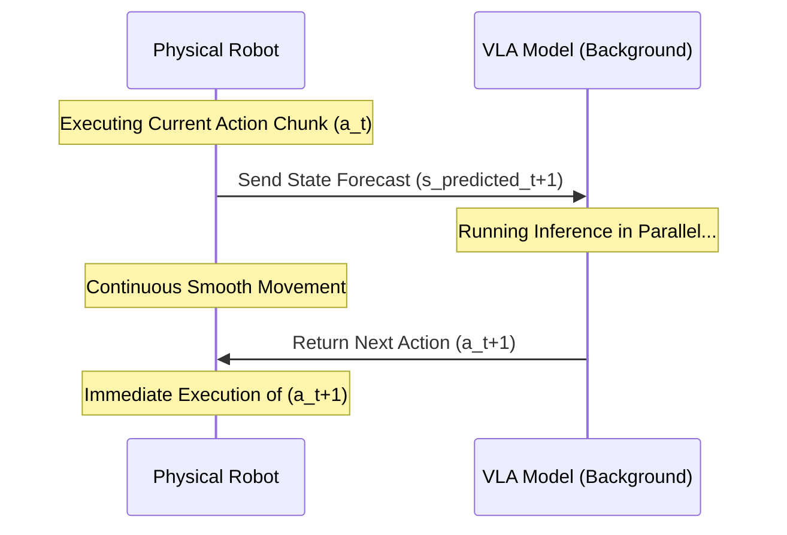

# **Breaking the Inference Stutter: How MIT's VLASH Framework Solves Robotics’ Silent Latency Crisis**

####

In the race to build general-purpose physical AI, the industry has hit a wall that has nothing to do with data scaling or parameter sizes. It is the silent killer of robotics: **inference latency**. 

While large Vision-Language-Action (VLA) models like OpenVLA or Physical Intelligence's $\pi_0$ show remarkable semantic reasoning, deploying them in the physical world is a study in frustration. In standard deployments, the robot suffers from what control engineers call the "stuttering robot" problem. Because traditional VLA inference is synchronous, the robot must capture an image, halt its physical movement, wait 100 to 500 milliseconds for the model to "think" (compute inference), execute the generated action chunk, and then halt again to repeat the cycle. This results in jerky, high-latency movements that are useless for real-world dynamic tasks.

To solve this, a research team led by PhD student **Jiaming Tang** and Associate Professor **Song Han** at MIT—in collaboration with researchers from Tsinghua University, Nvidia, UC Berkeley, UCSD, and Caltech—has introduced **VLASH** (Vision-Language-Action Asynchronous Inference). Published in their paper, *"VLASH: Real-Time VLAs via Future-State-Aware Asynchronous Inference"* (arXiv:2512.01031), the framework achieves up to **17.4x reduction in reaction latency** and a **2.03x to 3x task completion speedup**, all without retraining the underlying VLA or changing its architecture.

---

### The Architecture: Solving the Temporal Misalignment Problem

To run a robot asynchronously, you cannot simply pipe inputs to a background process. If a robot queries a VLA at time $t$ while executing a motion, the VLA will return an action command $a_{t+1}$ based on the state $s_t$. However, by the time the VLA finishes computing (at time $t + \Delta t_{\text{inference}}$), the physical robot is already at a different position $s_{t+\Delta t}$. This mismatch is known as **temporal misalignment**. If the robot attempts to execute $a_{t+1}$ from state $s_{t+\Delta t}$, it will overshoot, collide, or miss its target.

VLASH solves this by introducing a **Future-State-Aware Asynchronous Inference** loop. Instead of passing the current, stale state $s_t$ to the VLA, VLASH uses the robot's active control trajectory to roll the state forward. It mathematically projects the robot's future state $s_{t+\text{latency}}$ at the exact moment the VLA inference is expected to complete:

$$s_{t+\text{latency}} = f(s_t, a_{t:\text{latency}})$$

Where:
- $s_t$ is the current measured state (joint angles, end-effector pose, and camera feed).
- $a_{t:\text{latency}}$ is the action trajectory currently being executed by the robot controller.
- $f$ represents the forward kinematics and environment transition predictor.

By feeding this predicted state $s_{t+\text{latency}}$ to the VLA, the model calculates the next action chunk $a_{t+1}$ aligned with the robot's future starting configuration. This allows the VLA inference to run in parallel with physical execution, eliminating the pause step entirely.

---

### Action Quantization: Finding the Sweet Spot in Granularity

Running high-frequency control loops (e.g., 100Hz to 1kHz) with large language-model-based planners is computationally impossible on edge hardware. Typically, VLAs output action chunks (sequences of 4 to 8 steps). VLASH optimizes this pipeline using **action quantization**. 

By grouping fine-grained, high-frequency actions into coarser, trajectory-consistent macro-actions, VLASH reduces the frequency of VLA calls. This quantization reduces the processing overhead on edge GPUs (like Nvidia Jetson Orin or local workstations) while maintaining control authority. The lower-level controller interpolates these quantized outputs, ensuring that the physical robot maintains smooth, continuous force and velocity profiles.

---

### The Industry Reacts: "Latency is the Silent Killer"

The robotics community has reacted with strong interest to the MIT Han Lab's release. On X.com and Reddit, experts are debating the trade-offs of asynchronous control.

**Dr. Jim Fan**, Senior Research Scientist and Lead of GEAR at Nvidia, commented:
> *"This is a massive step for physical AI. In robotics, latency is the silent killer. You cannot run a 10-billion parameter VLA synchronously on a robot and expect it to play ping pong or catch objects. VLASH's future-state forecasting is exactly how we bridge the gap between large, slow models and fast physical dynamics without shrinking the model to the point of brain-damage."*

**Brett Adcock**, Founder and CEO of humanoid robotics company Figure, wrote:
> *"For humanoids to operate in dynamic human environments, continuous motion is non-negotiable. Synchronous stutters aren't just slow; they are physically dangerous because they ruin momentum and balance. Asynchronous control loops, powered by predictive state-estimation like VLASH, will be standard in commercial humanoid control stacks."*

However, some control theorists on Reddit’s `r/robotics` remain cautious about the limits of future-state prediction:
> *"Rolling the state forward works beautifully for predictable trajectories and static environments. But what happens during sudden contact or collisions? If the environment transitions state unpredictably during the inference window, the forecasted future state is wrong, and the robot will execute an action designed for a reality that doesn't exist. There has to be a fallback reactive controller."*

---

### Experimental Results: From Laundry to Table Tennis

The experimental data released by the VLASH team proves that their asynchronous pipelining has dramatic real-world utility across various physical benchmarks:

| Benchmark Task | Synchronous VLA (Baseline) | VLASH (Asynchronous VLA) | Performance Gain |
| :--- | :--- | :--- | :--- |
| **Laundry Folding** | Jerky, paused grasp execution | Smooth, continuous handovers | **3.0x speedup** |
| **Pick-and-Place** | 0.8 Hz action loop | 2.1 Hz action loop | **2.03x speedup** |
| **Reaction Latency** | ~280ms average stall | ~16ms average delay | **17.4x latency reduction** |
| **Dynamic Agility** | Failed (Unable to track) | Whack-a-Mole / Ping-Pong | **Enabled high-speed play** |

The framework is hardware-agnostic, meaning it can be implemented on standard industrial arms (like Universal Robots UR5), humanoid hands, and mobile manipulators. It provides a software-level upgrade that unlocks high-speed, dynamic capabilities on existing physical hardware.

---

### 4. Highlight

#### 4.1 Key Questions
1. How does the VLASH framework resolve the temporal misalignment problem between slow VLA inference and high-speed robotic execution?
2. What are the performance gains of asynchronous inference compared to traditional synchronous methods in real-world manipulation tasks?
3. How does VLASH enable hardware-agnostic integration across humanoid and industrial robots?

#### 4.2 Highlight Text
MIT’s new VLASH framework solves robotics’ biggest bottleneck: VLA inference latency. Traditional models force robots to stop and "think" between movements, causing jerky, high-latency stutters. VLASH introduces Future-State-Aware Asynchronous Inference, rolling the robot's state forward to forecast its future position. By planning based on where the robot *will* be when inference finishes, it pipelines computation and physical execution. The result? A 17.4x drop in reaction latency and up to 3x faster laundry folding, allowing robots to tackle high-speed dynamic tasks like table tennis and Whack-a-Mole.

#### 4.3 Hashtags
#Robotics #PhysicalAI #MachineLearning #MIT #VLASH #AI
