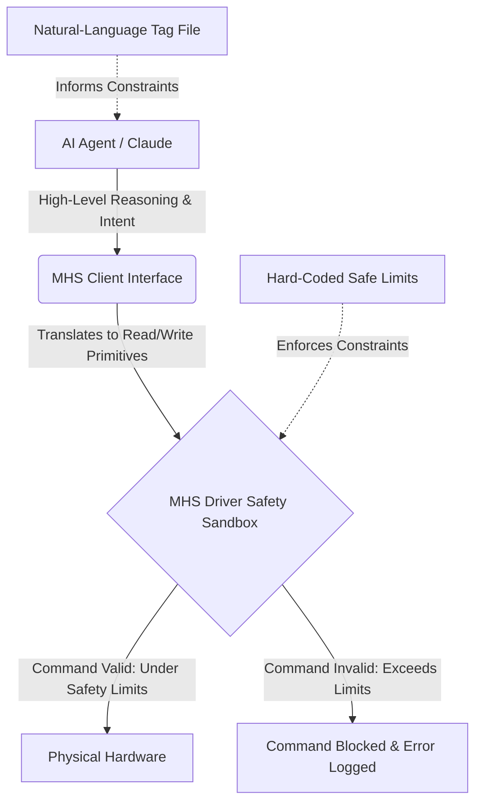

# **Bridging the Last Mile: Inside Anthropic’s Model Hardware Standard (MHS) and the Fight for Physical AI**

##

For years, the generative AI boom has been safely sequestered behind the glowing glass of our monitors. AI agents could write code, analyze spreadsheets, and draft emails, but their ability to act in the physical world remained bottlenecked by a notoriously messy, fragmented, and brittle layer: hardware integration. In laboratories and advanced manufacturing plants, connecting a new scientific instrument or robotic arm to a control network typically meant paying a steep "integration tax"—weeks of writing custom, device-specific drivers, debugging proprietary APIs, and praying that a minor firmware update wouldn't break the entire pipeline. 

On August 27, 2026, Anthropic took a major step toward solving this "last-mile" problem. The company announced the **Model Hardware Standard (MHS)**, a new universal, model-agnostic software interface designed to let autonomous AI agents safely discover, operate, and troubleshoot physical equipment. 

Currently in a limited research preview, MHS is already being tested by heavyweights like Genentech, AWS, Carnegie Mellon University (CMU), the University of Washington (UW), QuEra Computing, and robotics manufacturers such as Automata and Universal Robots. By extending the design philosophy of the Model Context Protocol (MCP)—which Anthropic open-sourced in late 2024 to standardize how AI connects to digital tools—into physical space, MHS aims to compress hardware setup times from weeks to mere hours.

But the launch has also triggered a fierce debate across Hacker News, Reddit, and X.com. Can a high-level, language-model-driven protocol safely manage physical systems without causing catastrophic equipment failures? And does MHS represent an evolution of—or a threat to—established robotics frameworks like the Robot Operating System (ROS)?

### The Architecture: Read/Write Primitives and MCP Integration

At its core, MHS is an abstraction layer that sits between an operating system and a device driver. Instead of exposing hundreds of proprietary, nested functions, an MHS-compliant driver standardizes all hardware interactions into two primary, universal primitives:
*   **`read`**: Fetches sensor states, current parameters, or diagnostic telemetry (e.g., querying a thermometer for its current Celsius reading or a robotic joint for its encoder position).
*   **`write`**: Executes control actions or adjusts device settings (e.g., setting a target temperature or commanding a motor to rotate to a specific angle).

Under the MHS framework, a physical device acts as an MCP server. When connected to a network, the device dynamically exposes its metadata using **natural-language tag files** (typically written in YAML or JSON). 

These tag files describe the device’s capabilities, what variables are adjustable, what parameters can be measured, and most importantly, its physical constraints. When an AI agent like Claude is introduced to the network, it reads these tag files, instantly "discovering" what the equipment is and how to talk to it.

As one senior automation engineer commented on Hacker News:
> *"What makes MHS so interesting is that it flips the integration script. Historically, standards like SiLA 2 (Standardization in Lab Automation) or OPC UA built rigid, schema-heavy XML definitions that required humans to write compile-time integration blocks. MHS accepts that the real world is messy and uses natural-language metadata so that an LLM can dynamically reason about what a new spectrometer does and call its read/write endpoints on the fly."*

### Enforcing Safety: The Driver-Level Sandbox

The most critical challenge in physical AI execution is the safety gap. In the digital world, an LLM hallucination results in a syntax error or a broken API call. In the physical world, a hallucinating AI agent that sends a command to move a robotic joint past its mechanical limits or run a pump dry can cause thousands of dollars of damage, ruin months of scientific research, or threaten human safety.

To prevent this, MHS separates **reasoning** from **enforcement**. 

1.  **Semantic Guidance (The Tag File):** The natural-language tag files inform the AI agent of the device’s physical limitations (e.g., *"Do not operate laser above 45°C"* or *"Robotic arm payload capacity is 5kg"*). The model reads this metadata to reason about its actions beforehand.
2.  **Deterministic Enforcement (The Driver Layer):** Even if the agent suffers a hallucination and attempts to bypass the semantic guidance, the MHS driver itself contains hard-coded safety limits. If the agent issues a `write` command that violates these limits, the driver intercepts the payload at the edge and rejects it, returning a standardized error code back to the model.

Anthropic CEO Dario Amodei has long advocated for structured, systemic approaches to AI safety. Speaking on the design of the standard, Amodei noted:
> *"If we want AI to accelerate scientific discovery, we must move it from purely analyzing data in a sandbox to actively executing experiments in a physical laboratory. But you cannot run physical experiments if a hallucinating model can melt a laser. By embedding hard safety boundaries directly at the driver layer, below the agent, we guarantee that the hardware remains protected regardless of model behavior."*

### Real-World Proof: QuEra's Quantum Stabilization

The primary validation of MHS's utility comes from its early pilots, particularly in high-precision scientific environments. During development, Anthropic collaborated with the **HHMI Janelia Research Campus** and quantum computing firm **QuEra Computing** to test the standard. 

In quantum laboratories, one of the most tedious manual tasks is **laser relocking**—restoring the stability of a laser that has drifted off its target frequency. This process requires monitoring complex diagnostics, adjusting voltages, and responding to environmental noise. 

By wrapping the laser hardware in an MHS driver, Anthropic and QuEra ran a trial where an AI agent was responsible for autonomously relocking the lasers over 700 trials. The results were stark: the automated relocking success rate surged from a baseline of **58% to 99.3%**. 

An AWS robotics researcher posted on X.com regarding the results:
> *"The QuEra data is the first real proof-of-concept that LLM agents can handle high-precision physics orchestration if the interface is clean. MHS doesn't replace the low-level PID controller running on the laser; it abstracts the state-estimation and diagnostic logic, allowing the agent to step in as a high-level operator when the classical control loop fails."*

### The Great Robotics Schism: MHS vs. ROS

Despite the excitement, the robotics and industrial automation communities are skeptical, and a major debate is brewing over whether MHS is trying to reinvent the wheel. 

The primary target of comparison is the **Robot Operating System (ROS)**, the open-source middleware that has dominated robotics research and industry for nearly two decades. ROS relies on a publish-subscribe architecture designed for high-frequency, low-latency, deterministic node communication. 

Prominent AI critic and Meta Chief AI Scientist Yann LeCun voiced his skepticism on X.com:
> *"Autoregressive LLMs have no real-world model of physics. A simplified read/write protocol with natural-language tags is a convenient software wrapper for lab automation, but it does not solve the fundamental challenges of robotics: continuous control, sensorimotor grounding, and low-latency feedback. You cannot reason your way through a slipping gripper or a dynamic obstacle in a text-based event loop."*

Robotics developers on Reddit’s r/robotics have echoed this sentiment, arguing that LLMs operating via cloud APIs introduce hundreds of milliseconds of latency, making them entirely unsuited for real-time robotic control.

However, proponents of MHS point out that the protocol is not meant to replace ROS, but rather to sit on top of it. MHS acts as the *declarative orchestrator*, while ROS handles the *imperative execution*. 

For instance, robotics manufacturer Universal Robots is piloting MHS by wrapping their existing ROS-based control nodes in an MHS server. The AI agent sends a high-level `write` command to the MHS driver (e.g., "move to coordinate X"), and the MHS driver translates that command into a ROS action client that executes the motion using traditional inverse kinematics and real-time path planning.

Clément Delangue, CEO of Hugging Face, highlighted how this bridge is already forming in the open-source community:
> *"Standardizing how AI interacts with hardware is crucial. We are actively working to integrate MHS with LeRobot. By combining MHS drivers with consumer-grade components like the SO-ARM101 and Raspberry Pi, we can allow developers to write simple Python agents that orchestrate complex physical tasks, opening up robotics to thousands of software developers who don't have a background in ROS or control theory."*

As MHS transitions from a gated research preview to a broader release, the battle to define the "physical API" of AI is officially underway. If Anthropic can prove that MHS can scale safely across hundreds of hardware vendors, it won't just solve the last-mile integration problem—it will lay the foundational pipes for the physical web.

---

# 4. Highlight

## 4.1 Key Questions
1. How does the Model Hardware Standard (MHS) prevent hallucinating AI agents from causing physical damage to laboratory equipment?
2. Does MHS replace the Robot Operating System (ROS), or does it act as an orchestration wrapper on top of it?
3. What were the quantitative performance gains observed during early MHS pilots, such as QuEra's quantum laser relocking trials?

## 4.2 Highlight Text
Anthropic’s newly unveiled Model Hardware Standard (MHS) is bridging the "last-mile" gap between digital reasoning and physical action. By abstracting laboratory and manufacturing hardware into simple `read` and `write` primitives, MHS enables AI agents to autonomously operate complex devices without custom integration scripts. Crucially, the protocol solves the safety gap of physical execution by enforcing hardware limits programmatically at the driver level, below the AI agent. Early pilots prove its viability, with QuEra's quantum laser stabilization success soaring from 58% to 99.3%. Is this the new physical API for AI?

## 4.3 Hashtags
#PhysicalAI #Robotics #AISafety #Anthropic #MHS #LabAutomation
