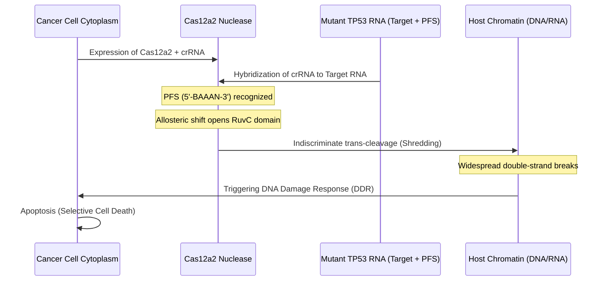

# **CRISPR's Nuclear Option: How Confluence's Cas-CLEAR and Doudna’s Nature Paper Turn Mutant RNA into a Chromatin-Shredding Kill Switch**

##

Silicon Valley has long treated gene editing as a search-and-replace software problem. We find a typo in the genome, program a Cas9 guide, make a double-strand break, and let host cell homology-directed repair (HDR) or non-homologous end joining (NHEJ) rewrite the code. But when it comes to oncology, this "precision edit" model breaks down. Cancers are heterogeneous, hyper-mutated, and master evasive maneuvers. If you edit 99% of a tumor, the remaining 1% kills the patient. 

Today, a paradigm shift is officially underway. St. Louis-based biotech startup **Confluence Genetics** has announced the launch of **Cas-CLEAR™** (Collaterally Enhanced Activated Ribonuclease), a therapeutic platform built around the newly characterized **CRISPR-Cas12a2** system. Supported by two back-to-back *Nature* papers from Nobel laureate Jennifer Doudna’s lab (UC Berkeley/IGI) and Ryan Jackson’s team (Utah State University), Cas12a2 is not an editor. It is a programmable, RNA-triggered *kill switch*. 

Instead of trying to repair or knock out a mutated DNA sequence, Cas-CLEAR uses cancer-specific RNA transcripts—such as those from mutated *TP53*, *EGFR*, or *MYC*—as a trigger. Once it senses the target transcript, Cas12a2 undergoes an allosteric transformation, unleashing a catastrophic "trans-cleavage" cascade that shreds the cell's chromatin and forces it into apoptosis. 

### The Molecular Biology: From Abortive Infection to Eukaryotic Execution

To understand why this is a massive deal, we have to look at the structural biochemistry of Cas12a2. In its native bacterial state, Cas12a2 functions as an abortive infection system—a scorched-earth defense mechanism. If a phage infects a bacterium, Cas12a2 detects the phage RNA and destroys the host cell to prevent viral propagation. 

The mechanics of this activation are remarkably elegant:

1. **Target RNA Binding:** Guided by a CRISPR RNA (crRNA), Cas12a2 scans the cellular transcript environment. It binds to a target RNA sequence, but only if it is flanked by a specific **Protospacer Flanking Sequence (PFS)** on the 3' end (typically a 5'-BAAAN-3' motif, where B is any nucleotide except adenine).
2. **Conformational Metamorphosis:** Upon binding both the target RNA and the correct PFS, the Cas12a2 protein undergoes a massive structural rearrangement. 
3. **RuvC Domain Activation:** This conformational shift opens and stabilizes the enzyme's RuvC nuclease active site.
4. **Indiscriminate Trans-Cleavage:** Once the RuvC domain is exposed, the enzyme abandons all target specificity. It begins destroying any nearby nucleic acids—specifically single-stranded RNA (ssRNA), single-stranded DNA (ssDNA), and double-stranded DNA (dsDNA)—in *trans*.
5. **The Aromatic Clamp:** Inside the RuvC site, a structural feature known as the "aromatic clamp" (stabilized by four key aromatic residues) drives a positive cooperativity mechanism. This clamp stabilizes unwound and distorted double-stranded DNA, allowing Cas12a2 to systematically shred the host cell’s chromatin.

### Contrast: Precise Editing vs. Collateral Destruction

The fundamental difference between canonical CRISPR systems and Cas12a2 lies in the fate of the target cell. Traditional CRISPR platforms (Cas9, Cas12a) act as "molecular scissors" to edit the genome, requiring host repair machinery. Cas12a2 acts as a "molecular bomb" that targets the transcriptome to obliterate the genome.

| Feature | Traditional CRISPR (Cas9 / Cas12a) | Cas12a2 (Cas-CLEAR / G-dase® E) |
| :--- | :--- | :--- |
| **Primary Target** | Genomic DNA | Messenger RNA (Transcriptome) |
| **Cleavage Mode** | *cis*-cleavage (Precise, target-specific break) | *trans*-cleavage (Indiscriminate collateral cleavage) |
| **Substrates Cleaved** | dsDNA at target site | ssRNA, ssDNA, and dsDNA globally in the cell |
| **Cellular Outcome** | Gene knockout, insertion, or base modification | Genome-wide chromatin shredding and cell death |
| **Therapeutic Logic** | Repair or modify genetic defects | Programmed cell elimination (oncology/antivirals) |
| **Off-Target Risk** | Unintended genomic edits at homologous sites | Accidental activation by WT transcripts in healthy cells |

### The Real-World Human Catalyst: spligak’s Crusade

While academia has spent the last few years detailing the biophysics of Cas12a2, the drive toward therapeutic translation has been accelerated by patient-advocates who refuse to wait. 

On Hacker News, a software engineer posting under the handle **spligak** shared a striking personal story. Diagnosed with a rare myeloproliferative neoplasm (MPN) driven by the **MPLW515L** somatic mutation, spligak found themselves frustrated by the slow pace of drug development for niche blood cancers. The mutation causes hematopoietic stem cells to produce hyper-lobulated megakaryocytes that spew inflammatory cytokines, progressively scarring the bone marrow niche (fibrosis) and risking transition into acute myeloid leukemia (AML).

"I ended up laddering up the academic food chain," spligak wrote on Hacker News, describing how they personally began funding research to apply Cas12a2 against their specific mutation. The results were startling: in vitro testing successfully shredded the mutant cells while leaving normal, wild-type stem cells completely untouched. As of mid-2026, spligak's funded team is building the necessary mouse models for in vivo validation. 

At a closed-door MPN Roundtable in Chicago, the technology reportedly stole the show. As one prominent biotech investor remarked on X: *"What spligak is doing is the future of patient-led R&D. They aren't just funding basic science; they are using a lethal bacterial immune system as a personalized heat-seeking missile."*

### The Clinical Hurdles: Delivery and the "Hair-Trigger" Problem

Despite the excitement, translating Cas12a2 into the clinic requires conquering two massive bottlenecks: delivery and specificity.

#### 1. In Vivo Delivery
How do you safely transport a nuclease designed to shred genomes into a patient's body? 
* **The LNP Challenge:** Current protocols rely on delivering Cas12a2 mRNA and crRNA via lipid nanoparticles (LNPs). However, systemic LNPs naturally accumulate in the liver. For hepatocellular carcinoma (Confluence Genetics’ lead target), this is a benefit. But for extrahepatic tumors (like MYC-driven lung cancers or EGFR-mutant brain tumors), researchers must engineer ligand-conjugated LNPs that target cancer-specific surface receptors (like folate or transferrin receptors) to avoid systemic toxicity.
* **Viral Vectors:** Utilizing Adeno-Associated Viruses (AAVs) is another route, but AAVs risk inducing long-term expression. With a payload as toxic as Cas12a2, transient expression via LNP mRNA is widely considered the safer path.

#### 2. The Specificity & Off-Target Activation Risk
Because Cas12a2 has a binary, collateral-cleavage activation mechanism, the risk of "leaky" activation in healthy cells is a major concern. If a healthy cell expresses low-level variants or wild-type (WT) transcripts that weakly cross-react with the crRNA, it could trigger a catastrophic, irreversible cell-death sequence.

To address this, researchers are deploying three primary engineering strategies:
* **PFS Matching and Mismatch Engineering:** The crRNA is designed so that the cancer mutation (e.g., the single nucleotide variant in *TP53* R175H) sits directly within the core seed region or adjacent to the PFS. A single mismatch between the wild-type transcript and the guide RNA completely halts the allosteric shift needed to activate the RuvC domain.
* **Ortholog Mining:** In a preprint published on bioRxiv on July 7, 2026, Confluence Genetics characterized nine novel Cas12a2 orthologs. They identified **RsCas12a2**, **SdCas12a2**, and **HmCas12a2** as highly active nucleases. Crucially, they mapped their exact mismatch tolerances and PFS preferences (such as the 5'-BAAAN-3' motif) to identify variants with the narrowest activation thresholds.
* **Logic Gates:** Engineers are designing dual-guide systems where two independent Cas12a2 split-proteins must bind separate, distinct cancer-associated transcripts (e.g., *TP53* mutant AND *MYC* overexpression) to reconstitute the active nuclease.

### The Commercialization Land Grab

The launch of Confluence Genetics’ Cas-CLEAR™ platform today officially opens the commercial front of the Cas12a2 wars. Confluence, based in St. Louis, has positioned its platform directly against **Akribion Therapeutics**, a German biotech spin-off from BRAIN Biotech AG that raised an €8 million seed round led by CARMA FUND and RV Invest. 

Akribion is commercializing its own Cas12a2 platform, **G-dase® E**, focusing on HPV-induced head and neck cancers. Meanwhile, Confluence's Cas-CLEAR is targeting hepatocellular carcinoma (HCC), utilizing Doudna’s newly published in vivo mouse model data, which showed a single intratumoral injection of Cas12a2-LNPs blunted tumor growth by roughly 50%.

The stakes are enormous. By expanding the target list to major cancer drivers like *EGFR* (particularly the EGFRvIII splice variant in glioblastoma) and *MYC* (a notoriously undruggable transcription factor overexpressed in many solid tumors), these platforms are aiming at the holy grail of oncology. 

As CRISPR pioneer Jennifer Doudna noted regarding the *Nature* study:
> **"Not only can this approach target the 'undruggable' cancers that we know, we can also easily and quickly adapt this to new mutations. This is an exciting development for cancer therapies, and potentially for other applications as well."**

But as Broad Institute's David Liu has frequently emphasized in discussions on CRISPR safety, the transition from precise editing (like base and prime editing) to indiscriminate cleavage is a double-edged sword. While collateral cleavage is a "feature" for diagnostics, it is historically a "bug" in human therapy. Cas-CLEAR and G-dase® E are bet-the-company plays that they can tame this bug and turn it into oncology's ultimate executioner.

***

# 4. Highlight

## 4.1 Key Questions
1. **Can we prevent off-target cell death?** If Cas12a2 is activated by low-level target RNA expressions in healthy cells, the resulting collateral cleavage is catastrophic.
2. **How will extrahepatic delivery be achieved?** Delivering Cas12a2 components outside of the liver in vivo remains a primary clinical hurdle.
3. **Will tumors evolve resistance?** High genetic diversity in clinical tumors means single-mutation targeting could quickly select for resistant clones.

## 4.2 Highlight Text
Today, Confluence Genetics launched Cas-CLEAR™, an oncology platform utilizing CRISPR-Cas12a2 to selectively eliminate cancer cells. Backed by Jennifer Doudna’s latest Nature study, the system marks a massive paradigm shift: from gene editing to transcript-activated chromatin shredding. Once it detects a target mutant RNA (like TP53), the nuclease switches to a trans-cleavage mode, destroying the cell's genome. While patients like HN's @spligak are already funding personalized Cas12a2 research for rare blood cancers, clinical success hinges on solving the "hair-trigger" off-target activation problem and engineering targeted extrahepatic delivery.

## 4.3 Hashtags
#CRISPR #Biotech #PrecisionMedicine #CancerResearch #GeneEditing #Cas12a2 #DeepTech
