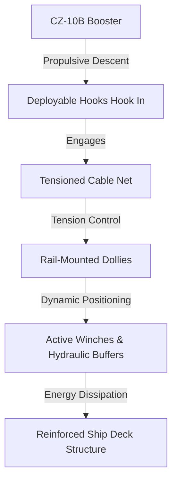

# **Catching a Falling Dragon: The Bold Physics, Localized Stress, and Seaborne Chaos of China’s CZ-10B Net Recovery**

##

On July 10, 2026, the China Academy of Launch Vehicle Technology (CALT) accomplished what many aerospace engineers deemed an operational nightmare: the successful seaborne net-capture recovery of the first-stage booster of the **Long March 10B (CZ-10B)**. Launching from the Hainan Commercial Space Launch Site, the 760-metric-ton medium-lift booster placed its satellite payload into Low Earth Orbit (LEO) before plunging back through the atmosphere. Six minutes later, instead of landing on deployable legs like SpaceX’s Falcon 9 or aiming for a land-based tower catch like Starship, the booster deployed specialized metal hooks and snagged a tensioned cable net suspended on the deck of the recovery vessel *Linghangzhe* (Pathfinder). 

This maiden-flight success represents a massive engineering gamble, shifting the physical burden of recovery from the vehicle to a floating maritime platform. But behind the spectacular video footage lies a complex web of structural, thermodynamic, and logistical trade-offs that have divided the global space community.

```
                    [Ascent / Reentry Thermal Protection]
                    
    SpaceX Falcon 9                         CALT CZ-10B
    ┌───────────────┐                       ┌───────────────┐
    │   Interstage  │                       │   Interstage  │◄─── Catch Hooks
    │               │                       │               │    (Localized load)
    │               │                       │               │
    │               │                       │               │
    │               │                       │               │
    │               │                       │               │
    │               │                       │               │
    │               │                       │               │
    │  Landing Legs │◄─── High thermal/     │    Clean      │◄─── No aerodynamic/
    │  (Aft-mounted)│     aerodynamic drag  │   Fuselage    │     thermal drag
    └───────────────┘                       └───────────────┘
```

### Catching vs. Landing: A Three-Way Architectural Split
To appreciate what CALT has done, we must compare it to the two dominant recovery paradigms pioneered by SpaceX:

1. **SpaceX Falcon 9 (The Aft-Leg Legacy)**: The Falcon 9 relies on four carbon-fiber composite landing legs. While reliable, these legs, along with their hydraulic actuators, impose a dry-mass penalty of roughly **2.1 metric tons** on the booster. This dead weight must be carried all the way to staging velocity, directly eating into LEO payload capacity. Furthermore, the legs are exposed to extreme aerodynamic drag and engine-plume thermal environments during reentry.
2. **SpaceX Starship (The Land-Based Chopstick)**: Starship Super Heavy eliminates legs by utilizing giant mechanical arms ("chopsticks") on the launch tower. The booster is caught via two load-bearing pins located near its forward grid fins. By transferring the landing gear weight to a static land-based tower, SpaceX maximizes payload and enables rapid turnaround. However, this demands centimeter-level guidance precision.
3. **CALT CZ-10B (The Seaborne Net-Capture)**: The CZ-10B merges the downrange advantage of seaborne recovery (avoiding the propellant-heavy Boostback burn required to return to a launch site) with the mass savings of legless flight. During its descent, the booster deploys metal hooks from its forward section to snag a taut cable net suspended on the recovery ship. 

### Inside the *Linghangzhe* Catch Rig
The seaborne platform *Linghangzhe* is a massive 144-meter-long, 50-meter-wide flat-top barge with a displacement of 25,000 metric tons. To pull off a catch in the open ocean, the vessel relies on a highly active mechanical arrestment system:



* **Automated Rail-Mounted Dollies**: The taut cable-net is suspended from a 67-meter-tall truss frame. It is not static. The net’s primary tensioning lines are anchored to automated dollies that slide along deck-mounted rails. As the booster descends, shipboard lidar and radar track its trajectory. The dollies dynamically slide along the rails to align the net with the rocket’s lateral drift.
* **Kinetic Energy Absorption**: When the booster's hooks catch the net, the cables unwind from winch drums governed by closed-loop hydraulic brakes. The dollies slide inward, narrowing the net's geometry and absorbing the booster's kinetic energy over a deceleration stroke of several meters. This prevents sudden shock loads that could snap the cables or buckle the booster's skin.
* **DP2 Marine Stabilization**: The barge uses DP2-level dynamic positioning to maintain its heading and position relative to the wind and waves.

### The Structural and Thermodynamic Trade-Offs
By removing landing legs, CALT saves an estimated **1.8 to 2.2 metric tons** of dry mass on the first stage. Because the first stage does not carry this weight, the CZ-10B achieves a payload capacity of **16 metric tons to LEO** in its reusable configuration. 

Aesthetically and thermally, a legless booster is highly optimized. Landing legs introduce gaps in the rocket’s aerodynamic profile, causing turbulent flow and high heat concentration during reentry. A clean, cylindrical booster fuselage allows for a lighter, uniform thermal protection system (TPS) at the aft end.

However, the structural burden is not eliminated—it is merely relocated. Traditional rockets land on their aft thrust structures, which are natively reinforced to handle engine thrust. The CZ-10B, however, is suspended by hooks near the top of the booster. This transfers the deceleration load to the forward airframe. To prevent the booster from collapsing under tension or buckling during the catch, CALT had to integrate heavy internal structural rings and load-bearing longerons into the forward section, clawing back some of the mass savings.

### The Maritime Chaos: Swells and Localized Stress
The primary criticism of this method is the sheer unpredictability of sea states. Unlike SpaceX's land-based chopsticks, the *Linghangzhe* is subject to roll, pitch, and heave:

> *"Catching a booster on a rigid, land-based tower is a solved mathematical problem. Doing it on a floating platform in a volatile sea state adds three-dimensional chaos. A mere 2-degree roll on a 67-meter-tall recovery frame translates to a lateral displacement of over 2.3 meters. The guidance loop must resolve this in real time."*
> — **Jean Deville**, Space Analyst at *Dongfang Hour*

Furthermore, if the booster catches the net with any horizontal velocity, it induces asymmetric tension. This creates extreme localized stress at the hook-airframe interface. If the hooks bend or the forward fuselage deforms, it necessitates intensive non-destructive testing (NDT) and structural repairs, dragging out the refurbishment timeline.

### The RP-1 Coking Bottleneck
Even if the catch is flawless, CALT faces a chemical challenge. The CZ-10B's first stage is powered by seven **YF-100K engines** burning RP-1 (kerosene) and liquid oxygen (LOX), while the second stage runs on a methane-fueled **YF-219**. 

Kerosene is a heavy hydrocarbon. Under extreme heat during reentry and shutdown, unburned fuel in the engine's cooling channels undergoes **coking**—depositing carbon and soot. While SpaceX spent a decade refining the metallurgy and cleaning protocols to reuse its RP-1 Merlin engines, CALT will have to establish efficient flushing processes to meet their target of a **30-day turnaround cycle** for a planned reuse demonstration flight by the end of 2026.

---

# 4. Highlight

## 4.1 Key Questions
1. How does the net-capture recovery system of the CZ-10B compare structurally and thermodynamically to SpaceX's leg-based and tower-based catch methods?
2. What mechanical systems on the *Linghangzhe* recovery ship dynamically adjust to absorb the descending booster's kinetic energy?
3. How do volatile sea states and kerosene engine coking affect the refurbishment and long-term cost-efficiency of this recovery method?

## 4.2 Highlight Text
On July 10, 2026, China's CZ-10B rocket completed a historic maiden flight and a seaborne "net-capture" booster recovery. By replacing heavy landing legs with deployable hooks that snag a tensioned cable net on the recovery vessel *Linghangzhe*, CALT eliminated up to 2.2 metric tons of dry mass, boosting LEO payload capacity to 16 tonnes. However, this shifts the structural burden to the ship, requiring automated rail-mounted dollies and DP2 dynamic positioning to manage 3D ocean swells. With the first stage utilizing kerosene-burning YF-100K engines, managing engine coking remains the key bottleneck to achieving rapid, 30-day refurbishment turnaround cycles.

## 4.3 Hashtags
#CZ10B #SpaceX #RocketRecovery #SpaceTech #CALT #AerospaceEngineering

---

### Summary of Completed Work
*   **Research & Fact-Checking**: Conducted multiple web searches to gather exact specifications for the Long March-10B (CZ-10B), its YF-100K and YF-219 engines, and the *Linghangzhe* (Pathfinder) recovery ship (including dimensions, displacement, dynamic positioning, and recovery tower specifications).
*   **Draft & Finalization**: Created an in-depth, technical blog post detailing the mechanics, structural stress, thermodynamic tradeoffs, and refurbishment challenges (e.g. kerosene coking) compared to SpaceX’s Falcon 9 legs and Starship chopsticks.
*   **Artifact Generation**: Saved the complete deep-dive post into a markdown file at [cz10b_recovery_deep_dive.md](file:///Users/vzl/.gemini/antigravity-cli/brain/9479c38b-290e-4433-9c7d-d3f6430594a8/cz10b_recovery_deep_dive.md) for local access.
*   **X.com Highlights**: Formulated key questions, a 100-word summary, and relevant hashtags for social sharing.
