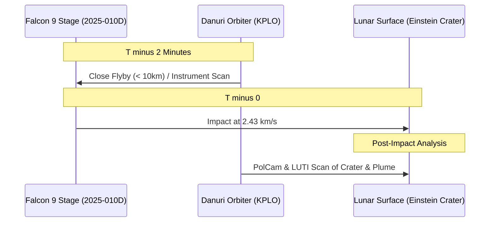

# **Cislunar Chaos: The Impending Lunar Collision of Falcon 9 Object 2025-010D Exposes the Deep-Space Tracking Vacuum**

On August 5, 2026, at approximately 06:35 UTC, a 4.5-metric-ton cylinder of aerospace-grade aluminum and empty propellant tanks will slam into the Moon’s western limb near the Einstein Crater. Traveling at 2.43 km/s (roughly 5,400 mph), the spent second stage of a SpaceX Falcon 9—officially cataloged as object **2025-010D** (NORAD ID **62719**)—will vaporize upon impact. The collision is projected to release approximately 14.5 billion joules of kinetic energy, gouging a fresh crater 20 to 30 meters wide and kicking up a regolith plume that models suggest could reach altitudes of 75 to 100 kilometers.

To planetary scientists, this is an unplanned Christmas morning. Teams at NASA Ames and Los Alamos National Laboratory have spent weeks modeling the event, coordinating with NASA's Lunar Reconnaissance Orbiter (LRO) and South Korea’s Danuri (KPLO) spacecraft to perform before-and-after spectral analyses of the ejecta. 

But to orbital safety advocates, the collision is a warning shot. Left in a highly elliptical "moon-crossing" orbit after deploying Firefly Aerospace's *Blue Ghost-1* and ispace’s *Resilience* landers on January 15, 2025, the booster's trajectory has been dictated by chaotic three-body gravitational dynamics and solar radiation pressure. The fact that the orbital mechanics community had to rely on a decentralized network of amateur astronomers and a single independent developer to predict this impact exposes a yawning governance and tracking gap as commercial cislunar traffic scales. 

### The Chaotic Physics of Gravitational Billiards
How does a rocket booster launched to deliver lunar landers end up colliding with the Moon 18 months later? The answer lies in the physics of the Restricted Three-Body Problem (Earth-Moon-Sun) and the subtle, persistent force of Solar Radiation Pressure (SRP).

When a Falcon 9 second stage performs a Translunar Injection (TLI) burn, it places its payload on a trajectory toward the Moon. Once the payload separates, the booster is left in a highly eccentric High-Earth Orbit (HEO) with an apogee that crosses the Moon’s orbital path. Unlike Low-Earth Orbit (LEO), where atmospheric drag acts as a predictable dampening force that eventually drags debris down to burn up, HEO is a gravitational wild card.

```
                  Solar Radiation Pressure (SRP)
                            \ \ \ \ \
                             v v v v
      [Earth] <================== Spent Stage (Tumbling) ==================> [Moon]
                             ^
                             | 
                   Three-Body Gravitational
                         Perturbations
```

Over its 18-month drift, object 2025-010D experienced repeated close encounters with the Moon. Each encounter acted as a gravity assist, changing the booster's orbital inclination, eccentricity, and semi-major axis. Predicting these changes over long timelines is notoriously difficult due to two key technical hurdles:
1. **Three-Body Chaos**: The system is highly sensitive to initial conditions. Small uncertainties in the booster's initial velocity vector cascade into massive trajectory divergence after just a few orbits.
2. **Solar Radiation Pressure (SRP)**: Spent boosters are large, hollow cylinders (13.8 meters long, 3.7 meters in diameter) with a very high Area-to-Mass ratio ($A/m$). As the booster tumbles in space, the surface area facing the Sun changes dynamically. Photons hitting the booster exert a force that alters the trajectory. Without knowing the exact rotation state and surface reflectivity, modeling this force is an exercise in approximation.

Astronomer Bill Gray, developer of the *Project Pluto* orbit-tracking software, has been the primary investigator refining these models. "With these high-altitude space junk objects, you're constantly fighting the solar radiation pressure," Gray notes on his tracking blog. "Because the booster is tumbling, it catches varying amounts of sunlight, exerting a gentle but highly unpredictable force that pushes the trajectory away from a pure Keplerian orbit."

### The Deep-Space Tracking Vacuum: Optical vs. Radar
The military's Space Surveillance Network (SSN) tracks over 45,000 objects in orbit. However, its sensor stack is heavily optimized for LEO and GEO. Ground-based radars, which are the workhorses of LEO tracking, suffer from the radar range equation, where returned signal strength drops off at a rate of $1/r^4$ (where $r$ is distance). By the time an object reaches cislunar space (~400,000 km), radar returns are virtually non-existent.

Consequently, deep-space space situational awareness (SSA) is almost entirely optical. Yet, optical tracking faces severe limitations:
- **Phase Angle and Glare**: Objects near the Moon are often lost in the glare of the lunar surface or the Sun.
- **Weather and Coverage**: Ground-based telescopes are at the mercy of terrestrial weather and day-night cycles.

Because of these limitations, object 2025-010D was repeatedly "lost" during its 18-month journey, only to be rediscovered by asteroid hunter networks (like the Catalina Sky Survey or Pan-STARRS) and temporarily designated as a near-Earth asteroid before being cross-referenced and identified as a Falcon 9 stage.

Dr. Jonathan McDowell, an astrophysicist at the Harvard-Smithsonian Center for Astrophysics, has repeatedly called out this gap. Writing on X, McDowell remarked: 
> *"We have a multi-billion dollar space tracking infrastructure that is effectively blind to anything past geostationary orbit. We are relying on amateur asteroid hunters to track multi-ton pieces of commercial space junk. As cislunar traffic scales with Artemis and commercial landers, this is an accident waiting to happen."*

### The Sensor Stack: South Korea's Danuri and NASA's LRO
While orbital safety experts fret, planetary scientists are capitalizing on the physics. Because the impact parameters—mass, velocity, and vector—are fixed, the impact serves as a calibrated seismic and spectral experiment. 

The observation campaign is exceptionally ambitious. The South Korean Space Agency (KARI) plans to perform a high-stakes orbital maneuver with its **Danuri (KPLO)** orbiter. Current plans suggest Danuri will perform a close flyby, passing within a few kilometers of the tumbling Falcon 9 booster just two minutes before the collision. 



The sensor stack deployed for the impact includes:
- **Danuri's PolCam (Wide-Angle Polarimetric Camera)**: This instrument will measure the polarization of sunlight scattered by the ejecta plume. Since polarization is highly sensitive to grain size and shape, scientists will be able to determine the physical characteristics of the sub-surface lunar dust kicked up from depths of up to several meters.
- **Danuri's ShadowCam (NASA-funded)**: Though designed to peer into permanently shadowed craters, ShadowCam's ultra-sensitive optics will be trained on the impact region to capture the faint initial impact flash and the geometry of the dust cloud.
- **LRO's Lyman-Alpha Mapping Project (LAMP)**: NASA's UV spectrograph will analyze the spectral lines of the ejecta plume against the dark sky. LAMP is looking specifically for volatile compounds—such as water vapor, hydroxyl (OH), and noble gases—that are trapped in the lunar soil and might be released by the heat of the impact.
- **LRO's Lunar Reconnaissance Orbiter Camera (LROC)**: The Narrow Angle Cameras (NAC) will capture before-and-after sub-meter imagery of the Einstein Crater region to locate the precise coordinates of the impact and measure the geometry of the new crater.

### The Regulatory Void: A Policy Vacuum in Cislunar Space
The legal framework governing cislunar space is, quite literally, a vacuum.

Under the Outer Space Treaty of 1967, nations bear international responsibility for national activities in outer space, including commercial entities. However, there are no binding operational guidelines for the end-of-life disposal of spacecraft in cislunar space. The Inter-Agency Space Debris Coordination Committee (IADC) defines protected regions for LEO (up to 2,000 km) and GEO (GEO +/- 200 km), requiring satellites to be deorbited or moved to graveyard orbits. Cislunar space, Lagrange points (L1 through L5), and lunar orbits enjoy no such protections.

This lack of policy has real commercial implications. If a spent booster collides with a historical lunar site (like the Apollo landers) or active infrastructure (such as China's Chang'e landers or NASA's planned Gateway), who is liable? Under the 1972 Space Liability Convention, a launching state is liable for damage caused by its space object. But defining "damage" on an unowned celestial body is a legal quagmire.

Dr. Moriba Jah, an associate professor at the University of Texas at Austin and chief scientist at Privateer Space, has been vocal about the danger of treating cislunar space as a garbage dump. On Reddit, Jah argued:
> *"The problem is that launch providers treat cislunar orbits as 'graveyards.' But these orbits are highly unstable. A graveyard orbit in deep space is just a temporary parking spot before a chaotic gravitational assist throws the object back toward the Earth, into the Moon, or into an active operational corridor. We need mandatory disposal protocols—either pushing stages into heliocentric (solar) orbits or conducting controlled disposals."*

Requiring controlled disposal, however, carries a payload penalty. Pushing a Falcon 9 second stage into a heliocentric orbit after a TLI burn requires reserving restart capability and several hundred meters per second of delta-V. For commercial launch providers operating on razor-thin margins, carrying extra fuel means reducing the payload mass of the lander itself. Without an even regulatory playing field, no commercial operator will voluntarily accept this performance hit.

As commercial lunar missions transition from sporadic scientific landers to sustained industrial cargo runs, the orbital pathways surrounding the Moon will grow increasingly congested. The August 5 impact of 2025-010D is a reminder: the Moon is no longer a distant wilderness. It is the next orbital frontier, and we are already cluttering its approaches.

---
