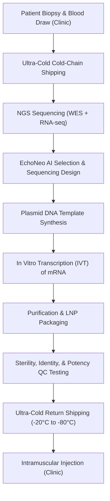

# Coding the Cure: Inside the Algorithmic Pipeline, Logistics Orchestration, and Regulatory Framework of Moderna and Merck's Phase 3 Personalized mRNA Cancer Vaccine

###

On August 19, 2026, the biopharma landscape crossed a historic milestone. Moderna and Merck announced positive topline results from their global Phase 3 **INTerpath-001** trial, demonstrating that the combination of the individualized neoantigen therapy (INT) **intismeran autogene** (V940/mRNA-4157) and the checkpoint inhibitor **Keytruda** (pembrolizumab) achieved statistically significant and clinically meaningful improvements in recurrence-free survival (RFS) and distant metastasis-free survival (DMFS) in patients with completely resected stage IIB–IV melanoma compared to Keytruda alone.

For decades, oncology has operated on a mass-production paradigm. mRNA-4157 represents a complete departure: it is a bespoke, patient-specific biologic. The drug is literally designed and synthesized from scratch for every individual patient. But beneath the celebratory press releases lies a complex computational, logistical, and regulatory infrastructure that must now scale from clinical trial cohorts to thousands of patients globally.

To understand the scope of this breakthrough, we must analyze the bioinformatic pipelines, the digital manufacturing operating systems, the regulatory mechanisms, and the clinical realities of implementing personalized medicine at scale.

---

### The Algorithmic Engine: EchoNeo and Multimodal Deep Learning
The design of each personalized vaccine begins with a patient's tumor. DNA and RNA are extracted from a tumor biopsy and matched healthy blood tissue, followed by whole-exome sequencing (WES) and transcriptomic RNA sequencing (RNA-seq).

The raw sequencing files (FASTQ/BAM) are processed through a bioinformatic pipeline to identify somatic mutations—specifically single nucleotide variants (SNVs), small insertions/deletions (indels), frameshift mutations, and gene fusions. Indels and frameshifts are highly sought after; because they alter the reading frame, they produce completely novel, non-self peptides that are highly immunogenic to the patient's T cells.

However, the human immune system does not recognize raw genomic mutations. It only identifies mutated peptides that are successfully processed, loaded, and presented on the cell surface by highly polymorphic **Human Leukocyte Antigen (HLA)** molecules (part of the Major Histocompatibility Complex, or MHC).

Traditionally, algorithms like NetMHCpan predicted neoantigens based almost entirely on predicted **MHC binding affinity (IC50)**. However, binding affinity alone does not guarantee immunogenicity; up to 95% of predicted binders fail to elicit an actual T-cell response, creating a massive false-positive challenge in vaccine design.

To solve this, Moderna developed **EchoNeo**, a multimodal deep learning pipeline. Instead of evaluating binding in isolation, EchoNeo models the entire antigen processing and presentation pathway:
1. **Proteasomal Cleavage:** Predicting where the cell’s molecular machinery will cleave the mutated protein.
2. **TAP Transport:** Modeling the affinity of the peptide for the Transporter associated with Antigen Processing.
3. **MHC-Peptide Stability:** Predicting the half-life of the peptide-MHC complex on the cell surface.
4. **TCR Engagement:** Modeling the likelihood of a T-cell receptor (TCR) recognizing the presented complex.

EchoNeo is trained on datasets combining public databases (such as IEDB and TESLA), mass spectrometry (LC-MS/MS) immunopeptidomics, and Moderna’s proprietary clinical trial data. The pipeline evaluates somatic candidates to select up to **34** optimal patient-specific neoantigens, which are then compiled into a single synthetic mRNA sequence separated by proprietary glycine-rich linker regions to optimize translation.

As Eric Topol, Director of the Scripps Research Translational Institute, has observed:
> "We are witnessing the fusion of generative AI and genomic translation. The ability to predict which neoantigens will trigger a real immune response in a specific HLA environment is the difference between a therapeutic dud and a highly protective vaccine. EchoNeo is essentially a molecular compiler."

However, this algorithmic approach has faced scrutiny. Biostats communities on Reddit and academic researchers have pointed out that historical training datasets for MHC binding models are heavily skewed toward common Caucasian HLA haplotypes (such as HLA-A\*02:01). This raises questions about whether neoantigen selection algorithms maintain equivalent predictive accuracy in racially diverse patient populations with rarer HLA alleles—a hurdle Moderna must address to ensure equitable access.

---

### The Manufacturing Bottleneck: The "Batch of One" and Maestro
Once EchoNeo designs the mRNA sequence, it must be manufactured. In traditional biopharma, a single batch of a drug is produced in a bioreactor to generate millions of identical doses. For mRNA-4157, every run is a "batch of one."

The workflow is a complex, time-sensitive loop:

To manage this workflow, Moderna built **Maestro**, a digital manufacturing orchestration system. Maestro acts as the operational nervous system, scheduling raw materials, track-and-trace logistics, and sequencing steps, automatically rescheduling downstream planning if delays occur in the pipeline.

Currently, the end-to-end turnaround time from biopsy collection to localized injection is **6 to 8 weeks**. In aggressive, high-risk melanomas, this timeline is a primary vulnerability. During these two months, a patient's cancer can progress to a point where immunotherapy is no longer viable.

During discussions on the r/biotech subreddit, a senior process engineer commented:
> "The bottleneck isn't the in vitro transcription (IVT) or the lipid nanoparticle (LNP) formulation; those are chemical reactions that take hours. The bottleneck is the DNA plasmid synthesis (making the template), the quality control (QC) sterility testing, and the complex logistics of tracking a single patient's lot through seven different stages without cross-contamination. If you drop a vial, there is no backup inventory."

Stéphane Bancel, CEO of Moderna, has highlighted this operational hurdle:
> "Our goal is to continually compress this timeline. With automation, digitized logistics via Maestro, and decentralized sequencing, we want to get this down to under 4 weeks. But manufacturing a customized biologic at scale is the hardest operational hurdle biopharma has faced in a generation."

---

### The Regulatory Frontier: SaMD and Predetermined Change Control Plans (PCCPs)
From a regulatory standpoint, personalized cancer vaccines do not fit the traditional Biologics License Application (BLA) framework. The FDA's standard regulatory pathway expects a static drug substance with defined chemical properties. If you change a single nucleotide in an antibody or a small molecule, it is considered a new drug. With mRNA-4157, every patient gets a completely different nucleotide sequence.

The FDA has adapted by regulating the *process* rather than the specific sequence. In August 2026, the FDA's Center for Biologics Evaluation and Research (CBER) released draft guidance on the potency assessment of active immunotherapy products, providing a framework for validating variable composition biologics.

However, the real regulatory innovation is how the FDA handles the AI algorithm itself. If EchoNeo is updated with new training data to improve its neoantigen selection accuracy, does Moderna need to submit a new BLA?

To prevent regulatory gridlock, the FDA is utilizing the **Predetermined Change Control Plan (PCCP)** framework, authorized under Section 515C of the FDCA. A PCCP allows Moderna to submit a pre-approved protocol for how the algorithm will learn and modify its parameters over time. As long as algorithm updates remain within the pre-defined boundaries and are validated according to the protocol, the updated model can be deployed without a new premarket submission. This establishes EchoNeo as **Software as a Medical Device (SaMD)** integrated directly into the Chemistry, Manufacturing, and Controls (CMC) portion of the biologic's regulatory dossier.

---

### Clinical Realities: Side Effects, Cold-Chains, and the Reimbursement Crisis
While the clinical efficacy is statistically significant, the data must be put in context. The Phase 3 INTerpath-001 trial met its primary endpoint of RFS and secondary endpoint of DMFS in a pre-specified interim analysis, though exact hazard ratios were not disclosed in the topline release. This builds on the Phase 2b KEYNOTE-942 trial, which showed a 49% reduction in the risk of recurrence or death (HR = 0.51) and a 41% reduction in the risk of distant metastasis or death (HR = 0.41) at 5 years.

However, the Phase 2b study faced criticisms regarding potential "baseline bias." Commentators on r/ModernaStock and biotech forums pointed out that the control arm (Keytruda monotherapy) in KEYNOTE-942 performed worse than historical benchmarks in other adjuvant trials (like KEYNOTE-054), which may have artificially inflated the relative benefit of the combination. The Phase 3 INTerpath-001 trial—being a randomized, double-blind, placebo-controlled study with 1,137 patients—is specifically designed to resolve this debate.

Implementing this therapy in real-world clinical oncology workflows presents substantial hurdles:

#### 1. Side Effects and Safety
The combination's safety profile is manageable, but patients experience common vaccine-related adverse events: injection site reactions, fatigue, chills, and myalgia, mostly Grade 1 or 2. When combined with Keytruda, there is a risk of compounding immune-related adverse events (irAEs) like thyroiditis or colitis. The long-term safety profile from KEYNOTE-942 suggests no synergistically toxic signals, but monitoring patients on dual therapy requires vigilant clinical management.

#### 2. The Cold-Chain Distribution Challenge
Unlike standard oncology drugs, mRNA-4157 requires strict temperature controls. The LNP-formulated mRNA must be stored and transported at ultra-low temperatures (-20°C to -80°C). Community oncology clinics, which treat the majority of cancer patients in the US, are rarely equipped to handle patient-specific ultra-cold storage, reconstitution, and strict administration windows. A single power outage or freezer failure could destroy a custom therapeutic.

#### 3. The Reimbursement Strategy
How do you price a custom-made drug? While Merck and Moderna share costs and profits 50/50, industry analysts estimate the commercial price of mRNA-4157 could reach **$150,000 to $250,000 per patient**, on top of the ~$150,000 annual cost of Keytruda.

Biotech investor Brad Loncar commented on X:
> "The clinical efficacy of V940 is undeniable, but the reimbursement battle will be historic. Insurers are used to paying for CAR-T, which is also personalized, but CAR-T is a one-time treatment. V940 is administered as up to 9 doses over a year alongside Keytruda. Payers will demand strict value-based reimbursement models, potentially tying payment to recurrence-free milestones."

---

### Expanding to "Cold" Solid Tumors
The success in melanoma is a proof-of-concept, but melanoma is an immunologically "hot" tumor with a high tumor mutational burden (TMB) and pre-existing T-cell infiltration. The true frontier is expanding the mRNA platform to immunologically "cold" tumors like pancreatic ductal adenocarcinoma (PDAC) and microsatellite stable (MSS) colorectal cancer.

These tumors are notoriously resistant to immunotherapy because they have a low TMB (fewer somatic mutations for AI to select from) and an immunosuppressive microenvironment packed with myeloid-derived suppressor cells (MDSCs) and regulatory T cells (Tregs) that actively exclude T cells.

Moderna is currently running Phase 1 studies evaluating mRNA-4157 in pancreatic cancer. (Importantly, the landmark pancreatic cancer mRNA trial published in *Nature* in 2023 was for BioNTech's competing platform, **autogene cevumeran/BNT122**, developed with Genentech). Moderna's strategy is to use EchoNeo to find the few high-quality neoantigens that do exist, and combine the vaccine with both checkpoint inhibitors and microenvironment-modifying therapies to "heat up" the tumor, forcing T-cell infiltration into previously cold lesions.

Whether AI and mRNA can successfully break the defenses of cold solid tumors remains one of the most critical open questions in clinical oncology.

---

## 4. Highlight

### 4.1 Key Questions
1. How will community oncology clinics manage the ultra-cold chain logistics and reconstitution protocols required for patient-specific mRNA vaccines?
2. Can Moderna's EchoNeo algorithm maintain its predictive accuracy for diverse HLA genotypes that are underrepresented in current genomic training databases?
3. How will payers structure reimbursement for a customized biologic costing up to $250,000 that must be administered alongside standard immunotherapy?

### 4.2 Highlight Text
On August 19, 2026, Moderna & Merck announced that their Phase 3 INTerpath-001 trial for personalized cancer vaccine mRNA-4157 (intismeran autogene) combined with Keytruda met its primary endpoint in melanoma. While the clinical results mark a historic milestone for individualized neoantigen therapy, the industry now faces the immense task of scaling a "batch of one." From the multimodal deep learning predictions of Moderna’s EchoNeo algorithm to the real-time logistics of the Maestro orchestrator and the FDA’s adaptive PCCP regulatory framework, personalized oncology is shifting from a scientific challenge to an operational and reimbursement sprint.

### 4.3 Hashtags
#CancerVaccine #mRNA #Biotech #Genomics #ArtificialIntelligence #PrecisionMedicine
