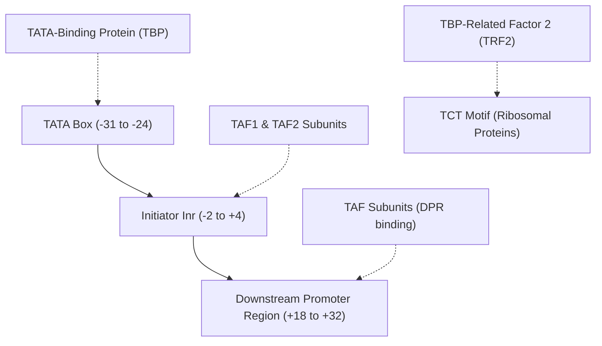

# Cracking the Core Promoter: SVR Models Unmask the Human Initiator and the Regulatory Grammar of Non-Coding DNA

##

The non-coding genome—accounting for roughly 98% of human DNA—has long been termed the "dark matter" of biology. Historically, interpreting how mutations in these regions alter gene expression has been a massive bottleneck in clinical genomics. In a landmark study published in *Genes & Development* (July 2026), UC San Diego researchers Torrey E. Rhyne-Carrigg, Long Vo Ngoc, Claudia Medrano, Kassidy E. Gillespie, and James T. Kadonaga bridged this gap by combining high-throughput experimental assays with machine learning to decode the human **initiator (Inr)**—the core promoter element that serves as the transcriptional "on switch" for roughly 60% of all human genes.

### The Molecular Biology of Gene Transcription
To appreciate the significance of this work, one must dive into the molecular mechanics of the pre-initiation complex (PIC). RNA Polymerase II (Pol II) is responsible for transcribing all protein-coding genes in humans. However, Pol II cannot bind to DNA or initiate transcription on its own. It relies on general transcription factors (GTFs) to assemble at the core promoter, a region spanning roughly -40 to +40 base pairs relative to the transcription start site (TSS, designated as +1).

The primary coordinator of this assembly is **TFIID**, a multi-subunit megadalton complex. TFIID recognizes and binds to key DNA sequence motifs in the core promoter:
1. The **TATA box** (typically located at positions -31 to -24), which is bound by the TATA-binding protein (`TBP`) subunit of TFIID.
2. The **Initiator (Inr)** (spanning positions -2 to +4), which is recognized and bound by the `TAF1` and `TAF2` subunits of TFIID.
3. The **Downstream Promoter Region (DPR)** (spanning positions +18 to +32), bound by other TBP-associated factors (TAFs).

### The Computational Hurdle: Why Consensus Sequences Fail
For decades, biologists defined the initiator using consensus sequences like the degenerate `YYANWYY` (where Y = pyrimidine, N = any nucleotide, W = A/T, and the A at +1 is the TSS). Later, the Kadonaga lab refined this to `BBCA+1BW` (where B = C/G/T, W = A/T) for focused human promoters.

However, these consensus sequences are crude approximations. The sequence space of functional initiators exhibits extreme sequence heterogeneity. Many functional initiators deviate significantly from these consensus models, while many sequences matching the consensus fail to initiate transcription. This heterogeneity makes it impossible for static sequence matchers to accurately predict the transcriptional impact of promoter mutations.

### The Machine Learning Solution: HARPE-SVR
To resolve this, the UCSD team utilized their **HARPE** (High-throughput Analysis of Randomized Promoter Elements) framework combined with machine learning:

1. **Dataset Generation**: They synthesized a pool of ~500,000 promoter variants where the initiator region (positions -3 to +5 relative to the TSS) was randomized.
2. **Quantitative Activity Measurement**: They performed in vitro transcription of this massive synthetic library using HeLa cell nuclear extracts, followed by high-throughput sequencing (RNA-seq). This mapped each of the 500,000 sequence variants directly to a quantitative measure of transcription initiation strength.
3. **Model Training**: The resulting sequence-to-activity dataset was used to train a **Support Vector Regression (SVR)** model (`HARPE-SVR`). By utilizing k-mer feature representation, the SVR model mapped the non-linear interactions of nucleotides at specific positions to transcriptional output.

Why SVR instead of a deep convolutional or transformer-based network (like DeepMind's Enformer or Calico's Borzoi)? While deep models excel at predicting distal enhancer-promoter loops across megabases, they are notorious "black boxes" that struggle with local, single-nucleotide variant (SNV) effects on personal genomes due to overfitting on reference genomes. 

As Stanford Associate Professor **Anshul Kundaje** notes:
> *"While deep sequence-to-expression models like Enformer or Borzoi are great at predicting general chromatin contexts, they often fail to capture fine-grained personal variant effects. Focused, high-throughput synthetic libraries allow us to isolate specific biophysical parameters. Applying SVR to this data gives us highly interpretable coefficient weights for every position, letting us map the true physical grammar of the promoter rather than empirical genomic context."*

### Key Genomic Insights Decoded by the AI
The SVR model's predictions yielded several major biological breakthroughs:
*   **The 60% Prevalence**: Genome-wide analysis showed that ~60% of natural human promoters contain a functional initiator signature, correcting older, lower estimates.
*   **The TATA-Specific Inr**: The model discovered that promoters containing a TATA box possess a distinct, more sequence-flexible initiator motif than TATA-less promoters.
*   **The TCT Motif**: The researchers characterized the TCT motif, which regulates ribosomal protein (RP) genes. While structurally overlapping with the Inr, the TCT motif is functionally distinct—it is TFIID-independent and recruits **TBP-Related Factor 2 (TRF2)** instead of TBP. Interestingly, the model revealed that human TCT motifs have distinct regulatory features compared to *Drosophila*.
*   **Core Promoter Element Interrelationships**:
    *   *Inr-DPR Synergy*: There is a strict, synergistic interaction between the Inr and the Downstream Promoter Region (DPR).
    *   *TATA-DPR Duality*: The model confirmed an inverse relationship/duality between the TATA box and the DPR. TATA-driven promoters rarely utilize the DPR, whereas TATA-less promoters rely on the strict cooperative synergy of the Inr and the DPR.

### Clinical Implications: Screening the Non-Coding Genome
Over 98% of the human genome is non-coding, and clinical sequencing databases are flooded with "Variants of Unknown Significance" (VUS) in promoter regions. In oncology, promoter mutations can drive tumorigenesis by altering transcription factor binding (e.g., the famous C228T and C250T mutations in the TERT promoter).

By utilizing `HARPE-SVR`, clinical genomicists can score patient promoter variants in silico with high confidence. A mutation that disrupts the TAF1/TAF2 binding affinity of the Inr or breaks the Inr-DPR synergy can be flagged as pathogenic immediately, bypassing months of wet-lab validation.

### Synthetic Biology and High-Precision Gene Therapy
From an engineering perspective, this work represents a paradigm shift for gene therapy. Traditional gene therapies often suffer from "promoter leakage"—where the therapeutic gene is expressed in non-target tissues, leading to off-target toxicity.

As **Vijay Pande**, General Partner at Andreessen Horowitz (a16z), has frequently observed:
> *"We are shifting from an empirical discovery phase in biology to an engineering discipline. Once we understand the exact sequence-to-activity grammar of these regulatory switches, we can program cells like computers."*

By utilizing the rules decoded by `HARPE-SVR`, synthetic biologists can rationally engineer custom, artificial core promoters. For example, by combining a TATA-specific Inr with an optimized DPR and tissue-specific enhancers, clinicians can design AAV vectors with extreme cell-type specificity and tunable, highly precise transcription rates, maximizing therapeutic efficacy while eliminating off-target expression.

***

# 4. Highlight

## 4.1 Key Questions
1. How does machine learning resolve the sequence heterogeneity of core promoter elements where deep neural networks fail?
2. What are the clinical implications of decoding non-coding promoter mutations (VUS) for oncology?
3. How does the decoded Inr-DPR-TATA grammar enable the rational design of synthetic promoters for cell-type-specific gene therapy?

## 4.2 Highlight Text
How do you decode the genomic "dark matter" of non-coding DNA? UC San Diego researchers just used machine learning to decode the "initiator"—the crucial DNA "on switch" present in ~60% of human promoters. By training a Support Vector Regression (SVR) model on 500,000 synthetic variants via the HARPE platform, the team bypassed the "black box" limitations of deep learning models like Enformer. The AI mapped the strict regulatory grammar governing TFIID, TATA, and DPR interactions. This breakthrough enables clinicians to screen patient genomes for pathogenic promoter mutations and allows engineers to design high-precision synthetic promoters for gene therapy.

## 4.3 Hashtags
#Genomics #MachineLearning #SyntheticBiology #GeneTherapy #BioTech
