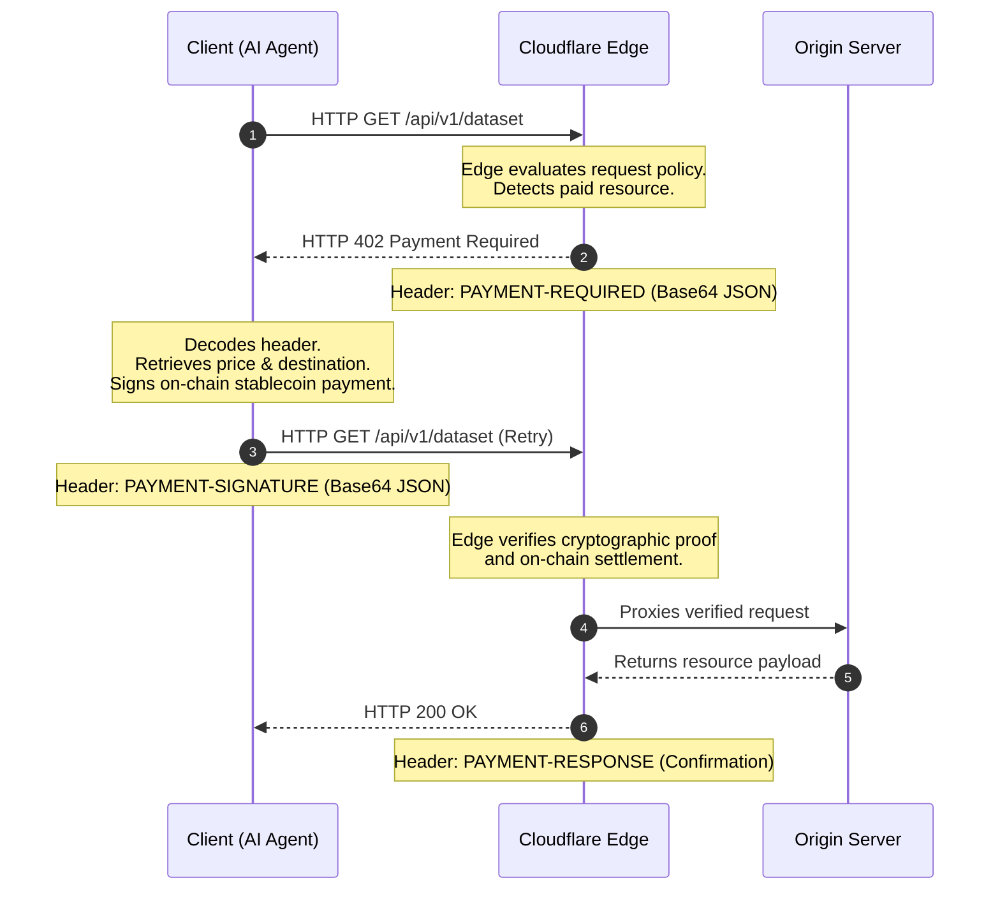

# **HTTP 402 Redux: Cloudflare, Coinbase, and the Edge-Enforced Paywalls of the Agentic Web**

---

##

The internet is undergoing a quiet, tectonic shift. For over three decades, the web has been fundamentally human-centric—monetized through the clumsy trade-offs of display ads, affiliate links, and monthly subscriptions. But today, the majority of API and data queries are increasingly driven not by human eyeballs, but by autonomous AI agents, scrapers, and [Model Context Protocol (MCP)](https://modelcontextprotocol.io/) clients. These machines consume massive datasets, evaluate tools, and scrap resources programmatically, bypassing the visual interfaces that traditional monetization relies upon.

In response, Cloudflare and Coinbase have co-developed a paradigm-shifting standard that "dusts off" one of the web's oldest, most famous dormant mechanisms: **HTTP 402 (Payment Required)**. 

With the official launch of the **Cloudflare Monetization Gateway** on July 1, 2026, and the open-source [x402 protocol](https://github.com/x402-foundation/x402) (now governed by the Linux Foundation), the foundations of the agentic economy are being laid at the network edge. This investigative deep dive dissects the technical architecture of the x402 challenge-response flow, evaluates the economic feasibility of micro-transactions, and analyzes the intense developer debates brewing on Hacker News and X.com.

---

### The Rise of the Agentic Web and the HTTP 402 Resurrection

The HTTP 402 status code was defined in RFC 2068 in 1997 with the simple placeholder: *"This code is reserved for future use."* For nearly 30 years, it remained a digital ghost town. 

The problem was infrastructure. In the late 90s, the internet lacked a native, low-friction, global settlement layer capable of handling micro-transactions. Credit card networks (Visa, Mastercard, Stripe) were built for human checkout pages and carried prohibitive transaction fees (typically $0.30 + 2.9%), making it economically impossible to charge a fraction of a cent for a single API query or article read.

However, the rise of LLM agents has changed the math. Autonomous agents powered by tools like LangChain, AutoGPT, or Anthropic's Claude Desktop request web resources thousands of times a minute. They do not click ads. They do not sign up for credit card subscriptions. 

As Coinbase CEO **Brian Armstrong** noted:
> *"AI agents cannot open bank accounts because they cannot satisfy traditional 'Know Your Customer' (KYC) requirements. Crypto wallets and stablecoins are the only native way for these autonomous entities to hold capital, sign transactions, and pay for services on their own."*

By pairing the edge network of Cloudflare with the low-cost stablecoin rails of Coinbase’s L2 network, Base, the x402 protocol makes programmatic web payments a reality.

---

### Inside the x402 Handshake: The Technical Workflow

At its core, x402 is an open, network-agnostic negotiation layer that relies on three primary HTTP headers to execute a cryptographic "challenge-response" transaction: `PAYMENT-REQUIRED`, `PAYMENT-SIGNATURE`, and `PAYMENT-RESPONSE`.

Here is the exact step-by-step lifecycle of an x402-gated request:



#### Step 1: The Initial Challenge (HTTP 402)
When an AI agent requests a protected API endpoint, the Cloudflare Monetization Gateway intercepts the request at the edge. Because there is no valid payment token, the gateway halts the request and responds with an **HTTP 402 Payment Required** status code. 

The response payload contains the `PAYMENT-REQUIRED` header, which carries a Base64-encoded JSON object detailing the price, the target network, the asset, and the merchant's wallet address:

```json
{
  "x402Version": 2,
  "error": "Payment Required",
  "paymentRequirements": [
    {
      "scheme": "ethereum",
      "network": "base",
      "asset": "USDC",
      "amount": "0.0005",
      "payTo": "0x742d35Cc6634C0532925a3b844Bc9e7595f0bEb",
      "resource": "api/v1/dataset-abc",
      "nonce": "c8a49ff2-3b90-4555-b37b-e9ff56db1946"
    }
  ]
}
```

#### Step 2: The Cryptographic Response (`PAYMENT-SIGNATURE`)
The client agent decodes the requirements, evaluates the cost against its internal budget, and uses its embedded Web3 wallet to authorize the transaction. The client then retries the HTTP request, appending the `PAYMENT-SIGNATURE` header. This header includes the transaction hash and a cryptographic signature proving the payment was broadcast to the blockchain:

```json
{
  "transactionHash": "0xa4b19c8f85f39642fb5917822b3e8ee79ef1c71285223e7284f55a1d7c35f29a",
  "signature": "0x8d5c412f84a441e8c75dfb3e41b238a8df0b5b1a3d2e1c9f7a6b5c4d3e2f1a0b...",
  "paymentId": "pay_cf_9812739"
}
```

#### Step 3: Edge Verification and Fulfillment
Rather than forcing the origin server to perform heavy blockchain lookups (which would quickly overwhelm its database), the verification is fully offloaded to Cloudflare Workers at the edge. Cloudflare's edge validators verify that the transaction signature matches the nonce and that the required amount of USDC was settled on the Base chain. Once verified, the gateway proxies the request to the origin server, which serves the resource alongside a `PAYMENT-RESPONSE` confirmation header.

---

### Economic Feasibility: Why Stablecoins on L2?

A micropayment standard is only as viable as its underlying fees. Fulfilling a $0.0005 API query on the Ethereum mainnet is a mathematical absurdity, given that gas fees routinely cost several dollars. 

To overcome this, the x402 Foundation—governed by the Linux Foundation with support from Coinbase, Cloudflare, Visa, AWS, Google, and Stripe—settles primarily in **USDC on Base**. Thanks to Ethereum’s Dencun upgrade and Base's high throughput, transaction fees are negligible (often less than $0.001). 

Jesse Pollak, the creator of Base, described the protocol as a structural unlock:
> *"x402 creates an open, friction-free toll system for the web. By routing stablecoin transactions over L2s, we can settle fractions of a cent instantly. This is the financial routing layer AI agents need to operate autonomously at scale."*

Furthermore, by performing verification at the network edge, the Monetization Gateway acts as a shield against unpaid bot traffic. High-frequency scrapers (like OpenAI’s GPTBot or Anthropic's ClaudeBot) that fail to settle payments are blocked immediately by Cloudflare, protecting origin infrastructure from DDoS-like resource exhaustion and scraper-induced database spikes.

---

### The Community Debate: Web Salvation or Centralized Cartel?

As the Monetization Gateway rolls out, a fierce ideological battle is playing out across Hacker News and X.com.

#### Proponents: The Salvation of Content Creators
Independent publishers and creators view x402 as a weapon against uncompensated LLM scraping. For years, AI labs have scraped the open web for free, training multi-billion dollar models while starving original creators of traffic and revenue. 

A prominent Hacker News comment summarized this view:
> *"Blanket robots.txt blocks don't work, and suing OpenAI takes years. x402 gives us a programmatic dial. If Perplexity wants to parse my blog to feed their search summary, they can pay $0.0002 per page view. If they don't pay, they get a 402 at the edge. Finally, we have leverage."*

#### Critics: High Latency, Startup Barriers, and Tarpits
Conversely, web purists and developers warn that the widespread adoption of x402 could destroy the open web and restrict startup innovation:

1. **API Latency Overhead**: Critics point out that a challenge-response workflow introduces significant latency. A standard API call requires two full round-trips (RTT)—one to receive the 402 challenge, and another to submit the payment signature—plus the time required for the agent's wallet to sign the payload and the edge to query the chain. In time-sensitive agentic loops, this overhead is highly prohibitive.
2. **The "Tarpit" Wallet Drain**: A major security concern is the possibility of malicious redirect loops. If an agent falls into a "tarpit"—a web ring designed to bounce agents through infinite loops of HTTP 402 gates—it could drain its entire stablecoin wallet in seconds.
3. **Startup Exclusion**: Bootstrapped developers argue that usage-based micro-paywalls will make multi-agent systems economically unviable. An agent that spawns sub-agents to perform a task could run up compounding, unpredictable micro-bills, pricing out early-stage startups that cannot afford to fund agent wallets.
4. **The Consortial Tax**: Some developers accuse the x402 Foundation of acting as a centralized cartel. By positioning themselves as the default gatekeepers, Cloudflare, Coinbase, Stripe, and Visa could eventually impose a network-level tax on all machine-to-machine commerce.

---

### The Verdict

The Cloudflare Monetization Gateway and the x402 protocol represent a significant milestone in the evolution of the web. By turning the theoretical HTTP 402 status code into a working edge-enforced standard, they are laying the groundwork for a machine-to-machine economy. 

Whether x402 remains a niche protocol for premium datasets or becomes the universal toll booth of the agentic web depends on how the industry resolves its fundamental trade-offs: balancing content rights against open web accessibility, and payment security against network latency. One thing is certain—the era of the free, uncompensated scraper web is coming to an end.

As Cloudflare CEO **Matthew Prince** put it:
> *"The Internet's core protocols have always been driven by independent governance, which is why we're proud to work with Coinbase to ensure x402 has the same path, given its likelihood to become a core protocol for agentic commerce."*

***

# 4. Highlight

## 4.1 Key Questions
1. How does the x402 protocol use the HTTP 402 status code and custom headers to manage automated payments?
2. What are the economic and performance trade-offs of settling micropayments via stablecoins on Layer 2 networks like Base?
3. How do edge-enforced paywalls protect origin servers from high-volume scraping bot traffic?

## 4.2 Highlight Text
Cloudflare's new Monetization Gateway and the open-source x402 protocol are dusting off the long-dormant HTTP 402 (Payment Required) status code to build the payment rails for the agentic web. By enforcing stablecoin micropayment challenges at the network edge (primarily USDC on Coinbase's Base network), the gateway allows creators and API providers to programmatically charge AI scrapers per request. While proponents view x402 as the ultimate shield against uncompensated LLM training data extraction, developers warn of high API latency overhead, wallet-draining "tarpit" redirects, and startup exclusion.

## 4.3 Hashtags
#Cloudflare #x402 #AIEconomy #BaseNetwork #Micropayments #Stablecoins #Web3
