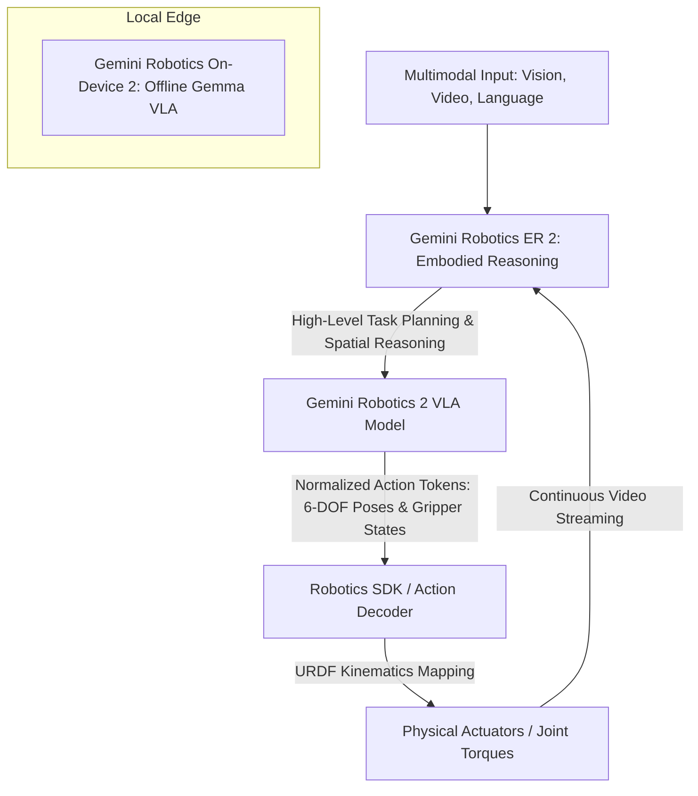

# **Inside Gemini Robotics 2: DeepMind’s Bid for Whole-Body Intelligence and the Decoupled VLA Edge**

##

Today, Google DeepMind dropped a massive bombshell on the physical AI landscape: **Gemini Robotics 2**. The newly announced suite of physical AI models represents a monumental shift in how machines interact with our messy, unpredictable world. For years, the robotics community has been fractured between hand-crafted physics engines, isolated joint-level controllers, and cloud-heavy Vision-Language-Action (VLA) models that struggle with real-time latency. Gemini Robotics 2 aims to dismantle this status quo by introducing a decoupled, tri-model architecture designed to coordinate complex whole-body motions—from walking and crouching to high-dexterity manipulation—across diverse robotic form factors.

DeepMind is framing this release as a complete solution for physical AI, structured around three specialized components:
1. **Gemini Robotics 2 (VLA):** The flagship Vision-Language-Action model responsible for low-level, whole-body control.
2. **Gemini Robotics ER 2 (Embodied Reasoning):** The high-level orchestration "brain," built on the Gemini 3.5 Flash architecture.
3. **Gemini Robotics On-Device 2:** A lightweight, Gemma-based edge model optimized for offline, low-latency execution.

To understand the engineering behind this release, we have to look at how DeepMind has decoupled reasoning from execution, and how it plans to bridge the notorious "reality gap" that has plagued robot learning for decades.

### The Architecture: Decoupling Reason from Action
At the core of the Gemini Robotics 2 framework is a clean separation of concerns. Instead of forcing a single, gargantuan neural network to handle both high-level semantic reasoning and millisecond-level joint control, DeepMind has split the pipeline.

**Gemini Robotics ER 2** functions as the high-level coordinator. Built on Gemini 3.5 Flash, it consumes raw video and audio feeds continuously rather than relying on static image snapshots. By leveraging the **Gemini Live API’s** bidirectional streaming capabilities, ER 2 processes environmental inputs in real time, virtually eliminating the awkward "stop-and-think" pauses seen in older robotic systems. 

DeepMind’s internal metrics for ER 2 are impressive:
* **Moment Finding:** The model identifies critical task transition points (e.g., when a screw is fully tightened or a box flap is closed) with **91.3% accuracy**.
* **Temporal Speed:** It executes these transitions four times faster than previous large model categories, averaging an event-timing distance of **0.96 seconds**.
* **Progress Tracking:** It maintains a **57.4% accuracy rate** in tracking progress through five-stage task sequences.

Once ER 2 formulates a plan, it hands execution off to the **Gemini Robotics 2 VLA** model. The VLA model translates visual scenes and high-level directives into a **normalized action space**. Rather than outputting raw motor voltages or joint torques directly, the model generates discrete action tokens representing normalized coordinates (such as 6-DOF end-effector poses and gripper state transitions). A specialized **Robotics SDK** containing an **Action Decoder** then maps these normalized coordinates onto the robot's physical configuration (defined by its Unified Robot Description Format, or URDF).

### The Latency Dilemma: Cloud vs. Edge
In robotics, latency is not just a performance bottleneck; it is a safety hazard. If a humanoid robot experiences a network hiccup while walking or carrying a heavy payload, a 200-millisecond delay in motor commands can result in a catastrophic fall.

Cloud-based VLA deployments are inherently vulnerable to network jitter, packet loss, and data center round-trip times. To solve this, DeepMind developed **Gemini Robotics On-Device 2**. Built on Gemma on-device model technology, this lightweight VLA model runs locally on edge hardware. 

Running locally allows On-Device 2 to bypass cloud latency entirely, operating at the high frequencies required for continuous stability control loops. Crucially, the on-device model inherits advanced motion-transfer techniques from the Gemini 1.5 generation, enabling it to adapt to entirely new robot configurations in a few hours using fewer than **200 demonstration examples**.

This hybrid deployment paradigm—cloud-based ER 2 for high-level semantic orchestration and local On-Device 2 VLA for low-latency physical loops—is designed to resolve the classic compute-versus-reaction trade-off in embodied AI.

### The Reality Gap: Sim-to-Real and the "Imitation Ceiling"
Perhaps the most heated debate in modern robotics research centers on the **reality gap**—the discrepancy between simulated training environments (which feature idealized physics and visuals) and the messy physical world. 

Historically, researchers relied on massive domain randomization to bridge this gap, styling simulated environments with arbitrary textures and lighting so the robot's visual system generalizes to the real world. However, complex contact physics, actuator backlash, and thermal drift are notoriously difficult to simulate.

Dr. Sergey Levine, co-founder of Physical Intelligence (Pi) and UC Berkeley professor, has long argued that pure behavioral cloning (imitative learning) from human demonstrations is fundamentally capped. 
> "Behavioral cloning and VLA models are an excellent starting point, but they hit an imitation ceiling," Levine noted. "To achieve true robustness, models must be fine-tuned via reinforcement learning (RL) in physically consistent world models and real-world rollouts."

NVIDIA's Dr. Jim Fan, who leads the GEAR group, has also voiced skepticism about relying solely on VLA architectures. Fan argues that the robotics "end game" requires a shift toward **World Action Models (WAMs)**:
> "VLA models are fundamentally language-vision models with action tokens tacked on the end. A true World Action Model doesn't just predict the next action token; it simulates the next state of the physical world in its hidden representation, building a deep understanding of physical common sense."

DeepMind is addressing these concerns by combining extensive simulation with real-world co-training. They have partnered with hardware OEMs—most notably **Apptronik**, utilizing their next-generation **Apollo 2** humanoid robot—and collected vast amounts of teleoperation and real-world data at their "Robot Park" facility in Austin, Texas. Furthermore, to evaluate these models objectively, DeepMind is using the **SIMPLER** benchmark, which aligns simulated evaluation with real-world success rates, alongside their new **ASIMOV-Agentic** safety framework.

### Heterogeneous Multi-Robot Orchestration
One of the most compelling features of the Gemini Robotics 2 suite is its ability to orchestrate heterogeneous robot teams. In a warehouse setting, a task might require a humanoid robot, a wheeled mobile manipulator, and a static robotic arm to work together.

Under the hood, Gemini Robotics ER 2 serves as the collective "brain." Because ER 2 represents tasks in a shared semantic context, it can decompose a complex prompt—like "clear this workbench and pack the items"—into distinct sub-tasks. It maps the spatial environment using 3D bounding box predictions, tracks the progress of each agent via continuous video understanding, and dynamically hands off tasks. For example, the humanoid (Apollo 2) might walk to a shelf to retrieve a heavy box, hand it to a wheeled rover, which then transports it to a packing station operated by a high-speed robotic arm. The entire pipeline coordinates without explicit, hard-coded communication protocols between the different machines.

### Market Implications: The OEM Platform Shift
For industrial warehousing, manufacturing, and consumer robotics, the market implications of Gemini Robotics 2 are profound. 

Traditionally, robotics companies had to build their entire software stack from scratch, hiring massive teams of control engineers to write custom kinematics solvers and trajectory planners. By offering Gemini Robotics 2 as a general-purpose physical AI platform, Google is trying to turn hardware OEMs into simple distribution channels for DeepMind’s model layer.

Karol Hausman, co-founder and CEO of Physical Intelligence (Pi) and former Google DeepMind Staff Research Scientist, has pointed out the massive commercial incentive behind this:
> "The goal for the industry is to build a universal physical brain. Once you have a model layer that can adapt to a new robot embodiment in a few hours with minimal data, the hardware itself becomes commoditized. The value shifts entirely to the model providers."

However, this transition is not without friction. Brett Adcock, founder and CEO of Figure, has consistently pushed aggressive timelines for humanoid deployment in manufacturing plants. Yet, critics warn that deploying cloud-tethered VLAs in industrial environments poses significant security, reliability, and data privacy challenges. Manufacturing floors are notoriously harsh network environments; a single dropped packet that halts a production line can cost automotive manufacturers tens of thousands of dollars per minute.

### Physical Safety and the ASIMOV-Agentic Benchmark
Deploying 150-pound, whole-body controlled humanoids in unstructured environments alongside humans raises serious safety concerns. Unlike traditional industrial robots confined to safety cages, humanoids must share workspaces with human operators.

To address these concerns, DeepMind introduced the **ASIMOV-Agentic** benchmark. This framework specifically measures an embodied agent’s safety orchestration:
* **Unsafe Tool Refusal:** The model's ability to identify and refuse harmful commands (e.g., "throw this heavy object near that worker").
* **Uncertainty Resolution:** The system's ability to recognize when it lacks the physical data or confidence to execute a task safely, prompting it to stop and request human assistance.
* **Constitutional Steering:** The use of "Robot Constitutions"—derived via Constitutional AI—to ensure the model's semantic reasoning adheres to strict safety boundaries.

At the hardware level, these safety policies are backed by physical constraints, such as torque-limiting actuators, human proximity sensors, and collision-avoidance algorithms embedded directly into the local control loop of the Robotics SDK.

Gemini Robotics 2 represents a major milestone on the path to general-purpose robots. While the cloud-based reasoning layer (ER 2) and on-device execution model (On-Device 2) provide a powerful architectural blueprint, the true test of this technology will play out on actual factory floors and warehouse bays over the next few years.

---

# 4. Highlight

## 4.1 Key Questions
1. How does the decoupled architecture of Gemini Robotics 2 balance high-level semantic reasoning with millisecond-level motor control feedback loops?
2. Will local execution on the Gemma-based "On-Device 2" model be sufficient to bridge the cloud latency gap on high-speed industrial assembly lines?
3. Can safety benchmarks like ASIMOV-Agentic truly guarantee safe physical interactions between 150-pound humanoids and humans in unpredictable warehouse environments?

## 4.2 Highlight Text
Google DeepMind has officially unveiled Gemini Robotics 2, a game-changing tri-model suite built for physical AI. By splitting the control pipeline into high-level embodied reasoning (ER 2, powered by Gemini 3.5 Flash) and low-latency local execution (On-Device 2 VLA, running on Gemma), DeepMind addresses the long-standing tension between computational depth and reaction speed. Partnering with Apptronik’s Apollo 2 humanoid platform, the model translates visual tokens into normalized motor commands via an Action Decoder. Alongside, the new ASIMOV-Agentic safety benchmark introduces rigorous standards for unsafe tool refusal and proactive human intervention.

## 4.3 Hashtags
#Robotics #PhysicalAI #GeminiRobotics2 #EmbodiedAI #DeepMind
