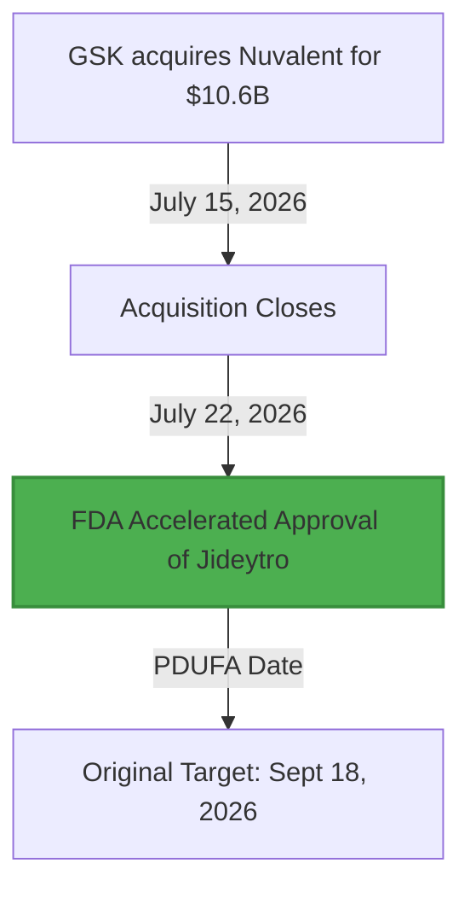

# **Inside the $10.6B Molecular Chessboard: How GSK’s Newly Approved Jideytro (Zidesamtinib) Rewrites the Code of Kinase Resistance**

####

On July 22, 2026, the FDA granted accelerated approval to GSK’s [Jideytro (zidesamtinib)](https://www.fda.gov), a next-generation ROS1-selective tyrosine kinase inhibitor (TKI), for patients with locally advanced or metastatic ROS1-positive non-small cell lung cancer (NSCLC) who have progressed on prior ROS1 TKIs. The regulatory nod dropped nearly two months ahead of its scheduled September 18, 2026, PDUFA date. It comes just a week after GSK closed its massive $10.6 billion all-cash acquisition of Nuvalent, Inc. ($124 per share, representing a 40% premium). 

For tech-minded oncology analysts and investors, the speed of this approval is a masterclass in structure-based drug design and strategic pipeline building.



##### The Molecular Architecture: Bypassing the G2032R Solvent Front
To understand why GSK paid $10.6 billion for Nuvalent's pipeline, one must look at the structural biology of the ROS1 kinase domain. First-generation TKIs like crizotinib (Pfizer’s Xalkori) and second-generation agents like entrectinib (Roche’s Rozlytrek) fail when tumors adapt. The chief mechanism of this resistance is the **G2032R solvent front mutation**. 

In the wild-type ROS1 protein, position 2032 is occupied by a flexible glycine residue. When mutated to arginine (G2032R), it introduces a bulky, positively charged side chain directly at the entrance of the ATP-binding pocket. This change creates massive steric hindrance, physically blocking older small molecules from docking.

```
Wild-type ROS1 ATP Pocket:   [Glycine 2032] <--- Compact. TKI binds easily.
Mutant G2032R ATP Pocket:    [Arginine 2032] <--- Bulky, charged. Clashes with traditional TKIs.
Jideytro (Zidesamtinib):     [Macrocycle Scaffold] <--- Engineered with minimized bulk. Avoids steric clash.
```

Nuvalent’s scientific founder, **Dr. Matthew Shair**, a professor of chemistry and chemical biology at Harvard University, pioneered a structure-based design approach to solve this. Instead of a linear small molecule, zidesamtinib (formerly NVL-520) was engineered as a rigid, low-molecular-weight **macrocycle**. 

A 2.2 Å resolution co-crystal structure of zidesamtinib bound to ROS1 G2032R shows that the macrocyclic ring is structurally optimized to curve around the mutated arginine side chain. In preclinical assays, zidesamtinib demonstrated an IC50 of **7.9 nM** against the G2032R mutant, compared to a staggering **5,700 nM** for crizotinib—a nearly 700-fold increase in potency.

##### The "TRK-Sparing" Breakthrough: Solving the Dizziness Bug
In kinase inhibitor engineering, selectivity is the ultimate performance metric. Bristol Myers Squibb’s competing next-gen TKI, repotrectinib (Augtyro), targets both ROS1 and the tropomyosin receptor kinase (TRK) family. While highly effective, off-target TRK inhibition in the central nervous system causes severe neurological side effects. In the pivotal TRIDENT-1 trial for repotrectinib, approximately **65% of patients** experienced treatment-limiting dizziness, ataxia, or cognitive impairment.

Zidesamtinib was engineered with a "TRK-sparing" profile. Because of its rigid macrocyclic conformation, it fits snugly into the ROS1 pocket but clashes sterically with the TRK ATP-binding pocket. Preclinical models showed that zidesamtinib is roughly **100-fold more selective** for ROS1 over TRK.

On X.com, thoracic oncologist **Dr. Miguel Gonzalez Velez** highlighted this differentiator:
> *"Zidesamtinib approved... ORR of ~44% between taletrectinib (55%), repotrectinib (38%) and lorlatinib (35%) but seems to have better toxicity profile... of less neurotoxicity."*

##### The ARROS-1 Data: Intracranial Efficacy and the Treatment Frontier
Up to 40% of patients with ROS1-positive NSCLC present with brain metastases at diagnosis, making blood-brain barrier (BBB) penetrance a non-negotiable feature. Zidesamtinib’s compact macrocyclic structure allows it to cross the BBB and evade efflux pumps like P-glycoprotein.

The clinical basis of the FDA approval rests on the global Phase 1/2 **ARROS-1** trial (NCT05118789):
*   **Highly Pre-treated Patients:** In 117 patients who progressed on prior ROS1 TKIs, zidesamtinib achieved an Objective Response Rate (ORR) of **44%**.
*   **G2032R Mutant Subpopulation:** In patients harboring the solvent front G2032R mutation, the ORR rose to **54%**, showcasing its direct mechanistical target hit.
*   **Intracranial ORR (IC-ORR):** Among patients with active CNS metastases who had previously received a TKI, the IC-ORR was **48%**. For those who had only received crizotinib previously, the IC-ORR was a stellar **85%**.
*   **Durable Efficacy:** 69% of responders maintained their response at 12 months.

The safety profile validated the TRK-sparing design. Only **10% of patients** required dose reductions, and a mere **2% discontinued** treatment due to adverse events. The most common toxicities were mild: peripheral neuropathy, edema, constipation, fatigue, and dyspnea, with minimal TRK-related dizziness.

##### The Venture Playbook: Why GSK Paid a Premium
From a capital perspective, GSK’s $10.6B acquisition represents a premium bid to secure post-2028 growth. GSK faces upcoming patent cliffs on its core HIV franchise (specifically dolutegravir) between 2028 and 2030. 

GSK Chief Commercial Officer **Luke Miels** defended the transaction, calling it a *"multi-product deal"* that provides *"immediate new sales growth opportunities"* and a *"platform in lung cancer for rapid expansion."* Analysts at **Jefferies** agreed, labeling the Nuvalent portfolio as "highly profitable" with long treatment durations and multi-blockbuster potential. Meanwhile, **Bernstein SocGen Group** reiterated an "Outperform" rating on the acquisition, calling it a rare example of "value-creating" oncology M&A.

##### The Sequencing Debate: Where Does Jideytro Fit?
With Jideytro approved, oncologists are debating how to sequence these next-gen TKIs. If Jideytro is highly potent and has a superior safety profile, should it be used in the first-line setting instead of waiting for resistance to develop?

**Dr. Stephen V. Liu** (Georgetown Lombardi Comprehensive Cancer Center) shared on X.com:
> *"Zidesamtinib receives [approval] for pts with ROS1+ NSCLC after a prior ROS1 inhibitor. Approval based on the ARROS1 trial that showed RR 44% after prior TKI with 1y DOR rate 69%. Very excited - but the TKI naive data were compelling to me (RR 89%, IC RR 83%)."*

Dr. Alexander Drilon (MSKCC), the lead investigator of ARROS-1, summarized the paradigm shift: 
> *"Zidesamtinib is a highly ROS1-selective TKI designed to surpass the limitations of prior ROS1 TKIs... it avoids TRK inhibition."*

Whether Jideytro becomes the undisputed first-line choice or remains a salvage therapy for G2032R mutant resistance, its rapid approval marks a triumph for structure-guided chemical engineering in oncology.

***

### 4. Highlight

#### 4.1 Key Questions
1. How does zidesamtinib's macrocyclic structure bypass the G2032R solvent front mutation that disables first- and second-generation ROS1 inhibitors?
2. What are the clinical advantages of a "TRK-sparing" design compared to multi-kinase inhibitors like repotrectinib (Augtyro)?
3. How does GSK's $10.6B acquisition of Nuvalent redefine the oncology treatment paradigm and address upcoming Big Pharma patent cliffs?

#### 4.2 Highlight Text
Just one week after closing its $10.6B acquisition of Nuvalent, GSK has secured early FDA accelerated approval for Jideytro (zidesamtinib), a next-generation, brain-penetrant ROS1-selective TKI for ROS1-positive NSCLC. Engineered by Harvard’s Dr. Matthew Shair as a rigid macrocycle, zidesamtinib curves around the notorious G2032R solvent front mutation that halts older therapies like crizotinib. Critically, its "TRK-sparing" architecture avoids the off-target TRK inhibition responsible for the ~65% dizziness rates seen in competitors like BMS's repotrectinib, offering oncologists an ultra-selective, CNS-penetrant weapon with a highly tolerable safety profile.

#### 4.3 Hashtags
#OncTech #PrecisionMedicine #Biotech #LungCancer #Jideytro #ROS1 #CancerResearch #DrugDesign
