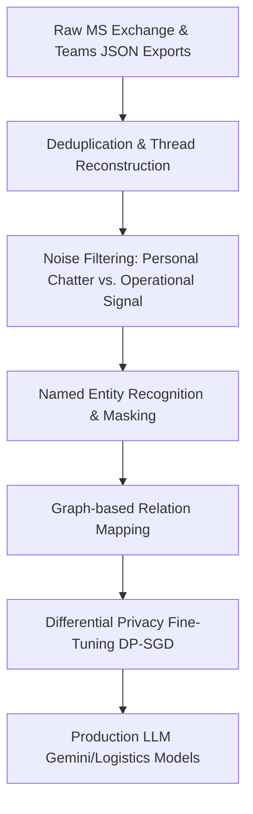

# **LLMs in the Cargo Hold: The Technical, Legal, and Ethical Battle Over Google’s $10M Spirit Airlines Data Grab**

##

On May 2, 2026, Spirit Airlines ceased all passenger operations, marking the final descent of a 34-year low-cost carrier. But while physical assets like aircraft leases and LaGuardia slots (acquired by JetBlue for $58.5 million) were liquidated in public view, the airline's most valuable asset was sold in the shadows. Google won a bankruptcy court auction with a $10 million bid for Spirit's "enterprise dataset"—a staggering digital archive representing decades of corporate coordination.

Yet, this transaction has triggered an unprecedented legal and labor dispute. The Association of Flight Attendants-CWA (AFA-CWA), representing 5,500 former Spirit employees, filed a formal objection in the U.S. Bankruptcy Court for the Southern District of New York. The union’s petition, led by AFA International President Sara Nelson, has forced Chief Judge Sean H. Lane to postpone the final approval hearing to September 9, 2026. Meanwhile, a late-stage bidding war has erupted as San Francisco-based AI data startup Micro1, led by 25-year-old CEO Ali Ansari, submitted a late $12.5 million offer, attempting to wrestle the dataset away from Mountain View.

This investigation explores the technical hurdles Google faces in parsing this conversational chaos, the legal loopholes of bankruptcy-driven data liquidation, and the privacy risks of training AI on the digital footprint of a defunct workforce.

---

### The Dataset: Spirit’s Digital Exhaust

The "enterprise dataset" Google is seeking to purchase is a massive repository of unstructured corporate communications and operational records. It includes:
* **100 million internal emails** spanning decades of operations.
* **500 million Microsoft Teams messages** capturing real-time coordination, daily chatter, and operational adjustments.
* **175,000 employee records** dating back to 1986, including tax documents, payroll logs, performance evaluations, and disciplinary history.
* **30 million lines of operational code** governing scheduling, pricing, route optimization, and maintenance databases.
* **17 million OneDrive files and 20 million SharePoint items** containing spreadsheets, policy documents, and manuals.

This corpus represents an operational goldmine for AI companies. While Google intends to use the data to train its Large Language Models (LLMs) to understand enterprise logistics and corporate workflows, other AI startups are equally hungry. Ali Ansari, CEO of Micro1, which submitted the late $12.5 million bid, remarked: 
> *"Google's $10 million bid is actually quite low. Massive, messy, real-world corporate operational data is the holy grail for AI training right now. It teaches LLMs how businesses actually operate, solve crises, and route logistics under pressure."*

---

### The Legal Loophole: Consumer vs. Employee Privacy in Bankruptcy

The AFA-CWA's formal objection exposes a stark regulatory asymmetry in U.S. bankruptcy law: the differential treatment of consumer data and employee data.

Under Section 363(b)(1) of the Bankruptcy Code, a debtor can sell assets "free and clear" of existing claims. To protect individual privacy, Congress enacted the Bankruptcy Abuse Prevention and Consumer Protection Act (BAPCPA) in 2005. This created Section 332, which mandates the appointment of a **Consumer Privacy Ombudsman (CPO)** if a debtor's privacy policy prohibits the transfer of personally identifiable information (PII) to third parties.

However, as bankruptcy experts point out, this statutory shield is strictly limited to **consumers**. 11 U.S.C. § 101(41A) defines PII exclusively in the context of an individual who is a *consumer* obtaining products or services from the debtor. 

Employees have no such protection. Their digital communications, performance reviews, and operational logs are classified as "intellectual property" or "operational books and records." As a result, no "Employee Privacy Ombudsman" is appointed, leaving the workforce's digital footprint open to liquidation to satisfy creditors. Sara Nelson, International President of the AFA-CWA, summarized the union's outrage:
> *"It is outrageous that the personal, daily communications of flight attendants and other workers are being sold as commodities. This data belongs to the people who generated it, not to a bankruptcy estate to be auctioned off to the highest bidder."*

---

### The Technical Challenge: Cleaning the Conversational Chaos

From an engineering perspective, Google's acquisition of 500 million Teams messages and 100 million emails is not a turn-key solution; it is a massive data cleaning problem. To extract valuable operational features for LLM training, Google’s engineers must build a pipeline capable of parsing conversational noise while preserving semantic utility.

#### 1. Thread Reconstruction and Deduplication
Corporate communications are highly fragmented. Microsoft Teams messages are exported as raw JSON containing unstructured message arrays, parent-child thread relationships, and reactions. Emails are exported as PST or EML files containing multiple nested forwards and replies. 

Google must implement text-matching algorithms (such as MinHash LSH or SimHash) to deduplicate redundant email bodies and construct a cohesive chronological graph of interactions. This involves:
* Reconstructing Teams threads by linking message IDs (`id`) to parent IDs (`parentMessageId`).
* Chronologically sorting message sequences using temporal anchors to preserve conversational flow.
* Resolving cross-channel communication where an issue begins on Teams and migrates to email.

#### 2. Separating Signal (Operational Knowledge) from Noise (Personal Chatter)
The vast majority of Teams messages are high-noise, low-utility communications ("be right back," "coffee?", "happy birthday"). Google plans to train text-classification transformers (e.g., fine-tuned BERT or RoBERTa architectures) to classify messages. 

Threads containing critical operational decisions (e.g., flight dispatchers re-routing planes during a convective weather system, crew schedulers managing duty-time limits) are tagged as "operational signal." Personal banter and out-of-office autoreplies are discarded to avoid corrupting the LLM's behavioral tuning.

#### 3. Named Entity Recognition (NER) and Contextual Masking
To comply with court-mandated de-identification, Google must strip direct PII (names, email addresses, phone numbers, employee IDs). This is done using advanced Named Entity Recognition (NER) pipelines. However, traditional regex and basic token masking are insufficient for "contextual PII," which is the next major challenge.

---

### The Myth of Anonymization: Referential Integrity and Re-identification Risks

The core of the AFA-CWA's objection is that the court-mandated "de-identification" process is a mathematical illusion. 

In any complex relational dataset, Google needs to maintain "referential integrity." For the data to be useful for training AI agents, "User A" in a Teams chat must map to the same entity as "User A" in an email thread. If Google replaces all names with randomized hashes, they preserve the relational links.

This preservation of relational links exposes the dataset to **re-identification via pattern reconstruction**. Security researchers call this "structural linkage."

For example, consider a specific flight incident:
1. **Public Record:** FAA records show that Spirit Flight 412 experienced a bird strike landing at Fort Lauderdale (FLL) on October 14, 2025, at 14:32.
2. **The Dataset:** Google’s dataset contains an anonymized Teams thread between `Dispatcher_88` and `Pilot_34` discussing a bird strike on an A320 arriving at FLL on that exact date and time.
3. **The Linkage:** By cross-referencing the public FAA flight log with the anonymized thread, an observer can immediately deduce that `Pilot_34` is Captain Jane Doe and `Dispatcher_88` is John Smith.
4. **The Cascade:** Once `Pilot_34` is unmasked, every other email, OneDrive document, and Teams message associated with `Pilot_34` across the entire 600-million-message corpus is deanonymized.

To mitigate this risk, Google is reportedly exploring **Differential Privacy (DP-SGD)** during the model training phase. DP-SGD adds mathematical noise to the gradients during backpropagation, ensuring that the model learns general operational patterns (e.g., how to re-route aircraft) without memorizing specific training examples (e.g., the exact chat log of a pilot arguing with management). However, implementing DP-SGD often results in a trade-off, reducing the model's accuracy on niche logistics tasks.

---

### Operational Goldmine: Training LLMs on Corporate Workflows

Why is Google willing to fight a legal battle over Spirit’s chat logs? The answer lies in the limitations of public internet data.

Most public text (Wikipedia, Reddit, news articles) is expository. It does not teach an AI agent how to coordinate complex, real-world tasks under constraints. The Spirit Airlines dataset represents 34 years of actual, messy human coordination:
* **Crisis Management:** How flight operations managers handle weather disruptions, fuel shortages, and mechanical failures in real-time.
* **Crew Scheduling:** The complex negotiations and operational maneuvers required to comply with FAA duty-time regulations.
* **Maintenance Logs:** Millions of technical conversations detailing how mechanics troubleshoot specific engine and avionics issues on Airbus A320-family aircraft.

By training Gemini models on this data, Google can build highly specialized autonomous agents capable of managing corporate logistics, customer support, and supply chain routing. As one machine learning engineer noted on Reddit:
> *"We've exhausted public text. The next frontier is enterprise interaction. Google isn't buying Spirit's data to read their gossip; they're buying the blueprint of how a multi-billion dollar logistics machine coordinates itself."*

---

### Precedent and the Surveillance Capitalism Debates

The Spirit Airlines case sets a terrifying precedent for the tech sector. On Reddit’s r/technology and r/degoogle, users have voiced deep anxiety over what this means for the digital footprint of every knowledge worker:
> *"Your work laptop is a permanent corporate surveillance device. Even after your employer dies, they will sell your Slack logs and emails to Google to train their AI. We have zero expectation of privacy."*

Historically, data-rich legacy companies in distress liquidated physical assets first. Today, decades of internal communications are the premier commodity. If Chief Judge Lane approves the sale on September 9, 2026, it will establish a legal template for future bankruptcy proceedings. Faltering companies like Walgreens, Macy’s, or struggling software firms could realize that their most valuable remaining asset is the "digital exhaust" of their employees.

In the AI era, workers are not just producing labor; they are generating the training data that will eventually automate their jobs. And in bankruptcy, that data will go to the highest bidder.

---

# 4. Highlight

## 4.1 Key Questions
1. How does Google plan to transform raw conversational data (such as emails and Teams chat logs) into structured operational training data for LLMs?
2. What are the legal protections—or lack thereof—governing employee privacy when corporate digital assets are sold during a bankruptcy auction?
3. How can individuals be re-identified through relational linkage and pattern matching in anonymized corporate communication datasets?

## 4.2 Highlight Text
Google’s $10M bid for the defunct Spirit Airlines data repository has triggered a massive labor and privacy showdown. The Association of Flight Attendants-CWA (AFA-CWA) has blocked the sale in bankruptcy court, objecting to the auction of 500M Teams messages and 100M internal emails for LLM training. While Google and Micro1 fight a bidding war for this operational goldmine, the case exposes a terrifying gap in U.S. bankruptcy law: consumer data is protected, but employee data is treated as corporate property. If approved, it sets a chilling precedent for the commodification of workplace communications. 

## 4.3 Hashtags
#AI #Privacy #TechNews
