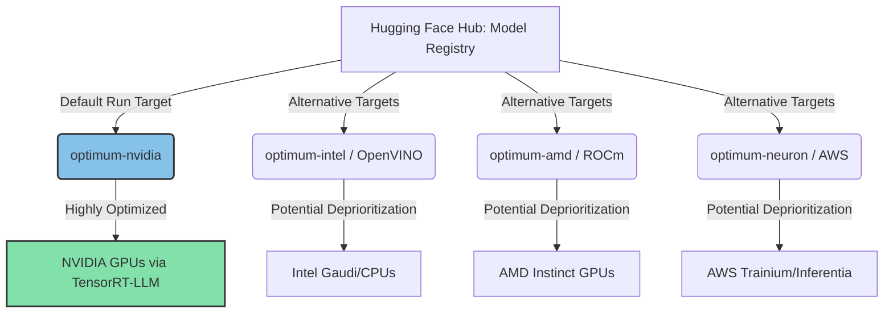

# **NVIDIA’s $12.9B Hugging Face Acquisition: Gaining Control of the Open-Source AI Software Pipeline**

##

Late on August 26, 2026, a report from *The Information* sent shockwaves through the tech industry: NVIDIA has reportedly agreed to acquire Hugging Face, the central repository and "GitHub of AI," in a massive deal valued at $12.9 billion. 

At a valuation representing an eye-watering ~86x multiple on Hugging Face’s estimated $150 million annualized recurring revenue (ARR), this acquisition is one of the most aggressive strategic plays in modern technology. It marks a dramatic shift from late 2025, when Hugging Face reportedly rejected a $500 million investment from NVIDIA that would have valued the startup at $7 billion. At the time, Hugging Face's co-founder and CEO, Clément Delangue, insisted on preserving the company's neutrality, famously stating that *"concentration of power is the biggest risk in AI."* 

Now, with a hardware monopolist poised to absorb the primary library of open weights, the AI developer community is facing an existential crisis. Is this the end of hardware-neutral open source, or is it NVIDIA’s ultimate defense against custom silicon?

---

### The Strategic Rationale: Vertical Chokepoints and the Custom Silicon Threat

To understand why NVIDIA is willing to pay nearly $13 billion for a startup generating relatively modest revenue, one must look at the shifting dynamics of the AI hardware market. 

Historically, NVIDIA’s dominance has been protected by a double moat: its industry-standard GPU hardware (H100, B200, Rubin) and its proprietary software ecosystem, CUDA. However, that moat is facing pressure from two fronts:

1. **Hyperscaler and Competitor Custom Silicon**: Every major cloud provider—Google (TPU v5p/v6), Amazon (Trainium 2/Inferentia 2), Microsoft (Maia 100), and Meta (MTIA)—is building custom ASICs designed specifically to bypass the "NVIDIA tax." Furthermore, hardware competitors like AMD (Instinct MI325X) and Intel (Gaudi 3) are aggressively shipping chips with competitive raw compute and memory bandwidth metrics.
2. **Closed-Source Consolidation vs. Open-Weight Proliferation**: Closed-source giants like OpenAI and Anthropic are increasingly looking to verticalize. OpenAI has been in deep negotiations with TSMC and Broadcom to build its own custom AI silicon. 

NVIDIA’s acquisition of Hugging Face is a defensive hedge against this hardware fragmentation. As Martin Casado, General Partner at Andreessen Horowitz (a16z), has pointed out, we have entered the "Machine Age" where physical infrastructure—chips, power, and data centers—is the primary bottleneck, and startups are overwhelmingly relying on open-weight models (like Llama 3, Mistral, and Qwen) to bypass proprietary API costs. 

By owning Hugging Face, NVIDIA controls the primary distribution channel for these open weights. If every developer downloads their models, tokenizers, and datasets from a platform owned by NVIDIA, NVIDIA can ensure that the path of least resistance for running these models points directly back to CUDA.



---

### Deep-Dive on the Software Stack: The Integration of CUDA, TensorRT-LLM, and the Optimum Paradox

Hugging Face’s value to developers lies in its hardware-agnostic design. Through its `optimum` library, Hugging Face has traditionally maintained a neutral stance, cooperating with all chipmakers to ensure that transformer architectures run efficiently across different hardware backends. 

This is accomplished via specialized sub-libraries:
* **`optimum-nvidia`**: Integrates with NVIDIA’s **TensorRT-LLM** and CUDA stack, compiling models into optimized engines that leverage FP8 precision on Hopper and Ada Lovelace architectures, delivering up to 28x throughput improvements.
* **`optimum-intel`**: Targets Intel architectures, compiling models to the **OpenVINO** Intermediate Representation (IR) and using the Neural Network Compression Framework (NNCF).
* **`optimum-amd`**: Integrates with AMD's **ROCm** stack for Instinct GPUs and the **Ryzen AI** (XDNA architecture) for client-side NPUs.
* **`optimum-neuron`**: Integrates with AWS's Neuron SDK for Trainium and Inferentia accelerators.

If NVIDIA owns Hugging Face, this delicate neutrality is threatened. A major technical worry is **optimization drift**. While NVIDIA is unlikely to outright block libraries like `optimum-intel` or `optimum-amd`—as doing so would invite immediate regulatory lawsuits—they can easily under-fund, deprioritize, or break compatibility with them during major releases of the core `transformers` library. 

For instance, when a new model like Llama 4 is released, the optimized `optimum-nvidia` config, fully integrated with TensorRT-LLM and FP8 quantization, could be available on Day 1. Meanwhile, the ROCm or OpenVINO paths could languish for weeks with unresolved dependency bugs. The default runtime configuration on Hugging Face Spaces could be engineered to run seamlessly on NVIDIA GPUs while running in unoptimized fallback modes on non-NVIDIA hardware.

Furthermore, the acquisition raises licensing questions. Hugging Face originally developed **Text Generation Inference (TGI)** as its premier production serving container. However, Hugging Face shifted TGI to the Hugging Face Community License, restricting competitors from offering it as a hosted service. Permissive serving runtimes like **vLLM** (licensed under Apache 2.0) have largely overtaken TGI in the open-source community as a result. With NVIDIA at the helm, the community fears that other critical middleware tools could see their licenses closed or altered to favor NVIDIA's proprietary software suite.

---

### The Community Schism: Fears of Corporate Capture

The reaction across developer hubs like Reddit’s `r/LocalLLaMA` and Hacker News has been a mixture of panic and resignation. For years, the open-weight ecosystem thrived because Hugging Face acted as the "neutral ground" where developers, startups, and academic researchers could collaborate without corporate lock-in.

Yann LeCun, Chief AI Scientist at Meta, has repeatedly argued that open-source AI is the only way to prevent a closed-source oligopoly from controlling human knowledge. Under NVIDIA's ownership, the open-source community fears that the very definition of "open" will be rewritten to mean "open, as long as you run it on CUDA."

On Hacker News, one prominent developer summarized the sentiment:
> *"Hugging Face was our Switzerland. If NVIDIA owns it, the incentives change instantly. Every default configuration, every pipeline tutorial, and every Spaces demo will be optimized to show why you need an H100 or a B200. AMD ROCm and Intel OpenVINO will become second-class citizens."*

Clément Delangue’s past warnings about the concentration of power are being cited as a tragic irony. Martin Casado’s recent launch of the $1.1 billion a16z **Machine Age Fund** highlights that the VC community is preparing for a world where access to physical compute is highly controlled. An NVIDIA-owned model hub makes that compute bottleneck even more formidable.

---

### The Antitrust Storm: Global Regulators Draw the Line

Given NVIDIA's existing 90%+ share of the AI datacenter GPU market, this acquisition faces an incredibly steep uphill battle with global antitrust authorities. 

The U.S. Federal Trade Commission (FTC) under Lina Khan, the Department of Justice (DOJ), the European Commission, and the UK’s Competition and Markets Authority (CMA) are already actively investigating NVIDIA’s business practices. The DOJ recently issued subpoenas to NVIDIA regarding allegations of anti-competitive bundling, retaliatory pricing against customers who look at AMD or Intel chips, and the acquisition of cluster-management startup Run:AI.

Regulators will likely view the Hugging Face acquisition through the lens of **vertical foreclosure**. By acquiring the dominant downstream distribution hub for AI models, NVIDIA could prevent upstream hardware competitors (AMD, Intel, Google) from accessing the developer community on equal terms. This case closely mirrors NVIDIA’s aborted $40 billion acquisition of Arm in 2022, which was blocked after regulators concluded it would harm competition in the mobile chip market.

```
NVIDIA Antitrust Pressure Points (2026):
├── DOJ Subpoena: GPU bundling & retaliatory pricing allegations
├── Run:AI Acquisition: Under deep regulatory investigation
└── Hugging Face Deal ($12.9B): High risk of vertical foreclosure blocking
```

---

### Competitor Counter-Tactics: Building the Post-Neutrality World

If the acquisition goes through, or even if it remains tied up in regulatory limbo, the rest of the AI industry will not sit idly by. Competitors like AMD, Intel, Google, Meta, and the hyperscalers are already contemplating defensive maneuvers:

1. **Fostering Alternative Repositories**: Alibaba’s **ModelScope** has already gained significant traction in Asia. Competitors could band together to fund and expand ModelScope or a similar neutral repository into a global alternative.
2. **Decentralized Registries**: Developers on Reddit are already proposing decentralized hubs using IPFS or BitTorrent-based distribution for open-weights, bypassing centralized registries entirely.
3. **The Rise of Ollama and Local Hubs**: Tools like **Ollama**, which manage model distribution locally and support multiple hardware backends (including Apple Silicon and ROCm), could expand their own model registries to act as neutral alternatives to Hugging Face.
4. **PyTorch or Linux Foundation Intervention**: A consortium of tech giants could push to move the core `transformers` library and model registry under the governance of a neutral foundation like the PyTorch Foundation or the Linux Foundation to guarantee long-term open-source neutrality.

NVIDIA's $12.9 billion bet is a clear signal that the future of AI is not just about who has the fastest silicon, but who controls the software pipe that feeds it. 

---

# Highlight

## 4.1 Key Questions
1. How will NVIDIA's acquisition of Hugging Face affect the optimization of open-weight models on competing hardware backends like AMD ROCm, Intel OpenVINO, and Google TPUs?
2. Will global antitrust regulators block the $12.9 billion deal under the doctrine of vertical foreclosure, similar to the aborted Arm merger?
3. How will the developer community respond to the loss of a hardware-neutral model registry?

## 4.2 Highlight Text
NVIDIA has reportedly agreed to acquire Hugging Face for $12.9 billion, a massive defensive play to secure control of the open-source AI pipeline. At 86x ARR, the deal aims to counter custom silicon efforts from OpenAI, Google, and AMD by channeling the open-weights ecosystem directly into CUDA via TensorRT-LLM and the Optimum library. However, the loss of Hugging Face's hardware-neutrality has sparked community outrage and will trigger immediate antitrust scrutiny from the FTC, DOJ, and EU. If blocked, expect competitor-backed neutral model registries or decentralized fanning.

## 4.3 Hashtags
#AI Hardware #OpenSource #NVIDIA #HuggingFace #Antitrust #CUDA #MachineLearning #SiliconWars
