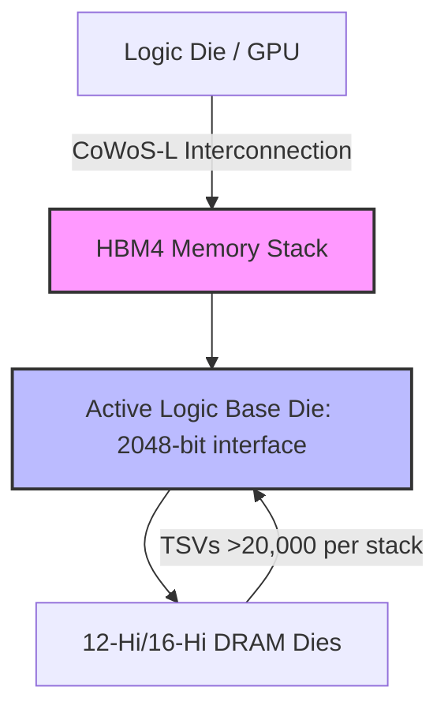

# **Nvidia’s Vertical Pincer: Inside the 15% Blackwell-Rubin Surcharge, the $7B Poolside Software Gambit, and the Physical Grid-Lock of AI Factories**

###

#### The Memory Squeeze: Why HBM is Driving a 15% System Price Surcharge
At the silicon level, the physics of advanced packaging are colliding head-on with capital expenditure projections. Nvidia has recently notified its hyperscale and neocloud customers of a planned price hike of over 15% on its Grace Blackwell NVL72 and next-generation Vera Rubin platforms slated for early 2027. 

Historically, logic dominated the Bill of Materials (BOM) for AI accelerators, with GPUs accounting for upwards of 80% of system costs. However, tracking by semiconductor research firm SemiAnalysis reveals that High-Bandwidth Memory (HBM) and high-density server DRAM now represent between 30% to 73% of the total manufacturing cost of modern AI servers. With HBM3e contract pricing hovering around $17/GB, memory has become a major driver of overall hardware costs.

The hardware transition from HBM3e to HBM4 is exacerbating these pressures. HBM4 introduces a major architectural shift: a doubled interface width of 2,048 bits and the introduction of an active, logic base die instead of a passive silicon interposer. This architecture demands TSMC’s advanced Chip-on-Wafer-on-Substrate-L (CoWoS-L) packaging and pushes Through-Silicon Via (TSV) density to over 20,000 TSVs per stack. 



This complexity has shifted bargaining power back to the memory oligopoly:
*   **SK Hynix:** Controls the market with its proprietary Mass Reflow-Molded Underfill (MR-MUF) process, positioning it to capture an estimated 70% share of Nvidia's next-generation Rubin-based platforms.
*   **Samsung:** Resolving earlier yield issues on HBM3e, Samsung is targeting an 80% yield on HBM4 using its "zHBM" vertical integration, which stacks memory directly on the logic die to bypass the interposer entirely.
*   **Micron:** Continues to scale HBM4 production, but with its 2026 capacity fully allocated, supply remains highly constrained.

As Gavin Baker, Managing Partner at Atreides Management, noted on X: *"Memory has historically been a highly cyclical commodity, but in the AI era, HBM acts as a specialized system component. The pricing power SK Hynix and Micron possess is a structural headwind for GPU gross margins."* To offset these rising memory costs, Nvidia is passing a 15% surcharge to customers, adding roughly $5 million in capex for every gigawatt of deployed data center capacity.

---

#### The Infrastructure Bottleneck: Cloverleaf and the Physical Limits of Compute
Even if hyperscalers can absorb a 15% hardware premium, they face a more fundamental constraint: the physics of power delivery and thermal management. In response, Nvidia has made a strategic equity investment in Cloverleaf Infrastructure, founded by CEO David Berry, Chief Commercial Officer Brian Janous (former head of Microsoft's energy team), and CTO Jonathan Abebe.

Cloverleaf acts as an intermediary, utilizing Nvidia’s DSX digital twin platform to model grid capacity, cooling, and water tradeoffs before breaking ground. This is aimed at addressing two primary bottlenecks:

##### 1. Grid Interconnection and Equipment Queues
Data centers in major regional transmission networks (like PJM, ERCOT, MISO, and CAISO) face a cumulative backlog of over 2,300 GW in interconnection queues. Developers face wait times of five to seven years for grid studies. Furthermore, lead times for high-voltage power transformers and switchgear have stretched from a historical 24 months to three to five years (120–160+ weeks), driven by shortages of Grain-Oriented Electrical Steel (GOES).

##### 2. The Liquid Cooling Thermal Envelope
Placing high-density racks like the Blackwell NVL72 (drawing up to 120kW per rack) into production requires a total redesign of cooling infrastructure. At this scale, air cooling is obsolete. Systems must implement liquid-to-liquid Coolant Distribution Units (CDUs) and secondary technology cooling loops (TCS). 

```
[Facility Water System (FWS)] <--- Heat Exchanger ---> [Technology Cooling System (TCS)]
                                                              |
                                                    [Coolant Distribution Unit (CDU)]
                                                              |
                                                      [Universal Manifold]
                                                              |
                                                  +-----------+-----------+
                                                  |                       |
                                         [Quick Disconnects]     [Quick Disconnects]
                                                  |                       |
                                          [GPU Cold Plate]        [GPU Cold Plate]
```

Key engineering metrics for these loops include:
*   **Coolant Chemistry:** The standard is PG25 (75% water, 25% propylene glycol) to balance heat transfer and prevent biological growth. Operating limits require a pH between 8.0–10.5 and conductivity strictly below 100 µS/cm to protect micro-channels from corrosion.
*   **Quick Disconnects (QDs):** Rack manifolds use Open Compute Project (OCP) Universal Quick Disconnect (UQD) standards to allow hot-swapping. Next-generation Large Quick Connectors (LQCs) are deployed on facility-side trunks to prevent excessive pressure drops.
*   **Thermal Standards:** While ASHRAE TC 9.9 provides guidelines for liquid cooling classes (W2 to W5), the thermal densities of the Blackwell and Rubin architectures require custom OEM specifications that override these standards to ensure adequate flow rates across cold plates.

---

#### The Software Counteroffensive: The $7B Poolside AI Gambit
Nvidia’s most strategic move is not on the physical grid, but in the software stack. In late August 2026, Nvidia executed a non-acquisitional talent and technology acquisition, investing $1 billion into coding-agent startup Poolside AI at a $12 billion pre-money valuation, alongside a $6 billion licensing agreement for Poolside’s proprietary "Model Factory." As part of the deal, over 100 Poolside engineers are transitioning to Nvidia to develop its Nemotron family of open-weight models.

This transaction follows the regulatory playbook established by Microsoft with Inflection and Amazon with Adept, allowing Nvidia to acquire talent and software without triggering a formal antitrust review by the FTC or DOJ. 

Poolside’s Model Factory provides Nvidia with a highly optimized platform for high-velocity research and reinforcement learning (RL) from code execution. The Model Factory handles:
*   **Synthetic Data Generation:** Orchestrating millions of code-execution feedback loops to train models on correct coding syntax and tool usage.
*   **Streaming Data Pipelines:** Feeding code directly into active training runs to bypass standard batching delays.
*   **The Laguna Model Family:** Developing models like Laguna S 2.1 (118B) and Laguna M.1 (225B MoE) which are optimized for on-premises, air-gapped agentic workflows.

By integrating Poolside's technology, Nvidia is executing a classic "commoditize your complements" strategy. AI models are the direct complement to Nvidia's GPUs. By using Poolside's infrastructure to release high-performance, trillion-parameter open-weight Nemotron models, Nvidia is driving the cost of the model layer toward zero. 

This directly undercuts the subscription and API-based business models of proprietary frontier labs like OpenAI and Anthropic. If enterprise developers can deploy highly capable, open-weight models locally on their own infrastructure, they will bypass proprietary APIs and invest directly in private GPU clusters—locking themselves into Nvidia’s hardware and CUDA/NIM software ecosystem.

As Altimeter Capital founder Brad Gerstner observed: *"Nvidia’s open-weight strategy is a brilliant hedge. By subsidizing open-source models, they commoditize the software layer, ensuring that the primary source of margin in the AI economy remains the physical token factory: Nvidia's silicon."*

---

## 4. Highlight

### 4.1 Key Questions
1. How does the architectural shift to HBM4 impact the gross margins of AI chip makers versus memory manufacturers?
2. What are the operational parameters required to sustain 120kW liquid-cooled Blackwell racks under full computational load?
3. Is Nvidia's $7B licensing and investment in Poolside AI a defensive talent grab or an offensive move to commoditize frontier model APIs?

### 4.2 Highlight Text
Nvidia is executing a massive hardware-software pincer to consolidate its AI dominance. Facing a 15% price hike on Blackwell and Rubin servers driven by high-bandwidth memory (HBM4) supply-demand imbalances, Nvidia is bypassing the memory squeeze by passing costs down the value chain. Concurrently, it is investing in Cloverleaf Infrastructure to solve power grid and cooling bottlenecks, while bypassing antitrust scrutiny through a $7B licensing and talent deal with Poolside AI. By utilizing Poolside to release trillion-parameter open-weight Nemotron models, Nvidia is commoditizing the software layer—undercutting OpenAI and Anthropic to ensure all roadmaps lead back to proprietary silicon.

### 4.3 Hashtags
#AIInfrastructure #NvidiaBlackwell #HBM4 #LiquidCooling #PoolsideAI #Semiconductors
