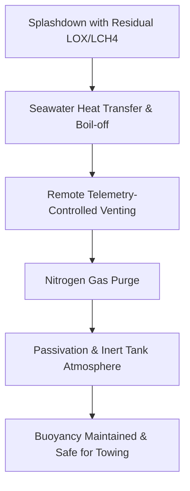

# **Operation Starboat: Inside the 13,000-Mile Ocean Salvage of SpaceX’s Ship 40 and the Reentry Physics of Starship V3**

####

On July 24, 2026, at 22:51 UTC, SpaceX’s Flight 13 lifted off from Pad 2 at Starbase, Texas, carrying Booster 20 and Ship 40. For the aerospace community, this was more than a routine test launch; it was the second flight of the overhauled Starship Version 3 (V3) stack and the first mission to deploy operational Starlink V3 satellites. But the real headline was written in the remote waters of the Indian Ocean. Following a successful orbital insertion, a series of in-space tests, and a fiery reentry, Ship 40 executed a pinpoint, soft vertical landing in the ocean, remaining entirely intact. Dubbed the "Starboat" by observers, the floating 171-foot-tall stainless-steel rocket set off an unprecedented, month-long salvage and stabilization campaign that culminated on August 27, 2026, when it was loaded onto a semi-submersible heavy-lift ship.

This deep dive examines the engineering milestones, maritime logistics, and post-flight forensics of the Ship 40 recovery, alongside the debates surrounding SpaceX’s rapid prototyping philosophy.

---

### The Mission Profile: Suborbital Satellites and Landing Anomalies
Flight 13 showcased the raw power of the Starship V3 configuration, propelled by the highly simplified, high-performance Raptor 3 engines. Boasting a sea-level thrust of 250 tons-force (tf) and a vacuum thrust of 275 tf, the Raptor 3 eliminates external plumbing, heat shields, and fire suppression systems, drastically reducing dry mass. 

The launch successfully demonstrated a clean, debris-free deployment strategy for the next-generation Starlink V3 satellites. Rather than inserting the payload into a permanent low Earth orbit (LEO), Ship 40 placed the 20 satellites into a suborbital trajectory at an altitude of approximately 200 kilometers (124 miles). During their brief 20-minute flight, the satellites deployed their solar arrays, established radio and laser communications, and beamed back critical external footage of Ship 40. Both the satellites and the ship's upper stage then re-entered the atmosphere, ensuring zero space debris remained from the launch.

While the upper stage's flight was nominal, the Super Heavy Booster 20 met a rougher end. Following a successful boostback burn, the booster’s landing burn in the Gulf of Mexico faltered. Only 10 of its 13 central Raptor engines successfully relit, resulting in a hard splashdown and the structural destruction of the booster. 

---

### Operation Starboat: Towing and Stabilization in Rough Seas
Ship 40’s survival of the ocean splashdown was a pleasant surprise for SpaceX, prompting an immediate salvage operation. However, the Indian Ocean is notoriously unforgiving. For 24 days, recovery teams battled 14-foot swells and high winds to tow the 52-meter-tall steel hull toward Christmas Island.

SpaceX deployed a specialized maritime flotilla, including the offshore support vessels *Normand Ranger*, *GO Australis*, and *Skimmer Tide*. The primary challenge was stabilizing a highly pressurized, sail-like structure. Standing 171 feet tall and weighing dozens of tons even when empty, the rocket acted as a massive wind vane. 

On August 7, 2026, as rough seas threatened to break the vehicle apart, Elon Musk posted a somber update on X: 
> "Unfortunately, ship recovery is not looking good right now. The weather is rough and swells are high. But we have already obtained close-up photos of critical regions of the heat shield and engines for future upgrades."

Despite the pessimism, the maritime crews persevered. By August 18, the flotilla guided Ship 40 into the sheltered waters of Flying Fish Cove at Christmas Island, an Australian territory. Here, in calm waters, engineers performed in-water inspections and retrieved physical samples of the thermal protection system (TPS) tiles.

---

### The Thermodynamic Nightmare: Passivating Cryogenic Residuals
Towing a freshly splashed-down rocket is a chemical hazard. Ship 40 landed with residual subcooled liquid methane (LCH4) and liquid oxygen (LOX) in its header tanks. At ambient ocean temperatures, these cryogens rapidly boil off, converting into highly volatile gaseous methane and oxygen. 

If the propellant tanks remained completely sealed, the internal pressure would exceed the structural limits of the 304L stainless-steel fuselage, leading to an explosive overpressurization. Conversely, if pressure dropped too low, the structural rigidity of the rocket—which behaves like a pressurized balloon—would fail, causing the hull to buckle under wave loads.

To manage this, SpaceX engineers used the ship’s telemetry links to command the remote vent valves from Starbase. Gaseous CH4 and LOX were vented in controlled sequences. Once the bulk of the cryogens had boiled off, the tanks were purged with gaseous nitrogen (N2) to displace any remaining flammable mixtures, achieving complete passivation. Throughout the operation, the recovery vessels used aerial drones equipped with gas sensors to monitor the Lower Explosive Limit (LEL) around the vehicle before divers could attach the tow lines.



---

### Loading onto the Boskalis *Forte* and the Cape Route
On August 23, 2026, the Boskalis *Forte*, a heavy-lift semi-submersible transporter ship, arrived at Christmas Island. On August 27, the recovery reached its climax. The *Forte* flooded its ballast tanks, submerging its cargo deck below the waterline. Tugboats maneuvered the floating Ship 40 over the deck and into a custom-built structural cradle. Once secured, the *Forte* pumped out its ballast water, deballasting and lifting the massive rocket completely out of the ocean.

```
       [ Ship 40 ]                      [ Ship 40 ]
     ~~~~~~~~~~~~~~~                  ==============   <- Raised Deck
     |  Submerged  |                  |            |
  ===|  Cargo Deck |===               | Cargo Deck |
  ~~~~~~~~~~~~~~~~~~~~~               ~~~~~~~~~~~~~~~~
   (Deballasting Phase)               (Transport Phase)
```

The *Forte* is now en route to Starbase, Texas, carrying Ship 40 on a 13,000-nautical-mile journey. SpaceX opted for the long route around the Cape of Good Hope, South Africa. This decision avoids the Panama Canal—which is bottlenecked by drought-related draft restrictions—and the Red Sea/Suez Canal route due to ongoing regional security concerns. The transit is expected to take several weeks, with an estimated arrival at Starbase around October 8, 2026.

---

### Reentry Forensics: The Engineering Goldmine
Recovering a space-flown upper stage is the holy grail of rocket development. At Starbase, engineers will dissect the fuselage to study reentry forensics:
1. **Steel Fuselage Integrity**: Analyzing how the 304L stainless steel reacted to aerothermal shear stress and the shock of ocean impact.
2. **TPS Tile Inspections**: Inspecting the ~18,000 hexagonal ceramic heat shield tiles. Engineers want to see where plasma leaked through the gaps and how the new load-sensing tiles on the aft flaps performed.
3. **Raptor 3 Saltwater Exposure**: Investigating how the regeneratively cooled Raptor 3 engines, which sat in saltwater for a month, tolerated corrosion.

As space flight commentator Scott Manley noted on X:
> "SpaceX has plenty of telemetry, but nothing beats physical metallurgy. Being able to run stress tests on a fuselage that survived reentry plasma is going to yield massive safety margins for Flight 14 and beyond."

---

### Ocean Recovery vs. Tower Catch: The Economics of Cadence
While the salvage of Ship 40 is a triumph, it highlights the economic limits of ocean-based recovery. 

| Metric | Ocean Splashdown (Ship-in-a-Bottle) | Tower Catch (Airline Model) |
| :--- | :--- | :--- |
| **Refurbishment Cost** | High (Galvanic corrosion, salt removal, engine swap) | Low (Direct inspection and refueling) |
| **Turnaround Time** | Months (13,000-mile transit + disassembly) | Hours to Days |
| **Logistical Assets** | Submersible ships, tugs, support vessels, divers | Launchpad tower arms (Mechazilla) |
| **Operational Cadence**| Stretched, distinct event | Rapid, repetitive loops |

Saltwater is highly corrosive to aerospace-grade alloys. Exposure to sodium chloride causes immediate galvanic corrosion at metallic interfaces. A rocket recovered from the ocean requires a complete strip-down, making rapid reuse impossible.

SpaceX's ultimate goal is the land-based tower catch using Mechazilla's arms. However, as Elon Musk has clarified, the company will not risk catching a ship at Starbase until they have demonstrated at least two consecutive, highly precise soft ocean landings. Flight 13 represents the first.

---

### The Iterative Debate: Go Fast and Break Things
The recovery of Ship 40 has reignited debates over SpaceX’s development style. Traditional aerospace firms often criticize the public failures of the program, pointing to Booster 20's hard splashdown as a sign of hasty engineering.

However, prominent VCs and tech founders defend the rapid prototyping model. On Reddit's r/SpaceXLounge, one popular analysis noted:
> "If SpaceX followed the traditional SLS-style paper review, they’d still be arguing about the weld thickness on the Starship V1 tanks. Instead, they just recovered a V3 orbital stage from the ocean. The data they’re getting from Ship 40 is worth ten years of computer simulations."

Flight 13 has proved that the V3 architecture can survive orbital reentry. Once SpaceX transitions to catching the upper stage with Mechazilla, the timeline for a fully reusable interplanetary transport system will shrink from decades to years.

---

### 4. Highlight

#### 4.1 Key Questions
1. How did SpaceX safely passivate and secure the explosive residual cryogens on a floating Ship 40?
2. What are the material science benefits of recovering an intact upper stage that survived orbital reentry?
3. Why did SpaceX opt for a 13,000-mile transit around Africa's Cape of Good Hope rather than the Panama Canal?

#### 4.2 Highlight Text
SpaceX has completed the historic salvage of Starship Ship 40 ("Starboat"). After a soft splashdown in the Indian Ocean during Flight 13 on July 24, 2026, the 171-foot-tall upper stage was towed through rough seas for 24 days to Christmas Island. Following remote passivation and a nitrogen purge of its tanks, the rocket was loaded onto the semi-submersible heavy-lift vessel *Forte* on August 27. Currently en route to Starbase, Texas via a 13,000-mile journey around the Cape of Good Hope, Ship 40 provides engineers with invaluable reentry and TPS forensic data, accelerating the timeline to full reusability.

#### 4.3 Hashtags
#Starship #SpaceX #SpaceTechnology #RocketRecovery #MaritimeLogistics
