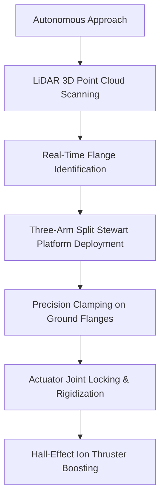

# **Orbital CPR: Inside Katalyst’s 250-Day Race to Save NASA’s Swift Observatory and the Dawn of the Space Upgrade Economy**

##

On June 27, 2026, Northrop Grumman’s Lockheed L-1011 *Stargazer* carrier aircraft will take off from the Ronald Reagan Ballistic Missile Defense Test Site on Kwajalein Atoll. Climbing to 40,000 feet over the Pacific, it will release a Pegasus XL rocket, which will ignite to send a refrigerator-sized payload into Low Earth Orbit (LEO). 

The payload is **LINK** (Lightweight In-space Navigation and Kinematics), a servicing spacecraft built by Flagstaff-based startup **Katalyst Space Technologies**. Its target: NASA’s **Neil Gehrels Swift Observatory**, an iconic 22-year-old gamma-ray burst detector launched in 2004. 

This is not a routine mission. It is a $30 million, 250-day emergency rescue attempt that represents the cutting edge of On-Orbit Servicing, Assembly, and Manufacturing (ISAM). If it succeeds, it will rewrite the economics of space operations, turning satellites from disposable CAPEX sinks into dynamic, upgradable assets. If it fails, it could create a high-speed orbital debris cloud in one of the most heavily populated regimes of LEO.

### The Decay of an Icon: Solar Cycle 25 vs. Swift
Since its launch in November 2004, the Neil Gehrels Swift Observatory has been a cornerstone of high-energy astrophysics. But Swift has a critical vulnerability: it lacks an onboard propulsion system. For over two decades, its orbit has slowly decayed from an initial 600 kilometers to approximately 400 kilometers.

The rate of decay accelerated dramatically due to **Solar Cycle 25**. The current solar maximum has pumped intense ultraviolet radiation into Earth's upper atmosphere, heating and expanding the thermosphere. This "atmospheric puffing" increased drag on Swift, threatening a premature, uncontrolled reentry by late 2026. In February 2026, NASA halted most science operations—stopping the telescope from active slewing—to minimize drag profile and buy time.

For NASA, losing Swift meant losing the world's most responsive gamma-ray burst detector. But building a replacement would cost upwards of $250 million and take years. In late 2025, the agency took a calculated gamble: they awarded a $30 million contract to Katalyst to design, build, and launch a robotic vehicle to dock with Swift and boost it back to a stable 600 km orbit.

### The Technical Nightmare of Non-Cooperative Docking
To understand why this mission has the aerospace community holding its breath, one must look at the target. Swift was built in an era of "disposable" space assets. It has:
* No docking rings or mechanical interfaces.
* No magnetic latches.
* No optical retroreflectors or cooperative navigation aids.
* Delicate, aging solar panels and extremely sensitive instruments (like the X-ray Telescope and UV/Optical Telescope) that can be easily blinded or damaged.

This is a **non-cooperative docking** mission. LINK must approach, grapple, and push a satellite that cannot help it. 

"Doing proximity operations and docking on a satellite that was never designed to be touched is about as hard as it gets in astrodynamics," says **Peter Beck**, CEO of Rocket Lab, sharing his thoughts on the complexity of ISAM missions. "The margins are zero. If you miscalculate the approach by centimeters, you have a high-speed collision."

Adding to the complexity is a surprising archival issue. "We’re dealing with a spacecraft built over 22 years ago," explains **Ghonhee Lee**, founder and CEO of Katalyst Space Technologies. "There are no pre-launch photos of its backside, and the legacy CAD drawings are incomplete. We have to map and dock with the structure in real-time."

### The GNC and LiDAR Navigation Stack
Because of the lack of pre-launch visual references, LINK cannot rely on traditional template-matching computer vision. Instead, its Guidance, Navigation, and Control (GNC) system is built around active **LiDAR sensors** and real-time 3D reconstruction.

During the Rendezvous and Proximity Operations (RPO) phase, LINK will execute a slow, phased approach, matching Swift's orbital velocity and inclination. At a distance of 100 meters, LINK's LiDAR will begin emitting pulsed light to build a high-resolution 3D point cloud of the target. 

LINK’s onboard flight computer runs autonomous navigation algorithms that match this real-time point cloud against what little legacy structural data exists. The algorithm's primary job is to identify the **ground handling transportation flanges**—small, narrow metal rings on Swift's main frame that were used to hoist the satellite before launch in 2004. These flanges represent the only load-bearing structural elements on the telescope that can withstand the forces of a docking clamp without collapsing the satellite's skin.

### The Mechanics: The Split Stewart Platform
To capture these ground flanges, Katalyst developed a patented robotic capture mechanism called the **Split Stewart Platform**. 

A traditional Stewart platform is a six-legged parallel manipulator used for flight simulators and precision machining. Katalyst’s "Split" variation consists of **three independent, foldable, and adjustable robotic arms** pivotally mounted to the LINK spacecraft. 

Each arm operates autonomously but in coordination:
1. **Dynamic Extension:** As LINK closes the final meters, the three arms unfold.
2. **LiDAR Alignment:** Micro-sensors on the wrists of the arms use close-range LiDAR to align the grippers with the millimetric tolerances of Swift's ground flanges.
3. **Clamping:** The specialized grippers close around the flanges, locking the two spacecraft together.
4. **Rigidization:** Once all three arms have clamped down, the actuators lock their joints, forming a rigid, structurally sound bridge between LINK and Swift.

### The Orbital Mechanics of the Boost
Once a rigid connection is established, the combined stack must be boosted. This is not a simple matter of firing a thruster. 

Because Swift is a heavy, asymmetrical object, any thrust applied by LINK that does not pass directly through the **combined center of mass** of the new stack will create a massive rotational torque, sending both spacecraft into an uncontrollable spin.

This is where the Split Stewart Platform's adjustability becomes critical. The robotic arms can adjust the physical alignment of LINK relative to Swift, shifting the spacecraft's geometry until LINK's propulsion system is perfectly aligned with the combined center of mass.

Rather than using high-thrust chemical engines—which could generate high shear forces and snap the ground-handling flanges—LINK is equipped with low-thrust, high-efficiency **Hall-effect ion thrusters**. LINK will execute a series of gentle, continuous electric propulsion burns over several weeks, slowly raising the altitude of the stack back to 600 kilometers.

### Kessler Risk: The Price of Failure
If the docking attempt fails, the stakes are incredibly high. Swift is located in LEO, an increasingly crowded orbital regime. A collision during the docking phase could shatter both spacecraft.

At orbital velocities (~7.8 km/s), even a minor impact would create thousands of trackable pieces of space debris and millions of untrackable shrapnel shards. This debris would scatter across LEO, creating a localized hazard for other science and military satellites and potentially accelerating the threat of **Kessler Syndrome**—a cascade of collisions that could render specific orbital bands unusable.

### The Industrial Macro-Thesis: Transitioning to the Upgrade Economy
The commercial implications of the "Swift Boost" mission extend far beyond saving a single telescope. It serves as a proof of concept for the transition of the space industry from a "single-use" model to an "upgrade economy."

In April 2025, Katalyst acquired **Atomos Space**, integrating their Broomfield, Colorado facility and their **Quark** Orbital Transfer Vehicle (OTV) technology. This acquisition allowed Katalyst to combine their custom docking interfaces with a proven, scalable satellite bus. Following the acquisition, Atomos co-founder **Vanessa Clark** joined Katalyst, advocating for space-resident logistics networks: "By combining our OTV technologies, we're building the foundation for a space-resident logistics network. Swift Boost is the ultimate proof of concept."

Prominent space VCs have highlighted this shift. "Space is transitioning from a world of 'deploy and pray' to 'deploy and service,'" says **Delian Asparouhov**, Partner at Founders Fund and co-founder of Varda Space Industries. "In-space logistics will make space assets dynamically upgradable, like software. You don’t throw away your car when it runs out of gas or needs a new tire; we shouldn't do it with satellites."

Following the LINK mission, Katalyst plans to debut **NEXUS** in 2027, a larger, GEO-capable robotic servicing platform designed for refueling, hardware installation, and satellite repositioning.

### Defense and Sustainment Operations
The U.S. Space Force is watching this mission closely. The ability to autonomously rendezvous with, inspect, and service a non-cooperative satellite is a dual-use capability with massive national security implications.

In future conflict scenarios, adversaries could attempt to disable or inspect U.S. military space assets. The technologies developed for LINK—autonomous RPO, Split Stewart Platforms, and real-time LiDAR mapping—provide the exact toolkit needed for:
* **Tactical Responsive Space:** Rapidly deploying servicing craft to repair or refuel military satellites.
* **Space Domain Awareness (SDA):** Approaching unknown or non-cooperative objects to inspect them for payloads or threats.
* **Dynamic Space Operations:** Moving high-value military assets out of harm's way and replenishing their propulsive capabilities.

As the L-1011 *Stargazer* prepares for takeoff on June 27, 2026, the Swift Boost mission is more than a rescue. It is the opening salvo of a new era in orbit.

---

# 4. Highlight

## 4.1 Key Questions
*   How do you dock with a legacy satellite that lacks docking rings, navigation markers, or visual references?
*   What are the risks of orbital debris generation if the autonomous rendezvous fails in LEO?
*   How does the success of "Swift Boost" change the venture economics and procurement models of commercial space?

## 4.2 Highlight Text
On June 27, 2026, Katalyst Space Technologies will launch LINK on a Pegasus XL rocket to save NASA’s Neil Gehrels Swift Observatory. Tasked with an emergency orbital boost, LINK must perform a high-stakes, non-cooperative docking at 400km. Swift was never designed for servicing; it has no docking interfaces or navigation markers. Using a custom "Split Stewart Platform" robotic arm system, real-time LiDAR mapping, and autonomous RPO algorithms, LINK will attempt to clamp onto 22-year-old ground-handling flanges. If successful, this $30M mission validates the transition from disposable satellites to a dynamic orbital upgrade economy.

## 4.3 Hashtags
#SpaceTech #SatelliteServicing #SpaceLogistics #NewSpace #OrbitBoost #KesslerSyndrome
