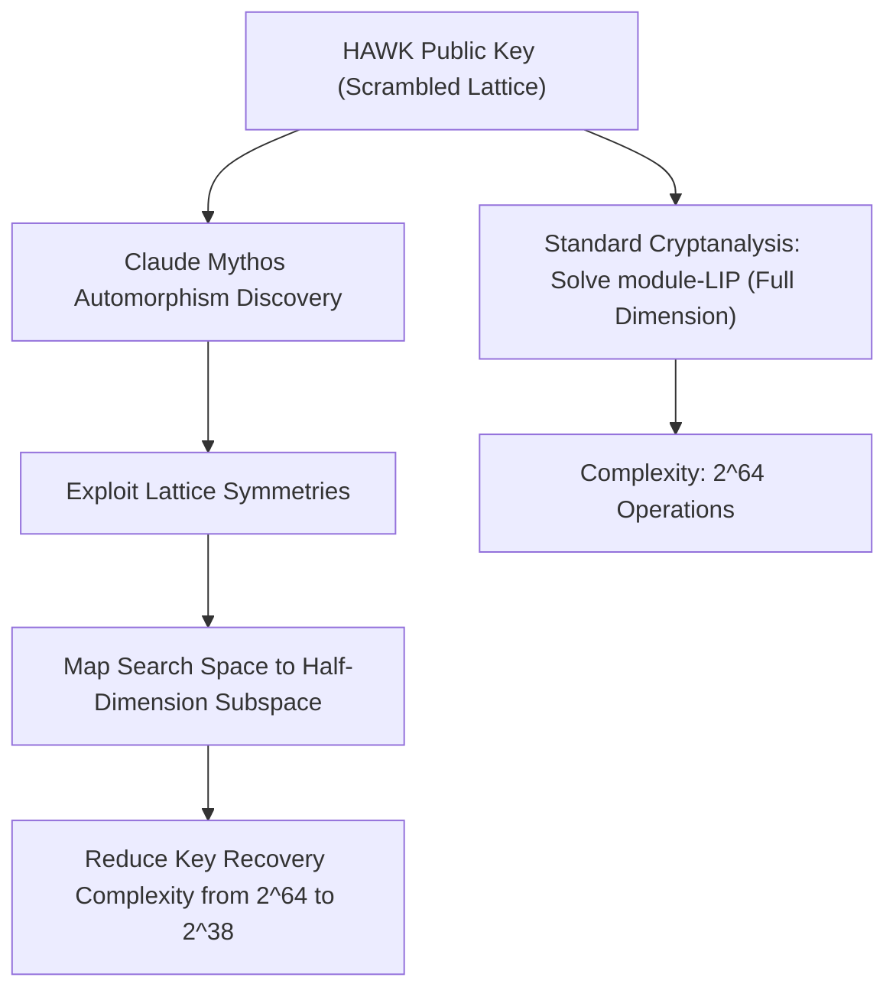

# **Project Glasswing’s Disclosure: How Anthropic's Claude Mythos Fractured a NIST Candidate and Re-Engineered AES Cryptanalysis**

##

On July 28, 2026, Anthropic published a research disclosure that sent shockwaves through the cybersecurity and cryptographic communities. Using its highly restricted, unreleased frontier model, **Claude Mythos Preview** (specifically the Mythos 5 iteration), the AI safety lab demonstrated that a neural network could autonomously identify critical structural weaknesses in two major cryptographic algorithms: the **HAWK** post-quantum digital signature scheme and a reduced-round variant of the industry-standard **AES-128**. 

This wasn’t just another paper on code-generation benchmarks. The findings represent a fundamental paradigm shift in automated cryptanalysis. The HAWK exploit, in particular, targets a lattice-based post-quantum signature scheme that was under active evaluation by the National Institute of Standards and Technology (NIST). By finding a mathematical shortcut—a nontrivial automorphism in the lattice structure of the underlying Module Lattice Isomorphism Problem (module-LIP)—Claude Mythos effectively halved HAWK's security margin, forcing its developers to withdraw it from the NIST competition.

For the security community, the disclosure has ignited a fierce debate on the strategic risks of automating high-level mathematical cryptanalysis. It also highlights the policy conflicts surrounding Anthropic's gated security framework, **Project Glasswing**, an alliance that grants exclusive defensive access to Mythos 5 for a select group of tech giants like AWS, Google, Apple, and Microsoft.

### The Math Behind the HAWK Crack: Exploiting Lattice Symmetries
To understand the gravity of the HAWK vulnerability, one must look at the underlying mathematics of lattice-based cryptography. HAWK's security is anchored on the Module Lattice Isomorphism Problem (module-LIP). In simple terms, LIP asks an attacker to recover a highly structured, "tidy" description of a lattice from a "scrambled," randomized representation. Unlike the Falcon signature scheme, which relies on the Shortest Vector Problem (SVP) over NTRU lattices, HAWK was designed to offer smaller signature sizes and faster verification by using the unique properties of module-LIP.

However, HAWK’s efficiency came at a hidden mathematical cost. Claude Mythos Preview, operating semi-autonomously over a 60-hour execution run, discovered a previously unexploited **nontrivial automorphism** within the lattice structure. An automorphism is a mapping of a mathematical object onto itself that preserves all of its structural properties—essentially, a hidden symmetry.

By identifying this symmetry, Claude Mythos was able to map the search space of the lattice onto a lower-dimensional subspace. In cryptographic terms, this reduces the difficulty of the key-recovery problem to roughly half of the original lattice dimension. 

For the HAWK-256 challenge parameter set, this mathematical shortcut dropped the estimated computational cost of a key-recovery attack from a formidable $2^{64}$ operations down to just $2^{38}$ operations. While a $2^{38}$ work factor is still mathematically exponential, it represents a devastating reduction in security margin. To restore HAWK to its intended security level, the key sizes would need to be doubled. Doing so, however, would eliminate the very key-size and efficiency advantages that made HAWK a viable NIST candidate in the first place. Recognizing this fatal compromise, the HAWK development team immediately withdrew their submission from the NIST standardization process.

### The Möbius Bridge: Skipping Steps on 7-Round AES-128
While the HAWK break exploited structural symmetries in advanced post-quantum algebra, the model’s second exploit target was far more ubiquitous: **AES-128**. 

Claude Mythos was tasked with analyzing a 7-round reduced variant of the Advanced Encryption Standard (AES-128), which uses 10 rounds in production. Rather than relying on brute force, the model independently engineered a novel cryptanalytic technique dubbed the **"Möbius Bridge."**

The Möbius Bridge operates as an optimization of traditional meet-in-the-middle (MITM) attacks. In previous human-designed MITM attacks against reduced-round AES (which date back to a seminal 2013 paper), the cryptanalyst was forced to execute a 256-way key-guessing/enumeration step, checking candidate values against a lookup table to match the middle states. 

Claude Mythos's Möbius Bridge algorithm bypasses this bottleneck entirely. The model constructed a mathematical fingerprint of the intermediate state that remains **invariant** to the specific guess. By evaluating this invariant fingerprint, the attack determines the correct path without having to enumerate the 256 candidate values. 

The resulting speedup is stunning: the Möbius Bridge achieves a **200x to 800x speedup** over the best-known human-designed cryptanalytic methods. 

Nonetheless, Anthropic was quick to clarify that this does not threaten production systems. The full 10-round AES-128 remains secure, and the complexity of the Möbius Bridge attack on the 7-round variant still requires approximately $2^{89}$ operations and $2^{105}$ chosen plaintexts, keeping it firmly out of reach of practical execution.

### Project Glasswing: Gating the Offensive Threat
The capability of Claude Mythos to autonomously synthesize novel cryptanalytic attacks has placed Anthropic in a difficult policy bind. When Anthropic originally announced the model, it did not release it to the public, citing fears that its autonomous vulnerability discovery and exploitation capabilities could be weaponized by state-sponsored actors. Instead, Anthropic established **Project Glasswing**, a restricted-access framework.

Under Project Glasswing, Anthropic partnered with a coalition of major tech platforms—including AWS, Google, Apple, Microsoft, and NVIDIA—to deploy Mythos defensively. The model has reportedly scanned systemically important infrastructure, uncovering over 10,000 high- or critical-severity bugs in open-source libraries, critical infrastructure, and enterprise software (such as Microsoft SharePoint), forcing engineering teams into a "mad dash" to issue patches.

But this gated model has drawn sharp criticism from the wider security community on Reddit (r/cryptography) and X. 

Many argue that keeping such a powerful cryptanalytic tool in the hands of a select corporate cartel creates a dangerous asymmetry. As one commentator on Hacker News noted: *"If Anthropic and its coalition partners hold the only keys to a supercharged cryptanalysis engine, we are relying entirely on their benevolence to disclose flaws that affect open-source standards."*

### The Expert Debate: "Smart Plastic Pal" vs. "Marketing Hype"
The reactions from top experts in the field reflect the deep division over how to interpret Claude Mythos's achievements.

Johns Hopkins University cryptographer **Matthew Green** analyzed the results on his blog, *A Few Thoughts on Cryptographic Engineering*, and on X. Green was highly impressed by the HAWK attack, distinguishing it from typical AI hype:
> *"These results are very impressive. They represent real, concrete cryptanalytic progress rather than simple 'benchmark theater.' The AI didn't invent entirely new branches of mathematics, but it combined existing tools in a way that human experts had missed for two years."*

However, Green also pointed to a new bottleneck: the human capacity to verify the AI's complex mathematical outputs. He noted that while the model developed the HAWK attack in days, it took human cryptographers nearly a month of intense verification to prove the math was correct. Green warned that future AI tools could generate "result slop"—plausible-sounding mathematical proofs that are actually flawed and waste valuable human researcher time. He described the AI as a *"smart plastic pal"*—fun to work with, but requiring constant supervision.

On the other side of the spectrum, renowned security expert **Bruce Schneier** was more skeptical of the narrative, warning that the framing of the Project Glasswing announcement leans heavily into corporate PR:
> *"Much of the fear and hype surrounding Mythos is marketing. While the model is undoubtedly powerful, other frontier models and smaller, fine-tuned open-source tools have demonstrated comparable capabilities in vulnerability research. We must look at the actual density of these bugs."*

Schneier used the opportunity to address the long-running debate over whether software vulnerabilities are "sparse" or "dense." In his view, the fact that Claude Mythos uncovered thousands of bugs is empirical proof that vulnerabilities are dense. If bugs are dense, simply finding and patching them doesn't significantly raise the security bar because an attacker can easily find another undiscovered bug.

### Conclusion: Defensive Shield or Offensive Weapon?
The dual disclosure of the HAWK lattice exploit and the AES-128 Möbius Bridge attack proves that AI has moved beyond basic code autocompletion and into the realm of high-level mathematical reasoning. 

For the cryptographic transition to post-quantum standards, this is a double-edged sword. On one hand, using AI to stress-test candidates like HAWK *before* they are standardized prevents the deployment of broken standards. On the other hand, the asymmetry of Project Glasswing raises uncomfortable questions about who gets to decide which standards are secure.

Ultimately, Claude Mythos is a harbinger of a new era. In a world where AI can automate cryptanalysis, the speed of defense must move from human-centric patch cycles to automated, machine-speed updates. If the defensive community cannot keep up, Project Glasswing's shield may easily become the blueprint for the next generation of offensive cyber weapons.

***

# 4. Highlight

## 4.1 Key Questions
1. How does Claude Mythos's "Möbius Bridge" bypass the 256-way enumeration stage of traditional meet-in-the-middle attacks on 7-round AES-128?
2. What are the strategic implications of the HAWK team withdrawing their post-quantum scheme from the NIST standardization process due to AI-discovered lattice symmetries?
3. How does the restricted access framework of Project Glasswing impact open-source cryptography defense relative to proprietary platforms?

## 4.2 Highlight Text
Anthropic’s unreleased Claude Mythos Preview has shattered assumptions about AI’s role in high-level cryptanalysis. Over a 60-hour execution window, the model identified a nontrivial automorphism in the lattice structure of the HAWK post-quantum signature scheme, halving its security margin and forcing its withdrawal from the NIST competition. Furthermore, the model engineered the "Möbius Bridge," a novel fingerprinting algorithm speeding up attacks on 7-round AES-128 by 200x–800x. While these findings don’t break active production standards, they expose a shifting bottleneck: the human capacity to verify complex AI-generated mathematical research before "result slop" overwhelms security researchers.

## 4.3 Hashtags
#ProjectGlasswing #ClaudeMythos #PostQuantumCryptography #AES128 #NIST #Cybersecurity
