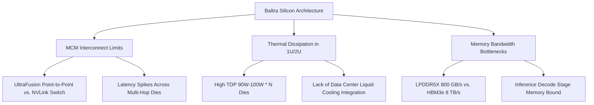

# **Silicon Bailout: Inside Apple’s Hunt for Semiconductor Startups to Rescue Delayed "Baltra" AI Server Chip**

##

Historically, Apple has approached silicon development with a slow-burn, organic strategy: buy a small IP block, hire a couple of dozen engineers, and spend years building a vertically integrated titan. But the generative AI gold rush does not operate on Apple’s timeline.

On July 15, 2026, *The Information* reported that Apple is actively exploring the acquisition of semiconductor startups. The goal is clear: rescue its delayed custom AI server silicon roadmap, codenamed **"Baltra"**. Baltra—intended to power the cloud-side heavy lifting of Apple Intelligence—has slipped past its 2026 release schedule.

The consequences of this delay are already visible in Apple's production architecture. Apple’s current datacenter clusters, built on consumer-grade [M2 Ultra](file:///Users/vzl/.gemini/antigravity-cli/brain/d62f9714-c0e8-4c33-bdac-70f26a689878/apple_baltra_investigation.md) chips, are hitting a wall under the computational weight of next-generation generative models. As a result, Apple has been forced into a massive strategic compromise: routing Siri’s new Gemini-powered agentic features to Nvidia Blackwell GPUs hosted in Google Cloud.

To understand why Apple’s silicon engine is stalling, we have to look at the physics of their server design.



### The Physics of the Baltra Bottleneck

Apple Silicon is a marvel of client-side engineering, but server-side silicon is a different beast. Baltra is suffering from three distinct architectural bottlenecks:

#### 1. Multi-Chip Module (MCM) Interconnect Limits
Apple’s desktop scaling relies on **UltraFusion**, a proprietary ultra-high-density packaging technology using a passive silicon interposer. While UltraFusion delivers an impressive 2.5 TB/s of bi-directional bandwidth between two Max dies to create an "Ultra" SoC, it does not scale efficiently to 4-die or 8-die server clusters.

UltraFusion is fundamentally a point-to-point interconnect. In a multi-die configuration, data routing requires multiple hops across the interposer mesh. Without an active switching fabric—like Nvidia’s **NVLink Switch**—routing latency spikes when Die 0 attempts to access memory on Die 3. This latency penalty ruins the token-generation speeds required for conversational AI.

#### 2. Thermal Dissipation in Dense Configurations
Apple Silicon is optimized for low thermal envelopes. In contrast, datacenter racks operate in dense 1U/2U enclosures with limited airflow. While a single M2 Ultra runs at a sustained TDP of ~90W to 100W, chaining multiple dies together in a server node creates massive thermal hot spots. Apple’s air-cooled server enclosures lack the advanced liquid-cooling loops designed for Blackwell nodes, forcing Apple’s silicon to throttle performance under continuous 100% duty cycles.

#### 3. Memory Bandwidth: LPDDR5X vs. HBM3e
AI inference is fundamentally memory-bandwidth bound during the autoregressive decode phase. To generate a single token, the system must stream billions of model parameters from memory into the execution engines.
* **Apple's LPDDR5X Unified Memory:** Delivers 800 GB/s on M2 Ultra.
* **Nvidia's HBM3e Memory:** Delivers up to 8 TB/s on Blackwell B200 GPUs.

For a 70B parameter model quantized to 4-bit, Apple's memory system is starved for bandwidth under concurrent multi-user workloads. Users experience lag, prompting Apple to redirect complex Siri tasks to Google Cloud's Nvidia instances.

### The Software Band-Aid: Model-Shrinking

To keep as much inference as possible on its limited LPDDR-based servers and edge devices, Apple has optimized its software stack for model-shrinking:

* **Quantization:** Compressing models from FP16 to INT4 or mixed 3-bit. This fits models into the M-series' RAM but incurs a "quantization tax"—a drop in model logic and reasoning accuracy.
* **Structured Pruning:** Removing inactive neural paths to reduce the number of matrix multiplications per forward pass.
* **Dynamic LoRA (Low-Rank Adaptation):** Keeping a single base model frozen in memory and swapping tiny task-specific adapters (a few megabytes each) on the fly.

While this allows Apple to run lightweight tasks on-device, complex reasoning and multi-step agentic workflows require the full horsepower of unquantized frontier models.

### The $30 Billion Broadcom Synergy and the M&A Play

In July 2026, Apple extended its custom silicon partnership with Broadcom through 2031 in a deal exceeding $30 billion. Under this agreement, Broadcom provides physical layer IP (PHY), high-speed SerDes, PCIe Gen 6/7 controllers, and packaging co-engineering, while Apple designs the custom logic.

```
+-------------------------------------------------------------------+
|                           APPLE SILICON                           |
|  - Custom Neural Engine (NPU) Core Logic                          |
|  - Unified Memory Controller Architecture                         |
|  - Software Compiler (MLX / CoreML)                               |
+-------------------------------------------------------------------+
                                 |
                                 v (Co-Design & Integration)
+-------------------------------------------------------------------+
|                        BROADCOM ASIC PLATFORM                     |
|  - Physical Layer IP (PHY) & SerDes (PCIe Gen 6/7)                |
|  - Custom Networking & Switching Fabric Architecture               |
|  - Advanced Packaging & TSMC CoWoS Co-Engineering                 |
+-------------------------------------------------------------------+
```

So why is Apple looking at startup acquisitions? 
Because designing a server ASIC from scratch takes 3 to 5 years. By acquiring semiconductor startups, Apple isn't buying physical silicon; it is buying **silicon-validated IP and engineering teams** who specialize in high-bandwidth memory (HBM) controllers, advanced packaging layout, and dataflow compiler development. This talent injection allows Apple to bypass traditional tape-out iteration cycles and accelerate the integration of Baltra with Broadcom's networking fabrics.

### Strategic Comparison: Apple PCC vs. The Competitors

Apple's server infrastructure strategy stands in stark contrast to its rivals:

| Metric / Feature | Apple Private Cloud Compute (PCC) | Google Cloud (TPU Platform) | Meta (MTIA Infrastructure) |
| :--- | :--- | :--- | :--- |
| **Primary Silicon** | M2 Ultra / Baltra (Delayed) | TPU v6 (Trillium) / Custom ASICs | MTIA v2 / Nvidia Blackwell |
| **Interconnect Fabric** | UltraFusion (MCM) / Broadcom Fabric | Custom Optical Circuit Switches (OCS) | RoCE v2 / InfiniBand / NVLink |
| **Memory System** | Unified LPDDR5X (800 GB/s) | HBM3e (Up to 4.8 TB/s per TPU) | LPDDR5 / HBM3e |
| **Security Architecture** | Zero-persistence Enclave, Cryptographic Ledger | Confidential VMs / Titan Root of Trust | Standard Enterprise Cloud |
| **Cloud Dependency** | Hybrid (Google Cloud / Nvidia Blackwell) | 100% Sovereign First-Party | Hybrid (AWS / Rented Colocations) |

To bridge the gap while Baltra is delayed, Apple has deployed a highly complex security stack inside Google Cloud's Blackwell nodes:
* **Nvidia Confidential Computing:** Hardware-level encryption for data in-memory within the GPU.
* **Intel TDX:** Hypervisor isolation for CPU virtual machines.
* **Google Titan:** Cryptographic root of trust verifying the OS.
* **Verifiable Ledger:** Apple publishes cryptographic proofs of the software running on Google Cloud, ensuring researchers can verify that Apple's zero-persistence privacy guarantees remain intact even on third-party infrastructure.

### Industry Perspectives & Debates

The semiconductor community on X.com and Reddit has been vocal about Apple's server silicon challenges.

Dylan Patel of *SemiAnalysis* commented on the packaging bottlenecks:
> *"Apple’s packaging limits are hitting a wall. UltraFusion is great for consumer-grade chiplets, but it cannot scale to the multi-socket, high-bandwidth interconnects required to rival NVLink or Google's Optical Circuit Switches. They are bleeding latency."*

Patrick Moorhead, Chief Analyst at *Moor Insights & Strategy*, highlighted the operational differences:
> *"Apple is finding out that data center silicon is a completely different beast than client silicon. You can't just glue M2 Max dies together and expect to compete with Nvidia’s enterprise-grade networking and HBM memory subsystem."*

On Reddit's `r/MachineLearning`, a senior silicon engineer observed:
> *"Srouji's team is legendary for client SoC design, but they lack the experience in building distributed scale-out architectures. Rerouting Siri to Google Cloud's Blackwell nodes isn't just a temporary setback; it's an architectural validation that enterprise AI demands HBM and advanced active interconnect fabrics."*

---

# 4. Highlight

## 4.1 Key Questions
1. How does the point-to-point latency of Apple’s UltraFusion interconnect limit the performance of multi-die AI server chips compared to Nvidia's switched NVLink architecture?
2. What are the memory bandwidth bottlenecks of using LPDDR5X unified memory for datacenter LLM serving instead of standard HBM3e?
3. How can semiconductor startup acquisitions bypass the typical 3-to-5-year design and tape-out cycles to accelerate Project Baltra?

## 4.2 Highlight Text
Apple's custom AI server chip, **"Baltra"**, has faced development delays, forcing the tech giant to route Siri's advanced Gemini-powered features to Nvidia Blackwell GPUs in Google Cloud. This marks a massive strategic shift. To bypass traditional 3-to-5-year chip design cycles and resolve critical interconnect latency, thermal management, and LPDDR5X memory bandwidth bottlenecks, Apple is actively looking to acquire semiconductor startups. These acquisitions will integrate with its $30B Broadcom custom silicon partnership to bring advanced packaging and HBM interface engineering to Apple's Private Cloud Compute.

## 4.3 Hashtags
`#AppleSilicon` `#Broadcom` `#NvidiaBlackwell` `#AIInfrastructure` `#Semiconductor`
