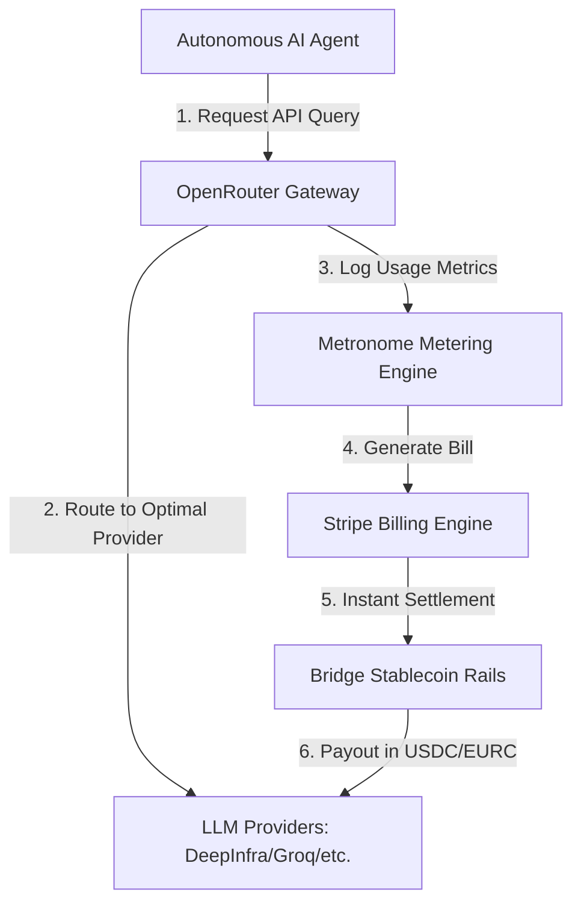

# **Stripe’s $7 Billion AI Tollbooth: The Inside Story of the OpenRouter Acquisition and the Battle for Agentic Commerce**

###

Silicon Valley has a new gravity well. Reports from Bloomberg and TechCrunch indicate that payments giant Stripe has finalized an agreement to acquire OpenRouter, the leading neutral AI model routing marketplace, for a valuation exceeding $7 billion (with sources pegging the final figure between $7 billion and $8 billion). 

The deal represents a breathtaking valuation leap for OpenRouter, which closed a $113 million Series B just three months ago in May 2026 at a $1.3 billion valuation led by Google parent Alphabet's growth fund, CapitalG. It also marks the cornerstone of Stripe’s quiet construction of a full-stack financial and operational rails system for the machine-to-machine economy. 

To understand why a fintech titan would pay more than $7 billion for a company that critics dismiss as an "API aggregator," we must analyze the technical orchestration of OpenRouter's routing engine and trace its synergy with Stripe’s recent blockbuster acquisitions: the usage-based billing platform [Metronome](https://stripe.com/newsroom/news/stripe-to-acquire-metronome) (completed in January 2026 for approximately $1 billion) and the stablecoin network [Bridge](https://stripe.com/newsroom/news/stripe-acquires-bridge) (officially closed in February 2025 for $1.1 billion).

#### The Technical Architecture of the Routing Engine
At its core, OpenRouter is a bidirectional gateway mapping a single API endpoint (`https://openrouter.ai/api/v1/chat/completions`) directly to the OpenAI chat completions schema. Yet, behind this simple facade lies a highly optimized, two-layer traffic controller running on edge networks to minimize latency overhead:

1. **Model Routing:** OpenRouter decouples the target LLM from the physical infrastructure. When a developer queries a model—for instance, `meta-llama/llama-3.1-405b-instruct`—OpenRouter's routing layer, built on a global Cloudflare Workers architecture that adds a negligible 15–25ms of latency, resolves which of its 70+ upstream partners (such as Together AI, DeepInfra, Fireworks, or Groq) are currently hosting it.
2. **Provider Routing & Load Balancing:** OpenRouter automatically load-balances requests across providers using a dynamic routing strategy. By default, it weights requests based on the **inverse square of the price** ($1/\text{price}^2$), skewing traffic toward the most cost-effective provider. Concurrently, it maintains a real-time health ledger. If a provider yields an HTTP 429 (Rate Limit) or an HTTP 5xx error, or if its p90 latency spikes, the routing engine deprioritizes that provider within a rolling 30-second window.

Developers can inject custom routing preferences directly into their payload using parameters like `provider.order` and `allow_fallbacks`:
```json
{
  "model": "meta-llama/llama-3.1-405b-instruct",
  "messages": [{"role": "user", "content": "Hello World"}],
  "provider": {
    "order": ["DeepInfra", "Together"],
    "allow_fallbacks": true,
    "sort": "latency"
  }
}
```
By resolving provider downtime, network congestion, and volatile spot pricing programmatically, OpenRouter has solved the three biggest headaches in production AI engineering: vendor lock-in, API failure states, and cost unpredictability.

#### The AI Money Stack: Bridge, Metronome, and OpenRouter
Why is Stripe paying a premium to own this gateway? The answer lies in CEO Patrick Collison's vision of "agentic commerce"—a future where autonomous software agents execute tasks, consume computing resources, and transact with other machines without human intervention. 

To power this machine-to-machine economy, Stripe has spent the last 18 months building the **AI Money Stack**:
* **The Settlement Rails (Bridge, Feb 2025):** Stripe's acquisition of Bridge provides the underlying rails for instant, low-cost cross-border payments via ERC-20 stablecoins (USDC and EURC), avoiding the multi-day delays and heavy fees of legacy banking systems.
* **The Metering Engine (Metronome, Jan 2026):** Metronome provides a high-throughput, multi-dimensional metering engine that ingests millions of events per second to charge for usage-based consumption (e.g., input/output tokens, context window sizes, and cache hits).
* **The Transaction Layer (OpenRouter, Aug 2026):** OpenRouter becomes the execution clearinghouse. 

By combining these platforms, Stripe has created a closed loop. When an AI agent executes a workflow, it queries models through OpenRouter. OpenRouter optimizes the routing for latency and cost; Metronome meters the exact token consumption; and Bridge clears the payment instantly via stablecoin micropayments. Stripe is effectively building the central bank and transaction clearinghouse for the AI agent economy.



#### The Valuation Debate: Moat or Mirage?
The leap from a $1.3 billion valuation in May to a $7-8 billion acquisition in August has ignited fierce debate on Reddit’s `r/StableDiffusion` and `r/ArtificialInteligence`. Critics argue that OpenRouter's routing layer is a commoditized service with minimal proprietary barriers to entry.
> *"OpenRouter is just an API wrapper,"* argued one developer on Hacker News. *"Any engineering team can spin up an open-source gateway like [LiteLLM](https://github.com/BerriAI/litellm) on AWS, add fallback logic, and use their own API keys. It’s a solved problem."*

However, the counter-argument is that OpenRouter's value lies in its **two-sided market network effects** and **telemetry data**. Founded in early 2023 by Alex Atallah (former co-founder and CTO of OpenSea) and Louis Vichy, OpenRouter has spent three years acquiring developer mindshare. For a startup, maintaining separate billing relationships and API keys with 70+ individual model providers is an operational nightmare. OpenRouter consolidates this into a single billing relationship. Furthermore, OpenRouter sits on a goldmine of real-time telemetry—possessing unbiased data on model performance, error rates, and actual cost efficiency across the entire industry.

#### Compliance vs. Neutrality: The NSFW Sanitization Anxiety
Despite the business logic, developer anxiety is running high. Stripe is a heavily regulated financial entity that enforces strict compliance standards. Stripe's [Restricted Businesses Policy](https://stripe.com/legal/restricted-businesses) strictly prohibits payments related to "adult content and services" and high-risk content.

OpenRouter, by contrast, has maintained strict architectural neutrality. The platform routes to uncensored, open-weights models and has become the primary infrastructure for developers running NSFW applications, creative writing projects, and interactive roleplay platforms (often integrated via frontends like SillyTavern).
> *"The moment Stripe’s legal team takes a look at what is being routed through OpenRouter, the censorship begins,"* warned a developer on `r/SillyTavernAI`. *"Stripe cannot afford the reputational or regulatory risk of underwriting NSFW model access. Uncensored open-weights models will be restricted or purged."*

If Stripe sanitizes OpenRouter's model catalog to comply with its payment terms of service, it risks destroying the developer goodwill that made the platform successful in the first place.

#### The Rise of Decentralized Alternatives
This fear of fintech gatekeeping is already accelerating interest in alternative routing options. Developers are increasingly turning toward self-hosted solutions like LiteLLM to maintain absolute control over their keys, or looking toward decentralized, censorship-resistant inference networks like Venice.ai, Akash Network, and Petals (a peer-to-peer network designed to run large-scale open-weights models like Llama 405B by splitting model layers across consumer GPUs).

To reassure the open-source community, Stripe will need to guarantee that OpenRouter will remain an independent, architecturally neutral utility. If the Collison brothers can maintain OpenRouter’s policy of neutrality while integrating it into the billing rails of Metronome and Bridge, Stripe will secure its position as the undisputed financial backbone of the AI era.

***

## 4. Highlight

### 4.1 Key Questions
1. How does OpenRouter's dynamic edge routing handle model and provider failovers with minimal latency?
2. How does Stripe's acquisition of OpenRouter complement Metronome and Bridge to create the "AI Money Stack"?
3. Will Stripe's strict payment compliance policies force the censorship or sanitization of OpenRouter's uncensored and NSFW model marketplace?

### 4.2 Highlight Text
Stripe has reportedly completed a landmark $7-8 billion acquisition of OpenRouter, the neutral AI gateway that routes queries across 400+ LLMs. Coming hot on the heels of Stripe acquiring usage-billing platform Metronome ($1B) and stablecoin network Bridge ($1.1B), the deal marks the birth of the "AI Money Stack." By controlling the API routing, usage metering, and stablecoin settlement rails, Stripe is positioning itself as the financial clearinghouse for the autonomous agent economy. However, developer communities on Reddit are anxious that Stripe's strict compliance policies could sanitize OpenRouter's neutral, NSFW-friendly marketplace.

### 4.3 Hashtags
#AI #Fintech #OpenSource #Stripe #OpenRouter #Llama #APIGateway #AgenticEconomy
