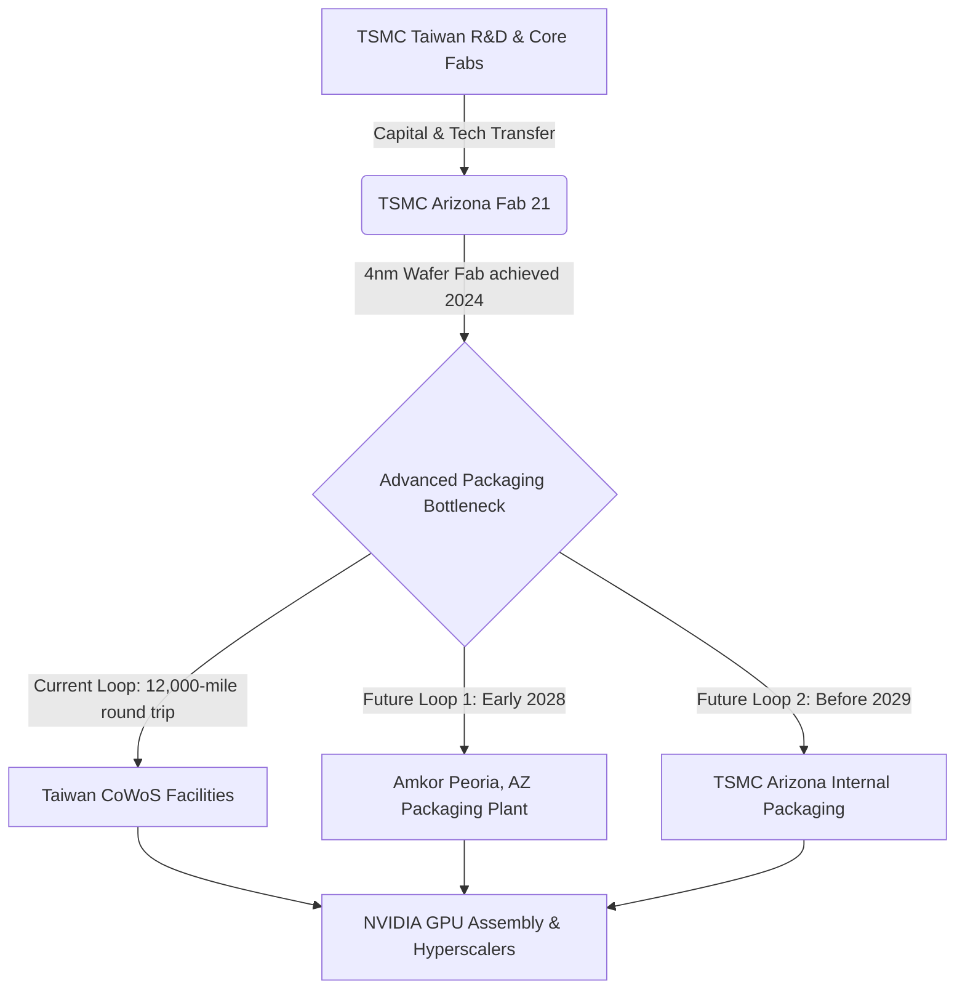

# **TSMC’s $44 Billion Arizona Gamble: Inside the Brutal Technical, Cultural, and Logistical Battle to Onshore AI Silicon**

##

On July 2, 2026, Taiwan’s Ministry of Economic Affairs (MOEA) Department of Investment Review officially approved a US$20 billion capital injection by TSMC into its wholly owned U.S. subsidiary, TSMC Arizona. This marks the sixth time Taiwanese regulators have cleared capital outflows for the Arizona operations, bringing the total approved investment to US$44 billion. 

This capital flow supports the execution of TSMC's massive, long-term Phoenix gigafab cluster. First announced as a three-fab, $65 billion commitment, the project was expanded in March 2025 to a projected total expenditure of US$165 billion. The expanded plan targets a footprint of six fabrication plants, two advanced packaging facilities, and an R&D center. Backed by US$6.6 billion in direct grants and up to US$5 billion in loans under the U.S. CHIPS and Science Act, the Phoenix site represents the most capital-intensive attempt in modern history to relocate the bleeding-edge of semiconductor manufacturing.

Yet, behind the policy wins lies a complex reality of yield metrics, packaging bottlenecks, and deep-seated cultural friction.

### The Geopolitical Crucible
The drive to onshore fabrication is born out of intense geopolitical anxiety. Currently, over 90% of the world’s advanced logic chips are fabricated in Taiwan, primarily at TSMC's Fab 18 in Tainan. A blockade or conflict in the Taiwan Strait would instantly freeze the global tech economy, paralyzing the hyperscale data centers of Microsoft, Google, Meta, and Amazon, while halting NVIDIA's AI dominance. 

To mitigate this single-point-of-failure risk, the U.S. government has applied immense pressure on TSMC. The goal is simple: construct a self-contained, domestic supply chain for the world's most critical compute engines.

### Front-End Yields: The Early Win
Skeptics originally predicted that TSMC Arizona (Fab 21) would suffer from lagging yield rates due to an inexperienced U.S. workforce. However, the technical reality has defied these expectations. 

In late 2024, Rick Cassidy, President of TSMC’s U.S. division, announced during an industry webinar that Fab 21 had achieved yield rates approximately 4 percentage points *higher* than equivalent facilities in Taiwan. By October 2025, this technical success culminated in NVIDIA CEO Jensen Huang visiting the Phoenix site to sign the first NVIDIA Blackwell wafer manufactured on U.S. soil. Built on TSMC’s custom 4NP process, this milestone proved that Fab 21 could manufacture the world's most complex AI accelerators.

Looking forward, the roadmap for the Arizona site is aggressive:
*   **Fab 1:** Currently mass-producing 4nm (N4) wafers.
*   **Fab 2:** Scheduled to begin 3nm (N3) production in 2027.
*   **Subsequent Fabs:** Planned to introduce 2nm and the revolutionary A16 (1.6nm) backside-power delivery nodes as the campus expands.

### The 12,000-Mile Packaging Loophole
Yet, fabricating the wafer is only half the battle. High-performance AI accelerators like NVIDIA's Blackwell and Rubin architectures rely on TSMC's proprietary **CoWoS (Chip-on-Wafer-on-Substrate)** advanced packaging. 

CoWoS is a 2.5D packaging technology that integrates multiple active silicon dies (like GPU logic cores and High Bandwidth Memory - HBM) onto a silicon interposer. This interposer features micro-bumps and Through-Silicon Vias (TSVs) to establish high-bandwidth, low-latency connections. 

Currently, wafers fabricated in Arizona must be shipped on a 12,000-mile round trip back to Taiwan for CoWoS packaging because the U.S. lacks high-volume advanced packaging infrastructure. To bridge this critical bottleneck, TSMC announced a 10-year partnership with Amkor Technology in June 2026. Amkor is constructing a packaging campus in Peoria, Arizona, targeted to run CoWoS and InFO (Integrated Fan-Out) packaging by early 2028. Additionally, TSMC plans to bring its own internal CoWoS capabilities to Arizona before 2029.

### The Cultural Divide
While the technical engineering is progressing, the workplace management remains highly contentious. TSMC's success in Taiwan is built on a high-intensity, hierarchical corporate culture. 

TSMC founder Morris Chang has famously pointed out the stark differences in worker expectations. In Taiwan, if a multi-million dollar lithography tool fails at 2:00 a.m., engineers are called in and immediately resolve the issue. In the U.S., Chang noted, workers expect standard work-life balance, meaning the machine might sit idle until the morning shift.

This clash is visible on public platforms like Glassdoor and Reddit. American employees complain of "military-style," top-down management, long hours, and language barriers (Mandarin vs. English). 

The operational complexity was summarized by TSMC CEO C.C. Wei, who admitted during a university lecture: 
> *"We were in Arizona, I was crying and going through all kinds of training. First, we thought that the United States is so big, building a house is not a big deal. Wrong, building a house is a big deal."*

### The "American Premium" and Market Realities
The ultimate question for the industry is: who pays for the domestic manufacturing premium? 

Early estimates from Morris Chang claimed that U.S. production would be 50% to 150% more expensive than Taiwan. Macquarie Bank previously suggested operating costs in Arizona could be up to 30% higher, due to the need to build a localized supply chain of specialty chemicals and materials in the desert.

However, recent data from TechInsights using strategic cost models paints a more nuanced picture. Wafer processing in Arizona is estimated to be less than 10% higher than in Taiwan. Because modern semiconductor fabs are highly automated, direct labor accounts for less than 2% of the total wafer cost. Instead, the cost is driven by equipment depreciation (such as ASML's EUV systems), which costs the same globally.

| Cost Component | Taiwan Fab 18 | Arizona Fab 21 | Key Cost Driver |
| :--- | :--- | :--- | :--- |
| **Wafer Processing Cost** | Baseline | < 10% Premium | Dominated by global equipment depreciation |
| **Cleanroom Labor** | Baseline | High Premium | Minimal impact (<2% of total wafer cost due to automation) |
| **Operating Overheads** | Baseline | 20% - 30% Premium | Local chemical supply chain and utility constraints |
| **Advanced Packaging (CoWoS)** | Localized | Outshored (Taiwan) | Temporary shipping costs; Amkor Peoria facility online 2028 |

Nevertheless, hyperscalers and GPU providers like NVIDIA will have to absorb elevated costs. While they gain geographical resilience, the capital expenditure required to secure domestic allocations will keep the pricing of AI hardware premium for years to come.

### The Ecological Challenge: Desert Water
Operating a gigafab cluster in the Sonoran Desert presents severe ecological challenges. Semiconductor manufacturing is exceptionally water-intensive, requiring millions of gallons of ultra-pure water (UPW) daily to rinse wafers. 

To address water scarcity, TSMC has constructed an on-site industrial water reclamation plant in Phoenix. The facility utilizes advanced filtration and reverse osmosis to recycle industrial wastewater, targeting a near-zero liquid discharge rate. While this step satisfies environmental regulations, it adds a capital expenditure premium that Taiwanese fabs do not face to the same degree.

***

# 4. Highlight

## 4.1 Key Questions
1. How does the yield rate of TSMC’s Arizona Fab 21 compare to its facilities in Taiwan?
2. What is the current logistical bottleneck for U.S.-fabricated AI accelerators like NVIDIA Blackwell?
3. How do actual wafer fabrication cost premiums in the U.S. compare to early industry predictions?

## 4.2 Highlight Text
On July 2, 2026, Taiwan's MOEA cleared a $20B capital injection into TSMC Arizona, bringing approved funding to $44B of a projected $165B mega-cluster. While Arizona's Fab 21 achieved N4 yields 4% higher than Taiwan's counterparts—validated by the first U.S.-fabricated Blackwell wafers in late 2025—the supply chain remains bound to Taiwan. Advanced packaging (CoWoS) requires a 12,000-mile round trip for final assembly until partnerships with Amkor (2028) and internal packaging fabs (2029) go online. Meanwhile, TechInsights reveals that wafer costs are only <10% higher due to high automation, debunking labor-blaming cost myths.

## 4.3 Hashtags
#Semiconductors #TSMCArizona #AIHardware #NVIDIA #CHIPSAct #CoWoS
