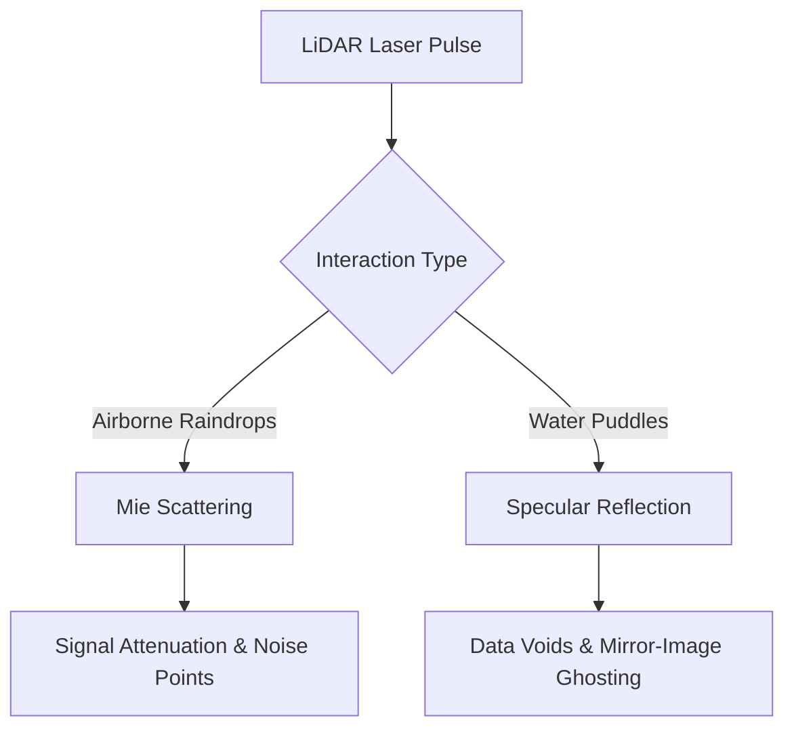

# **Tesla’s Florida Gambit: The Geofencing Paradox, California Regulatory Flight, and the Vision-Only Rain Test**

####

On July 3, 2026, Tesla officially crossed the Rubicon. In a quiet update to its ride-hailing app, the company launched its first fully unsupervised, driverless Robotaxi service in western Miami-Dade County, Florida. Operating a fleet of Model Y vehicles, the service is currently restricted to a 10 to 14 square mile zone spanning Doral, West Miami, and Coral Gables. 

This launch represents a pivotal tactical shift. For the first time, Tesla is operating public rides with no human safety monitor in the vehicle. Yet, the deployment exposes a profound strategic tension: the service relies on the very technology Elon Musk has spent years deriding—geofencing.

##### The Geofencing Paradox: General Autonomy vs. Local Realities
For years, Elon Musk has mocked LiDAR-based, geofenced autonomous vehicles, specifically targeting Google’s Waymo. Musk famously punned that Waymo costs *"Way-mo money"* because its vehicles are expensive, low-volume, and require high-definition mapping and *"localized parameter sets"* for every deployment. Musk’s promise was clear: Tesla’s Full Self-Driving (FSD) would be a generalized, vision-based AI solution that could drive anywhere on Earth without maps or geographical limits.

But the reality of the Doral-Coral Gables rollout tells a different story. The service is strictly bounded by SR-826 (Palmetto Expressway) to the north and US-41 (Tamiami Trail) to the south, explicitly excluding high-density hubs like downtown Miami and Miami Beach. Even near Miami International Airport (MIA), the vehicles are restricted from terminal pick-ups. 

As autonomous vehicle pioneer Brad Templeton has noted, the true benchmark for autonomous success isn’t a PR milestone, but the removal of human supervision paired with viable, localized unit economics. By restricting its unsupervised service to a specific corridor, Tesla is silently acknowledging that "general autonomy" must be deployed in controlled, mapped increments. The neural networks must be throttled and constrained to operate safely at Level 4.

##### Regulatory Arbitrage: Fleeing California for Florida's Open Roads
Tesla’s choice of Miami as its initial unsupervised playground is no accident—it is a masterclass in regulatory arbitrage. 

Under Florida Statutes § 316.85 and § 319.145, autonomous vehicles are permitted to operate on public roads without a human operator present. Crucially, Florida does not require manufacturers to secure complex, state-level testing or deployment permits. Instead, the state relies on its "Dangerous Instrumentality Doctrine," which holds the owner of the vehicle (in this case, Tesla or the fleet owner) fully liable for any crashes or traffic infractions, requiring standard high-limit insurance policies ($1 million liability) for autonomous ride-hailing networks.

Contrast this with Tesla's home state. On July 1, 2026—just two days before Tesla’s Miami launch—California’s Assembly Bill 1777 (AB 1777) went into effect. AB 1777 establishes a formal process for law enforcement to issue a **"Notice of Autonomous Vehicle Noncompliance"** directly to AV manufacturers for moving violations. If a driverless car runs a red light or blocks traffic in San Francisco, police can log the infraction, and the manufacturer is legally mandated to report it to the California DMV within 72 hours (or 24 hours for safety-critical events). The DMV compiles these notices to restrict, suspend, or revoke testing and deployment permits. 

By prioritizing Florida over California for its driverless launch, Tesla has sidestepped California's tightening law enforcement loop.

##### The Physics of Weather: Lidar Scattering vs. Vision Occlusion in Tropical Storms
Miami’s summer climate presents the ultimate test for autonomous perception. Heavy afternoon downpours, high humidity, and localized street flooding are daily occurrences. How do the competing sensor philosophies stack up in a tropical deluge?

###### The LiDAR Dilemma: Mie Scattering and Specular Reflection
LiDAR-based systems (like Waymo) emit laser pulses (typically at 905nm or 1550nm) to build a 3D point cloud of the environment. In heavy rain, this system faces two primary physical bottlenecks:
1. **Mie Scattering:** Raindrops in the air are comparable in size to the laser’s wavelength. When the laser pulses strike suspended water droplets, the light scatters and attenuates. This reduces the sensor's effective range and generates high-frequency "noise" points, which can cause the system to perceive rain as physical barriers (false positives).
2. **Specular Reflection:** Water puddles on asphalt act as mirrors. Instead of reflecting the laser diffuse-style back to the LiDAR sensor, the light bounces away from the vehicle according to the angle of incidence. This results in "data voids" (holes in the point cloud) or "ghost reflections," where the sensor perceives a mirrored image of an object appearing to exist below ground level.

Waymo mitigates these issues through sensor fusion—augmenting LiDAR with radar (which easily penetrates water droplets) and high-resolution cameras—alongside active dome-wipers and hydrophobic coatings.

###### The Vision-Only Challenge: Occlusion and Hydroplaning
Tesla’s HW4 vision-only suite, utilizing 5-megapixel cameras, faces a different set of physical challenges:
1. **Refraction and Occlusion:** Raindrops adhering directly to the glass cover of the B-pillar or fender cameras refract light, distorting the visual field. Condensation inside the camera housing from Miami's intense humidity can blind the sensors entirely.
2. **Road Spray:** Fine mist kicked up by leading trucks creates a low-contrast visual barrier that cameras struggle to penetrate.

Tesla’s neural networks utilize spatial-temporal transformers (occupancy networks) to reconstruct the 3D environment. If a camera is briefly occluded by a water droplet, the temporal network uses memory from previous frames to "fill in the blanks." Tesla's software also runs visibility diagnostics, dividing camera inputs into a grid and assigning a visibility score (0 to 3) while tagging scenes for "rain" or "condensation" to trigger internal defrosters and wipers automatically.

However, the fundamental flaw of a vision-only system is its inability to measure water depth or detect hydroplaning before it occurs. Without active sonar or LiDAR depth estimation, Tesla’s Model Y relies on inertial measurement units (IMUs) to react to traction loss *after* the tires have already lost contact with the road.

##### Logistics and Fleet Operations: Bridging the Gap to the Cybercab
Because Tesla's purpose-built, steering-wheel-less "Cybercab" is not yet in volume production, the Model Y serves as the operational bridge. 

To support the unsupervised launch, Tesla has established dedicated maintenance and charging depots within the Doral corridor. The company updated its mobile app to feature a "Self-Driving" status indicator, allowing passengers to confirm when the vehicle is in fully autonomous mode. 

Furthermore, Tesla has collaborated with local authorities, conducting emergency response training with the Coral Gables Fire Department. Firefighters were trained on how to interact with a driverless Model Y, locate high-voltage cut-off loops, and contact Tesla's remote assistance team, who must respond to emergency calls within the legally required window.

##### Strategic Implications
Tesla’s Miami launch is a critical step forward, but it is also a compromise. By adopting geofencing, Tesla has yielded to the physical and operational realities that govern all Level 4 AV developers. Whether FSD's vision-only neural networks can survive Miami's summer storms without the safety net of LiDAR remains the multi-billion-dollar question. For now, the driverless war has officially moved to the East Coast.

---

### 4. Highlight

#### 4.1 Key Questions
1. Why did Tesla choose Miami for its first unsupervised Robotaxi launch over California?
2. How does Tesla's vision-only approach handle the physics of tropical rainstorms compared to LiDAR-based systems?
3. What does Tesla's use of a 10-14 square mile geofence mean for Elon Musk's critique of geofenced autonomous vehicles?

#### 4.2 Highlight Text
Tesla has officially launched its first unsupervised Robotaxi service in West Miami, Doral, and Coral Gables using Model Ys. Restricted to a 10–14 square mile geofenced zone, the rollout directly challenges Elon Musk’s long-standing critique of geofencing. By prioritizing Florida’s permissive regulatory framework, Tesla also bypasses California's newly enacted AB 1777 ticketing law. The true test lies in the physics of Miami’s summer: while LiDAR struggles with Mie scattering and specular reflection on puddles, Tesla’s vision-only cameras must navigate severe occlusion and hydroplaning risks without physical depth sensors. The East Coast autonomous war has begun.

#### 4.3 Hashtags
#TeslaRobotaxi #AutonomousVehicles #FSD #MiamiTech #TechRegulation
