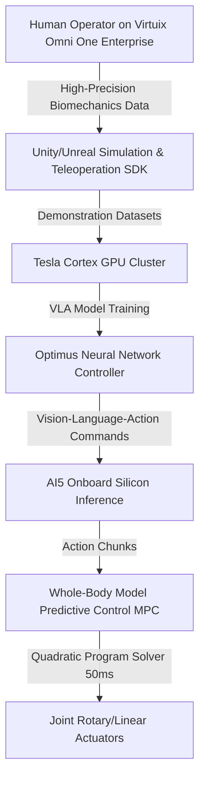

# **Tesla’s High-Stakes Pivot: Inside the Fremont Conversion, the Optimus Gen 3 Architecture, and the War for the $20K Humanoid**

####

**FREMONT, CALIFORNIA** — The screech of welding torches and the mechanical hum of automotive assembly lines have been replaced by a new, more calculated cadence. Tesla’s Fremont factory has officially completed its most audacious manufacturing pivot to date. Following the decommission and dismantling of the Model S and Model X production lines in early May 2026—a 46-day retooling blitz—the facility has transitioned to limited assembly of the **Optimus Gen 3** humanoid robot. 

With limited production officially underway as of August 2026, Tesla is attempting to ramp Fremont to an eventual run-rate of one million units annually before transferring the bulk of production to a specialized facility in Giga Texas, where it aims for an aspirational 10 million units per year starting in summer 2027.

The transition marks a pivotal moment in the robotics industry: can a general-purpose humanoid robot be manufactured at a consumer-friendly $20,000 to $30,000 price point while maintaining industrial-grade durability? To answer this, we must unpack the mechanical, electrical, and AI engineering that defines this transition, along with the geopolitical supply chain hurdles that could derail the entire project.

#### The Mechanical and Electrical Battleground: Joints and Battery Efficiency
At the heart of the Optimus Gen 3 lies an intense mechanical engineering challenge. The robot features **28+ degrees of freedom (DoF)** in its main body, complemented by a massive upgrade in its hands: **22 degrees of freedom per hand** (powered by 50 total actuators per robot, or 25 per forearm/hand). These hands utilize a tendon-driven system to achieve near-human dexterity, a significant leap from the 11-DoF hands seen in previous iterations.

Powering this complex kinematic system is a torso-integrated **2.3 kWh lithium-ion battery pack** operating at approximately 52V. Tesla engineers have optimized the power draw to achieve roughly 8 hours of runtime for light-duty tasks, relying on the robot's ability to autonomously navigate to inductive charging docks. 

To put these specifications in perspective, consider how Optimus compares to its primary competitors in the industrial space:

| Humanoid Robot | Total Body DoF | Hand DoF (Per Hand) | Battery Capacity / Runtime | Mobility | Payload |
| :--- | :---: | :---: | :---: | :---: | :---: |
| [Tesla Optimus Gen 3](file:///Users/vzl/.gemini/antigravity-cli/scratch/optimus_analysis.md) | 28+ (excl. hands) | 22 DoF | 2.3 kWh (~8 hours) | Bipedal | ~20 kg |
| **Figure 02** | 35 | 16 DoF | 2.25 kWh (~5 hours) | Bipedal | 20 kg |
| **Boston Dynamics Atlas (Electric)** | 56 | Custom Grippers | 4 hours (2 hours heavy lift) | Bipedal (360° Joints) | 30–50 kg |
| **Sanctuary AI Phoenix (Gen 8)** | 44–75 | 20–21 DoF | Proprietary | Wheeled Base | 25 kg |
| **Agility Robotics Digit (v4/v5)** | 30 | Simple Grippers | ~4 hours | Bipedal | 16 kg |

Boston Dynamics' electric Atlas boasts an impressive 56 DoF with 360-degree rotating joints at the hips, waist, and neck, prioritizing raw agility and industrial throughput (lifting up to 50 kg) over human-like hand dexterity. Meanwhile, Figure 02 uses 16-DoF hands and a 2.25 kWh torso battery to get a 5-hour runtime. Sanctuary AI’s Phoenix has opted for a wheeled base in its latest Gen 8 configuration to optimize battery usage and mechanical stability, emphasizing manipulation over complex bipedal locomotion.

#### Supply Chain Bottlenecks: The Rare-Earth Crisis
While Elon Musk continues to market a long-term cost under $20,000, Tesla's vertical integration strategy is hitting a major geopolitical barrier. The Optimus actuator design is heavily dependent on Chinese manufacturing partners like Sanhua Intelligent Controls (linear actuators) and Tuopu Group (rotary actuators). 

More critically, each Optimus unit requires approximately **3.5 kg of neodymium-iron-boron (NdFeB) permanent magnets** for its high-torque motors. 

Following China's enforcement of strict export controls on rare earth magnets, dysprosium, and terbium on April 4, 2025, Tesla has had to navigate tedious export licensing protocols. On X.com, industry commentators have pointed out that this dependency is a massive vulnerability. While Tesla has reduced semiconductor dependencies by designing its own AI5 chip, it cannot easily engineer its way out of the rare-earth monopoly. Tesla is actively qualifying motor designs that require fewer rare earths, but doing so without compromising torque density remains a major engineering challenge.

#### Bridging the Sim-to-Real Gap: Virtuix Omni One Integration
One of the most surprising additions to the Optimus training pipeline is the integration of the **Virtuix Omni One Enterprise** system. Tesla’s robotics division recently acquired several of these B2B omnidirectional treadmills to serve as "human-in-the-loop" teleoperation interfaces.

Traditionally, humanoid robots have been trained using two primary methods:
1. **Reinforcement Learning (RL) in simulation:** Fast and cheap, but suffers from the "sim-to-real gap," where policies that work in a virtual physics engine fail in the messy physical world.
2. **Real-world RL:** Highly accurate, but slow, and subjects the physical hardware to extreme wear-and-tear, leading to frequent joint failures.

By utilizing the Omni One Enterprise's unrestricted SDK (integrated with Unity and Unreal Engine) and foot trackers, human operators can walk, run, crouch, and turn 360 degrees in virtual space while remaining stationary. This allows a human to teleoperate Optimus in a digital twin environment, mapping complex human locomotion and manipulation directly to the robot's joint controllers. 

This human-in-the-loop data is fed into Tesla's **Cortex** supercomputer cluster (powered by tens of thousands of GPUs) to train its vision-in, motor-commands-out **Vision-Language-Action (VLA)** neural network. The VLA model outputs "action chunks"—sequences of motor commands—which are executed onboard via Tesla's custom AI5 silicon. A Whole-Body Model Predictive Controller (MPC) acts as a safety layer, solving a quadratic program every 50 ms to ensure these neural network outputs do not compromise the robot’s balance or physical joint limits.

#### The Celebrity Debate: True World Models vs. Hype
The rapid progression of humanoid hardware has sparked a fierce debate among Silicon Valley's elite. On X.com, Meta's Chief AI Scientist **Yann LeCun** has repeatedly expressed skepticism regarding end-to-end neural network control for physical agents:

> *"We are far from true intelligence. Current AI models lack the 'world models' necessary for robots to reason, plan, and safely navigate the physical world. Simply scaling up training on video data won't solve the hard physics of contact dynamics."*

This drew a sharp rebuttal from Figure AI's CEO **Brett Adcock**, who countered:

> *"Humanoid robotics is on the cusp of a major breakthrough driven by neural networks. End-to-end models can solve the complexity of movement and manipulation far better than hand-coded control theory ever could. We are moving from R&D to real-world commercial deployment faster than critics think."*

ARK Invest's **Cathie Wood** has sided with the optimists, arguing that the integration of humanoid robotics in manufacturing represents a massive, multi-trillion-dollar value driver that will redefine productivity. 

As Tesla begins its slow manufacturing ramp in Fremont this August, the ultimate test will be whether the Optimus Gen 3 can withstand the punishing demands of real factory floors without constant maintenance. The hardware is largely ready, but the battle for the $20,000 humanoid will ultimately be won in the supply chain and the neural network training loops.

---

### 4. Highlight

#### 4.1 Key Questions
1. Can Tesla overcome geopolitical rare-earth magnet export restrictions to reach its target $20k–$30k price point?
2. How does the Optimus Gen 3’s 22-DoF hand stack up against Figure 02 and electric Atlas in real industrial trials?
3. Will "human-in-the-loop" teleoperation using Virtuix Omni One Enterprise treadmills bridge the sim-to-real gap faster than pure RL?

#### 4.2 Highlight Text
Tesla has officially completed the conversion of its Fremont Model S/X assembly lines to kick off production of the Optimus Gen 3 humanoid. Aiming for 1M units/year before scaling to Giga Texas, the project faces a critical bottleneck: China's rare-earth export controls on the 3.5 kg of NdFeB magnets required per robot. To accelerate training, Tesla is bypass-routing traditional RL by integrating Virtuix Omni One Enterprise VR treadmills for human teleoperation. This feeds high-fidelity physics datasets directly into a Vision-Language-Action model running on AI5 edge chips, setting up a showdown with Figure 02 and Atlas.

#### 4.3 Hashtags
#TeslaOptimus #HumanoidRobotics #SiliconValleyTech #OptimusGen3 #AIEngineering
