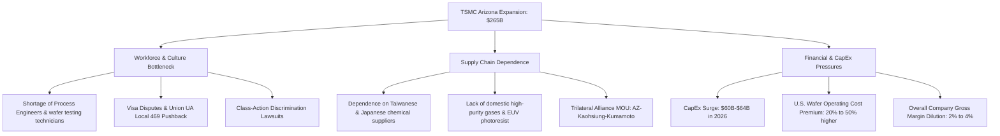

# **The $265 Billion Paper Fortress: The Unvarnished Technical and Financial Realities of TSMC Arizona**

---

###

TSMC’s mid-2026 announcement sent shockwaves through the global semiconductor sector. By committing an additional $100 billion to its Phoenix, Arizona footprint during its Q2 2026 earnings call, the Taiwanese giant raised its total U.S. investment to an astronomical $265 billion—solidifying it as the largest foreign direct investment (FDI) in U.S. history. The revised master plan scales the Arizona mega-site to a staggering 13 facilities: 10 semiconductor fabrication plants (fabs), two advanced packaging facilities, and a dedicated R&D center. 

With a laser focus on 2-nanometer and below process technologies utilizing gate-all-around (GAA) nanosheet transistors, this expansion is positioned as the crown jewel of U.S. technological sovereignty. TSMC CEO C.C. Wei cited "extremely robust" AI-driven demand, pushing the company to raise its 2026 capital expenditure (CapEx) guidance to a historic $60 billion to $64 billion. Yet beneath the high-yield press releases lies a complex web of structural conflicts. To understand if TSMC’s Arizona gambit will succeed, we must dissect three critical bottlenecks: the talent crisis, the supply chain illusion, and the brutal reality of Wall Street's margins.

#### The Human Bottleneck: Visas, Unions, and Class-Action Culture Wars

The most immediate threat to the Phoenix mega-site is not lithography physics, but human resources. Advanced semiconductor manufacturing requires an army of highly specialized process engineers, yield diagnostics experts, and wafer testing technicians. Arizona has struggled to produce this workforce at scale. To bridge the gap, TSMC attempted to fast-track visas for hundreds of Taiwanese engineers, a move that triggered immediate, fierce resistance from local trade unions. Local 469 (representing plumbers, pipefitters, and welders) launched aggressive campaigns to block these visas, accusing TSMC of using "specialized skills shortage" as a pretext to exploit cheaper, more submissive offshore labor.

But the friction runs deeper than visa paperwork; it is a fundamental clash of corporate philosophy. TSMC’s legendary yield rates in Taiwan are built on a militaristic work culture. TSMC founder Morris Chang famously remarked that if a machine breaks down at 2 AM in Taiwan, it is fixed by 3 AM because the engineer is called in while their family goes back to sleep. "In the U.S.," Chang noted, "they would wait until the next morning." 

On platforms like Reddit and X, American engineers have described TSMC Arizona’s management style as "brutal," "authoritarian," and "uncompromising." This cultural chasm has now escalated into the legal arena. A high-profile class-action lawsuit filed by American workers accuses TSMC of systemic "anti-American" discrimination, alleging that Taiwanese managers hold U.S. staff to different standards, favor Mandarin speakers for promotions, and foster a hostile work environment. Furthermore, the *Yeh v. TSMC* gender discrimination lawsuit filed in April 2026 has added fuel to the fire, alleging systemic bias and inappropriate workplace conduct.

#### The Material Illusion: A Supply Chain Anchored in East Asia

Politicians frequently cheer the Phoenix expansion as a triumph of domestic manufacturing resilience. However, supply chain analysts warn that localizing the fab does not mean localizing the supply chain. A semiconductor fab is a highly sensitive ecosystem requiring constant inputs of cleanroom consumables, silicon wafers, and ultra-high-purity specialty chemicals.

Currently, the U.S. lacks the domestic chemical ecosystem required to run sub-2nm nodes. TSMC Arizona remains structurally dependent on East Asian suppliers for:
* **EUV Photoresists:** Highly proprietary chemical formulations controlled almost exclusively by Japanese giants like Tokyo Ohka Kogyo (TOK), JSR Corporation, and Shin-Etsu Chemical.
* **Specialty Wet Chemicals:** High-purity solvents, etchants, and developer solutions sourced from Taiwanese leaders like Chang Chun Petrochemical and LCY Chemical.
* **Raw Wafers:** Advanced 300mm silicon substrates from Shin-Etsu Handotai and SUMCO.

While the March 2026 signing of the trilateral Memorandum of Understanding (MOU) between Arizona, Kaohsiung (Taiwan), and Kumamoto (Japan) aims to build a "semiconductor strategic triangle" to streamline these logistics, it also codifies a sobering reality: Phoenix cannot operate in a vacuum. If a geopolitical crisis disrupts shipping lanes across the Pacific, the Arizona fabs will starve of raw materials within weeks, rendering the $265 billion domestic fortress useless.

#### The Wall Street Calculus: Margin Dilution vs. The AI Premium

When TSMC raised its CapEx guidance to $60B–$64B in Q2 2026, Wall Street reacted with immediate skepticism, triggering a temporary sell-off of TSMC shares. Investors are deeply concerned about capital efficiency and margin degradation. 

Building and running a fab in the U.S. is notoriously expensive. Construction costs are estimated to be up to four times higher than in Taiwan, plagued by regulatory delays and NIMBYism. Analysts estimate that producing wafers in the U.S. incurs a **20% to 50% operating cost premium** over Taiwan. While this local overhead is massive, TSMC projects it will result in a **2% to 4% dilution of its global gross margins** as overseas fabs scale up. 

TSMC plans to offset some of these cost differentials by charging a premium for "made-in-USA" silicon to clients like Apple, NVIDIA, and AMD, but the structural drag on capital efficiency remains a primary concern. As Dylan Patel of *SemiAnalysis* pointed out, lower capacity utilization and higher depreciation expenses in the U.S. could push total U.S. wafer costs even higher in the short term. The core question remains: will tech giants pay the "security tax" on American silicon when the underlying supply chain remains fundamentally transpacific?

---

## 4. Highlight

### 4.1 Key Questions
1. **The Talent Gap:** Can TSMC bridge the deep cultural and operational chasm between its militaristic Taiwanese engineering culture and American labor expectations without sacrificing yield rates?
2. **The Supply Chain Illusion:** How long will TSMC Arizona remain dependent on Japanese and Taiwanese chemical suppliers for critical sub-2nm cleanroom consumables before a viable domestic ecosystem is established?
3. **The Margin Equation:** Will TSMC’s key customers (Apple, NVIDIA, AMD) absorb a 20% to 50% localized wafer cost premium, or will gross margin dilution force TSMC to scale back its ambitious Arizona roadmap?

### 4.2 Highlight Text
TSMC is doubling down on its Phoenix footprint, committing a historic $265B to build a 13-facility advanced manufacturing hub. But can money solve structural industry friction? Beyond the headlines, TSMC faces a brutal labor battle fueled by culture clashes, union disputes, and discrimination lawsuits. More critically, the fab remains a "paper fortress"—completely dependent on Taiwanese and Japanese suppliers for the raw chemistry, wafers, and EUV photoresists required to print sub-2nm silicon. With U.S. wafer production costs 20% to 50% higher than in Taiwan, tech giants face a steep premium for supply chain resilience.

### 4.3 Hashtags
#Semiconductors #TSMC #SiliconValley #CHIPSAct #HardwareEngineering #AITech
