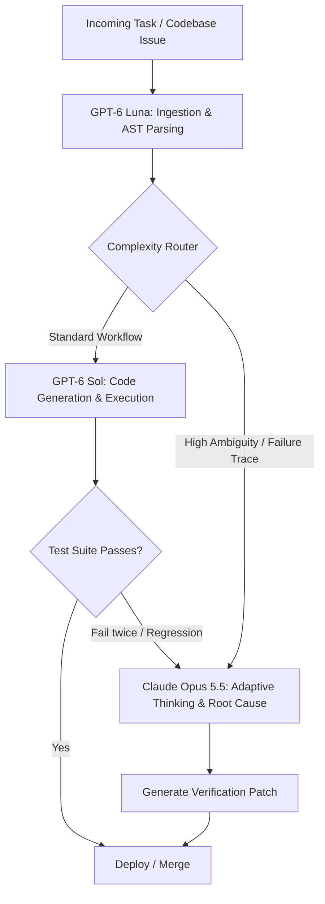

# **The $4 Frontier Clash: Inside Opus 5.5’s Adaptive Thinking, GPT-6 Sol’s "Rushed" Reasoning, and the New Economics of Enterprise AI**

##

On September 22, 2026, the artificial intelligence industry experienced its most consequential, synchronized frontier collision to date. Within ninety minutes of each other, Anthropic and OpenAI launched their next-generation architectures, radically restructuring the pricing, latency expectations, and architectural blueprints of enterprise AI systems.

Anthropic opened the conflict with the immediate general availability of Claude Opus 5.5 across the Claude API, Amazon Bedrock, Google Cloud Vertex AI, and Microsoft Foundry. Engineered to match the reasoning fidelity of Anthropic’s research-grade Claude Fable 5.1 checkpoint, Opus 5.5 cuts operating inference costs by approximately 40% compared to Opus 5. It establishes a baseline rate of $4.00 per million input tokens and $20.00 per million output tokens, accompanied by an aggressive prompt-caching read tier of $0.20 per million tokens. Architectural enhancements include a 30% increase in token generation velocity, hardened prompt-injection defenses, and the debut of native, always-on "adaptive thinking"—a dynamic meta-reasoning loop that autonomously calibrates chain-of-thought depth against prompt complexity.

OpenAI retaliated with immediate precision, unveiling its dual-model framework under the banner: *"Build with Sol, scale with Luna."* Rather than matching Anthropic's pricing tier, OpenAI undercut it by half. GPT-6 Sol, designed as a dedicated coding and core reasoning engine, debuted at $2.00 per million input tokens and $10.00 per million output tokens—a 50% reduction against prior GPT-5.6 pricing. Complementing Sol, OpenAI introduced GPT-6 Luna at $0.10 input and $0.50 output per million tokens, targeting high-volume ingestion, structured parsing, and continuous telemetry pipelines.

Yet beneath the headline price reductions lies a deeper architectural conflict. As independent evaluations on Terminal-Bench 4.0 and GDPval circulate through the engineering community, two distinct operational controversies have emerged: Claude Opus 5.5’s runaway token consumption in recursive autonomous agent loops versus GPT-6 Sol’s propensity for "rushed," shallow reasoning caused by aggressive early-exit heuristics.

```
Frontier AI Pricing & Economics Matrix (Launched Sept 22, 2026)
┌──────────────────┬──────────────┬──────────────┬──────────────────┬────────────────────────┐
│ Model            │ Input / 1M   │ Output / 1M  │ Cache Read / 1M  │ Primary Value Vector   │
├──────────────────┼──────────────┼──────────────┼──────────────────┼────────────────────────┤
│ Claude Opus 5.5  │ $4.00        │ $20.00       │ $0.20            │ Deep Deliberation, TB4 │
│ GPT-6 Sol        │ $2.00        │ $10.00       │ Standard (50%)   │ Fast Code Gen, Cost/Perf│
│ GPT-6 Luna       │ $0.10        │ $0.50        │ Standard (50%)   │ High-Throughput Routing│
└──────────────────┴──────────────┴──────────────┴──────────────────┴────────────────────────┘
```

### The Architectural Divide: Self-Regulating Compute vs. Early-Stopping Heuristics

The core divergence between Opus 5.5 and GPT-6 Sol centers on how each system handles test-time compute.

Anthropic’s adaptive thinking eliminates manual configuration over reasoning budgets. Rather than relying on a static "reasoning effort" parameter, Opus 5.5 executes a dynamic self-evaluation phase: it inspects the semantic complexity and structural ambiguity of the prompt, dynamically expanding or contracting its hidden chain-of-thought tokens. This mechanism is directly tied to Anthropic's reinforced prompt-injection defenses, as the model uses its deliberation steps to untangle untrusted third-party data from system instructions before executing tools.

The friction appears when Opus 5.5 is deployed inside recursive agent frameworks like SWE-agent, Devin, or custom Claude Code harnesses. On Terminal-Bench 4.0—which evaluates autonomous terminal command orchestration, repository-level debugging, and system administration—Opus 5.5 achieved a state-of-the-art 54.8% task resolution rate. However, when an environment emits non-deterministic terminal output, stderr warnings, or cyclic test failures, the adaptive thinking mechanism frequently treats each obstacle as a novel conceptual crisis.

The model expands its internal reasoning exponentially, burning tens of thousands of output tokens at $20.00 per million tokens before issuing a single shell command.

Simon Willison, creator of Datasette and open-source AI tooling pioneer, highlighted the financial reality on X:
> *"Opus 5.5 is the smartest model I have ever used inside an interactive CLI, but inside an autonomous loop, it has no economic self-control. When a compiler threw an obscure linker flag error, adaptive thinking spent 14,000 hidden reasoning tokens parsing the lineage of dynamic linking in GCC before emitting `make clean`. At $20/M output tokens, an unconstrained recursive loop will drain your API balance before you finish your morning espresso."*

Conversely, OpenAI engineered GPT-6 Sol around cost-optimized inference velocity. To achieve a $10.00/M output price point with low Time-to-First-Token (TTFT), OpenAI applied aggressive pruning policies to Sol’s internal reasoning paths. 

On GDPval—the enterprise benchmark measuring performance on real-world economic tasks such as financial statement audits, supply-chain contract verification, and legal discovery—GPT-6 Sol demonstrated high throughput but collapsed when faced with subtle edge-case friction. Across developer communities on Reddit and X, users quickly flagged Sol's "rushed reasoning."

Andrej Karpathy analyzed the failure mode on X:
> *"What we're seeing in GPT-6 Sol is the classic penalty of early-exit optimization in test-time compute. Sol's reinforcement learning policy is heavily tuned to converge on an answer quickly to maximize token generation efficiency. When generating greenfield code or typical boilerplate, it performs brilliantly. But on GDPval-style multi-constraint problems, Sol declares victory prematurely. It closes its reasoning trace before verifying boundary invariants. Opus 5.5 thinks too long; Sol stops thinking the second it finds a plausible path."*

```
Execution Profile: 50-Step Autonomous Repository Debugging Task
┌─────────────────────────────────────────────────────────────┐
│ Claude Opus 5.5: Deep Deliberation & Runaway Token Spend    │
│ [Reasoning: 16.4k tokens] ──> [Tool: bash] ──> [Reasoning]   │
│ Cumulative Task Cost: $3.84 | Resolution: PASS              │
├─────────────────────────────────────────────────────────────┤
│ GPT-6 Sol: Rapid Convergence & Premature Pruning            │
│ [Reasoning: 1.2k tokens] ──> [Tool: bash] ──> [Early Exit]   │
│ Cumulative Task Cost: $0.46 | Resolution: FAIL (Regressed)   │
└─────────────────────────────────────────────────────────────┘
```

### Benchmark Diagnostics: Terminal-Bench 4.0 and GDPval

Independent evaluations confirm the structural polarization of the two models across rigorous benchmarks:

* **Terminal-Bench 4.0:** Opus 5.5 leads at 54.8% resolution compared to GPT-6 Sol’s 49.2%. However, Opus 5.5 consumed an average of 4.6 times more reasoning tokens per successful trajectory than Sol. GPT-6 Luna, as expected for a high-throughput lightweight model, scored 18.4%, validating OpenAI's warning that Luna should not be used as an independent coding agent.
* **GDPval (Enterprise Composite):** Opus 5.5 secured a score of 91.4, outperforming Sol’s 86.7. In sub-evaluations testing multi-jurisdictional tax compliance and security exploit attribution—where hallucinations incur catastrophic risk—Opus 5.5 maintained an edge-case resilience rate of 94.1% against Sol’s 78.3%.
* **Security & Prompt Injection:** Opus 5.5’s reinforced defense pipeline achieved a 99.4% neutralization rate against indirect prompt injection embedded in cloned repositories and raw webpage inputs, compared to 94.2% for GPT-6 Sol and 88.5% for GPT-6 Luna.

### The Rise of Asymmetric Enterprise Architectures

The concurrent launch has accelerated an industry-wide pivot away from single-vendor model dependency. Rather than choosing between Anthropic’s deep-reasoning premium and OpenAI’s high-velocity affordability, enterprise engineering teams are stitching both ecosystems into asymmetric, multi-model execution pipelines.



Harrison Chase, CEO of LangChain, outlined how production topologies adjusted within 24 hours of the announcements:
> *"The immediate architectural consensus among our enterprise customers is triage. You don't feed raw terminal logs to Opus 5.5 at $20 a million, and you don't trust GPT-6 Sol to autonomously refactor a financial ledger without verification. Teams are deploying Luna at $0.10/$0.50 to summarize git diffs and parse stdout. Sol writes the patch and runs the local test suite. If the build breaks twice or hits a security checkpoint, the context escalates to Opus 5.5 to diagnose the failure using adaptive thinking. That hybrid loop cuts baseline token costs by roughly 70% while matching Fable-tier accuracy."*

Prominent investor and technologist Elad Gil echoed this economic reality:
> *"September 22 will be remembered as the day the 'one model to rule them all' myth officially expired. OpenAI has successfully set the floor for commodity inference with Sol and Luna, putting immense margin pressure on mid-tier models. Anthropic, meanwhile, has positioned Opus 5.5 as the high-reliability cognitive firewall. The enterprise margin is entirely in the routing logic."*

### Leadership Perspectives: Amodei vs. Altman

The leadership of both frontier labs addressed the strategic tension between their architectural philosophies.

Anthropic CEO Dario Amodei, speaking at an investor briefing, defended the resource intensity of adaptive thinking:
> *"Autonomy without verification is an expensive liability. If a model moves fast, saves 60% on token generation, but hallucinates a data migration script or succumbs to an indirect injection attack via a third-party package dependency, the enterprise remediation cost is astronomical. Opus 5.5 is intentionally designed to prioritize cognitive rigor, calibrated deliberation, and native alignment. We built it to solve the hardest problems correctly, not to win a race to the bottom on token truncation."*

OpenAI CEO Sam Altman countered directly on X, emphasizing the necessity of inference efficiency:
> *"True utility at scale requires ruthless compute efficiency. The overwhelming majority of production code, customer workflows, and data transformations do not require multi-minute existential chain-of-thought loops. With GPT-6 Sol at $2/$10 and Luna at pennies, builders can deploy continuous, real-time intelligence without blowing up their infrastructure budgets. If you need unbounded deliberation, you can explicitly orchestrate it. The model shouldn't decide to tax your API bill on its own."*

### The Verdict

The synchronized releases of September 22, 2026, represent a structural shift in frontier AI. Anthropic’s Claude Opus 5.5 establishes a new ceiling for autonomous problem-solving and adversarial resilience, delivered through native adaptive thinking—but it demands strict orchestrational guardrails to prevent token bloat in recursive loops. Concurrently, OpenAI’s GPT-6 Sol and Luna have commoditized routine logic and high-throughput transformations, even as community scrutiny exposes the risks of their early-exit reasoning heuristics.

The enterprise competitive edge is no longer found in selecting a single provider. It belongs to the architects capable of wiring Luna’s speed, Sol’s economics, and Opus 5.5’s cognitive depth into a unified, self-correcting engine.

***

# 4. Highlight

## 4.1 Key Questions
1. **The Cost vs. Depth Dilemma:** Does Claude Opus 5.5’s "adaptive thinking" justify its $20.00/M output token burn in recursive loops when compared to GPT-6 Sol’s 50% cheaper, but shallower, reasoning engine?
2. **Benchmark Reliability:** How accurately do Terminal-Bench 4.0 and GDPval capture the real-world friction of model early-stopping heuristics and token consumption bloat?
3. **Pipeline Evolution:** Will single-model enterprise contracts be entirely replaced by multi-tier asymmetric routing (e.g., Luna for ingestion, Sol for drafting, Opus 5.5 for arbitration)?

## 4.2 Highlight Text
The frontier AI pricing war reached its boiling point on September 22, 2026. Anthropic’s Claude Opus 5.5 brought Fable-level reasoning, adaptive thinking, and a 40% cost reduction ($4/$20), only to trigger alarms over runaway token consumption inside recursive agent loops. OpenAI struck back with GPT-6 Sol ($2/$10) and the ultra-cheap Luna ($0.10/$0.50), sparking community backlash over "rushed" early-exit reasoning on Terminal-Bench 4.0 and GDPval. As Karpathy, Willison, and leading founders note, the monolithic model era is over: enterprise advantage now lies in asymmetric routing—using Luna to ingest, Sol to code, and Opus 5.5 to arbitrate.

## 4.3 Hashtags
#AI #ClaudeOpus55 #GPT6 #MachineLearning #EnterpriseAI #SoftwareEngineering
