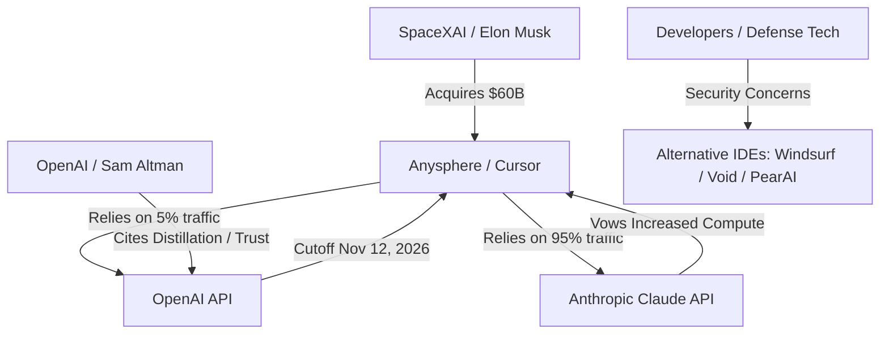

# **The $60B Code War: Inside SpaceX’s Anysphere Acquisition and OpenAI's Nuclear API Cutoff**

##

On August 14, 2026, SpaceX officially completed its acquisition of Anysphere, the developer of the AI-powered code editor Cursor, in a historic $60 billion all-stock transaction. The acquisition, which folds Cursor into the newly integrated "SpaceXAI" division alongside xAI, represents the largest venture-backed startup exit in history. However, the consolidation has triggered a massive corporate and technical war. Yesterday, OpenAI announced it will wind down Cursor's API access by November 12, 2026, citing trust violations and a history of model distillation by Elon Musk-affiliated entities.

This deep dive analyzes the technical and contractual conflicts of this shutdown, exploring Cursor's routing architecture, the viability of Anthropic's Claude series as a replacement, and the strategic positioning of SpaceXAI's developer pipeline.

### Inside the Cursor Router: The Opaque 5%
To understand the performance implications of OpenAI's cutoff, one must look at Cursor's technical architecture. Cursor does not connect directly to LLMs. Instead, it relies on the **Cursor Router**, an intelligent classifier layer trained on over 600,000 production developer interactions. In "Auto" mode, the router dynamically assesses request complexity, context depth (combining vector embeddings and graph-based codebase indexing), and domain requirements to route the query to the most cost-effective model.

Cursor CEO Michael Truell confirmed that OpenAI models account for roughly **5% of Cursor's total user traffic**, with the remaining 95% dominated by Anthropic's Claude 3.5 Sonnet and the newly launched Claude Sonnet 5. 

However, the loss of OpenAI models represents a critical hit to Cursor's latent capability. The 5% of traffic routed to OpenAI contains premium, high-reasoning tasks. Cursor relies on OpenAI's GPT-5.5 Pro and GPT-5.6 Sol as:
1. **The Composer Orchestrator**: GPT-5.6 Sol's logical consistency is heavily utilized in multi-file refactoring (Composer mode) where complex, multi-layered code edits require high execution precision.
2. **Robust Fallback Infrastructure**: OpenAI serves as the primary failover when Anthropic's API experiences rate limits or downtime.
3. **Enterprise Routing Control**: Many teams restrict model access to specific providers due to corporate compliance; losing OpenAI removes the preferred choice for enterprise developers who reject Anthropic or Google models.

While users can bypass the cutoff by inputting their own personal OpenAI API keys, this disables Cursor's proprietary routing optimization, forcing developers to pay raw token rates and lose the benefit of the automated classifier.

---

### The Legal Feud: Distillation and the Change of Control Clause
OpenAI's legal justification for ending Cursor's API access is rooted in the bitter rivalry between Elon Musk and Sam Altman. OpenAI invoked a "change-of-control" clause in its developer agreement, arguing that SpaceX's acquisition of Anysphere violates the trust required for enterprise API licensing.

The core of the dispute is **model distillation**—the technique of using a frontier "teacher" model's outputs to train a smaller "student" model. During the *Musk v. Altman* legal proceedings, Musk admitted under oath that xAI (now part of SpaceXAI) had "partly" distilled OpenAI's models to train its Grok family, stating that "generally, AI companies distill other AI companies."

OpenAI's legal counsel argued that providing model access to a SpaceX-owned subsidiary poses an unacceptable risk of intellectual property theft, claiming SpaceXAI would use Cursor's telemetry and OpenAI's API responses to distill GPT-5.6 Sol/Terra into its proprietary Grok-Coder models.

Musk lashed out on X.com:
> "Altman and his board are completely untrustworthy. They abandoned their non-profit mission for commercial greed, and now they are trying to sabotage Cursor because they are terrified of Grok running on the Colossus supercomputer cluster. We couldn't care less about their API. Grok will become the premier coding model."

---

### The Anthropic Alternative: Claude Sonnet 5 vs. OpenAI Astra
As OpenAI withdraws, Anthropic has moved to capture the market, promising to increase compute allocations for Claude models on the Cursor platform. This sets up a technical comparison between Anthropic's frontier models and OpenAI's upcoming agentic suite:

- **Claude Sonnet 5** (released June 30, 2026, training cutoff January 2026) features "adaptive thinking" enabled by default. It excels at real-time, context-aware autocomplete, displaying superior latency and intuitive UI generation.
- **Claude Fable 5** (released June 9, 2026) is Anthropic's reasoning heavyweight. However, it incorporates strict safety classifiers that frequently trigger fallbacks to Claude Opus 4.8 when writing low-level network code or security scripts.
- **OpenAI Astra** (upcoming) is a long-horizon agentic model designed to act as a "root agent" that delegates sub-tasks to 16+ sub-agents. In evaluations, Astra successfully solved 10 unsolved mathematical and theoretical computer science problems, generating machine-checkable Lean proofs. 

Without access to Astra or GPT-5.6 Sol, Cursor developers lose access to OpenAI's advanced multi-agent debugging capabilities.

---

### SpaceXAI's Vertically Integrated Toolchain
SpaceX's $60 billion purchase of Anysphere is a key piece of Musk's strategy to build a vertically integrated AI and engineering stack. SpaceX requires ultra-reliable code generation to support:
- **Starship Flight Software**: Complex control loops and real-time telemetry systems.
- **Optimus Humanoid Robotics**: Deep learning vision models and physical control loops written in C++ and Python.
- **Tesla Autopilot/FSD**: Neural network integration and simulation code.

By combining Cursor's interface with xAI's "Colossus" supercomputer cluster in Memphis—which houses a massive array of H100, H200, and B200 GPUs—SpaceXAI plans to train custom Grok-Coder models using Cursor's telemetry, eliminating any dependence on third-party APIs.

Andrej Karpathy, CEO of Eureka Labs, commented on the strategic consolidation:
> "Cursor was the playground for vibe coding. But as we transition to agentic engineering, the toolchain is becoming a geopolitical weapon. If you don't control the base models and the IDE, you don't control your engineering velocity."

---

### Market Impact: Telemetry Anxiety and the Rise of Alternatives
The acquisition of a critical software development tool by a major defense contractor has created significant anxiety. Defense tech companies like Palantir and Anduril, alongside enterprise SaaS providers, are concerned that their proprietary codebases and developer queries will be ingested by SpaceXAI to train Grok or monitor developer pipelines.

This security anxiety is driving developers to explore independent and open-source alternatives:
1. **Windsurf (Codeium)**: Rapidly gaining market share due to its "Cascade" system—an agentic interface that autonomously reads directory context, writes code, and executes terminal commands.
2. **Void**: An open-source, self-hosted fork of VS Code that allows developers to bring their own local models (like DeepSeek-Coder-V2) or direct API keys, ensuring complete data privacy.
3. **PearAI**: An emerging open-source alternative focusing on integrated AI-first developer workflows.

While Cursor remains the current gold standard, SpaceX's acquisition and the resulting OpenAI shutout have fractured the developer landscape, forcing engineers to choose between the backing of a tech conglomerate or the privacy of independent toolchains.

***

# 4. Highlight

## 4.1 Key Questions
1. How does the loss of OpenAI's models affect Cursor's multi-file editing precision?
2. Can Anthropic's Claude Sonnet 5 completely replace GPT-5.6 Sol's logical reasoning in complex, context-aware code generation?
3. Will enterprise and defense developers migrate to independent alternatives like Windsurf due to data telemetry concerns under SpaceXAI ownership?

## 4.2 Highlight Text
SpaceX's $60B acquisition of Anysphere has turned the AI coding landscape into a corporate battleground. OpenAI's decision to cut off Cursor's API access by November 12, 2026, citing "model distillation" trust violations, threatens the IDE's multi-file refactoring capabilities and fallback systems. While OpenAI models represent only 5% of Cursor's traffic, they orchestrate complex logic in Composer. As Anthropic increases compute support with Claude Sonnet 5, developers face a critical choice: remain with a SpaceX-integrated editor or migrate to independent agentic IDEs like Windsurf to secure their proprietary developer pipelines.

## 4.3 Hashtags
#AIcoding #CursorAI #SpaceX #OpenAI #ClaudeSonnet5 #SoftwareEngineering #VibeCoding
