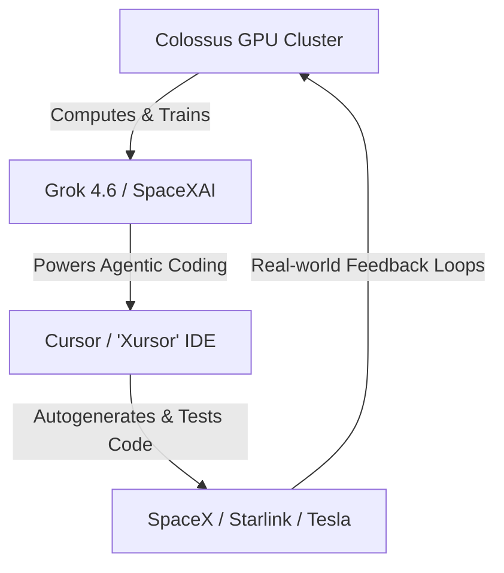

# **The $60 Billion Vibe Check: Inside SpaceX’s Mega-Acquisition of Cursor and the Battle for the Developer Moat**

###

On August 14, 2026, the technology sector witnessed the largest acquisition of a venture-backed startup in history. SpaceX officially completed its acquisition of Anysphere, the startup behind the AI-first code editor Cursor, in an all-stock transaction valued at an astronomical $60 billion. 

To put this in perspective: Elon Musk purchased Twitter (now X) for $44 billion in 2022. For SpaceX—which went public just two months ago on June 12, 2026, under the Nasdaq ticker **SPCX**—to spend $60 billion on a code editor reveals a massive shift in strategic priorities. This is not just about helping developers write boilerplate code faster; it is a calculated bid to control the front-end interface of software engineering itself.

#### The Financial Mechanics: Dilution, RSUs, and "Revesting"
The acquisition was structured entirely as an all-stock transaction, tying the fortunes of Anysphere’s team directly to the public performance of SPCX. According to filings, the financial mechanics broke down as follows:
*   **Common & Preferred Stock:** Anysphere’s outstanding shares were converted into the right to receive an aggregate of **389,289,254 shares** of SpaceX Class A common stock. The conversion ratio was determined using a 7-day volume-weighted average price (VWAP) ending immediately prior to the August 14 closing.
*   **Vested RSUs:** Vested Cursor RSUs were converted into the right to receive **1,752,426 shares** of SpaceX Class A stock.
*   **Unvested Equity & Options:** SpaceX assumed unvested employee equity under a continuing vesting schedule, converting them into **29,128,326 SpaceX RSUs** and **44,365,047 stock options** to purchase SpaceX Class A common stock.
*   **Retention "Revesting":** To prevent talent flight, key founders and engineers signed restrictive "Revest Agreements," re-tying a portion of their converted equity to multi-year service milestones at SpaceX.

Following the merger, Anysphere operates as a wholly owned subsidiary of SpaceX, integrated into the newly formed **SpaceXAI** division (which was created on July 6, 2026, after SpaceX absorbed and rebranded Musk’s xAI).

#### Solving the Compute and Scaling Wall via Colossus
Before the acquisition, Cursor was hitting a massive technical hurdle. As its agentic workflows—such as Cursor Composer—expanded to handle multi-file edits, the developer tool’s backend was throttled by the cost and rate-limits of third-party APIs (principally Anthropic's Claude 3.5 Sonnet and OpenAI's GPT-4o). 

In an official post on X shortly after the closing, the Cursor team acknowledged that the deal grants them "an order of magnitude more compute." By merging into SpaceXAI, Cursor bypassed retail API markups and gained bare-metal access to **Colossus**, the massive supercomputing cluster located in Memphis, Tennessee. Running hundreds of thousands of Nvidia GPUs, Colossus is the training bed for Grok 4.5 and Grok 4.6. By running fine-tuned, localized Grok models directly on Colossus, SpaceXAI can slash latency for agentic cycles and handle context windows that were previously cost-prohibitive.

#### The User-in-the-Loop Moat and "Agentic Engineering"
The core strategic motivation for this acquisition is the developer workflow dataset. To build models that can write complex, multi-file production systems, AI companies cannot rely purely on static code repositories like GitHub. They need behavioral data: how a developer prompts, how they reject or accept diffs, how they fix lint errors, and how they navigate codebase architecture. 

In early 2025, Andrej Karpathy coined the term "vibe coding" to describe programming by simply instructing an IDE like Cursor:
> *"There's a new kind of coding I call 'vibe coding', where you fully give in to the vibes, embrace exponentials, and forget that the code even exists... I 'Accept All' always, I don't read the diffs anymore."*

However, as the technology evolved into 2026, Karpathy and other researchers noted a transition from "vibe coding" to a more disciplined **"agentic engineering"**. By owning Cursor, SpaceXAI gains a proprietary telemetry loop of millions of developers engaging in agentic engineering. This active feedback loop acts as the ultimate reinforcement learning (RLHF) dataset to train advanced coding models.

#### Developer Backlash: The "Xursor" Fear and Claude Code Migration
While the financial markets reacted with curiosity, the developer community on Hacker News, X, and r/cursor erupted in debate. Many questioned the sanity of a $60 billion valuation for a wrapper IDE. 

More pressing, however, are concerns about platform lock-in and rebranding. Rumors of a rebranding to **"Xursor"** or **"CurXor"** have sparked jokes and anxiety. Developers are voicing data privacy concerns, fearing their proprietary codebases will be ingested to train Grok or monitor enterprise workflows. 

This friction has catalyzed a migration to alternative tools. In particular, Anthropic's **Claude Code**—a terminal-based CLI coding assistant released in early 2026—has emerged as a major refuge. Unlike Cursor, which integrates directly into a custom VS Code fork, Claude Code operates from the CLI, offering a lightweight, agentic flow that avoids IDE lock-in. On Hacker News, one developer remarked: 
> *"I canceled my Cursor subscription the day the SpaceX deal closed. I don't want my code going into Elon's training loop. Claude Code in the terminal is cleaner anyway."*

#### SpaceX’s Vertical Integration Strategy: From Ideation to Orbit
The acquisition of a developer interface fits perfectly into Musk’s playbook of extreme vertical integration. 

For SpaceX, Starlink, and Tesla, the bottleneck to scaling physical engineering is software. Starship relies on millions of lines of safety-critical C++ flight code; Starlink requires complex mesh routing algorithms for its massive satellite constellation; and Tesla’s FSD (Full Self-Driving) and Optimus robot divisions rely on continuous simulation and training pipeline code. 

By vertically integrating the chip (Colossus), the model (Grok), the developer interface (Cursor), and the execution systems (Starship/Optimus/FSD), SpaceXAI is building a closed-loop system where AI agents can write, compile, test, and deploy software directly to autonomous hardware. 

#### Geopolitical Implications
This deal goes beyond SV corporate chess; it has national security implications. With Microsoft owning GitHub Copilot, Google backing Project IDX, and OpenAI pushing its own agentic initiatives, SpaceXAI is locking down a proprietary developer data moat. By housing these AI coding pipelines inside a major defense contractor (SpaceX), the US domestic supply chain for autonomous systems software remains insulated from foreign telemetry, establishing a formidable national champion in the global AI race.

---

## 4. Highlight

### 4.1 Key Questions
1. How will SpaceX leverage the Colossus supercomputer to solve Cursor's compute scaling bottlenecks?
2. What are the vertical integration benefits of Cursor for SpaceX, Starlink, and Tesla?
3. How will the developer backlash and migration to Claude Code affect Cursor’s user base post-acquisition?

### 4.2 Highlight Text
SpaceX’s $60B all-stock acquisition of Anysphere (Cursor) marks a historic consolidation in the developer tooling landscape. By integrating the AI-first IDE into the newly formed SpaceXAI division alongside the Grok team, SpaceX is building a vertically integrated innovation loop. The deal solves Cursor’s compute constraints via the massive Colossus GPU cluster while providing SpaceX with a proprietary developer feedback loop to train next-gen coding agents. However, concerns about data privacy, rebranding ("Xursor"), and platform lock-in are driving developers toward alternatives like Anthropic's Claude Code, highlighting a growing rift in the software community.

### 4.3 Hashtags
#SpaceXAI #CursorAI #VibeCoding #DeveloperTools #TechMergers
