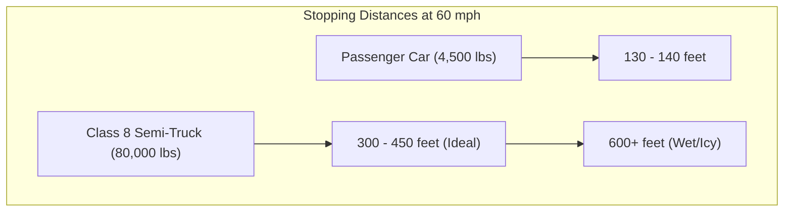
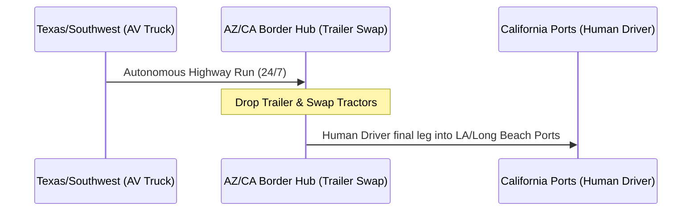

# The 80,000-Pound Edge Case: Inside the DMV's Autonomous Trucking Shift and the Teamsters' Alameda Showdown

##

On April 28, 2026, the California Department of Motor Vehicles (DMV) officially adopted a regulatory shift that dismantled a decade-long prohibition: it lifted the state’s ban on testing autonomous vehicles with a Gross Vehicle Weight Rating (GVWR) of 10,001 pounds or more. By August 2026, the theoretical regulatory framework had hit the pavement. The DMV issued its first-ever heavy-duty autonomous truck testing permits to **Aurora Innovation** and **Kodiak AI**. 

Kodiak immediately deployed a handful of test trucks running routes near its Mountain View headquarters, restricted by phase-one rules that mandate a human safety driver, ban operations on streets with speed limits of 25 mph or lower (unless on a direct depot-to-highway route), and require compliance with California Highway Patrol (CHP) weigh station stops.

Yet, as these 80,000-pound rigs begin merging onto Silicon Valley's highway network, they are driving straight into a legal and political wall. On August 5, 2026, Teamsters California filed a lawsuit in the Alameda County Superior Court. The union's goal: a total repeal of the DMV's new rules. 

This deep dive dissects the technical hurdles, safety cases, and macroeconomic implications of this landmark showdown.

---

### Part 1: The Physics of High-Speed Automation

To understand the core technical debate, one must start with basic Newtonian physics. A standard passenger robotaxi (like a Cruise or Waymo Jaguar I-Pace) weighs roughly 4,500 pounds. At 65 mph, its kinetic energy ($E_k = \frac{1}{2} mv^2$) is approximately 5.6 × 10⁵ Joules. A fully loaded Class 8 commercial semi-truck weighs up to 80,000 pounds. At 65 mph, its kinetic energy exceeds 1.12 × 10⁷ Joules—nearly **20 times** the kinetic energy of a passenger vehicle.

This mass differential radically alters the dynamics of stopping distance:
*   **Passenger Car:** ~130–140 feet to stop from 60 mph on dry asphalt.
*   **Class 8 Semi-Truck:** ~300–450 feet under ideal conditions. In wet, icy, or high-wind scenarios, this stopping distance can easily double.

Because a Class 8 truck requires nearly one-and-a-half football fields to come to a stop, the system's perception horizon must extend far beyond the 100–150 meters typical of urban robotaxis. It must reliably detect, classify, and predict the path of debris, stalled cars, and construction zones at a distance of **300 to 450 meters**.

#### Aurora’s Answer: Frequency-Modulated Continuous Wave (FMCW) LiDAR
To crack the 300-meter perception barrier, Aurora Innovation relies on its proprietary **FirstLight LiDAR**, an FMCW (Frequency-Modulated Continuous Wave) system operating at the 1550nm wavelength. Unlike traditional Time-of-Flight (ToF) LiDAR, which measures the round-trip time of discrete light pulses, FMCW emits a continuous, frequency-modulated beam. By measuring the frequency shift of the returning light (the Doppler effect), Aurora’s system instantly calculates both the **distance** and the **instantaneous velocity** of an object in a single data point. 

On X.com, engineers frequently point out that FMCW is immune to solar interference and sensor-to-sensor crosstalk, two major vulnerabilities of ToF systems in bright highway environments. This instant velocity vectoring eliminates the latency of calculating speed over multiple frames, saving crucial milliseconds when a vehicle suddenly cuts in front of the truck.

#### Kodiak’s Answer: Modular Redundancy and the Actuation Control System
Kodiak AI approaches the problem with a focus on hardware modularity and system-level redundancy. Instead of custom-built truck designs, Kodiak integrates its sensor suite into **SensorPods**—modular units mounted directly onto the truck's side mirrors. These pods house LiDAR, radar, and cameras, and can be swapped out in less than 10 minutes in the field, bypassing the need for specialized calibration.

To address safety, Kodiak developed the **Kodiak Actuation Control System (ACS)**. The ACS is a custom, safety-critical computer that acts as a redundant fallback. If the primary compute engine experiences a software freeze or hardware failure, the ACS takes over, commanding the steering, braking, and throttle to bring the truck to a safe, controlled stop on the highway shoulder.

---

### Part 2: The Labor Showdown: Jobs vs. Capital Efficiency

The Teamsters' lawsuit in Alameda County is not merely a safety complaint; it is a structural challenge to the DMV's regulatory process. 

#### The Economic "Shortcut"
Under California’s Administrative Procedure Act (APA), any "Major Regulation"—defined as having an economic impact of $50 million or more—must undergo a rigorous Standardized Regulatory Impact Assessment (SRIA). The Teamsters argue that the DMV bypassed this requirement by utilizing a "shortcut" process meant for minor regulatory updates. The union claims that authorizing driverless heavy trucks threatens the livelihoods of California's 200,000+ commercial truck drivers, representing an economic shift that dwarfs the $50 million threshold.

Teamsters General President Sean M. O'Brien has been uncompromising on this issue: 
> "Allowing the unfettered and unregulated operation of autonomous vehicles – ultimately seeking to replace human drivers with robots – is unequivocally a threat to safety on our roadways and the existence of good jobs in the trucking industry."

#### The Industry Counter-Argument
From the logistics perspective, the economic metrics presented by Aurora and Kodiak are compelling:
*   **Fuel Efficiency and Carbon Reduction:** Both companies report substantial environmental gains. Aurora’s data suggests that autonomous driving algorithms can increase fuel efficiency by up to **32%** by optimizing throttle control and maintaining a steady, efficient speed (such as 65 mph). Kodiak reports fuel and emission reductions of up to **25%**.
*   **Asset Utilization:** A human truck driver is restricted by federal Hours of Service (HOS) regulations to 11 hours of driving per day. An autonomous truck can theoretically run **24/7**, stopping only for fuel, maintenance, and inspections. This triples asset utilization and slashes transit times (e.g., Dallas to Los Angeles in under 24 hours instead of 2.5 days).

---

### Part 3: The Highway Level 4 Readiness Debate

The battle on X.com and Reddit (particularly on subreddits like `r/SelfDrivingCars` and `r/AuroraInnovation`) mirrors the broader anxiety surrounding autonomous vehicles, heavily influenced by recent controversies in the urban passenger robotaxi sector.

Tech commentators often point to Cruise's disastrous October 2023 pedestrian dragging incident in San Francisco, which resulted in the DMV suspending its driverless permits, a federal criminal investigation carrying a $500,000 fine, a $1.5 million civil penalty to the NHTSA, and the departure of co-founder Kyle Vogt. Critics also bring up the January 2026 NTSB and NHTSA investigations into Waymo regarding school bus passing violations and school zone collisions.

The core argument from skeptics on Reddit is simple: *If a 4,500-pound sedan cannot navigate urban streets without dragging pedestrians or blocking emergency vehicles, how can we trust an 80,000-pound semi-truck to handle high-speed highway environments?*

As Teamsters President Sean O'Brien noted:
> "If one of the biggest driverless car companies in the world can't safely deploy small passenger cars, it goes without saying that a self-driving semi-truck should not be on our roadways without a trained human operator behind the wheel."

On X.com, the tech elite are divided. Prominent founders and VCs argue that highway driving is actually a simpler problem than urban navigation because it lacks pedestrians, cyclists, and complex intersections. However, as Box CEO Aaron Levie noted in a June 2026 tweet highlighting the challenges of validating complex agentic systems:
> "Almost all AI model and agent progress is downstream from evals."

Evaluating a highway-bound Level 4 truck is incredibly difficult because of the rarity and high-velocity nature of highway edge cases (e.g., tire blowouts, crosswinds, blown cargo). Unlike an urban robotaxi that can "fail-safe" by pulling over or coming to a stop in the middle of a city street, a heavy truck stopping in the middle of an active interstate lane creates an immediate, catastrophic pileup hazard.

Elon Musk, a strong proponent of autonomous transit, defended the safety of AI-driven vehicles in an April 2026 post, tweeting:
> "Tesla self-driving saves a lot of lives – the statistics are unequivocal."

But the Teamsters and independent safety researchers point out that aggregate safety statistics often hide the unpredictable nature of edge cases, and that comparing safety records of new autonomous test fleets to the average human driver fleet is an "apples-to-oranges" comparison.

---

### Part 4: Macroeconomic and Regulatory Implications

If the Teamsters' lawsuit succeeds in repealing the DMV's regulations, it could accelerate a trend that is already reshaping the US logistics network: regulatory fragmentation.

While California faces intense legal friction, states like Texas, Arizona, and Florida have embraced autonomous trucking, passing legislation that allows driver-out testing and commercial deployment. Aurora, for instance, has focused its initial commercial lane testing in Texas (specifically Dallas to Houston). 

If California remains closed to driverless trucks due to legal challenges, we will likely see a fragmented national logistics market. Shippers could adopt a "hub-to-hub" model where autonomous trucks transport freight across the Southwest, but must drop their trailers at the California border (e.g., in Ehrenberg, Arizona or Las Vegas, Nevada). At these border hubs, human drivers would take over for the final leg into California's massive ports of Los Angeles, Long Beach, and Oakland. 

While this model preserves union jobs within California, it introduces significant friction, requiring additional staging yards, tractor swaps, and administrative overhead, potentially driving up shipping costs and routing volume away from California ports to more AV-friendly Gulf Coast ports.

Kodiak Founder and CEO **Don Burnette** provided a strong endorsement of California's move when they received their permit:
> "California's comprehensive autonomous vehicle regulations are a major unlock for freight innovation. This permit allows us to begin the first phase of scaling autonomous trucking coast-to-coast, while ensuring appropriate safety oversight from California regulators. We thank Governor Newsom for his leadership in allowing California born-and-bred Physical AI innovators like Kodiak to bring our technology to highways in our home state..."

The DMV's permit issuance to Aurora and Kodiak is a major milestone, but the road ahead is anything but clear. The clash in California is no longer just a technical engineering challenge; it is a high-stakes legal and economic battle over the future of labor and automation.

---

# 4. Highlight

## 4.1 Key Questions
1. How does the kinetic energy of an 80,000-pound commercial truck at highway speeds impact the technical requirements for sensor range and latency compared to a standard passenger robotaxi?
2. What are the legal grounds on which the Teamsters are challenging the California DMV’s regulatory process in court?
3. How will supply chain logistics adapt if California's legal barriers create a fragmented regulatory framework across the US?

## 4.2 Highlight Text
As California lifts its ban on heavy autonomous trucks, the logistics industry faces an 80,000-pound showdown. The DMV’s first-ever permits to Kodiak AI and Aurora Innovation have triggered a high-stakes Alameda Superior Court lawsuit by the Teamsters, who cite public safety and driver displacement. While tech leaders debate the highway readiness of Level 4 Physical AI systems in the wake of passenger robotaxi controversies, shippers confront a fragmented supply chain. Can FMCW LiDAR and redundant actuation systems outrun legal friction, or will the future of freight halt at the California border? 

## 4.3 Hashtags
#AutonomousTrucks #PhysicalAI #LogisticsTech #SupplyChain
