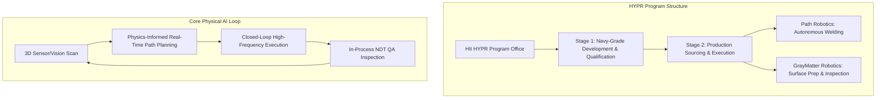

# **The $900M Physical AI Gambit: Inside HII’s Plan to Deploy Cognitive Robots on the Navy’s Shipyard Floor**

##

Silicon Valley has spent the last three years obsessing over LLMs, GPU clusters, and cloud-based reasoning. But while venture capitalists poured billions into digital chatbots, a quiet national security crisis was unfolding in the dry docks of Virginia and Mississippi. U.S. Navy shipbuilding is in a historic bottleneck. To maintain global deterrence, the Navy requires the delivery of one aircraft carrier, two *Virginia*-class submarines, and one *Columbia*-class ballistic missile submarine annually. Currently, due to a severe industrial labor shortage, the defense industrial base is falling behind.

To break this logjam, Huntington Ingalls Industries (HII), the nation’s largest military shipbuilder, has announced a massive performance-based production agreement worth up to $900 million over seven years. Under its newly established High-Yield Production Robotics (HYPR) program, HII has partnered with two of the country's leading physical AI startups: **Path Robotics** and **GrayMatter Robotics**. 

This is not a traditional defense procurement contract. It is a milestone-contingent production agreement divided into two stages: a Navy-grade development stage to validate and qualify the technologies, followed by a delivery stage where these automated systems will execute production-grade fabrication. Path Robotics will deploy autonomous welding technologies, while GrayMatter Robotics will automate surface preparation, coating, and in-process quality inspection.

### The High-Mix, Low-Volume Dilemma: Why Automotive Robots Fail in Shipyards
If you walk into a modern automotive factory, you see hundreds of robotic arms performing spot welds with perfect repeatability. Why couldn't HII simply deploy off-the-shelf industrial robots from legacy manufacturers? 

The answer lies in the engineering physics of shipbuilding: **High-Mix, Low-Volume (HMLV) manufacturing.**

In automotive assembly, parts are stamped to sub-millimeter tolerances and held in rigid, expensive fixtures. The robot executes a pre-programmed path defined by a static CAD file. In shipbuilding, parts are massive, multi-ton steel plates. Due to thermal expansion, manual cuts, and transportation tolerances, the actual joint fit-up in a shipyard never matches the theoretical CAD model.

"We have taken these traditional automation technologies as far as they can go in the complex production of Navy ships," explains Eric Chewning, HII’s Executive Vice President of Maritime Systems and Corporate Strategy. "Shipyard automation remains limited to repeatable activities. Shipbuilding demands a cognitive machine."

When welding a thick steel plate, the heat generated deforms the steel in real-time. If a robot follows a rigid CAD path, it will weld off-seam, causing catastrophic structural defects that fail Navy certification. This is why shipyards have historically relied on a dwindling pool of elite manual welders. 

### Path Robotics: Cognitive Welding and the Obsidian™ Engine
To automate these unpredictable welds, Path Robotics bypasses manual programming entirely. Their core technology, **Obsidian™**, is a physics-informed reinforcement learning model trained in a virtual "Weld World Model" on tens of millions of inches of real welding data.

Instead of being pre-programmed, a Path Robotics welding cell executes a "See, Understand, Weld" loop:
1. **Perception:** The cell uses high-density 3D blue-light scanners to build an accurate spatial map of the joint.
2. **Autonomous Path Generation:** Obsidian identifies the weld seam and autonomously determines torch angles, travel speed, voltage, and wire feed speed.
3. **Multi-Pass Adaptive Fill:** Thick naval bulkheads require dozens of weld passes to fill a joint. Obsidian calculates the placement of each bead on the fly, adapting to varying joint gaps.
4. **Thermal Compensation:** The system continuously monitors the weld pool, adjusting parameters dynamically to compensate for heat distortion.

For welding inside the confined double hulls of aircraft carriers and submarines, fixed cells are useless. Path is deploying **Rove™**, a mobile robot integrating the Obsidian model onto a crawling platform that navigates metal hulls to weld autonomously in unstructured environments.

As Andrew Lonsberry, CEO of Path Robotics, explains: *"If you want to solve manufacturing, you have to solve it for parts that aren't perfect. Real-world metal has warps, gaps, and offsets. Physical AI is the only way to build a machine that has the judgment of a master craftsman."*

### GrayMatter Robotics: 125 Hz Haptic Control and Scan&Inspect™
If welding is the skeleton of shipbuilding, surface finishing is the skin. Before naval steel can be coated to resist seawater corrosion, it must be ground, sanded, and blasted. This is a grueling, hazardous job where workers inhale toxic dust and face high vibration risks. 

GrayMatter Robotics is automating this with their **GMR-AI™ Platform**. Like Path, GrayMatter does not rely on CAD programming. Their **Scan&Sand™** system scans a curved ship structure, plans a grinding path in minutes, and begins work.

The core technical challenge here is force feedback. If a robot grinds too hard, it thins the naval steel below tolerance; too light, and the coating won’t adhere. GrayMatter's GMR-AI operates a closed-loop haptic control system with a sub-8ms latency (125 Hz feedback loop). Using force and acoustic sensors, the robot adjusts its tool pressure and angle dynamically to match the warped surface contours of the steel.

Furthermore, they are integrating **Scan&Inspect™**, which runs real-time computer vision during the sanding process. The AI identifies surface defects (pitting, micro-cracks, weld spatter) in real-time, allowing the robot to rectify flaws in-process rather than waiting for post-process NDT (Non-Destructive Testing) inspectors.

### The VC Debate: Rebuilding the Arsenal of Democracy
The HII deal has sent shockwaves through the venture capital ecosystem, validating the "American Dynamism" thesis pioneered by firms like Andreessen Horowitz and Lux Capital. 

"We are moving from an era of pure software AI to a world where embodied physical AI will rebuild our industrial base," Marc Andreessen recently noted. Katherine Boyle, a General Partner at a16z, has long argued that Silicon Valley must focus on "rebuilding the physical world," warning that our defense industrial base has withered due to decades of outsourcing and software-only investments.

Joe Lonsdale, co-founder of Palantir and partner at 8VC, pointed out the geopolitical reality on X: *"Our shipbuilding capacity is a fraction of China's. We cannot build ships faster by throwing more bodies at the problem—the bodies do not exist. We have to automate, and the HII-Path-GrayMatter deal is the first major proof point that physical AI is ready for prime time."*

However, the hardware transition is fraught with risk. Lux Capital’s Josh Wolfe has highlighted the "deployment gap" between impressive lab demos and shipyard reality: *"Getting a robot to sand a pristine car hood in a lab is easy. Getting a robot to sand a rusty, vibrating hull in a humid Pascagoula shipyard with salt spray and manual welding dust is a brutal engineering challenge. The founders who succeed will be the ones who get their boots dirty on the shipyard floor."*

***

# 4. Highlight

## 4.1 Key Questions
1. Why does traditional industrial automation fail in shipyard environments, and how does Physical AI overcome these barriers?
2. What are the key performance metrics (such as the 125 Hz haptic loop and multi-pass adaptive fill) that make autonomous welding and surface finishing viable?
3. How is HII structuring its $900M HYPR program to mitigate technology integration risks while addressing the critical labor shortage in naval manufacturing?

## 4.2 Highlight Text
Huntington Ingalls Industries (HII) has launched a landmark $900M, 7-year performance-based production agreement with Path Robotics and GrayMatter Robotics under its High-Yield Production Robotics (HYPR) program. By deploying "Physical AI" to automate welding and surface finishing, HII is directly addressing the existential labor shortage delaying U.S. Navy submarine and aircraft carrier programs. Moving beyond rigid, pre-programmed CAD paths, these cognitive systems use real-time 3D scanning, physics-informed reinforcement learning (Path's Obsidian™), and sub-8ms force feedback (GrayMatter's GMR-AI™) to adapt to the unpredictable, high-mix environments of shipyards.

## 4.3 Hashtags
#PhysicalAI #DefenseTech #Robotics #Shipbuilding #AdvancedManufacturing #DeepTech
