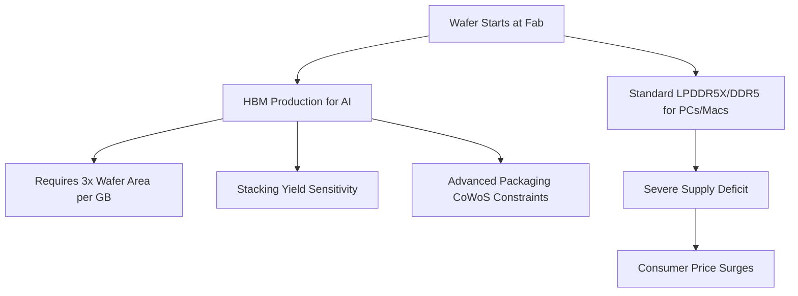

# **The AI Tax: How the Data Center Memory Squeeze Forced Apple's Hand (and Why the iPhone is Next)**

##

On June 25, 2026, Apple did something it hasn't done in years: it announced sweeping, mid-cycle price increases across several core hardware lines. The MacBook Neo, MacBook Air, MacBook Pro, and iPad lineups saw retail prices jump by $100 to $300, with high-end configurations seeing even steeper adjustments. Tim Cook described the situation as a "hundred-year flood," emphasizing that even the world's most sophisticated supply chain manager cannot escape the current semiconductor realities: *"I've never seen anything like it in any area in over 40 years."*

The root cause of these price increases lies in the server racks of AI hyperscalers. The explosive build-out of generative AI data centers has created an insatiable demand for High-Bandwidth Memory (HBM3E/HBM4) and enterprise SSDs. Because memory suppliers like Samsung, SK Hynix, and Micron can charge massive premiums for these components, they are aggressively reallocating cleanroom space and wafer starts away from standard consumer-grade DRAM and NAND flash.

Under the hood, this pivot is constrained by the physical mathematics of HBM manufacturing. This bottleneck, often called the "Wafer Tax," has a direct cascading effect on consumer tech:
* **Wafer Footprint:** HBM DRAM dies require a significantly larger footprint than standard LPDDR5X to accommodate Through-Silicon Vias (TSVs) and complex control interfaces. Per gigabyte, HBM consumes roughly **three times** the physical wafer starts of standard DDR5.
* **Yield Cascades:** Stacking 8 to 12 dies vertically introduces severe yield sensitivity. Because a single sub-surface defect in one layer ruins the entire stacked module, net yields are dramatically lower than single-die consumer memory.
* **Packaging Bottlenecks:** Memory vendors are forced to allocate finite advanced packaging capacity (such as CoWoS) and engineering resources to AI products, leaving the consumer PC and mobile markets to fight for the remaining "scraps."



At the same time, the migration of high-layer 3D NAND to high-density enterprise SSDs (such as 30TB and 60TB drives for AI training clusters) has starved client-side SSD supply. Counterpoint Research Director Tarun Pathak notes that raw memory spot prices have surged more than **fourfold since Q4 2025**, forcing hardware manufacturers to absorb costs until hitting a breaking point.

This crisis has fundamentally inverted the power dynamics between Apple and its suppliers. For decades, Apple's massive buying power allowed it to squeeze suppliers during industry slumps. During the 2023 memory glut, Apple demanded rock-bottom pricing. In an interview with *The Wall Street Journal*, Micron Chief Business Officer Sumit Sadana implicitly criticized this procurement model. Sadana noted that during the downturn, "very aggressive" customers pushed for pricing that was "not constructive," driving negative margins and discouraging manufacturers from investing in capacity expansion. With AI hyperscalers now signing lucrative, multi-year supply contracts, memory makers no longer need to accept Apple's aggressive terms.

Apple's financial guidance reflects the pressure. In the March 2026 quarter, Apple reported a 49.3% gross margin. For the June quarter, however, it guided gross margins down to **47.5%–48.5%** due to escalating cost of goods sold (COGS). 

While the June 25 announcement spared the iPhone, Apple Watch, and AirPods, analysts warn this reprieve is temporary. Nabila Popal, Senior Research Director at IDC, explained:

> "The iPhone isn't spared; its hike is coming. By adjusting pricing for secondary lines like the Mac and iPad in June, Apple is cushioning consumers from the shock, ensuring its flagship fall iPhone launch event isn't completely overshadowed by price increases."

IDC expects the upcoming fall iPhone lineup to face Average Selling Price (ASP) increases of **11%**, translating to a **$100 to $200** retail price bump.

```
"Relying on a 1260H-listed entity like CXMT to bail out consumer hardware margins is a grave mistake. It deepens our technological dependency on China at the worst possible moment."
— Representative John Moolenaar (R-MI)
```

Desperate for alternative supply channels, Apple has lobbied the U.S. Commerce Department to prevent Chinese DRAM maker ChangXin Memory Technologies (CXMT) from being placed on the Entity List. CXMT is currently on the DoD's 1260H list of "Chinese military companies." Sourcing from CXMT would provide a lower-cost supply valve, but Representative John Moolenaar, Chairman of the House Select Committee on China, has publicly warned that bypassing restrictions would be a "grave mistake."

Apple is not alone. The memory shortage has shattered the traditional model of console depreciation:
* **Microsoft:** Raising Xbox Series X/S prices by **$100 (512GB)** and **$150 (1TB)** on August 1, 2026—its third price hike in 13 months—while sunsetting the 2TB model.
* **Sony:** Facing major PlayStation 5 price adjustments; reports indicate the PlayStation 6 bill of materials has escalated so rapidly that its launch could be delayed until **2028 or later**.
* **Nintendo:** Implementing Switch 2 price hikes starting September 2026.

As Prabhu Ram, VP at CyberMedia Research (CMR), notes: *"Consumer electronics are now collateral damage in the AI hardware arms race."* With new fab capacity from Micron, TSMC, and Intel not expected to go online until 2028, consumers will continue to pay the "AI tax" on everyday tech.

---

# 4. Highlight

## 4.1 Key Questions
1. How does the "Wafer Tax" of High-Bandwidth Memory (HBM) physically limit the supply of consumer-grade LPDDR5X and SSD storage?
2. How has the AI datacenter boom shifted pricing leverage away from Apple and back to memory foundries like Micron and Samsung?
3. Will the rising costs of memory and storage components inevitably force Apple to raise retail prices on the upcoming fall iPhone lineup?

## 4.2 Highlight Text
The consumer electronics market is paying the "AI Tax." Apple’s June 25 price hikes on Macs and iPads ($100–$300 increases) reveal a brutal supply chain reality: fabs are shifting silicon wafer starts to high-margin High-Bandwidth Memory (HBM) and enterprise SSDs for AI data centers. Because HBM requires 3x the wafer footprint of DDR5, standard memory supply is drying up. With Micron CBO Sumit Sadana pointing to Apple's past aggressive pricing as a source of supplier underinvestment, the leverage has shifted. Analysts warn the iPhone is next, and competitors like Microsoft and Sony are already raising hardware prices.

## 4.3 Hashtags
#SiliconShortage #ApplePriceHike #HBM #GenerativeAI #SupplyChain #TechNews
