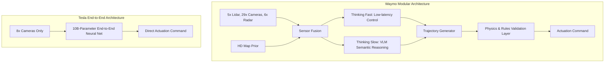

# **The Autonomy False Summit: Waymo’s Modular Redundancy Confronts Tesla’s End-to-End Black Box**

##

On August 26, 2026, Srikanth Thirumalai, Waymo’s Vice President of Onboard Software, published a technical manifesto: ["10 AI Lessons from Driving 200+ Million Fully Autonomous Miles."](https://waymo.com) The timing of this release was far from accidental. Arriving just days before Tesla’s scheduled "Cybercab" robotaxi launch on September 3, 2026, Thirumalai’s post drew a sharp line in the sand. It presented a comprehensive, technically rigorous critique of the vision-only, end-to-end neural network strategy that Tesla claims is the gateway to unsupervised driving. 

The core of the philosophical divide is captured in Waymo’s tenth lesson: **There is no substitute for actual fully autonomous miles.** Thirumalai argues that attempting to evolve a supervised Level 2 driver-assist system (like Tesla’s FSD) into a Level 4 fully autonomous system is a "false summit." In a supervised paradigm, the AI is shielded from the gravity of its decisions. The human supervisor continuously filters out edge cases, intervenes to correct near-misses, and handles out-of-distribution (OOD) scenarios. This constant human safety net contaminates the training distribution, preventing the neural network from experiencing and learning from the actual consequences of its actions. 

This stands in stark opposition to Elon Musk's vision. Tesla’s strategy relies on billions of customer-supervised miles to train a unified, end-to-end neural network that goes from pixels to torque. But as Tesla prepares to launch the Cybercab, recent real-world safety failures—most notably an August 2026 incident where a Tesla running FSD v14.3.7 failed to stop at an active, flashing railroad crossing, forcing the driver to slam on the brakes to avoid an oncoming train—have reignited regulatory investigations and exposed the vulnerabilities of the "black box" approach.

### The Architectural Divide: Modular "Thinking Fast & Slow" vs. End-to-End Policy Nets

The technical debate centers on how these two systems perceive, process, and act upon the world. 

#### Waymo’s Modular Redundancy
Waymo's 5th-generation Driver relies on a heavy sensor suite: 5 lidars (providing 360-degree high-density point clouds), 29 cameras (with overlapping fields of view), and 6 imaging radar sensors. This perception stack is integrated with an HD map "prior." Waymo does not use maps as a rigid track, but rather as a memory cache for road layout, speed limits, and crosswalks. This allows the onboard compute to focus its processing budget on dynamic agents rather than reconstructing static geometry in real-time.

Architecturally, Waymo splits its AI into a "Thinking Fast and Slow" framework:
*   **"Thinking Fast":** Low-latency, highly optimized neural networks that process sensor inputs to output immediate trajectories.
*   **"Thinking Slow":** Large Vision-Language Models (VLMs) that run in parallel to perform high-level semantic reasoning (e.g., interpreting hand gestures from a traffic cop or recognizing a complex construction zone layout).
*   **The Validation Layer:** Critically, Waymo rejects the "black box" philosophy. The trajectory proposed by the neural planner is passed through an independent, onboard validation layer. This layer acts as a physics-based hard backstop, checking the path against collision envelopes, friction limits, and traffic laws. If the AI proposes an unsafe lane change or fails to stop, the validation layer overrides the command.

#### Tesla’s End-to-End "Software 2.0"
Tesla's FSD v12 and the upcoming v15 discard modular pipelines entirely. Previously, Tesla used separate networks for perception (generating a 3D vector space and occupancy grids) and a C++ planner containing hundreds of thousands of lines of heuristic code. Under the new end-to-end paradigm, a single, deep neural network is fed raw camera pixels from 8 cameras and outputs steering, braking, and acceleration commands directly.

Elon Musk’s core thesis is that human drivers navigate using two eyes (passive optical sensors) and a neural network (the brain). Therefore, additional active sensors like lidar are redundant and introduce conflicting data. 

However, the lack of an independent safety-hardened validation layer is Tesla's Achilles' heel. When FSD v14.3.7 failed to stop at the active railroad crossing, it wasn't because a specific C++ rule failed; it was because the end-to-end network's policy did not output a braking command. The network encountered an out-of-distribution combination of direct glare, track geometry, and flashing lights that its training dataset did not resolve correctly. Without a modular, rule-based checker to state *"If red lights at railroad crossing are flashing, velocity must equal zero,"* the black box simply drove forward.

### The Compute and Memory Bottleneck: HW4 vs. The Cybercab

A significant technical hurdle for Tesla is hardware constraint. Standard customer vehicles equipped with Hardware 4 (HW4/AI4) feature limited onboard RAM, which is shared between the infotainment system and the FSD computer. Running Tesla’s new 10-billion-parameter neural network natively is highly resource-intensive. 

To make these models run on customer vehicles, Tesla must perform heavy weight distillation, deploying smaller, compressed versions of the model (frequently referred to as "FSD Lite"). This compression compromises the model's capacity to handle edge cases, explaining the discrepancy between internal testing performance and real-world consumer experiences. 

Rumors within the supply chain indicate that the Cybercab, scheduled to launch on September 3, 2026, bypasses this bottleneck by utilizing an upgraded compute board with double the memory capacity and potentially moving toward the new AI5 silicon. This allows the Cybercab to run the full, undistilled FSD v15 model natively. However, this creates a major commercial conflict: consumer Tesla owners who purchased FSD under the promise of full autonomy may find their HW4 hardware is mathematically incapable of running the software required for unsupervised driving.

### Industry Perspectives: The Experts Weigh In

The debate has polarized the Silicon Valley AI community. 

Andrej Karpathy, former Director of AI at Tesla and a pioneer of the "Software 2.0" transition, remains optimistic about end-to-end learning but acknowledges the validation challenge:
> *"The transition to end-to-end neural nets is a massive paradigm shift. It replaces code with optimization. But the evaluation of these networks becomes the absolute bottleneck—you need massive simulation loops and automated critics to find where the network behaves weirdly."*

Conversely, Yann LeCun, Chief AI Scientist at Meta, has been highly critical of Tesla's marketing claims and the limitations of pure autoregressive, end-to-end models for safety-critical tasks:
> *"Unsupervised driving requires world models that can predict the physics of the environment, but current end-to-end architectures lack the reasoning and planning layers to guarantee safety. You cannot just train a black box on human video and expect it to never hallucinate a clear path where a train is crossing."*

Kyle Vogt, former CEO of Cruise, has repeatedly defended sensor redundancy:
> *"Lidar is not a crutch; it is a physical ground truth. Relying on cameras alone means you are trying to reconstruct 3D space from 2D projections, which is mathematically ill-posed and prone to catastrophic failure in edge cases like fog, dust, or direct glare."*

Autonomous vehicle analyst Brad Templeton summarizes the scaling tradeoff:
> *"Waymo is climbing a very steep, expensive mountain but has reached the peak in specific cities through geofencing and redundant hardware. Tesla is climbing a gentler slope that allows them to scale globally instantly, but they are hitting a vertical wall of safety validation that they may not be able to climb without physical sensors or HD maps."*

### Market and Commercial Viability: The Scaling Playbook

The commercial strategies of both companies reflect their technical architectures. 

*   **Waymo’s Asset-Heavy Robotaxi Model:** Waymo's unit economics are high due to the cost of its sensor suite (estimated at tens of thousands of dollars per vehicle) and the operational cost of continuous HD mapping. However, Waymo is generating real revenue, operating tens of thousands of fully driverless rides weekly in San Francisco, Phoenix, Los Angeles, and Austin. Waymo's scaling is deliberate, safe, and capital-intensive.
*   **Tesla’s Asset-Light Consumer Fleet Model:** Tesla’s marginal cost to deploy FSD is zero because the hardware is pre-installed on every consumer vehicle. This allows Tesla to collect billions of miles of training data. However, the commercial viability of the Cybercab hinges on regulatory approval for unsupervised driving. If regulators refuse to approve vision-only, unmapped autonomy in the wake of incidents like the railroad crossing failure, Tesla's massive compute investment will remain tethered to a supervised Level 2 system.

***

# 4. Highlight

## 4.1 Key Questions
1. Can an end-to-end, black-box neural network ever achieve the safety guarantees required for unsupervised Level 4 autonomy without a deterministic validation layer?
2. Will consumer Hardware 4 (HW4) vehicles require model distillation that permanently limits their capability compared to Tesla’s upcoming Cybercab?
3. How will regulators handle the safety validation of vision-only autonomous systems in the wake of repeated failures at railroad crossings?

## 4.2 Highlight Text
The battle for full autonomy is reaching a fever pitch. Waymo VP Srikanth Thirumalai's latest post argues that Tesla's supervised Level 2 approach is a "false summit," claiming that shielding AI from real-world consequences limits its training distribution. Meanwhile, Tesla is betting its future on the end-to-end neural networks of FSD v15 and the Cybercab launch on Sept 3. But with FSD v14.3.7 recently failing to stop at active railroad crossings and consumer HW4 vehicles facing severe memory bottlenecks, the question remains: is vision-only end-to-end AI safe enough, or is sensor-redundant modularity the only path forward?

## 4.3 Hashtags
#AutonomousVehicles #Waymo #Tesla #FSD #Cybercab #MachineLearning
