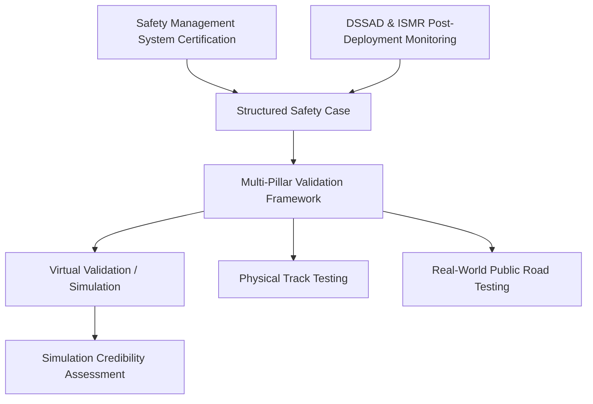

# The Codex of Driverless Scale: Inside the UNECE WP.29 Global ADS GTR and the End of the Manual Brake Pedal

##

On June 24-25, 2026, at the Palais des Nations in Geneva, the United Nations World Forum for Harmonization of Vehicle Regulations (WP.29) reached a historic milestone during its 199th session. The forum formally adopted the world's first **Global Technical Regulation on Automated Driving Systems (ADS GTR)**. Jointly co-led by the European Union, the United States, China, Japan, Canada, and the United Kingdom, this unified framework establishes the technical and organizational blueprints for deploying fully driverless Level 4 and Level 5 systems.

For the global robotaxi and autonomous trucking sectors, this is the equivalent of the Westphalian peace accord. By replacing a highly fragmented patchwork of national testing guidelines with a single, harmonized validation framework, the ADS GTR removes major structural trade barriers. An autonomous vehicle designed and validated under this standard can now scale across international jurisdictions without requiring a complete re-engineering of its safety architecture.

### The Core Pillars of the ADS GTR

The regulation shifts the safety compliance model from prescriptive physical checks to a holistic, lifecycle-wide assurance framework. It is built on five core pillars:

#### 1. Certified Safety Management Systems (SMS)
Before a manufacturer can submit a vehicle for type approval, they must obtain a certified SMS. This is an organizational-level safety governance system that mandates:
*   **Lifecycle Traceability:** Demonstrable processes mapping safety requirements from initial hazard analysis (under ISO 26262 and ISO 21448 / SOTIF) down to physical code commits and hardware verification.
*   **Safety Culture Audits:** Independent third-party audits of the developer's internal safety reporting channels, ensuring that engineers can flag safety-critical software regressions without fear of reprisal.

#### 2. The Structured "Safety Case"
The cornerstone of the ADS GTR is the **Safety Case**—a structured argument supported by a body of evidence that demonstrates the system poses "no unreasonable risk" within its defined Operational Design Domain (ODD). Instead of relying on a checklist of maneuvers, the safety case links high-level safety claims (e.g., "The vehicle will not collide with pedestrians in low-visibility urban environments") to empirical evidence (e.g., simulation coverage, closed-course test results, and formal safety proofs). This closely mirrors the structure defined in the ANSI/UL 4600 standard for autonomous product evaluation.

#### 3. The Multi-Pillar Validation Framework (VMAD)
Developed by the Validation Methods for Automated Driving (VMAD) subgroup, the validation framework relies on a multi-pillar testing methodology:
*   **Virtual Validation (Simulation):** The regulation recognizes that physical testing cannot cover the billions of miles needed to validate an ADS. It mandates virtual simulation for edge-case coverage.
*   **Simulation Credibility Assessment:** Because simulation is only as good as its underlying models, the GTR introduces a strict credibility assessment. Developers must mathematically prove their simulator's fidelity (Sim-to-Real validation) through correlation metrics that match simulator outputs with physical track testing.
*   **Track and Real-World Testing:** Physical track testing is used to validate critical limit-handling scenarios, while real-world public road testing evaluates nominal driving behavior and human-machine interaction.

#### 4. Data Storage System for Automated Driving (DSSAD)
The DSSAD functions as an automated "black box." It is mandated to record:
*   System status (active/inactive, ODD transitions).
*   Human-machine interface (HMI) interactions (override requests, driver presence detection).
*   Safety-critical events (collisions, near-misses, emergency maneuvers).
*   Data must be stored in a write-once, tamper-evident format to support accident reconstruction and liability determination.

#### 5. In-Service Monitoring and Reporting (ISMR)
Rather than a "one-and-done" certification, the GTR mandates post-market surveillance. Operators must continuously monitor their fleets and submit regular reports to safety authorities on occurrences such as unexpected disengagements, critical safety anomalies, and software updates that modify the vehicle's dynamic behavior.

### The Great Debate: "Better than a Competent and Careful Human"

The most controversial aspect of the GTR—and the focal point of fierce debates on X.com and Reddit—is the performance standard. The GTR mandates that the ADS must perform "at least as safely as a competent and careful human driver" within its ODD.

On X.com, safety advocates and tech executives have clashed over how to audit this qualitative standard. 

Carnegie Mellon University professor and safety expert **Dr. Philip Koopman** (@PhilKoopman) has been vocal on the limitations of simple statistical metrics:
> *"The industry likes to use 'net safety'—claiming their cars are safer because they have fewer crashes overall than the average human. But the 'competent and careful human' is not the average distracted or drunk driver. An ADS must not make bizarre mistakes that no sober, competent human would ever make, like failing to detect a pedestrian in clear daylight because they are carrying an odd object."*

This sentiment is echoed by **Dr. Mary "Missy" Cummings**, former NHTSA safety advisor, who posted on X:
> *"Simulators are fantastic for repeating simple scenarios, but they cannot simulate the chaotic, unstructured behavior of human construction workers or emergency personnel. Defining 'careful' requires the system to handle extreme semantic uncertainty, which current AI architectures still struggle to generalize."*

To bridge this gap, some manufacturers advocate for mathematical reference models. Mobileye CEO **Amnon Shashua** has pushed for the integration of **Responsibility-Sensitive Safety (RSS)**, which formalizes the "competent and careful" driver into a set of mathematical constraints:
> *"You cannot program an AV to never crash; other road users will inevitably cause collisions. But you can program it to never *cause* a crash by maintaining a mathematically defined safe distance and proving that its maneuvers never put other vehicles in an unavoidable accident state."*

On Reddit's r/selfdrivingcars, engineers have debated the engineering feasibility of the GTR's VMAD "Simulation Credibility Assessment." One verified AV engineer noted:
> *"The bottleneck isn't the code; it's the physics engine. When you're validating tire-slip dynamics on wet asphalt at the limit of adhesion in simulation, the error margins between the virtual tire model and the physical tire can be the difference between a successful collision avoidance and a fatal slide. The GTR's credibility assessment makes it clear: if you can't prove your sim matches the track within tight statistical bounds, your virtual miles don't count."*

### Domestic Integration: NHTSA and the End of the Brake Pedal

While the WP.29 GTR establishes the global standard, its impact is realized through domestic transposition. Under the UNECE 1998 Agreement, signatory nations are obligated to initiate domestic rulemaking to adopt the GTR into their national codes.

In the United States, this transition has triggered a massive regulatory overhaul. On **June 25, 2026**, the National Highway Traffic Safety Administration (NHTSA) officially commenced rulemaking to amend **FMVSS No. 135 (Light Vehicle Brake Systems)**. 

Historically, FMVSS No. 135 was a structural barrier for purpose-built autonomous vehicles. It strictly mandated a physical, hand- or foot-operated brake pedal. To deploy vehicles without pedals (like the Zoox robotaxi or custom driverless shuttles), manufacturers had to apply for temporary exemptions under 49 CFR Part 555. These exemptions were capped at a meager 2,500 vehicles per manufacturer annually, making commercial scale impossible.

NHTSA’s new proposed update changes the landscape:
*   **Controls Exemption:** Vehicles designed to be operated *exclusively* by an ADS (without any provision for a human driver) are exempt from requiring manual foot or hand brake controls.
*   **Braking Performance Parity:** The vehicle must still meet identical stopping distance and thermal performance standards. Compliance will be demonstrated through alternative testing protocols, such as digital software commands or track-testing via remote override systems.

This rulemaking, combined with the WP.29 GTR, enables automakers to design a single, pedal-less vehicle platform that can be type-approved in Europe and self-certified in the US without costly mechanical redesigns.

### Legal and Municipal Implications: The New Battlegrounds

As federal and international frameworks stabilize, the operational friction is shifting to civil liability, insurance, and municipal oversight.

#### 1. Liability Shift
The adoption of the GTR formalizes the transfer of liability from the human operator to the ADS entity (the manufacturer or the commercial fleet operator). If a vehicle operating in fully autonomous mode crashes due to a software failure, it is treated as a product liability issue under tort law, rather than a driver negligence issue.

#### 2. The Actuarial Redesign
Insurance underwriters are completely restructuring their risk models. Instead of evaluating individual human demographics (age, zip code, driving record), insurers are assessing:
*   The robustness of the certified Safety Management System (SMS).
*   The completeness of the manufacturer's Safety Case.
*   Historical fleet data recorded by the DSSAD.
Risk is now tied to the specific software version (e.g., v5.4 vs. v5.5) and the sensor suite configuration, turning auto insurance into a subset of enterprise product liability insurance.

#### 3. Municipal Friction vs. Federal Preemption
While NHTSA regulates the safety design of the vehicle (preempting states from setting vehicle safety standards), municipalities retain control over their streets. In major test beds like San Francisco, Phoenix, and Austin, city officials are clashing with state regulators. 

San Francisco municipal agencies (like the SFMTA) have repeatedly argued that federal and state approvals fail to address localized urban blockages, passenger pick-up zone safety, and interference with first responders. Under the new global framework, cities are pushing for "municipal geofence licensing," where a city can legally restrict ODD approvals based on local traffic density, construction schedules, and emergency response zones.

The UNECE WP.29 GTR has successfully harmonized the *how* of autonomous vehicle safety verification. However, the *where* and *when* of robotaxi operations remain a highly political, hyper-local battleground.

---

# 4. Highlight

## 4.1 Key Questions
1. How does the newly adopted UNECE WP.29 Global Technical Regulation (GTR) eliminate the fragmented trade barriers that previously slowed down international robotaxi deployments?
2. What are the core engineering limitations in auditing the "competent and careful human driver" standard within virtual simulators?
3. How does NHTSA's proposed amendment to FMVSS No. 135 to eliminate manual brake pedals interact with the global GTR framework to enable mass-production scaling?

## 4.2 Highlight Text
The UN's newly adopted WP.29 Global ADS GTR, alongside NHTSA’s historic June 25 rulemaking to eliminate manual brake pedal mandates (FMVSS No. 135), marks the end of regulatory isolation for autonomous vehicles. By unifying Safety Management Systems, virtual validation credibility, and post-market DSSAD logging across the US, EU, China, and Japan, this framework removes the structural trade barriers that have throttled robotaxi scaling. Yet, the industry faces a fierce debate over how to mathematically audit the GTR’s "competent and careful human driver" benchmark without relying on flawed, aggregate "net safety" statistics.

## 4.3 Hashtags
#AutonomousVehicles #NHTSA #WP29 #Robotaxis #SelfDrivingCar #EngineeringSafety
