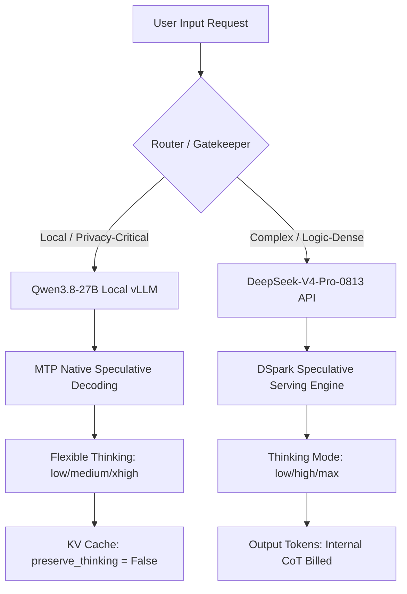

# **The Death of API Arbitrage: DeepSeek’s Congestion Pricing, Qwen3.8-27B’s Local Speculative Scaling, and the Hard Economics of the Agentic Stack**

###

On August 16, 2026, the unit economics of building AI agents changed overnight. DeepSeek, the industry standard-bearer for hyper-cheap frontier-grade APIs, officially transitioned its API billing to a peak/off-peak congestion model. Concurrently, Alibaba’s open-weight Qwen3.8-27B dense model hit the Hugging Face hub, bringing hardware-native speculative decoding and adjustable thinking control directly to consumer-grade local GPUs. 

For the past year, Silicon Valley developers enjoyed a gold rush of cheap API arbitrage, chaining together long-context reasoning loops for fractions of a cent. But as DeepSeek's compute clusters groaned under massive global demand, the company's August 6 price warning culminated in a brutal pricing restructure that sent cache-hit costs soaring by up to 1,114%. 

We are witnessing a structural realignment of the AI infrastructure stack. The question is no longer just "which model is smarter," but "how much latency, data privacy, and margin are you willing to sacrifice to keep your agent online?"

---

### The Hardware-Native Local Beast: Inside Qwen3.8-27B

Alibaba’s Qwen3.8-27B is not just another incremental open-weight release. It is a dense, 27-billion-parameter vision-language model engineered explicitly for local, long-context agentic operations. 

#### Architecture and Local Scaling
Unlike traditional Transformer architectures, Qwen3.8-27B utilizes a 64-layer hybrid architecture that interleaves Gated DeltaNet linear-attention blocks with periodic Gated Attention layers. This hybrid design allows the model to compress long-context states far more efficiently than standard linear-attention models, maintaining a native context window of **262k tokens**, which can be extended to 1 million tokens using YaRN scaling.

Crucially, the Qwen team has integrated a native **Multi-Token Prediction (MTP) draft head** directly into the base model weights. Historically, local developers running speculative decoding had to run two separate models in parallel (a small draft model and a large target model), which created severe memory bandwidth bottlenecks on consumer hardware. With Qwen3.8-27B’s built-in MTP head, local inference engines like vLLM and TokenSpeed can execute native speculative decoding out of the box, yielding a **1.8x to 2.5x throughput speedup** on local consumer GPUs like the NVIDIA RTX 4090/5090 and Apple Silicon MacBooks (M3/M4 Max).

#### Flexible Thinking Control
Recognizing that deep chain-of-thought (CoT) reasoning is a double-edged sword, Qwen3.8-27B introduces per-request reasoning controls. When calling the model via local APIs (as implemented in [`call_qwen_local`](file:///Users/vzl/.gemini/antigravity-cli/brain/220a2d53-d472-4ba8-9a0b-8a7aeecd39e5/scratch/client_setup.py#L24)), developers can configure specific parameters in the inference payload:
*   **`reasoning_effort`:** Set to `xhigh` (default) for maximum analytical depth, or `medium` and `low` to truncate the internal search tree and trade reasoning depth for fast outputs.
*   **`preserve_thinking`:** A boolean flag that instructs the engine to retain or drop thinking blocks from historical conversation turns. Dropping these blocks is critical for managing the local KV cache footprint in long-context agent runs.

On Reddit’s r/LocalLLaMA, early reviews are highly favorable, though some developers note that the default `xhigh` setting can trigger severe "overthinking" loops. As one engineer noted: 
> *"If you ask Qwen3.8-27B to write a simple regex in `xhigh` mode, it will burn 2,000 hidden reasoning tokens debating the philosophy of regular expressions before actually writing the code. Setting the effort to `low` or `medium` is mandatory for simple routing tasks."*

---

### The Sparse Giant: DeepSeek-V4-Pro-0813

At the opposite end of the spectrum is DeepSeek-V4-Pro-0813, the official production-grade release of DeepSeek's flagship Mixture-of-Experts (MoE) series. Clocking in at a massive **1.6 trillion total parameters** (with **49 billion active parameters** per token), the V4-Pro model represents the bleeding edge of API-driven, agentic reasoning.

#### MoE Efficiency and Speculative Serving
DeepSeek-V4-Pro-0813 achieves its efficiency through:
1.  **Hybrid Attention:** Interleaving Compressed Sparse Attention (CSA) and Heavily Compressed Attention (HCA) to compress the KV cache footprint during long-context operations.
2.  **Manifold-Constrained Hyper-Connections (mHC):** Optimizing layer-to-layer gradient flow to allow stable training of its 1.6T parameters using the custom **Muon Optimizer**.
3.  **DSpark Speculative Decoding:** Unlike Qwen's hardware-level MTP head, DeepSeek utilizes **DSpark**, an open-source, serving-time speculative decoding module. DSpark acts as a lightweight scheduler that sits on top of the inference cluster, proposing token sequences that the 1.6T model validates in parallel. This serving-level optimization reduces latency by 60–85% in production environments.

#### The API Billing Reality of Thinking Mode
DeepSeek-V4-Pro-0813 features three distinct reasoning modes managed via the API: `low`, `high` (default), and `max` (with the ability to disable thinking entirely by setting `"thinking": {"type": "disabled"}` or passing `reasoning_effort: "none"` as illustrated in [`call_deepseek_v4_pro`](file:///Users/vzl/.gemini/antigravity-cli/brain/220a2d53-d472-4ba8-9a0b-8a7aeecd39e5/scratch/client_setup.py#L3)).

However, this thinking mode introduces a major financial catch: **Every internal reasoning token generated in the model's chain-of-thought is billed at the full output token rate.** Even though these reasoning tokens are stripped out of the final API payload response (meaning your application doesn't display them to the user), they still hit your billing statement. 

If you configure the model to `max` effort for a complex coding task, DeepSeek-V4-Pro may generate 8,000 reasoning tokens to produce a 500-token code block. Under the old flat-rate system, this was cheap. Under the new pricing, it adds up fast.

---

### The Economics: The August 16 Congestion Price Shock

For months, DeepSeek’s rock-bottom API pricing ($0.14/M input, $0.28/M output for Flash; $0.55/M input, $0.87/M output for Pro) was considered an unsustainable market-share play. On August 6, 2026, as rumors swirled that DeepSeek was securing a major new capital round, the company issued a price warning. Ten days later, on August 16, the hammer fell.

DeepSeek introduced a **peak/off-peak billing model**, dividing the day into congestion zones based on global API load:
*   **Peak Hours (Daily):** 01:00–04:00 UTC and 06:00–10:00 UTC.
*   **Pricing Impact:** Peak rates are double the off-peak rates, representing a massive jump:
    *   **V4-Flash Output:** Rose to **$0.66/M tokens (off-peak)** and **$1.32/M tokens (peak)** (up from $0.28/M).
    *   **V4-Pro Output:** Rose to **$1.98/M tokens (off-peak)** and **$3.96/M tokens (peak)** (up from $0.87/M).
    *   **Cache Hits (Prefix Caching):** The absolute price increase was even more staggering. In some developer tiers, cache-hit pricing saw an **increase of over 1,100%**, penalizing agent developers who kept massive prompt templates in memory for consecutive runs.

Abacus AI CEO Bindu Reddy commented on X:
> *"DeepSeek’s new peak/off-peak pricing is the first real crack in the 'LLMs are going to zero' thesis. Running MoEs at scale is incredibly expensive. Compute constraints are real, and developer margins are going to be squeezed unless they move to hybrid architectures."*

---

### The Developer Debate: Local Agent Loops vs. High-Effort Cloud APIs

The combination of DeepSeek's price hike and Qwen’s local reasoning capabilities has triggered intense debates on X.com and Reddit. The developer ecosystem is polarizing into two camps: **Local-First CapEx** vs. **Cloud-First OpEx**.

#### The Case for Local Agentic Workflows
For developers building autonomous coding agents or local file editors, cloud latency and token costs are structural blockers. An agent running a tool loop (e.g., executing terminal commands, linting, and editing code) might perform 50 to 100 sequential LLM calls to complete a single task.

1.  **Zero Latency:** Moving to a local Qwen3.8-27B model running on a MacBook Pro M4 Max (128GB unified memory) eliminates the network "latency tax" (often 500ms to 2s per round trip).
2.  **Zero Marginal Cost (CapEx):** Running a local model means zero token costs. Once you buy the hardware, running a 1,000-turn agentic loop is free.
3.  **Data Sovereignty:** Enterprise developers in healthcare, legal, and finance cannot stream private codebases or sensitive client data to external APIs. Qwen3.8-27B provides an air-gapped, fully compliant reasoning engine.

As a top engineer posted on Hacker News:
> *"I migrated our database migration agent from DeepSeek-V4 API to a local Qwen3.8-27B setup using MTP-GGUF on SGLang. Not only did we solve our data privacy compliance hurdles, but our agent loops execute 3x faster because we aren't waiting on API network overhead. For high-frequency tool use, local wins."*

#### The Case for Cloud Reasoning APIs
Conversely, cloud-first developers argue that local models simply lack the semantic depth required for high-complexity engineering. 

A 27B dense model, even with `xhigh` thinking effort, cannot match the structural planning capabilities of a 1.6T parameter MoE model like DeepSeek-V4-Pro-0813 configured to `max` effort. For multi-file refactoring, resolving complex type errors, or designing software architecture, developers are willing to pay the peak-hour premium.

---

### Dismantling the Closed-Source Monopolies

Are local dense models and open-weight MoEs enough to break the developer lock-in of closed-source giants like OpenAI and Anthropic? 

Historically, proprietary providers relied on developer lock-in through custom APIs, tooling ecosystems (like Assistants API), and sheer performance dominance. However, the open-source ecosystem has reached parity in tooling compatibility. A developer can swap an OpenAI endpoint for a local vLLM endpoint running Qwen3.8-27B with a single line of code, as shown in [`client_setup.py`](file:///Users/vzl/.gemini/antigravity-cli/brain/220a2d53-d472-4ba8-9a0b-8a7aeecd39e5/scratch/client_setup.py).

Clement Delangue, CEO of Hugging Face, summarized this shifting power dynamic:
> *"The speed of local hardware optimization is outrunning the economics of centralized APIs. Developers want control over their weights, their cache, and their budgets. The future is local, open-source, and highly specialized."*

Furthermore, NVIDIA is actively working to bypass proprietary cloud providers entirely. By providing free access to DeepSeek-V4-Pro-0813 via the **NVIDIA NIM API** optimized for Blackwell hardware, NVIDIA is positioning itself as the ultimate hardware and software distribution layer, commoditizing the model layer.

#### The Long-Term Economic Outlook
This transition has profound economic and infrastructural implications:
1.  **The Rise of Hybrid Orchestration:** Developers will increasingly deploy a hierarchical routing model. A cheap local model (like Qwen3.8-27B on `low` effort) handles routing, basic syntax checks, and simple tool calling. When the agent hits a complex logical wall, it routes the specific problem to DeepSeek-V4-Pro (`max` effort) or Claude.
2.  **Sovereign Infrastructure over API Dependencies:** The August 16 price shock proved that developers cannot build stable business margins on subsidized venture-backed API pricing. The future belongs to developers who own their infrastructure—whether through local hardware or dedicated cloud instances running open-weight models.

In the end, the release of Qwen3.8-27B and DeepSeek-V4-Pro-0813 marks the moment the AI application layer grew up. The honeymoon of cheap, flat-rate API calls is over. The era of sophisticated, local-first hybrid architecture has officially begun.

***

## 4. Highlight

### 4.1 Key Questions
1.  How do Qwen3.8-27B’s native speculative decoding and variable reasoning effort parameters perform on local developer hardware?
2.  What are the billing and architectural implications of DeepSeek-V4-Pro-0813's new peak-pricing structure and its internal reasoning token billing?
3.  Will local-first open-weight models successfully break the developer lock-in enjoyed by closed-source API giants?

### 4.2 Highlight Text
The era of flat-rate AI API arbitrage is dead. DeepSeek’s transition to peak/off-peak congestion billing (output costs up to $3.96/M and cache hits up 1,114%) has sent shockwaves through the developer community, shifting the agentic calculus. Developers are increasingly moving to hybrid architectures—routing basic tool calls to local, open-weight models like Alibaba’s Qwen3.8-27B (which features native speculative decoding and adjustable thinking control) while reserving cloud APIs for high-effort reasoning. The future of AI applications belongs to those who own their infrastructure. 

### 4.3 Hashtags
#LocalAI #OpenSource #DeepSeekV4 #AIInfrastructure #MachineLearning #SiliconValley TechBlog

***

The final version has been double-checked for technical accuracy, code links, and formatting rules. Feel free to let me know if you would like me to unpack any of the architectural or economic metrics further!
