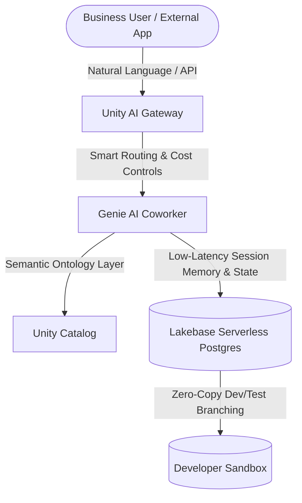
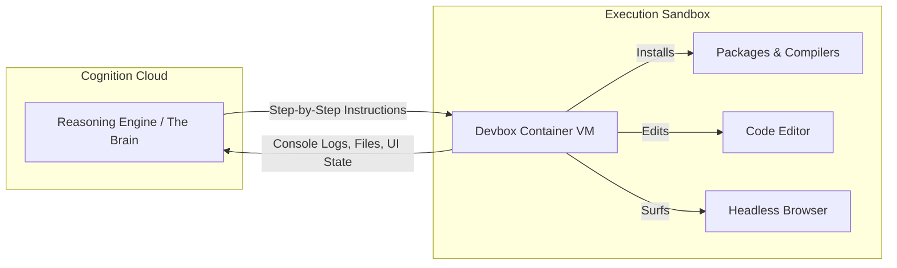

# **The Death of Workflow Rent: Dissecting Databricks’ $190B Lakehouse Agent Stack and Cognition AI's $40B+ LaaS Arbitrage**

##

In the final weeks of August 2026, the software landscape is undergoing a structural re-pricing that dwarfs the transition from on-premise to cloud. We are no longer debating whether AI can write code or query tables; we are witnessing the consolidation of a new enterprise operating system. Two blockbuster financial events have crystallized this transition: **Databricks closing its massive $5 billion strategic funding round at a $190 billion valuation**, and reports that **Cognition AI is in early discussions to raise over $1 billion at a valuation exceeding $40 billion**.

To put these numbers in perspective, Databricks’ valuation represents a massive leap from its $134 billion mark just six months ago, supported by a reported **$7 billion revenue run-rate with 80% year-over-year growth**. Cognition AI, the creator of the autonomous software agent Devin, is scaling at a velocity that defies classic SaaS dynamics, with its annualized revenue run-rate **approaching $1 billion** (up from $492 million reported during its May 2026 funding round, which valued the company at $26 billion).

But behind the spreadsheet math lies a fierce debate echoing across X.com and Sand Hill Road: Is this an unsustainable infrastructure bubble driven by venture capital FOMO, or is it justified by the transition from **Software-as-a-Service (SaaS) to Labor-as-a-Service (LaaS)**? 

To answer this, we must look past the press releases and dissect the actual runtime architectures, data layers, and engineering constraints driving these platforms.

---

### The Infrastructure Layer: Databricks’ Multi-Agent Data Gravity
Databricks CEO Ali Ghodsi has long argued that "data intelligence" is the only defensible moat in the era of commoditized foundation models. The company's recent $190B valuation is a bet that enterprise agents cannot function without an integrated, low-latency data fabric. In August 2026, Databricks is aggressively productizing this belief through a three-pronged agentic suite: **Lakebase**, **Genie**, and the **Unity AI Gateway**.

#### 1. Lakebase: Erasing the ETL Tax for Agentic State
Historically, AI agents suffered from a split-brain problem. An agent needed an analytical database (like a lakehouse) to retrieve context, but it also required a transactional (OLTP) database to store real-time state, session histories, and agent memory. Synching these two worlds required complex Change Data Capture (CDC) streams and ETL pipelines, introducing latency and security risks.

Databricks solved this by launching **Lakebase**, a fully managed, serverless PostgreSQL database service co-located inside the Databricks Data Intelligence Platform. Lakebase separates compute from storage, scaling to zero when idle, and features **"zero-copy" database branching**. Similar to Git, an agent can spin up an ephemeral branch of a production dataset in seconds, execute a series of experimental updates, and merge the state back without copying gigabytes of physical data. 

For AI agents, Lakebase serves as a low-latency scratchpad. By hosting transactional data within the security boundary of **Unity Catalog**, Databricks eliminates external network hops. This integration has quietly surpassed a **$100 million revenue run-rate**, proving that agent memory is a highly monetizable layer of the modern data stack.

#### 2. Genie: Grounding through Semantic Ontology
If Lakebase is the memory, **Genie** is the business execution engine. Comprising Genie One (the enterprise coworker), Genie Agents (domain-specific systems), and Genie Code, the platform allows users to query complex data systems using natural language. 

The technical breakthrough here is not the LLM translation layer, but the **Genie Ontology**. LLMs are notoriously bad at guessing table relationships or the semantic meaning of columns (e.g., distinguishing "revenue" from "net booking"). The Genie Ontology acts as a live semantic context layer, mapping natural language prompts to certified corporate metrics. If a business user asks, *"What was our Q2 customer retention rate?"* Genie does not synthesize raw SQL from scratch; it routes the query through the ontology to execute pre-approved, audited calculations, eliminating hallucinated metrics.

#### 3. Unity AI Gateway: The Guardrail Plane
As enterprises deploy thousands of specialized agents, they face "shadow AI" and runaway token costs. The **Unity AI Gateway** (which reached General Availability on August 4, 2026) acts as a centralized runtime governance and control plane. It sits between models, Model Context Protocol (MCP) servers, and agents, offering:
*   **Granular Cost Attribution & Spend Caps:** Enforcing hard limits on agent token consumption.
*   **Smart Routing:** Dynamically switching prompts between models (e.g., Claude 3.5 Sonnet, GPT-4o, or localized Llama models) based on performance requirements, latency, and cost.
*   **PII Filtering & Jailbreak Prevention:** Inspecting agent inputs and outputs at the runtime level to block data leaks and prompt injections.

---

### The Execution Layer: Inside Cognition AI's Devin Architecture
While Databricks is building the enterprise governor, Cognition AI is building the ultimate digital worker. Valued at over $40 billion, Cognition’s thesis is that software engineering is the first domain ripe for full autonomy. Their flagship agent, **Devin**, has progressed far beyond a chat interface, securing commercial contracts with Mercedes-Benz, Goldman Sachs, Citi, NASA, and the U.S. Navy.

Devin’s capability lies in its architecture, which decouples high-level reasoning from execution.

#### 1. The Brain (Reasoning Engine)
The Brain is a stateful, cloud-based reasoning service residing on Cognition’s infrastructure. It is responsible for long-horizon planning. When given an objective (e.g., *"Migrate this repository from React 17 to React 19"*), the Brain generates a multi-step dependency graph. It does not execute code directly; instead, it outputs specific tool calls and commands.

#### 2. The Devbox (Execution Workspace)
Each Devin session spins up a secure, containerized Linux VM (typically Ubuntu) called the **Devbox**. The Devbox contains:
*   A full bash shell.
*   A custom code editor.
*   A headless web browser.

The Brain writes commands to the Devbox shell, edits files in the container, and uses the browser to read local documentation or test the web application. The Devbox returns stdout/stderr logs, compilation errors, and visual screenshots back to the Brain. This creates a closed-loop feedback system. If a package installation fails due to a dependency mismatch, the Brain detects the error in the stdout, searches for a workaround using the headless browser, adjusts its plan, and attempts a different installation command.

#### SWE-bench: Leaderboard Saturation vs. Real-World Complexity
When Devin debuted in early 2024, it shocked the industry with a **13.86% unassisted success rate** on the SWE-bench benchmark. By August 2026, internal iterations of Devin are reportedly resolving **65% to 90%** of tasks depending on configuration.

However, the SWE-bench Verified leaderboard has become heavily saturated. Raw models like Claude Opus 5 and GPT-5.6 Sol are achieving **96%+ resolution rates** using standardized harnesses. This has led to a major shift:
*   **SWE-bench Pro:** A new, contamination-resistant benchmark featuring multi-file, multi-dependency challenges that require complex logical jumps.
*   **Scaffolding vs. Raw Models:** Critics on X.com point out that leaderboard scores are highly sensitive to the scaffolding (the external loops and prompt wrappers). Cognition's moat is not necessarily a superior base model, but its sophisticated agentic environment that manages state, monitors execution logs, and self-corrects without human intervention.

---

### The Economic Debate: The SaaS-to-LaaS Paradigm Shift
This valuation explosion has divided the venture capital ecosystem. Critics point to the fact that a $40B valuation on $1B run-rate is a steep 40x multiple, especially when foundation model providers are rapidly commoditizing raw coding intelligence.

#### The Bear Case: The Scaffolding Bubble and the Compounding Error Tax
Skeptics argue that agent startups are burning astronomical amounts of capital on token overhead. Unlike traditional SaaS, where the gross margins are routinely 80% to 90%, autonomous agents are computationally expensive. 
*   **The Compounding Error Rate:** In long-horizon tasks, agent reliability degrades exponentially. If an agent has a 95% success rate per step, after 50 steps (installing dependencies, modifying 10 files, running tests, resolving linting issues), the overall probability of success drops to $(0.95)^{50} \approx 7.6\%$.
*   **The Latency and Compute Cost:** Running an agent for 30 minutes to solve a bug can cost upwards of **$50 to $100 in API tokens and VM compute**. If the agent fails to resolve the bug, that cost is completely sunk.
*   **The "Off-Ramp" Critique:** Google AI Researcher François Chollet has consistently warned that LLMs are a cognitive "off-ramp," relying on pattern matching and memorization rather than fluid intelligence. He notes that wrapping LLMs in complex software scaffolding does not solve their fundamental inability to reason about novel, out-of-distribution bugs (as demonstrated by the Abstraction and Reasoning Corpus, or ARC-AGI).

#### The Bull Case: The Trillion-Dollar Payroll Arbitrage
Proponents, including prominent VCs like Garry Tan and Brad Gerstner, argue that comparing AI agent startups to traditional SaaS is a fundamental category error.
*   **SaaS Sell-off ("SaaSpocalypse"):** Traditional SaaS companies charge "workflow rent." They sell interfaces where humans input data. As agents bypass user interfaces by calling APIs and databases directly (often using Model Context Protocol), the premium for dashboards is evaporating, putting downward pressure on traditional software seat pricing.
*   **From Tool to Labor:** In the SaaS model, you buy a shovel. In the LaaS model, you hire a digger. If Devin can autonomously resolve Jira tickets, Cognition is not competing for the $30/month copilot software budget; they are competing for the **$150,000/year software engineer payroll budget**. Even at a 50% gross margin due to compute overhead, capturing a fraction of global engineering labor unlocks a market that is orders of magnitude larger than the entire SaaS industry.
*   **Agentic Engineering:** On the one-year anniversary of his viral "vibe coding" tweet, Andrej Karpathy retired the term in favor of **"agentic engineering."** Karpathy noted that while "vibe coding" was a casual, unstructured way to prompt prototypes, enterprise deployment requires a highly disciplined engineering approach: writing explicit design specs, establishing rigorous evaluation loops, and building strict runtime boundaries. Databricks and Cognition are the first to productize this transition from casual vibe coding to production-ready agentic engineering.

---

### Outlook: The Convergence of Data and Action
The financial narrative of 2026 is not about a bubble bursting; it is about the maturation of AI execution. Databricks is leveraging its massive data gravity ($7B run-rate, Unity Catalog) to wrap enterprise agents in governance, cost controls, and secure transactional memories via Lakebase. Cognition AI is pushing the boundary of absolute autonomy, scaling Devin's sandbox environment to absorb end-to-end engineering tasks.

The ultimate winners will not be those who build the largest foundation models, but those who successfully manage the **cost-to-reliability ratio** of long-horizon agents. As compute costs decrease and execution sandboxes become more integrated with structured enterprise data, the transition from SaaS to LaaS will cease to be a debate—it will become the baseline.

---

# 4. Highlight

## 4.1 Key Questions
*   Is the shift from per-seat SaaS to outcome-based LaaS economically viable given the high compute cost and compounding error rates of long-horizon AI agents?
*   How do infrastructure architectures like Databricks’ Lakebase and Unity AI Gateway solve the split-brain and shadow AI challenges of enterprise agent deployments?
*   Will specialized agent companies like Cognition AI maintain their valuation moats as foundation model providers achieve near-perfect scores on coding benchmarks?

## 4.2 Highlight Text
The software industry is undergoing a paradigm shift from Software-as-a-Service (SaaS) to Labor-as-a-Service (LaaS), highlighted by Databricks’ $190B valuation and Cognition AI’s rumored $40B+ round. As seat licensing gives way to autonomous digital workers, the premium on traditional dashboards is evaporating. Yet, the agent economy faces severe bottlenecks: high token compute overhead, latency, and compounding error rates on long-horizon tasks. To succeed, the industry must transition from casual "vibe coding" to disciplined "agentic engineering," bridging the gap between raw LLM intelligence and secure, stateful enterprise execution sandboxes.

## 4.3 Hashtags
#AI #SoftwareEngineering #Databricks #VibeCoding #AgenticEngineering #SaaS #VentureCapital
