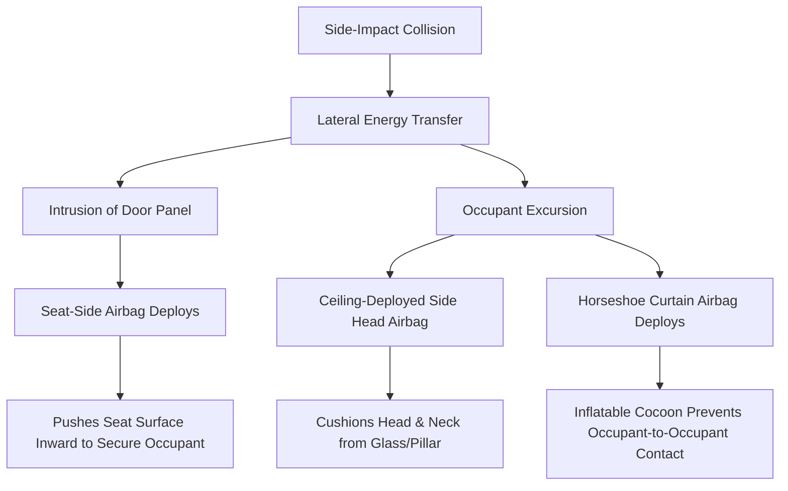

# **The Death of the Dashboard: Inside the NHTSA’s Historic Exemption of Zoox's Symmetrical Robotaxi**

##

On July 30, 2026, the National Highway Traffic Safety Administration (NHTSA) crossed a regulatory Rubicon. Under petition docket NHTSA-2022-0082, the federal agency granted Zoox, Inc., a temporary commercial deployment exemption from portions of eight Federal Motor Vehicle Safety Standards (FMVSS). Valid from July 31, 2026, to July 31, 2028, this landmark Section 555 exemption authorizes Amazon-backed Zoox to introduce up to 2,500 purpose-built, steering-wheel-free vehicles annually into interstate commerce. 

This is not a demonstration pilot or a testing waiver; it is the first-ever commercial deployment approval for a clean-sheet autonomous vehicle lacking manual controls. For an industry that has spent a decade grafting sensors onto conventional passenger cars, Zoox’s exemption marks the transition from retrofitting the past to codifying the future of urban transit. 

To understand why this is a watershed moment, one must dissect the engineering friction that made Zoox’s carriage-style geometry illegal under twentieth-century safety paradigms, the crash physics of face-to-face seating, and the operational chess match between Zoox and its primary rival, Waymo.

---

### The Eight Exempted Standards: Why Human-Centric Rules Failed Zoox’s Geometry
Federal Motor Vehicle Safety Standards were written under a foundational assumption: every vehicle has a human driver sitting in a forward-facing seat, peering through a front windshield, and controlling acceleration, steering, and braking via physical mechanical interfaces. 

By designing a bidirectional vehicle with no steering wheel, brake pedal, or designated front-versus-rear orientation, Zoox created a vehicle that literally could not comply with the letters of these laws. 

Here is the technical breakdown of the eight FMVSS provisions from which Zoox was granted temporary relief:

1. **FMVSS No. 103 (Windshield Defrosting and Defogging Systems):** Traditional standards require a defrosting system that clears the windshield area directly in front of the driver’s eyes. Because Zoox's robotaxi has no driver's station and no steering wheel, it has no "driver's field of view." The vehicle uses automated internal heating and HVAC systems to manage cabin humidity, but standard compliance was structurally impossible.
2. **FMVSS No. 104 (Windshield Wiping and Washing Systems):** This standard mandates physical wipers and washers to keep the driver's forward glass clear. Zoox replaced this with mechanical, localized sensor-cleaning systems. Every LiDAR, camera, and radar pod on the exterior is equipped with high-pressure water jets and compressed air blasts to clear debris—rendering traditional human-aligned windshield wipers obsolete.
3. **FMVSS No. 108 (Lamps, Reflective Devices, and Associated Equipment):** This regulation governs headlamps, turn signals, and physical switch controls. Zoox’s bidirectional architecture means the vehicle never performs a U-turn; it simply reverses direction. Thus, headlamps must toggle dynamically to taillamps (shifting color temperatures from white to red), and turn indicators must invert their flash sequences. Furthermore, FMVSS 108 mandates a manual high-beam selector switch on the steering column—a component that does not exist in the Zoox vehicle.
4. **FMVSS No. 111 (Rear Visibility):** Mandates physical rearview and sideview mirrors. Zoox uses a redundant sensor array (camera, LiDAR, radar) to monitor the environment. Physical mirrors would increase aerodynamic drag and create collision hazards with pedestrians or narrow street furniture.
5. **FMVSS No. 135 (Light Vehicle Brake Systems):** This standard dictates the physical pedal force, travel, and indicator lamps visible to a human driver. Zoox utilizes an electro-hydraulic brake-by-wire system controlled entirely by its Automated Driving System (ADS) with dual-redundant actuators. There is no physical brake pedal.
6. **FMVSS No. 201 (Occupant Protection in Interior Impact):** Regulates the crash protection of interior surfaces, targeting components like steering columns, sun visors, and dashboard instrument panels. Because Zoox's interior is a symmetrical, open cabin with face-to-face seating, the traditional impact testing zones and crash target geometries did not apply.
7. **FMVSS No. 205 (Glazing Materials):** Dictates the materials, laminates, and optical quality of vehicle glass. Zoox required exemptions for its large, wrap-around glazing panels to ensure that structural window configurations did not interfere with the transmission of internal optical sensors while maintaining necessary occupant retention.
8. **FMVSS No. 208 (Occupant Crash Protection):** The most complex exemption. This standard mandates frontal airbags and seat belts calibrated for forward-facing occupants, triggered by longitudinal deceleration relative to the driver's position. Zoox’s face-to-face seating and bidirectional motion meant occupants could experience a crash as either a frontal or rearward impact. Standard steering-wheel and passenger-side dashboard airbags were useless.

---

### The Side-Impact Physics of the "Campfire" Cabin
The most contentious debate in autonomous safety circles surrounds Zoox's "campfire" seating configuration. Traditional vehicles place all occupants facing forward, utilizing the seatbacks of the front row as a protective barrier for the second row. In Zoox's 3.63-meter carriage, four passengers sit face-to-face in pairs.

During a high-velocity side-impact collision, this configuration presents severe biomechanical challenges. The occupant on the side of the impact is accelerated laterally into the cabin, while the passenger facing them is accelerated in the opposite relative direction. Without mitigation, this creates a high risk of passenger-to-passenger collision—specifically head-to-head or knee-to-knee impacts.

To resolve these physics, Zoox developed a custom, multi-layered passive safety system:
* **The Horseshoe Curtain Airbag:** Deployed from the ceiling, this massive airbag drops down to wrap around the entire cabin perimeter, forming an "inflatable dashboard." It acts as a structural partition between the face-to-face passengers, preventing occupant-to-occupant contact during lateral and oblique crashes.
* **Seat-Side Airbags:** Built directly into the seat frames, these airbags deploy within the seat itself during a side impact. Rather than just cushioning the occupant, they expand to push the seat bolsters inward, firmly clamping the occupant's hips and torso to prevent slide-out.
* **Redundant Seatbelt Pretensioners:** The moment the vehicle's millimetric-wave radars and LiDARs detect an unavoidable collision, the system fires pyrotechnic pretensioners that actively pull passengers deep into their seats, locking their hips in place before the physical impact occurs.
* **The Bidirectional Airbag Control Unit (ACU):** A specialized, dual-axis sensing system that calculates the exact vector and velocity of the impact relative to the vehicle's current travel direction, deploying only the specific set of airbags required for that orientation.

Despite these innovations, skeptics on Reddit's r/selfdrivingcars and X.com point to the lack of traditional crumple zones. Unlike a standard SUV with a large engine bay to absorb frontal energy, Zoox's carriage places passengers close to the outer envelope of the vehicle. Zoox counters this by isolating its drive modules (which house the motors, suspension, and steering actuators) from the passenger cabin. These modules are structurally designed to collapse and break away from the rigid passenger capsule, absorbing massive amounts of impact energy.

---

### Waymo vs. Zoox: Retrofit vs. Purpose-Built Scalability
The NHTSA exemption intensifies the philosophical battle between Waymo’s "retrofit" model and Zoox’s "purpose-built" strategy. 

Waymo, the undisputed leader in commercial AV mileage, integrates its "Waymo Driver" sensor and software stack into mass-produced passenger vehicles like the Jaguar I-PACE and the upcoming Zeekr minivan. Zoox, conversely, manufactures its unique carriage from scratch at its Clawiter facility in Hayward, California, while conducting development and test-fleet assembly at its Kato facility in Fremont.

| Scalability Metric | Waymo (Retrofit Strategy) | Zoox (Purpose-Built Strategy) |
| :--- | :--- | :--- |
| **Manufacturing Capex** | **Low to Moderate:** Leverages existing OEM assembly lines; only builds and installs sensor/compute hardware. | **Extremely High:** Requires dedicated assembly plants, custom stamping dies, and end-of-line quality verification. |
| **Regulatory Friction** | **Low:** The base vehicle is already FMVSS-certified; only the automated driving system must be self-certified. | **Extremely High:** Requires complex Section 555 exemptions from federal standards, plus state-level approvals. |
| **Operational Efficiency** | **Moderate:** Converted passenger cars are prone to high wear-and-tear; traditional steering/pedals remain redundant. | **High:** Bidirectional travel reduces turn maneuvers; sliding doors speed up ingress; optimized interior is easier to clean. |
| **Rider Experience (UX)** | **Standard:** Mimics a high-end rideshare (e.g., backseat of an SUV); restricted layout due to front-seat configurations. | **Premium:** Open "campfire" cabin with face-to-face seating, glass roofs, and no driver cockpit distraction. |

Waymo’s former CEO, John Krafcik, famously articulated the case against purpose-built vehicles: *"Building a car is incredibly hard, and there is no need to reinvent the wheel. Partnering with OEMs allows us to focus entirely on the Waymo Driver."* This capital-efficient strategy has allowed Waymo to scale rapidly across Phoenix, San Francisco, Los Angeles, and Austin, racking up millions of driverless miles.

But Zoox's CTO and co-founder, Jesse Levinson, argues that retrofitting is a dead-end: *"By designing the vehicle from the ground up, we could build in safety features that are physically impossible in a retrofitted passenger car."* 

Meanwhile, Tesla’s Elon Musk has historically dismissed both strategies, mocking Zoox’s boxy silhouette as a "toaster" and betting Tesla's autonomous future on a vision-only "Cybercab" architecture that bypasses LiDAR entirely. The engineering consensus, however, remains skeptical of Tesla's lack of sensor redundancy compared to Zoox's triple-sensor modalities.

---

### The California Wall and Dynamic Authorizations
While the federal exemption removes the primary barrier to manufacturing Zoox's robotaxi at scale, the path to commercial revenue remains fragmented. 

NHTSA’s exemption is not a blank check. It is governed by a strict "Operational Authorization" framework. Under this dynamic structure, NHTSA can modify operational parameters in real time based on fleet performance data. Zoox must comply with strict reporting mandates, including detailing all teleoperation interactions, software anomalies, and passenger incidents. Crucially, NHTSA requires all remote vehicle operators to be based within the United States.

At the state level, the regulatory landscape diverges:
* **Nevada:** The state's laissez-faire approach has cleared the path for Zoox to launch its first paid, driverless commercial service in Las Vegas in August 2026.
* **California:** Despite Zoox’s headquarters being in Foster City, California, the company faces a steep regulatory wall. Zoox currently holds a DMV driverless testing permit and a CPUC Phase I Driverless Passenger Service Pilot permit, which allows them to transport passengers but **prohibits charging fares**. 

To launch a commercial ride-hailing service in San Francisco or Los Angeles, Zoox must secure a DMV Autonomous Vehicle Deployment Permit and a CPUC Phase II Driverless Passenger Service Deployment Permit. California regulators, under pressure from local municipalities and labor unions, have slowed the deployment pipeline, scrutinizing AV interactions with emergency services and double-parking behaviors.

---

### The Investigative Verdict
Zoox’s federal exemption is a massive validation of the purpose-built robotaxi thesis, proving that the federal government is willing to rewrite the rules of the road for automation. However, the commercial stakes are unforgiving. 

While Zoox has spent years securing the right to build its steering-wheel-free carriage, Waymo has captured the market's mindshare and established operational dominance using retrofitted SUVs. Zoox has the vehicle of the future, but it must now prove it can build it at scale, protect its passengers in real-world side impacts, and navigate the bureaucratic maze of California's regulatory agencies. The next two years will decide if Zoox’s carriage-style dream is the future of transit, or an expensive, over-engineered detour.

---

# 4. Highlight

## 4.1 Key Questions
1. How does Zoox protect passengers sitting face-to-face in a high-velocity side-impact collision without traditional dashboards?
2. Why did the NHTSA exempt Zoox from exactly eight human-centric FMVSS standards, and what are the operational limits of this waiver?
3. Will Waymo's rapid retrofit strategy win the autonomous scaling war, or will Zoox's capital-heavy, purpose-built vehicle prevail in the long run?

## 4.2 Highlight Text
The NHTSA has granted Zoox a historic commercial exemption (under 49 C.F.R. § 555) from eight Federal Motor Vehicle Safety Standards, allowing the commercial deployment of up to 2,500 steering-wheel-free robotaxis annually from July 31, 2026, to July 31, 2028. This shifts the AV paradigm from Waymo’s capital-efficient retrofit model to a ground-up carriage architecture. To survive side-impacts in its unique face-to-face cabin, Zoox relies on innovative "horseshoe" curtain airbags and breakaway drive modules. While Las Vegas paid operations launch in August 2026, California's DMV and CPUC regulatory walls remain a major hurdle.

## 4.3 Hashtags
#AutonomousVehicles #Robotaxi #Zoox #NHTSA #Waymo #SelfDrivingCars
