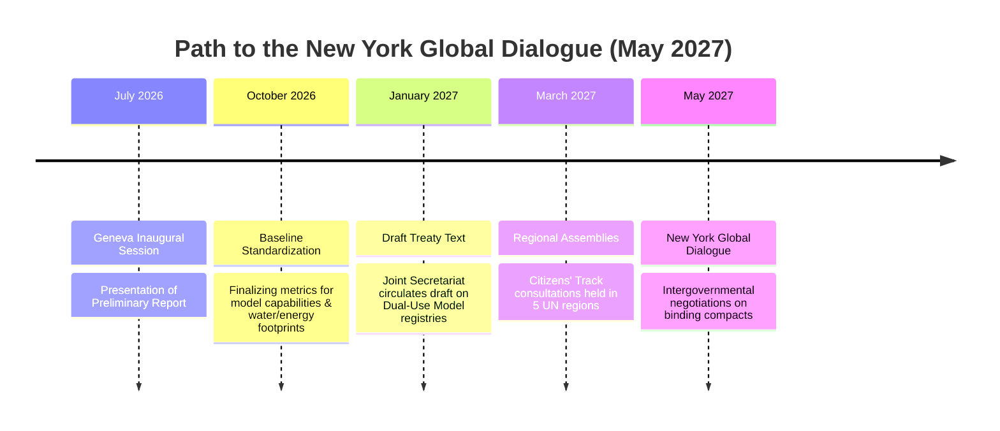

# **The Geneva AI Accord in Limbo: Inside the Geopolitical Clash Over Compute, Kinetic Autonomy, and the Fission-Renewable Energy Divide**

GENEVA — As delegates gathered at the Palais des Nations for the inaugural United Nations Global Dialogue on AI Governance (July 6–7, 2026), the atmosphere was less of diplomatic triumph and more of an engineering triage. The event, established under the auspices of the UN’s Global Digital Compact, was meant to harmonize global safety standards. Instead, it exposed a deep rift between the exponential physics of AI capability scaling and the linear, friction-heavy machinery of international diplomacy.

### The Bengio-Ressa Report: Quantifying the Capability-Regulation Gap

The intellectual anchor of the summit was the preliminary report of the Independent International Scientific Panel on AI, co-chaired by Turing Award winner Yoshua Bengio and Nobel laureate Maria Ressa. The panel, composed of 40 global experts, delivered a sobering assessment: the gap between AI capability scaling and state regulatory capacity is widening at an alarming rate.

```
AI Training Compute (FLOPs) vs. Regulatory Implementation Time
Compute:    10^25 (GPT-4) ---> 10^27 (2025/2026 Frontier Models) [100x Increase]
Regulatory: EU AI Act / US EO ---> Implementation & Standards Drafting [3-5 Year Lag]
```

The report details how hardware advances—such as Nvidia’s Blackwell architecture with low-precision FP4 execution—alongside algorithmic breakthroughs in reinforcement learning at search-time (System 2 thinking models) have bypassed the threshold metrics set by early regulatory drafts. For example, the US Executive Order’s reporting threshold of $10^{26}$ FLOPs is increasingly obsolete; modern architectures pack equivalent capabilities into significantly smaller compute footprints through Mixture-of-Experts (MoE) routing and post-training distillation.

"We are scaling systems whose inner workings we do not fully understand, and there are currently no technical guarantees that we can control them," Bengio warned during his presentation. Maria Ressa was even more direct about the consensus document's limitations, characterizing the report as representing the "floor, not the ceiling" of the panel's concerns regarding the erosion of truth and democratic stability.

### The Geopolitical Gridlock: Kinetic Autonomy and the "Killer Robot" Paradox

While the dialogue was officially structured around civilian AI, the shadow of military application dominated the bilateral corridors. UN Secretary-General António Guterres opened the session with a stark demand: an absolute, legally binding international ban on Lethal Autonomous Weapon Systems (LAWS), which he explicitly labeled "killer robots." 

However, the game-theoretic reality of the US-China technological rivalry quickly stymied any formal treaty progress. On paper, both Washington and Beijing have agreed in principle that humans must maintain control over nuclear command systems. But on the conventional battlefield—accelerated by lessons from drone warfare in Ukraine and the Red Sea—neither superpower is willing to cede the kinetic edge of edge-AI autonomy.

```
Superpower Positioning on Military AI Governance
┌─────────────────────────────────┬─────────────────────────────────┐
│          United States          │              China              │
├─────────────────────────────────┼─────────────────────────────────┤
│ • Focuses on "Responsible Use"  │ • Supports bans on use, but not │
│   frameworks (Political Decl.)  │   research and development.     │
│ • Rejects binding bans on       │ • Uses dual-use tech pipeline to│
│   kinetic autonomous target-    │   circumvent chip restrictions  │
│   ing systems.                  │   for military models.          │
└─────────────────────────────────┴─────────────────────────────────┘
```

B2B corridors were filled with chatter about China’s domestic silicon breakthroughs (such as SMIC’s advanced packaging for Huawei Ascend 910C platforms) and the US’s widening export control net. A senior engineer from an American defense contractor, posting anonymously on X, summed up the prevailing mood: *"A binding treaty on autonomous weapons is dead on arrival. You cannot verify code compliance at the edge without intrusive inspections that neither the US nor China will ever allow. So, we build."*

### The Energy Divide: Guterres’s 100% Renewable Mandate vs. the SMR Lobby

Perhaps the most economically contentious debate centered on the physical infrastructure powering the AI boom. Secretary-General Guterres proposed the **AI Environmental Transparency Initiative**, which would mandate that all AI data centers transition to 100% renewable energy by 2030. 

For Silicon Valley, this mandate represents a fundamental misunderstanding of electrical grids and thermodynamic scaling. A single state-of-the-art AI cluster comprising 100,000 Nvidia Blackwell GPUs draws approximately 130 MW of continuous power. When accounting for Power Usage Effectiveness (PUE) and cooling infrastructure, this demand easily exceeds 180 MW. If hyperscalers scale to the planned 1-million GPU clusters, the load jumps to nearly 2 Gigawatts (GW).

```
Power Profile Comparison: 100k GPU Cluster
┌──────────────────────────┬──────────────────────────┬──────────────────────────┐
│ Metric                   │ Renewable (Solar/Wind)   │ Nuclear (SMR / Baseload) │
├──────────────────────────┼──────────────────────────┼──────────────────────────┤
│ Capacity Factor          │ 25% - 40% (Intermittent) │ 90%+ (Continuous)        │
│ Land Footprint           │ Large (~100-300 acres)   │ Compact (<5 acres)       │
│ Battery Storage Req.     │ Massive (Gigawatt-hours) │ None                     │
└──────────────────────────┴──────────────────────────┴──────────────────────────┘
```

"Wind and solar are excellent for general grid decarbonization, but they cannot provide the 'five nines' (99.999%) uptime required for deep training runs without financially prohibitive battery storage," wrote a prominent energy VC on X. 

Instead, the tech industry is aggressively lobbying for Small Modular Reactors (SMRs) and advanced nuclear co-location. Key initiatives discussed at the sidelines include:
*   **Oklo’s Fast Fission:** Chairman Sam Altman has advocated for Oklo's Aurora reactors (15 MWe capacity) to be placed directly behind the meter at data center sites.
*   **TerraPower’s Liquid Sodium:** Bill Gates's TerraPower is pushing its 345 MWe Natrium reactor as the optimal scale for gigawatt-class AI campuses.
*   **The Three Mile Island Revival:** Microsoft's 20-year Power Purchase Agreement (PPA) with Constellation Energy to restart the 835 MW Crane Clean Energy Center (Three Mile Island Unit 1) by 2028 was cited as the blueprint for sovereign, grid-independent tech energy.

However, the SMR route faces severe technical and regulatory bottlenecks. The domestic supply chain for High-Assay Low-Enriched Uranium (HALEU) is extremely constrained, and licensing new reactors through the US Nuclear Regulatory Commission (NRC) routinely takes upwards of five to seven years—far too slow for the 3-year product cycles of frontier LLMs.

### The Democratic Deficit: Civil Society and the "Citizens’ Track"

Outside the security perimeter, civil society coalitions led by organizations like *Connected by Data* and *Women at the Table* held counter-briefings. They protested the "regulatory capture" of the UN dialogue by a cozy duopoly of Big Tech executives and national security officials.

The coalition demanded the formal establishment of a **"Citizens' Track"**—utilizing sortition-selected citizens' assemblies—to review and veto high-level AI governance policies. On social media, the debate was fierce. Proponents argued that without public deliberation, AI safety standards will serve to protect the market share of incumbent tech giants rather than protect the public. Conversely, prominent tech founders responded on X, arguing that adding layers of public veto groups would only slow down democratic nations while autocratic rivals sprint ahead.

### The Road to New York: 2026–2027 Timeline

To prevent the Global Dialogue from becoming another talking shop, the Joint Secretariat (accessible at `aidialogue@un.org`) mapped out a critical path leading to the second session in New York in May 2027:



If the international community cannot resolve the fundamental friction between national security imperatives, energy realities, and democratic inclusion, the May 2027 summit in New York may find itself governing a technology that has already evolved beyond the reach of international law.

***
