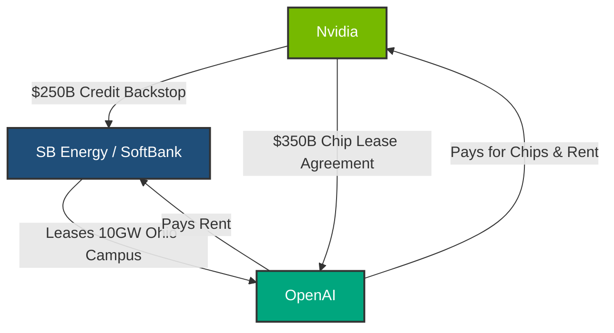

# **The Half-Trillion-Dollar Loop: Inside Nvidia’s $250B Ohio Backstop, OpenAI’s 10GW Megasite, and the Risks of AI’s Lucent Moment**

##

The AI infrastructure race has officially graduated from a scramble for individual clusters to a brute-force geopolitical land grab. At the center of this transition is a proposed deal of unprecedented proportions: a 10-gigawatt (10GW) data center campus in Piketon, Pike County, Ohio, developed by SoftBank’s SB Energy subsidiary. The proposed primary tenant is OpenAI. The financial catalyst? A staggering $250 billion credit guarantee under negotiation by Nvidia to backstop OpenAI’s lease. 

For Silicon Valley, this project represents the physical manifestation of Sam Altman's multi-trillion-dollar infrastructure vision. But for Wall Street and seasoned tech analysts, the deal’s structure has triggered intense alarm, resurrecting the ghosts of the early-2000s telecom collapse. By backing the debt of its own primary customer so that customer can lease facilities and purchase its own chips, Nvidia is deploying a highly controversial "vendor financing" model. 

Is this a visionary mechanism to solve a systemic credit bottleneck, or is it a high-risk financial loop that threatens to destabilize the entire semiconductor sector?

---

### The Financial Engineering: Credit Backstops and Circular Flows

The core financial bottleneck of the AI boom is not a lack of capital, but a lack of credit. OpenAI is a private, structurally complex, and currently unprofitable entity. Despite a valuation soaring past $150 billion, it lacks the investment-grade credit rating required to secure the massive, multi-decade debt facilities needed to build a $500 billion infrastructure site. 

To bridge this gap, Nvidia is reportedly proposing a **$250 billion financial guarantee**. Under this agreement, if OpenAI defaults on its lease obligations to SB Energy, Nvidia will step in to cover the payments. This guarantee essentially shifts the credit risk from OpenAI’s unproven balance sheet to Nvidia’s highly liquid capital reserves.

In parallel, the two companies are negotiating a separate **$350 billion chip lease agreement** to populate the campus with next-generation accelerators. 

Critics argue this is a classic textbook example of vendor financing. During the dot-com bubble, telecom giants like Lucent Technologies, Cisco Systems, and Nortel aggressively financed their own buyers (such as emerging Competitive Local Exchange Carriers, or CLECs). When those startups failed to generate cash from their fiber-optic networks, the vendor financing loans defaulted, forcing billions in write-offs and triggering the collapse of the telecom equipment market.

On X.com and Reddit, the debate has reached a fever pitch. Prominent tech commentators have pointed out the systemic fragility:

> **@VC_Observer (X.com):** *"Nvidia guaranteeing OpenAI's lease to buy Nvidia's own chips is the most circular financial engineering we've seen since the Lucent days. If OpenAI's model monetization slows down, the entire card castle collapses back onto Nvidia's balance sheet."*

Conversely, supporters of the deal argue that comparing Nvidia to Lucent is fundamentally flawed. On the *BG2 Pod*, hosts Brad Gerstner and Bill Gurley have extensively analyzed the CapEx build-out, with Gerstner noting that unlike the "phantom fiber" of 2001, AI compute represents highly productive assets with immediate utility. In a recent discussion, they addressed how Nvidia is effectively acting as the investment bank of the AI era:

> **Brad Gerstner (Altimeter Capital):** *"Traditional banks simply do not have the technical underwriting capacity to value GPU clusters or understand their depreciation curves. Nvidia has the cash and the visibility to underwrite this risk, enabling the physical infrastructure to be built at a pace the traditional financial system can't support."*

Nvidia CEO Jensen Huang has publicly defended these creative structures, comparing them to the financing arms of heavy industrial manufacturers:

> *"When John Deere or Ford provides financing to farmers or drivers, nobody calls it 'circular.' We are building AI factories. These factories are long-term cash-generating assets. Seeding the infrastructure is a strategic enablement of a new industrial revolution."*

---

### The Geopolitical Angle: Howard Lutnick and the Pike County Power Brokerage

Building a 10GW campus requires more than just capital; it requires political leverage and massive energy resources. The chosen site—the Portsmouth Gaseous Diffusion Plant in Piketon, Ohio—is a decommissioned federal uranium enrichment facility. Because it is federal land, power allocation and site reuse are heavily regulated by the U.S. Department of Energy (DOE).

Enter U.S. Commerce Secretary **Howard Lutnick**. As the lead gatekeeper of federal energy assets, Lutnick is directly responsible for determining which tech companies get access to the site's power capacity. While OpenAI is currently the frontrunner, other major AI players—including Anthropic, Google, and Microsoft—have reportedly engaged in discussions with Lutnick's office to lobby for a slice of the 10GW allocation. 

Adding to the complexity is the **$33.3 billion U.S.-Japan Strategic Trade and Investment Agreement**, signed in late 2025. Under this bilateral framework, Japanese institutions are funding the construction of a **9.2GW natural gas power plant** directly on-site. Because SB Energy is a subsidiary of Japan's SoftBank Group, the deal represents a highly coordinated geopolitical alliance: Japanese capital builds the power generation, federal land hosts the site, Nvidia provides the credit backstop, and OpenAI deploys the intelligence layer.

---

### The Brute-Force Engineering: The Realities of 10GW

To put **10 Gigawatts** in perspective: it is equivalent to the generating capacity of approximately 10 standard nuclear reactors, or roughly 100 typical hyperscale data centers. Managing a load of this size on a single campus presents unprecedented engineering and thermodynamic challenges.

#### 1. The Grid Integration and Substation Challenge
The local utility, AEP Ohio, cannot simply route 10GW of power from the existing regional grid without causing a systemic collapse of the PJM Interconnection. To prevent this, SB Energy and AEP Ohio are investing **$4.2 billion** in dedicated transmission infrastructure, including new high-voltage substations (operating at 765kV or 345kV) and direct behind-the-meter connections to the natural gas plant. 

#### 2. The Liquid Cooling Flow Rates (Blackwell NVL72)
Nvidia’s Blackwell architecture (such as the NVL72) has made liquid cooling mandatory due to its extreme power densities, which reach 120kW to 140kW per rack. 

For a campus housing Nvidia's hardware, the cooling loops require massive hydraulic design. Assuming 8GW of the campus’s power is dedicated purely to compute (leaving 2GW for lighting, cooling infrastructure, and network overhead):
* **Compute Power:** 8,000,000 kW.
* **Rack Count (at 120kW per rack):** ~66,667 NVL72 racks.
* **Coolant Flow Rate:** Modern CDUs (Coolant Distribution Units) require approximately **1.5 liters of coolant per minute per kW** to maintain silicon junction temperatures.
* **Total Volumetric Flow Rate:** 
  $$\text{Flow Rate} = 8,000,000 \text{ kW} \times 1.5 \text{ L/min/kW} = 12,000,000 \text{ liters per minute}$$
  This circulating loop requires massive industrial pumps and variable frequency drives (VFDs) running constantly to move over 3.17 million gallons of water-glycol mixture per minute through the racks.

#### 3. The Thermodynamic Wall and Water Consumption
If the facility utilizes open-loop evaporative cooling towers to reject the 8GW of waste heat, the water consumption is staggering. The latent heat of vaporization of water is roughly 2.26 MJ/kg. To evaporate enough water to cool 8GW of thermal load:
* **Evaporation Rate:** 
  $$\dot{m} = \frac{8,000,000,000 \text{ W}}{2,260,000 \text{ J/kg}} \approx 3,540 \text{ kg/s (or liters per second)}$$
  This translates to **56,100 gallons per minute (GPM)** evaporated, amounting to **80.8 million gallons of water consumed per day**. 

Drawing this volume from Pike County's local water tables or the nearby Scioto River would trigger severe environmental resistance. Consequently, the engineering design must rely on closed-loop dry cooling towers. 

However, dry cooling introduces the **"Thermodynamic Wall."** When ambient summer temperatures in southern Ohio exceed 35°C (95°F), dry coolers struggle to lower the coolant inlet temperature back to the required 20°C - 25°C range. To prevent thermal throttling (which can cut GPU performance by up to 60%), the campus must engage industrial water chillers. These chillers consume massive amounts of additional power, temporarily spiking the data center’s Power Usage Effectiveness (PUE) from an efficient 1.15 to over 1.45. This extra thermal load requires another 2.4GW of power just to run the cooling equipment, threatening to max out the on-site generation capacity.

---

### The Hyperscaler Threat and the Future Standard

The Piketon project represents a fundamental shift in how AI infrastructure is built and financed. Historically, AI labs relied on hyperscalers (Microsoft, AWS, Google) to build data centers and lease compute. By working directly with SB Energy and securing a financial backstop from Nvidia, OpenAI is attempting to bypass Microsoft's cloud monopoly.

If this deal succeeds, it will create a template for "power-anchored, vendor-backed" infrastructure. Future developers will no longer build data centers and look for power; they will build power plants and attach data centers directly to them, using hardware manufacturer balance sheets to underwrite the debt.

However, the systemic risk remains. If OpenAI’s next-generation models fail to justify their multi-billion-dollar operational costs, Nvidia will find itself holding the lease liabilities for a massive, specialized facility in Ohio, alongside billions in depreciating GPU assets. 

In the high-stakes game of generative AI, the boundaries between semiconductor manufacturing, real estate development, and sovereign trade agreements have completely dissolved. The 10GW Piketon campus is no longer just a technical facility—it is the ultimate lever in a half-trillion-dollar financial experiment.

---

# 4. Highlight

## 4.1 Key Questions
1. How does Nvidia's proposed $250B credit guarantee reshape systemic risk in the tech market?
2. What are the thermodynamic limits and water/power engineering hurdles of managing a 10GW load?
3. How will Secretary Howard Lutnick's federal power allocation decisions alter the competitive dynamics between OpenAI, Anthropic, Google, and Microsoft?

## 4.2 Highlight Text
Nvidia is reportedly in talks to provide a massive $250B lease guarantee to backstop OpenAI’s 10GW megasite in Piketon, Ohio. Developed by SoftBank's SB Energy and supported by a $33.3B U.S.-Japan energy pact, the project bypasses traditional cloud provider monopolies. However, the deal's "circular financing" model—where Nvidia acts as the credit backstop for its own chip buyers—draws uncomfortable comparisons to the dot-com era's telecom bubble. With 10GW requiring massive on-site natural gas generation, closed-loop liquid cooling (moving 12M L/min), and deep grid integration, this project pushes the absolute limits of finance, geopolitics, and physics.

## 4.3 Hashtags
#Nvidia #OpenAI #SoftBank #ArtificialIntelligence #EnergyGrid #TechFinance #GPU
