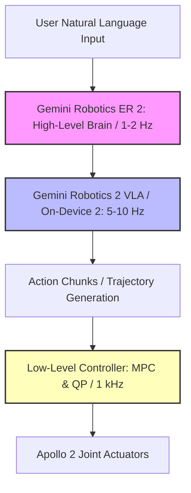

# The Humanoid Convergence: Inside Google DeepMind’s Gemini Robotics 2 and the Battle for Whole-Body Control

On July 30, 2026, Google DeepMind unveiled the Gemini Robotics 2 suite, marking a major architectural pivot in the embodied AI landscape. The release represents a concerted move away from narrow, task-specific policies toward unified, whole-body intelligence for humanoid and multi-jointed robots. 

The suite comprises three specialized models designed to distribute the computational burden of physical interaction:
1. **Gemini Robotics 2 (VLA):** A unified Vision-Language-Action model that maps sensory and textual inputs directly to motor control commands, managing full-body coordination (crouching, walking, balancing) under a single policy.
2. **Gemini Robotics ER 2 (Embodied Reasoning):** The high-level cognitive engine built on Gemini 3.5 Flash. It utilizes a 128k context window to perform sub-second task planning, multi-robot delegation, and natural language communication.
3. **Gemini Robotics On-Device 2:** A lightweight, quantized VLA model optimized to execute locally on edge hardware, bypassing network dependency and enabling local adaptation to new kinematics in just a few hours using fewer than 200 demonstrations.

To showcase this architecture, DeepMind deployed the suite on Apptronik’s next-generation Apollo 2 humanoid, configured with 22-degree-of-freedom SharpaWave tactile hands and Inspire dexterous grippers. In co-located demonstrations, the Apollo 2 cooperated with a Franka F3 Duo dual-arm manipulator, translating natural language commands like *"clear the workbench and sort the components"* into coordinated full-body walking, reaching, and fine-motor execution. However, behind the polished demonstrations, developers and researchers are confronting severe engineering challenges and a fundamental debate over the path to physical autonomy.

### The Frequency Chasm: Fast Action vs. Slow Reasoning

The core engineering hurdle of running large visual-autoregressive models on a humanoid is the control loop frequency. Classical bipedal locomotion requires high-frequency feedback loops—typically running between 500Hz and 1000Hz (1kHz)—to dynamically resolve balance equations, calculate joint torques, and adjust to external perturbations. Conversely, running a multi-billion parameter transformer like a VLA on edge TPU hardware typically limits inference rates to 5Hz–10Hz.

To bridge this gap, DeepMind implements a decoupled, multi-frequency control pipeline:
* **The Planning Layer (ER 2):** Operates at 1Hz–2Hz. It evaluates task progress using a new visual "moment-finding" classifier that achieves 91.3% accuracy, determining when sub-tasks are complete.
* **The Execution Layer (VLA / On-Device):** Evaluates visual inputs and generates short-horizon action "chunks" (trajectories spanning 100ms–200ms) at 10Hz.
* **The Dynamic Layer (Hardware Firmware):** Standard Model Predictive Control (MPC) and Quadratic Programming (QP) solvers run at 1kHz on the Apollo 2, interpolating the VLA's action chunks and executing high-frequency stabilization.

Despite this decoupling, the "chunking problem" remains a major bottleneck. If the execution layer experiences a latency spike due to local thermal throttling or network handover, the low-level controller is forced to extrapolate. In humanoid walking, a 100ms delay in correcting center-of-mass errors can lead to a catastrophic fall. Furthermore, executing actions in discrete chunks frequently causes micro-shuddering at chunk boundaries, introducing mechanical stress and accelerating joint wear.

### The Great Architecture Debate: End-to-End vs. Modular

The release of Gemini Robotics 2 has intensified the ongoing debate within the robotics community regarding the limits of end-to-end learning. 

Dr. Jim Fan, a leading researcher in foundation models for embodied AI, emphasizes the hardware constraints:
> *"The scaling laws of VLA models are real, but latency remains the final boss of physical AI. Decoupling reasoning from action loops is a step in the right direction, but running a transformer autoregressively in the control loop is still a luxury that edge hardware can barely afford without severe quantization."*

Yann LeCun, Chief AI Scientist at Meta, continues to criticize the tokenization of physical action:
> *"Autoregressive generation of actions is an illusion of control. It is prone to compounding errors and lacks a true predictive world model. Humanoids do not plan their balance by predicting the next token; they operate on energy-based models and physics constraints. Without representation-space predictive models, these systems will always fail in out-of-distribution physical scenarios."*

Conversely, Sergey Levine, a pioneer in offline reinforcement learning, argues that data volume is the primary solution, referencing Apptronik’s newly opened 90,000-square-foot "Robot Park" facility in Austin, Texas:
> *"The bottleneck isn't the architecture; it's the data. With Robot Park collecting fleet-scale, real-world interactions of Apollo 2, we are finally seeing the data loop that foundation models need. If you feed a unified VLA enough diversity of physical interactions, it will learn the implicit physics, bypassing the need for hand-crafted modular boundaries."*

Representing the classical control theory camp, MIT's Russ Tedrake warns against removing formal safeguards:
> *"Treating the VLA as a 'policy interface' is acceptable only if you have a classical, physics-based guardrail underneath. You cannot guarantee stability or safety on a wet warehouse floor using a transformer's attention map. We still need Lyapunov stability and control theory to govern the physical limits of the actuators."*

### Physical Hallucinations and the ASIMOV-Agentic Safety Benchmark

In digital environments, model hallucinations produce incorrect text or images. In physical deployments, a hallucinated command can cause a 160-pound humanoid to drive its actuators past their mechanical limits, resulting in hardware damage or injury to nearby personnel. 

To quantify and mitigate these risks, DeepMind introduced the **ASIMOV-Agentic** safety benchmark, hosting the open-source evaluation code and datasets on Hugging Face (`google/asimov_agentic`) under a CC-BY-4.0 license. The benchmark shifts the focus from digital alignment to agentic safety orchestration across three axes:

| Metric | Evaluation Parameter | Technical Execution |
| :--- | :--- | :--- |
| **Safety Refusal** | Rejection of unsafe commands | High-level planning filters block commands that violate kinematic or safety envelopes. |
| **Uncertainty Resolution** | Proactive intervention requests | Computes token-distribution entropy; if confidence falls below threshold, the robot halts and pings a human operator. |
| **Proximity Orchestration** | Human safety compliance | Integrates ER 2 visual tracking to detect humans within a 2-meter radius, triggering automatic low-velocity states or physical shutdowns. |

While ASIMOV-Agentic provides a standardized test suite, the debate persists on whether digital simulations can adequately prepare a robot for real-world entropy. Simulation environments struggles to model chaotic edge cases such as varying surface friction, sudden lighting shifts, sensor occlusion, or micro-slippage in five-fingered tactile tasks.

### Commercial Readiness Verdict

Gemini Robotics 2 represents a major step forward, but it is not yet ready for unmonitored commercial deployment on warehouse floors or retail environments. The computational overhead of running VLAs locally, the risk of physical hallucinations, and the lack of formal stability proofs mean that human-in-the-loop oversight remains mandatory. 

However, the continuous learning loop enabled by Apptronik’s Apollo 2 fleet in Austin and Google's multi-tier model stack indicates that the technical gap between cognitive reasoning and low-level physical control is narrowing rapidly.

***
