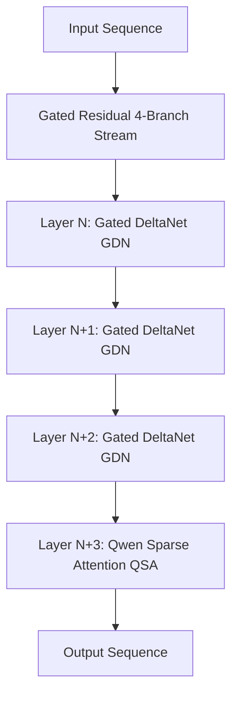
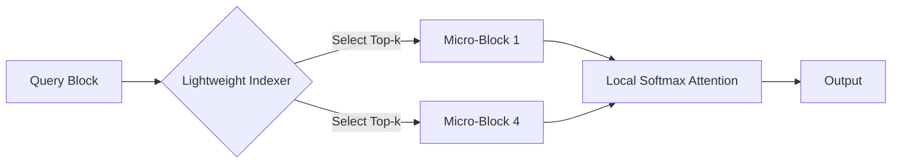
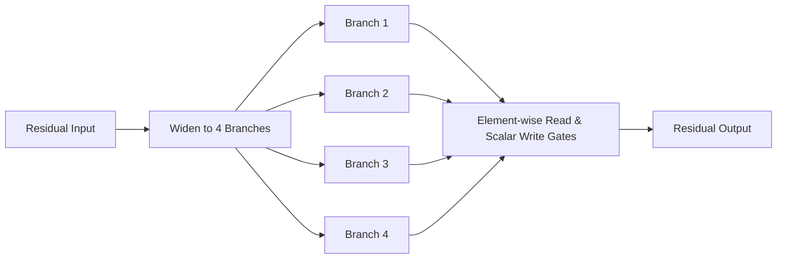

# **The Hybridization Frontier: How Qwen3.8-Flash and Gated DeltaNet-2 Just Rewrote the Economics of 1M-Token Contexts**

###

On August 26, 2026, Alibaba Cloud dropped a bombshell on the AI ecosystem with the release of the Qwen3.8-Flash series. The release features two primary models: **Qwen3.8-Flash-Next**, an open-weight architectural preview of the future Qwen4 family, and the **Qwen3.8-Flash** production API. 

The Qwen3.8-Flash-Next model is a 125 billion parameter Mixture-of-Experts (MoE) model that activates a slim **6 billion parameters** per token. Under the hood, however, it represents a massive departure from standard transformer architectures. By combining **Gated DeltaNet (GDN)** and **Qwen Sparse Attention (QSA)**, the model supports a native context window of 262,144 tokens (extensible to 1 million via YaRN) at a fraction of the compute and memory footprint of traditional dense transformers.

### The Architecture: Gated DeltaNet-2 Meets Qwen Sparse Attention

The central engineering challenge of long-context LLMs is the quadratic scaling of the Key-Value (KV) cache. In traditional Transformers, the cost of storing and retrieving keys and values grows as $O(L^2)$ with sequence length $L$. To circumvent this, the Qwen team has adopted a hybrid approach.

#### 1. Gated DeltaNet-2 (GDN-2)
GDN-2 is used in three out of every four layers to compress historical context into a fixed-size recurrent state, avoiding the growth of the KV cache. GDN-2 represents an evolution of linear attention that utilizes a "delta rule" to perform surgical, targeted memory updates:

$$S_t = S_{t-1} + (v_t - S_{t-1} k_t) \otimes k_t$$

Where $S_t \in \mathbb{R}^{d \times d}$ is the recurrent state, and $k_t, v_t$ are key and value vectors. In GDN-2, this update is modulated by decoupled, channel-wise erase and write gates:

$$S_t = (1 - g_{\text{erase}, t}) \odot S_{t-1} + g_{\text{write}, t} \odot \left( (v_t - S_{t-1} k_t) \otimes k_t \right)$$

This allows the model to erase outdated information and write new context with high precision, avoiding the cumulative noise that degrades standard linear attention or SSMs over long sequences.

#### 2. Qwen Sparse Attention (QSA)
While GDN-2 handles memory compression, pure recurrent architectures tend to suffer from a "state capacity bottleneck"—they cannot retrieve highly specific tokens from a vast history. To solve this, QSA is interleaved with GDN-2 (in the remaining one out of every four layers). 

Unlike token-sparse attention mechanisms, which suffer from poor GPU hardware utilization, QSA operates at a **micro-block granularity**. The sequence is partitioned into blocks of size $B$ (e.g., 64 tokens). A lightweight indexer computes routing scores between the current query block and historical key blocks, fetching only the top-$k$ relevant micro-blocks into local GPU memory for full softmax attention:

This hybrid layout ensures that the model retains near-perfect retrieval fidelity (the "needle-in-a-haystack" test) across 1 million tokens while reducing VRAM usage by over 80%.

As **Albert Gu**, co-creator of Mamba, noted on X:
> *"A pure SSM or linear attention model eventually hits a capacity wall for precise retrieval over long contexts. The hybrid path—combining linear attention like Gated DeltaNet-2 with sparse self-attention layers—is the pragmatist's solution: get 90% of the KV cache savings while keeping the search fidelity of full attention."*

FlashAttention creator **Tri Dao** agreed, emphasizing the hardware benefits of QSA:
> *"QSA's micro-block routing is brilliant because it groups tokens into dense sub-matrices. This makes the sparse operations hardware-friendly, running beautifully on Tensor Cores without the memory bandwidth bottlenecks of unstructured sparsity."*

### Gated Residuals and the N-gram Embedding Loophole

To stabilize the deep hybrid layers and scale model capacity, Qwen3.8-Flash-Next introduces two novel mechanisms:

#### Gated Residuals (GR)
Instead of standard residual connections, GR widens the residual stream into four parallel branches:

Each branch contains element-wise, data-dependent read gates and per-branch scalar write gates. This allows independent specialized feature extraction in parallel and improves training stability across the heterogeneous attention layers.

#### 51B N-gram Embedding Table
The model is supplemented by a massive 51B parameter lookup table containing 20 million entries of bigrams and trigrams. This table maps frequent local context directly to dense representations, bypassing the MoE routing entirely for local sequences. 

To run this model on consumer hardware, the N-gram table is offloaded to host system memory (or SSDs) and paged asynchronously during inference. A background thread predicts potential n-grams for upcoming tokens and prefetches their embeddings into GPU VRAM, overlapping the I/O transfer time with the GPU's MoE computation.

On r/LocalLLaMA, users are already demonstrating local deployments on unified memory rigs:
> *"The 51B N-gram table offloading is the real hack here. We're paging it out to NVMe on Mac Studio (M5 Ultra) and AMD Strix Halo rigs, and because it's paged asynchronously, token generation doesn't block. This is how we run a 176B parameter model on consumer hardware."* — **u/LocalModelDev**

### Training at 1/9th the Cost: Enter Muon

Perhaps the most startling metric shared by Alibaba is that Qwen3.8-Flash-Next achieved superior coding and agentic capabilities with only **1/9th the training cost** of its predecessor, Qwen3.7-Plus. This efficiency is largely attributed to the use of the **Muon optimizer**.

Muon (Momentum Orthogonalized by Newton-Schulz) optimizes the hidden 2D weight matrices by constraining updates to the Stiefel manifold, performing matrix orthogonalization rather than treating parameters as independent scalars:

$$W_{t+1} = W_t - \eta \cdot \text{Orthogonalize}(M_t)$$

The orthogonalization is solved via Newton-Schulz iterations:

$$X_{k+1} = \frac{1}{2} X_k (3I - X_k^T X_k)$$

Muon optimizes the hidden layers, while AdamW handles the embedding and final classifier projections.

**Andrej Karpathy** commented on the paradigm shift:
> *"AdamW has been the default for too long because it's robust, but it's fundamentally a scalar optimizer. Muon treats weights as matrices, which is how they actually process information. The speedup on llm.c was just the beginning."*

Muon's creator, **Keller Jordan**, added:
> *"Muon's ability to orthogonalize gradients via Newton-Schulz iterations avoids the spectral bias of AdamW. Seeing it scale from a 124M NanoGPT speedrun to a 125B production MoE is validation of Stiefel manifold optimization."*

### Geopolitical and Economic Implications

By serving Qwen3.8-Flash with a native 1M context window at a rock-bottom price, Alibaba is applying intense economic pressure on US-based API providers like OpenAI, Anthropic, and Google.

**Bindu Reddy**, CEO of Abacus AI, summarized the market implications:
> *"Alibaba Cloud's pricing for Qwen3.8-Flash is going to trigger another round of margin compression for US API vendors. You cannot compete with an MoE that only activates 6B parameters per token but delivers 125B capability over a 1M token window."*

Hugging Face CEO **Clement Delangue** framed it as a win for the open-source community:
> *"Qwen3.8-Flash-Next proves that open weights are not just catching up to closed models; they are pioneering the hybrid architectural frontier."*

As the open-weight frontier accelerates, the industry is shifting from pure dense transformers with giant KV caches to highly optimized, hybrid linear-attention MoEs. The launch of Qwen3.8-Flash has officially marked the start of this new paradigm.

***

## 4. Highlight

### 4.1 Key Questions
1. How does the Qwen3.8-Flash architecture maintain precise token retrieval over a 1-million-token context window without the storage overhead of a standard Transformer's KV cache?
2. What role does the Muon matrix optimizer play in achieving a 9x reduction in training costs compared to traditional AdamW-trained architectures?
3. How can a model of this scale (125B main parameter MoE + 51B N-gram table) run on consumer-grade hardware with unified memory or NVMe setups?

### 4.2 Highlight Text
Alibaba Cloud’s Qwen3.8-Flash-Next launch marks a paradigm shift in LLM design. Moving away from pure transformers, this 125B MoE uses a 3:1 hybrid layout of Gated DeltaNet-2 (linear attention with decoupled write/erase gates) and Qwen Sparse Attention (operating at micro-block granularity) to run 1M-token contexts with minimal VRAM overhead. Combined with a 51B N-gram embedding table designed for asynchronous host memory offloading and trained at 1/9th the cost of Qwen3.7-Plus using the matrix-orthogonalizing Muon optimizer, Qwen3.8-Flash has rewritten both the technical design and the geopolitical economics of foundation models.

### 4.3 Hashtags
#AI #MachineLearning #Qwen #OpenSource #DeepLearning #LLM
