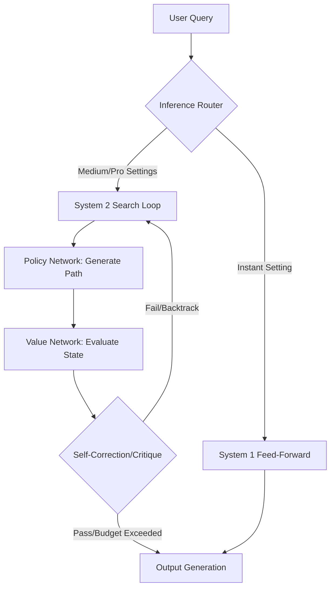

# **The Inference Compute Dial: Inside OpenAI’s GPT-5.6 System 2 Architecture, Luna's 80% Price Crash, and the Developer Cost Crisis**

###

In the second week of August 2026, the artificial intelligence landscape underwent a quiet but fundamental paradigm shift. Four days ago, on August 6, 2026, OpenAI rolled out its highly anticipated "reasoning slider" and the "Think" button for the GPT-5.6 family (Sol, Terra, and Luna), which originally launched in July 2026. 

This update is not just another UI enhancement. It represents the industry's first mainstream transition from "System 1" token generation—fast, reactive next-token prediction—to "System 2" cognitive runtimes, where models plan, search, reason, and self-correct before generating a final response. 

But as developers have rushed to integrate these new capabilities, they have hit a wall of architectural trade-offs, intense price wars, and a frustrating new failure mode: the "infinite thinking loop."

---

### Under the Hood: The Architecture of System 2 Inference
Historically, LLM generation has been computationally static. A model with $N$ parameters uses the same number of floating-point operations (FLOPs) per token, regardless of whether it is writing a greeting or solving a complex cryptographic puzzle. This is System 1: a single, feed-forward pass.

GPT-5.6 Sol, OpenAI's flagship tier, breaks this limitation by decoupling inference-time compute from parameter size. At the core of Sol's System 2 engine is a search-and-heuristic runtime that operates as a Monte Carlo Tree Search (MCTS) or specialized beam-search loop guided by two primary components:
1. **A Policy Network:** Recommends the next logical steps or sub-queries to explore.
2. **A Value Network:** Evaluates the viability of those steps, estimating the likelihood of reaching a correct solution.

The newly introduced **reasoning slider** is the user interface for this search-time budget. By adjusting the slider from **Instant** to **Medium**, **High**, **Extra High**, and **Pro**, developers are modifying the hyperparameters of the search tree:
* **`max_reasoning_tokens`**: The hard token limit allocated to the internal chain-of-thought (CoT).
* **`exploration_constant` ($c_{puct}$)**: Controls the width of the search tree (exploration vs. exploitation).
* **`verification_depth`**: The number of critique-and-refinement loops the value network performs on candidate code or reasoning paths.

When the slider is set to **Instant**, the model bypasses System 2 entirely, functioning as a standard auto-regressive model. When set to **Pro**, the engine is authorized to generate thousands of internal "reasoning tokens" (which are billed as output tokens) to explore deep solution spaces, backtrack when a path fails, and synthesize a verified response. Free and Go users access a streamlined version of this via the **"Think" button**, which triggers a fixed, moderate-effort search path powered by the lightweight GPT-5.6 Luna model.

Former OpenAI researcher Andrej Karpathy commented on the technical shift on X:
> *"System 1 is a reflexive, single-pass forward propagation. System 2 is an active runtime. The reasoning slider is essentially soft-programming the compute graph. We are adjusting the clock speed of the search engine, letting the model trade time and compute for accuracy."*

---

### The Token Price War: Luna’s $0.20 Revolution
Simultaneously, the economics of LLM APIs have been upended. On July 30, 2026, OpenAI slashed the API pricing for **GPT-5.6 Luna** by a massive 80%, dropping it to **$0.20 per million input tokens** and **$1.20 per million output tokens**. 

| Model Tier | Input Price (per 1M tokens) | Output Price (per 1M tokens) |
| :--- | :--- | :--- |
| **GPT-5.6 Sol** | $5.00 | $30.00 |
| **GPT-5.6 Terra** | $2.00 | $12.00 |
| **GPT-5.6 Luna** | $0.20 | $1.20 |

This price drop, combined with prompt caching (which lowers repeated read costs to $0.02 per million tokens) and batch mode ($0.10 input / $0.60 output), has radically altered developer architecture. 

Rather than running entire pipelines on Sol, developers are adopting a hierarchical routing model. Sol or Anthropic's Claude 5 is used as a high-level "architect" to decompose a problem and draft a plan, while the execution of individual, high-volume sub-tasks is offloaded to the cheap, fast Luna.

Prominent VC Paul Graham noted on X:
> *"At $0.20 per million input tokens, GPT-5.6 Luna makes agentic loops cheaper than human breath. If you are building a SaaS company and your margins aren't expanding, you're routing your tokens wrong."*

---

### The Battleground: GPT-5.6 Sol vs. Anthropic's Claude 5
Despite OpenAI's pricing offensive, the developer community on Reddit and X is highly polarized, pitting GPT-5.6 Sol against Anthropic’s Claude 5 family (specifically **Opus 5** and **Sonnet 5**).

While OpenAI has opted for a manual reasoning slider, Anthropic’s Claude 5 features **adaptive thinking** by default. Rather than forcing the user to manually guess the required reasoning budget, Claude 5 dynamically scales its internal thinking tokens based on its own confidence score and task complexity.

Anthropic CEO Dario Amodei explained this design philosophy:
> *"A manual slider is a primitive abstraction. The model should decide how much effort is required. With Claude 5, the compute budget is dynamically allocated per task. An expert programmer doesn't have a physical dial on their head; they just think longer when the problem is hard."*

In coding-agent environments like Cursor and Claude Code, developers are split. Pro-OpenAI users argue that Sol in "Pro" mode achieves higher absolute accuracy on niche competitive coding tasks. However, many developers prefer Claude 5 Sonnet for day-to-day work, citing its superior context-window coherence and more predictable latencies.

---

### The Credit Drain: The "Thinking Loop" Crisis
The transition to System 2 has introduced a painful new user experience failure mode: the **thinking loop**. Because MCTS and self-correction paths generate actual tokens, OpenAI bills these internal reasoning tokens at the standard output rate ($30.00 per million for Sol). 

In agentic loops—where an agent is recursively trying to run, test, and debug code—models frequently get stuck. If a model encounters a bug that lies outside its training distribution or parametric knowledge, it enters a repetitive cycle: trying a solution, failing the test, self-critiquing, and trying the exact same solution again under a slightly different variable name.

On the `r/LocalLLaMA` and `r/sillytools` subreddits, developers are sharing horror stories of massive credit drainage. One developer reported:
> *"We had to implement an emergency circuit breaker in our LangChain setup. Sol in 'Pro' mode went into a 4,500-token self-referential loop trying to fix a minor CSS alignment bug, costing $0.15 for a single run and taking 90 seconds, only to output the exact same broken code."*

Keras creator François Chollet explained why these loops occur:
> *"Thinking loops are the inevitable dead end of pure search without representation. If the model's parametric space doesn't contain the generalization rule, spending 10,000 reasoning tokens on MCTS is just search-based hallucination. It's a brute force illusion that costs real money."*

To mitigate this, developers are building custom middleware that monitors reasoning token counts in real time, triggering a fallback or halting the run if the model spends more than 1,000 reasoning tokens without progressing.

---

## 4. Highlight

### 4.1 Key Questions
1. How does OpenAI's reasoning slider translate manual settings into algorithmic constraints for inference-time search?
2. What are the economic implications of GPT-5.6 Luna’s 80% price reduction on multi-agent software architectures?
3. Why do System 2 models get trapped in costly, repetitive "thinking loops" during autonomous coding tasks?

### 4.2 Highlight Text
OpenAI's GPT-5.6 reasoning slider and "Think" button represent a critical transition from System 1 token generation to System 2 cognitive runtimes. By allowing users to scale inference compute, OpenAI has unlocked unprecedented task accuracy, but at a cost. Developers complain that Sol's "Pro" mode frequently falls into repetitive, expensive "thinking loops" that drain credits without producing results. Meanwhile, Luna's 80% price crash to $0.20/1M input tokens has triggered a massive price war, forcing a shift to hierarchical routing and custom developer-side circuit breakers.

### 4.3 Hashtags
#AI #InferenceCompute #GPT5 #Claude5 #System2 #LLMEconomics
