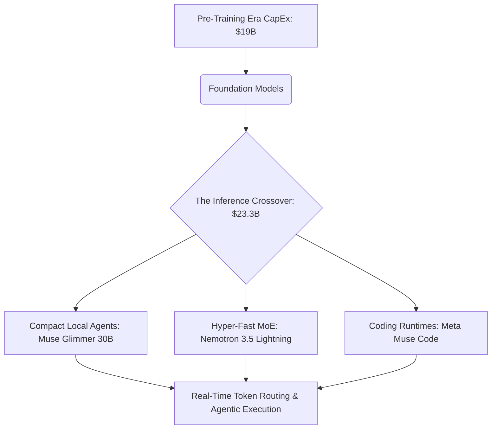

# The Inference Crossover: Why Inference Spending Surpassed Training at $23.3B and the Architecture of the Post-Scaling Era

##

For the past three years, Silicon Valley has been locked in a high-stakes, capital-intensive race: who can raise the largest round to buy the most Nvidia B200s and train the largest dense transformer. But mid-2026 has brought a seismic economic shift that marks the end of the raw pre-training era.

According to projections released by Gartner in August 2026, global enterprise spending on **AI inference** is projected to reach **$23.3 billion** for the full year, officially eclipsing spending on **frontier model training ($19 billion)** for the first time in history. 

This is not just a statistical milestone. It represents a fundamental transition in the AI value chain. The massive CapEx of model pre-training is giving way to the operational OpEx of real-time, long-running agentic workloads. As a direct consequence, overall worldwide spending on AI-optimized Infrastructure as a Service (IaaS) is projected to grow by **96% in 2026, reaching a staggering $42 billion**.



---

### The Scaling Wall and the Shift to Test-Time Compute

For years, the industry operated under the assumption of power-law scaling: more compute and more data during pre-training predictably yielded smarter models. However, pre-training compute ($C_{\text{train}} \approx 6ND$, where $N$ is parameter count and $D$ is dataset size in tokens) has hit a double wall of data exhaustion and thermal limits.

As Meta Chief AI Scientist Yann LeCun has repeatedly argued:
> "Autoregressive LLMs are essentially auto-complete on steroids. Scaling them up by adding parameters and web crawl text will not lead to true world models or human-level intelligence. We need architectures that model the physical world, not just text."

This sentiment is reflected in the market. The performance delta between massive proprietary models (like GPT-5.4 or Claude Opus 4.6) and open-weights alternatives has collapsed to single-digit percentages. Base models are officially a commodity, and token prices have plummeted by 90% over the last 18 months in a race to the bottom.

Instead of scaling pre-training compute, the frontier has pivoted to **test-time compute (inference-time scaling)**. By utilizing Reinforcement Learning with Verifiable Rewards (RLVR), models are trained to search, backtrack, and reason during inference.

OpenAI's Noam Brown notes:
> "Allowing a model to think for 20 seconds before answering a difficult math or coding question can yield a capability bump equivalent to scaling the pre-training run by 100,000x. The bottleneck is no longer how much we can train, but how efficiently we can run reasoning loops during inference."

Former OpenAI researcher Andrej Karpathy echoes this:
> "In 2025/2026, we saw the rise of reasoning models powered by RLVR. The model trades inference-time compute for accuracy, generating search traces and self-correcting. We are moving from static generation to agentic search."

---

### The New Class of Agentic Edges: Muse Glimmer and Nemotron 3.5 Lightning

This economic reality has driven the release of highly optimized, compact model architectures designed for low-latency, high-throughput agentic execution. Two models released this month define the state-of-the-art:

#### Meta Muse Glimmer 30B (Released August 10, 2026)
Muse Glimmer 30B is an open-weight (Apache 2.0) dense causal language model optimized for "always-on" local execution on consumer hardware.
*   **The 1.8B Perception Encoder:** Unlike standard LLMs that rely on external vision models, Muse Glimmer embeds a 1.8B-parameter perception encoder directly into the model's projection layers. This allows the model to ingest interleaved screenshots, system logs, and DOM trees natively.
*   **Dynamic 4-bit Quantization:** Muse Glimmer is designed to fit into 24GB VRAM envelopes. Using dynamic activation-aware quantization (AWQ), the model maintains 98% of its FP16 reasoning capability.
*   **DFlash Speculative Decoding:** To solve the latency hurdle, Glimmer uses a lightweight drafting model (DFlash) to achieve generation speeds of over 120 tokens/sec on consumer GPUs.

#### NVIDIA Nemotron 3.5 Lightning (Released August 11, 2026)
NVIDIA's answer to enterprise agentic workflows is a 30B Mixture-of-Experts (MoE) model.
*   **3B Active Parameters:** Although the model has a 30B parameter capacity, it routes tokens such that only 3B parameters are active per forward pass. This reduces the FLOPs per token by 90%, enabling massive concurrency.
*   **1-Million Token Context:** Nemotron 3.5 Lightning supports an ultra-large context window, allowing agents to hold entire codebases or transaction histories in-memory.
*   **NeMo Switchyard Integration:** The model is natively integrated with NeMo Switchyard, an open-source framework that manages dynamic model routing based on semantic complexity and token budgets.

---

### The Runtime is the Agent: Meta's Muse Code and "Replay-Exact" Event Logs

The transition to inference-heavy architectures is best exemplified by terminal-based coding agents like **Meta's Muse Code** (released in beta on August 5, 2026). Powered by the **Muse Spark 1.2** model, Muse Code is designed to run repository-scale tasks autonomously.

Historically, the major hurdle for coding agents has been state synchronization and crash recovery. If a network connection drops or an agent runs out of tokens halfway through a refactor, the state is lost.

Muse Code solves this with an append-only, local event log that enforces a **replay-exact, restart-safe runtime**. The agent records every tool execution, file diff, and model output. If the system crashes, it parses the log to reconstruct the exact state without re-executing API calls or wasteful token generation.

We can see this architectural pattern in [replay_agent.py](file:///Users/vzl/.gemini/antigravity-cli/brain/af4b7153-6b8b-4384-aa32-47f400755ddd/scratch/replay_agent.py), where the [`ReplayExactRuntime`](file:///Users/vzl/.gemini/antigravity-cli/brain/af4b7153-6b8b-4384-aa32-47f400755ddd/scratch/replay_agent.py#L5-L12) class implements a write-ahead event log to recover state mutations inside the [`execute_step`](file:///Users/vzl/.gemini/antigravity-cli/brain/af4b7153-6b8b-4384-aa32-47f400755ddd/scratch/replay_agent.py#L38-L64) method:

```python
# From replay_agent.py: Ensuring deterministic state recovery
def execute_step(self, step_name: str, action: Callable[[], Any]) -> Any:
    # Look for existing event in log to bypass execution
    for event in self.event_history:
        if event.get("step_name") == step_name:
            print(f"[REPLAY] Replaying step '{step_name}' from log.")
            return event["payload"].get("result")

    # Step not in log, execute it
    result = action()
    # Log the result before returning (Write-Ahead Logging)
    ...
```

By ensuring that long-horizon tasks are deterministic and auditable, enterprise teams can run agents for hours, scaling inference compute horizontally.

---

### The Enterprise Reality: Token Routing and the "Token-Gaming" Dilemma

As enterprises deploy hundreds of agents, managing the token budget has become a critical operational challenge. This has led to the rise of specialized middleware like **NeMo Switchyard** and token routing frameworks.

We can model this dynamic routing logic in [nemo_router.py](file:///Users/vzl/.gemini/antigravity-cli/brain/af4b7153-6b8b-4384-aa32-47f400755ddd/scratch/nemo_router.py), where the [`TokenRouter`](file:///Users/vzl/.gemini/antigravity-cli/brain/af4b7153-6b8b-4384-aa32-47f400755ddd/scratch/nemo_router.py#L4-L10) class calculates utility scores inside the [`route_request`](file:///Users/vzl/.gemini/antigravity-cli/brain/af4b7153-6b8b-4384-aa32-47f400755ddd/scratch/nemo_router.py#L11-L38) method:

```python
# Heuristic routing utility calculation in nemo_router.py
score = (config["capability_score"] * 10) - (cost * 1000) - (expected_latency / 100)
if expected_latency > target_latency_ms:
    score -= 50
```

However, this routing layer is facing a new exploit. Martin Casado, General Partner at a16z, has warned about **"token-gaming"** in enterprise systems:
> "We are seeing enterprise systems and agents exploit the economics of token consumption. System integration bottlenecks are occurring because agents are gaming routing layers—calling cheap models recursively to bypass billing thresholds, which degrades performance, or bloating context windows with redundant prompts. The infrastructure layer (like gateway APIs) must evolve to police these interactions."

Altimeter Capital's Brad Gerstner points to the hardware bottleneck:
> "AI distribution has become incredibly compute-intensive. It's no longer just a model training problem; it's a memory bandwidth and power constraint problem. We are seeing data centers scramble to secure energy contracts just to handle the massive onslaught of inference tokens. The unit economics of inference will dictate who wins the enterprise software stack."

This scramble for hardware infrastructure has already claimed victims. In late July 2026, Leopold Aschenbrenner’s hedge fund, **Situational Awareness LP**, which had surged to $45 billion in AUM, underwent a dramatic liquidity crisis. The fund collapsed after making highly leveraged bets on hardware and memory infrastructure stocks (SanDisk, SK Hynix, and CoreWeave), losing 67% in a matter of weeks and forcing a massive public equity liquidation to Citadel. It serves as a stark reminder of the extreme volatility in the AI supply chain.

---

### The Synthesis: Wrapper vs. Native Agentic Workflows

The ultimate debate on Reddit (specifically r/MachineLearning) and X.com centers on the differentiation of AI applications: are startup products just thin "wrappers" on top of foundation models, or are they "native agentic" systems?

| Feature | Thin API Wrapper | Native Agentic Architecture |
| :--- | :--- | :--- |
| **Model Coupling** | Hardcoded to a single foundation model API. | Dynamic routing (e.g., NeMo Switchyard) across MoE and local models. |
| **State Management** | Ephemeral, stateless chat requests. | Persistent, append-only, replay-exact event logging (e.g., Muse Code). |
| **Tool Execution** | Basic function-calling parsing. | Multi-step execution loops with self-correcting validation and RLVR. |
| **Inference Footprint** | Cloud API call only. | Hybrid cloud/local execution (e.g., dynamic 4-bit quantization on consumer VRAM). |

The crossover of inference spending proves that the value is migrating. Enterprises are no longer paying for the intellectual property of a foundation model; they are paying for the execution of workflows. Startups that rely on thin wrappers are being crushed by model commoditization and API price drops. Meanwhile, those building native agentic runtimes with robust local recovery systems and intelligent token routing are capturing the $23.3 billion inference gold rush.

The era of training-first AI is behind us. The era of the agentic runtime has officially begun.

---

# 4. Highlight

## 4.1 Key Questions
1. What does the $23.3B crossover in inference spending mean for the future of frontier AI model training?
2. How are compact agentic architectures like Muse Glimmer 30B and Nemotron 3.5 Lightning redefining local and cloud compute unit economics?
3. Is the AI sector hitting a hard physical scaling wall, or is it transitioning into a mature post-scaling operational era?

## 4.2 Highlight Text
The AI industry has hit a massive structural crossover: enterprise spending on AI inference ($23.3B) has officially surpassed training ($19B) as foundation models become commoditized. With IaaS spending skyrocketing 96% to $42B, the frontier is shifting from pre-training compute to test-time compute and agentic runtimes. Compact architectures like Meta's Muse Glimmer 30B and NVIDIA's Nemotron 3.5 Lightning are leading this charge, while coding agents like Muse Code introduce restart-safe, "replay-exact" execution logs. The value has migrated from the weight-holders to the workflow-owners. Are you ready for the post-scaling era?

## 4.3 Hashtags
#AIEconomics #InferencePivot #AgenticAI
