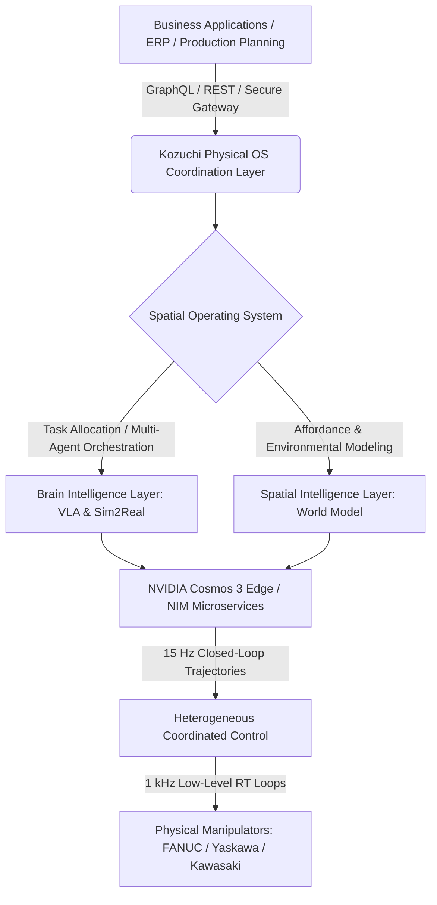

# **The Japanese Robotics Rebellion: Inside Fujitsu’s Kozuchi OS, NVIDIA Cosmos, and the Quest for Sovereign Physical AI**

##

In late July 2026, the global robotics landscape shifted on its axis in Tokyo. A landmark coalition spearheaded by Fujitsu and Japan’s mechatronics triumvirate—FANUC, Yaskawa Electric, and Kawasaki Heavy Industries—announced a unified push to develop a cooperative control platform for "Physical AI." The strategic goal is as clear as it is urgent: mitigate Japan’s acute labor deficit and rapidly aging demographic by embedding advanced cognitive intelligence directly into heavy industrial hardware. 

The software centerpiece of this initiative is the **Fujitsu Kozuchi Physical OS**, a sovereign, open control platform designed to bridge digital world models and real-world industrial environments. Backed by NVIDIA's newly unveiled **Cosmos 3 Edge** model and the **Omniverse** simulation stack, this project seeks to challenge the traditional, closed software silos of individual robot manufacturers, potentially defining the global standard for the next generation of automation.

---

### The Architecture: Brains, Space, and the Secure Gateway
At its core, the Kozuchi Physical OS is a spatial operating system. Unlike traditional robotic control setups that operate on rigid, hard-coded routines, Kozuchi separates high-level task planning from execution, utilizing a twin-layer intelligence structure:



1. **The Brain Intelligence Layer:** Handles cognitive adaptability. This layer runs Vision-Language-Action (VLA) models co-trained on heterogeneous datasets (such as the Open X-Embodiment dataset). By using imitation and reinforcement learning, it allows robots to interpret raw video and semantic text to execute tasks they were not explicitly programmed to perform.
2. **The Spatial Intelligence Layer:** Constructs a dynamic, real-time "spatial world model." Rather than relying on simple coordinates, it maps "affordances"—understanding what actions are physically possible on an object (e.g., whether a box can be grasped, slid, or rotated)—while utilizing socio-physics simulations to navigate safely around human operators.

For enterprise environments, the Kozuchi Physical OS integrates directly with ERP and logistics networks. High-level business instructions (e.g., *"Reallocate line 3 output to bin B due to shipping delay"*) flow through a **Secure Inter-Agent Gateway**. This gateway prevents sensitive manufacturing IP from leaking back to public cloud models, utilizing containerized **NVIDIA NIM microservices** for secure local orchestration.

---

### The Ultimate Engineering Hurdle: 15 Hz AI vs. 1 kHz Hardware Loops
For all the excitement surrounding Physical AI, industrial engineers have pointed to a glaring technical mismatch: **control loop frequency**. 

Traditional Programmable Logic Controllers (PLCs) and mechatronic systems operate at **1 kHz (1ms latency)** to guarantee real-time safety, collision avoidance, and determinism. Vision-Language-Action models and world models, however, are computationally heavy. Even running on-device via NVIDIA's latest edge silicon, closed-loop inference speeds for foundation models like **Cosmos 3 Edge** cap out at **15 Hz (~67ms latency)**.

On Reddit’s r/robotics and X.com, this latency gap is the subject of fierce debate. As one prominent robotics researcher noted:
> *"You cannot run a safe, dynamic manipulator on 15 Hz inference alone. If a human steps into the path of an industrial robot arm, a 67ms decision loop is the difference between a minor pause and a catastrophic accident."*

Kozuchi resolves this discrepancy by employing a hybrid control stack. The 15 Hz Cosmos 3 Edge model acts as a "high-level trajectory planner," continuously predicting the environment's state and generating target path corridors. These corridors are fed down to a local, 1 kHz mechatronic controller. The 1 kHz loop handles real-time motor torque control, force feedback, and immediate safety overrides, operating within the boundaries set by the VLA model. 

---

### The Sim2Real Pipeline: NVIDIA Omniverse and Physics-Informed AI
Training robots in the physical world is slow, expensive, and dangerous. The Kozuchi OS relies heavily on a high-fidelity **Sim2Real (Simulation-to-Real)** pipeline powered by **NVIDIA Omniverse** and the **Isaac** platform. 

```
[Real World: Physics & Textures] ---> [NVIDIA Omniverse Digital Twin]
                                             |
                                    (Domain Randomization)
                                             |
                                  [Isaac Gym Parallel RL]
                                             |
[Real-world Deployment] <--- [Sim2Real Policy Transfer (zero-shot)]
```

By generating massive amounts of synthetic data in simulated environments, robots learn complex manipulation skills before touching a factory floor. To overcome the "Sim2Real gap"—where differences in physical properties cause virtual policies to fail in reality—Kozuchi utilizes **domain randomization** (varying friction, mass, lighting, and sensor noise during simulation) combined with **physics-informed neural networks (PINNs)**. 

PINNs embed physical equations (such as Euler-Bernoulli beam theory and Navier-Stokes equations) directly into the AI’s loss function. In predictive maintenance applications, this allows the OS to compare real-world vibration data from FANUC or Yaskawa joints against the physics-informed model, identifying micro-structural fatigue and predicting failure points before sensors detect any visible deviation.

---

### Edge Compute: The Cosmos 3 Edge Engine
Deploying these workloads at the industrial edge requires immense local computational power. Cloud-based inference introduces unacceptable latencies and data gravity concerns. The Kozuchi OS runs locally on NVIDIA's **Cosmos 3 Edge** model, a 4-billion-parameter "omni-model" launched at SIGGRAPH 2026. 

Cosmos 3 Edge uses a specialized **Mixture-of-Transformers (MoT)** architecture. The architecture splits processing between two distinct neural pathways:
*   An **Autoregressive Tower** for logical, sequential reasoning.
*   A **Diffusion-based Generative Tower** to predict upcoming video frames and construct spatial world states.

Running locally on NVIDIA Jetson Thor or T2000/T3000 modules, the MoT architecture enables the robot to "imagine" the physical consequences of its actions in real time, executing closed-loop vision-action policies with zero cloud dependencies.

---

### Bypassing the Proprietary Silos: The Sovereign OS Strategy
Strategically, the Fujitsu Kozuchi Physical OS represents a coordinated attempt by Japanese industry to reclaim the software layer of automation. Historically, robotics giants like Yaskawa, FANUC, and Kawasaki have maintained walled-garden ecosystems, locking customers into proprietary programming languages and controller hardware. 

By banding together under the soft-backed **Cosmos Coalition**—which includes SoftBank Corp, Preferred Networks, SoftBank, and Turing—these mechatronics leaders are embracing an open-source, unified software platform. During his visit to Japan, NVIDIA CEO Jensen Huang highlighted this shift, stating:
> *"Japan’s unmatched mechatronics legacy, combined with local, sovereign AI foundation models, positions the nation to lead the next industrial revolution. Physical AI requires local understanding and local control."*

If the Kozuchi Physical OS succeeds in its upcoming proof-of-concept tests (scheduled for September 2026 at Fujitsu's own manufacturing facilities), it could establish a new global standard for plug-and-play industrial automation, rendering proprietary robot-programming languages obsolete and shifting the industry's value from hardware components to intelligent spatial orchestration.

***

# 4. Highlight

## 4.1 Key Questions
1. How does Fujitsu’s Kozuchi Physical OS resolve the latency gap between 15 Hz edge AI inference and 1 kHz real-time hardware safety loops?
2. Can open, sovereign spatial operating systems break the proprietary vendor lock-in maintained by industrial robotics giants like FANUC, Yaskawa, and Kawasaki Heavy Industries?
3. What role does NVIDIA's Cosmos 3 Edge Mixture-of-Transformers (MoT) architecture play in running local, zero-cloud physical AI at the industrial edge?

## 4.2 Highlight Text
The future of industrial automation belongs to Physical AI, but the road there is blocked by a massive engineering clash: the 15 Hz inference limit of foundation models vs. the 1 kHz real-time loops required by heavy machinery. Fujitsu’s new Kozuchi Physical OS—backed by the NVIDIA Cosmos Coalition—tackles this mismatch with a hybrid spatial architecture. By bridging high-level VLA trajectory planning with local mechatronic safety loops, this open OS bypasses legacy vendor lock-ins to orchestrate multi-vendor hardware. Japan is betting its mechatronics crown on sovereign AI.

## 4.3 Hashtags
#PhysicalAI #Robotics #NVIDIACosmos #KozuchiOS #IndustrialAutomation #Sim2Real
