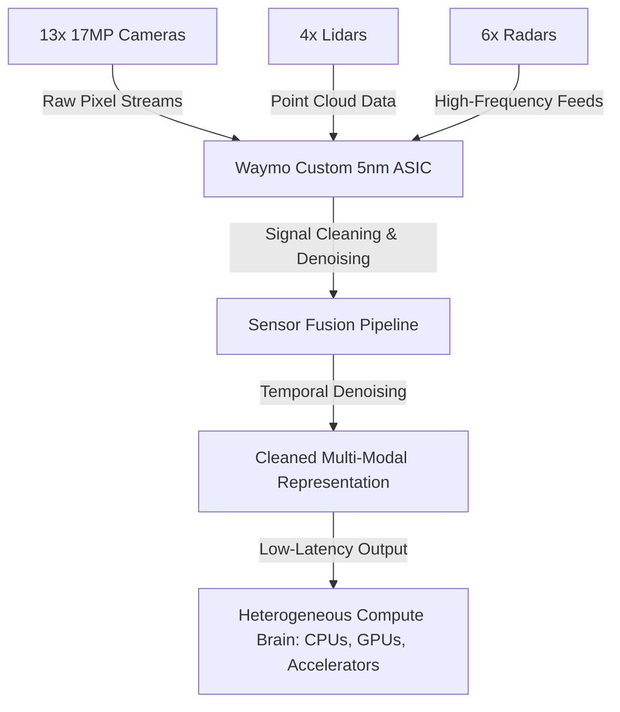
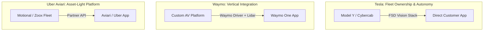

# **The Las Vegas Robotaxi Gold Rush: NTA Unlocks Clark County as Waymo Unveils Custom 5nm Sensor ASIC**

##

The autonomous vehicle (AV) race just shifted into high gear in Southern Nevada. In a marathon session, the Nevada Transportation Authority (NTA) unanimously approved commercial Autonomous Vehicle Network Company (AVNC) permits under **NRS Chapter 706B** for **Tesla Robotaxi, LLC**, **Waymo, LLC**, and **Aviari Services, LLC** (a wholly owned subsidiary of Uber Technologies). 

This regulatory shift authorizes an unprecedented expansion of commercial driverless fleets across Clark County, including the high-traffic corridors of the Las Vegas Strip and the surrounding county. While the permits include Harry Reid International Airport in their geographic scope, the operators must still secure separate, specific authorizations from the Clark County Department of Aviation before conducting passenger pickups or drop-offs on airport grounds.

The sheer scale of the 12-month fleet authorizations represents a massive leap forward:
* **Tesla:** Authorized for up to 5,000 vehicles.
* **Waymo:** Authorized for up to 1,000 vehicles.
* **Aviari (Uber):** Authorized for up to 1,000 vehicles.
* **Zoox (Amazon):** Currently holds an active permit for 100 vehicles in the area.

In parallel with this commercial expansion, Alphabet's Waymo detailed its custom-designed 5nm application-specific integrated circuit (ASIC), manufactured by TSMC. Engineered to handle the raw data from Waymo's 6th-generation Driver, this custom chip marks a major milestone in the optimization of edge compute for autonomous driving.

---

### The Regulatory Blueprint: Navigating the NTA's Mandates

The NTA's approval marks a massive pivot from its initial, highly cautious stance. In July 2026, the regulator had granted Tesla a restrictive interim permit capped at just 10 vehicles, confined to a limited Strip corridor, limited to a 45 mph speed ceiling, and banned from airport operations. The new AVNC permits lift these restrictions, allowing full-speed operations throughout the county subject to standard commercial carriage rules.

However, the NTA is not handing out a blank check. To transition from permit approval to commercial operation—a process expected to take roughly 30 days—each company must fulfill strict compliance conditions:
1. **First Responder Protocols:** Operators must establish a dedicated, 24-hour emergency contact line for first responders and share real-world interaction protocols to manage stalled or "bricked" vehicles.
2. **Data and App Audits:** Companies must submit their rider-facing application architectures for regulatory review, fare tariff rates, and provide clear documentation of vehicle safety inspections.
3. **The Insurance and Liability Pivot:** Under **NRS Chapter 706B**, commercial AVNCs are required to carry a minimum of $1.5 million in liability insurance. 

Because these vehicles operate without a safety driver, legal experts note that liability is shifting. As one legal scholar noted on Reddit’s r/selfdrivingcars: *"When a robotaxi crashes, it's no longer a standard driver-negligence dispute. It becomes a complex product liability case. The software developer, the hardware manufacturer, and the fleet operator will share the liability spotlight."*

---

### Waymo's Silicon Play: Under the Hood of the 5nm TSMC ASIC

While Tesla scales its fleet footprint, Waymo is focusing on computing efficiency at the edge. The company recently detailed its new custom 5nm ASIC, manufactured by TSMC. This silicon represents a transition away from the power-hungry and expensive Intel FPGAs (Field Programmable Gate Arrays) previously used in the sensor-processing pipeline.

#### The Ingestion Pipeline
The 6th-generation Waymo Driver utilizes a streamlined, cost-optimized sensor suite:
* **13 High-Resolution Cameras:** Featuring 17-megapixel imagers providing overlapping 360-degree coverage.
* **4 Lidar Units:** Providing dense 3D point clouds.
* **6 Radar Units:** Delivering robust velocity and range tracking in all weather conditions.

Processing this massive, multi-modal datastream in real time requires immense bandwidth and ultra-low latency. Waymo's custom ASIC serves as a specialized "front-end" processor. It ingests the raw pixel streams, lidar point clouds, and radar returns directly at the physical interface layer.

#### Key Capabilities of the ASIC:
* **Over 1,000 TOPS (System-Level):** The compute system, deploying these ASICs in parallel, delivers over 1,000 trillion operations per second (TOPS) of machine-learning performance dedicated to front-end processing and ML models.
* **Temporal Denoising:** The ASIC runs neural networks designed to clean up sensor feeds over time, which is critical for handling the visual noise, reflections, and low-light conditions of the Las Vegas Strip at night.
* **Sensor Fusion:** By performing early-stage spatial and temporal alignment on the ASIC, Waymo fuses camera, lidar, and radar data before passing the cleaned representation to the vehicle's core decision-making engine.
* **Native Redundancy:** To satisfy safety-critical requirements, the compute architecture behaves like two independent engines operating in parallel. Both ASICs process the full sensor workload simultaneously; if one chip experiences a thermal or electrical fault, the other maintains seamless control. The unit is liquid-cooled, ruggedized against vibration, and integrated into the vehicle's main coolant loop.

---

### The Silicon Face-Off: Custom ASICs vs. Off-the-Shelf Accelerators

Waymo’s decision to build its own front-end ASIC highlights a divergence in autonomous driving compute architectures. By implementing custom silicon, Waymo achieves tight integration between its sensor hardware and perception algorithms, minimizing latency.

However, Waymo is not building a fully vertical, in-house compute stack. It employs a **heterogeneous computing strategy**. The custom ASIC acts as the gatekeeper, cleaning and fusing data, while merchant silicon from AMD, Nvidia, Samsung, Micron, SanDisk, and Socionext handles general-purpose processing, storage, and high-level path planning.

Here is how Waymo's system compares to industry-standard and upcoming platforms:

| Metric / Feature | Waymo 6th-Gen Compute | NVIDIA Jetson Orin | NVIDIA Jetson Thor | Tesla AI5 (HW5) |
| :--- | :--- | :--- | :--- | :--- |
| **Peak Performance** | >1,000 TOPS (System-Level Combined) | Up to 275 TOPS (INT8) | ~1,035 TFLOPS (FP8) | ~2,000–2,500 TOPS (Est.) |
| **Silicon Source** | Custom ASIC (TSMC 5nm) | Merchant SoC (Ampere) | Merchant SoC (Blackwell) | Custom SoC (TSMC 3nm/4nm) |
| **Sensor Philosophy** | Multi-Modal Fusion | General Robotics | General Robotics | Pure Vision (No Lidar) |
| **Compute Role** | Front-end Sensor Processing | Central Compute | Central Compute | Central End-to-End Brain |

Tech analyst Patrick Moorhead commented on Waymo's approach on X: *"Waymo’s ASIC announcement isn't about replacing Nvidia or AMD. It's a heterogeneous play. By hardening the sensor-ingestion pipeline in custom 5nm silicon, they free up the general-purpose GPU and CPU blocks for complex planning and ML routing. It's a pragmatist's path to lower bill-of-materials (BOM) costs."*

Andrej Karpathy, former Director of AI at Tesla, has long argued that general-purpose silicon is a bottleneck for real-world edge robotics. In past technical discussions, Karpathy has noted that when you control both the neural network architecture and the silicon design, you can strip away the unnecessary overhead of general-purpose GPUs. You build exactly the mathematical operators you need, which is how you get to the 1,000+ TOPS domain without cooking the car's thermal budget.

In contrast, Tesla’s AI5 (Hardware 5) represents a fully vertical, end-to-end compute strategy. Designed to run Tesla's vision-only neural networks, AI5 handles everything from raw pixel ingestion to path generation on a single custom SoC, eliminating the need for separate lidar-processing pipelines.

---

### Operational Warfare: Tesla's Scale vs. Uber's Platform vs. Waymo's Verticals

As these fleets prepare to deploy in Las Vegas, three distinct business models are clashing:

#### Tesla: The Scaling Powerhouse
With an NTA authorization for 5,000 vehicles, Tesla has the largest permitted ceiling. The company plans to launch its commercial service using Model Y vehicles before transitioning to the custom-built Cybercab. 

During the NTA hearing, Eric Early, Tesla’s Cybercab Chief Engineer, managed expectations regarding deployment speed: *"I don't think we'll be in a position by this time next year to deploy 5,000 vehicles... I think we would be extremely happy and satisfied if we could get ourselves up to 2,500, maybe a bit higher than that in the next year."* Still, a 2,500-vehicle fleet would immediately make Las Vegas the largest autonomous network in the world. On X, Tesla's official Robotaxi account celebrated the permit: *"The golden future is upon us."*

#### Uber (Aviari Services): The Asset-Light Aggregator
Uber is taking a platform-centric approach through its Aviari Services subsidiary. Instead of purchasing and maintaining a costly fleet of autonomous vehicles, Aviari will act as the digital marketplace connecting autonomous fleet providers to Uber’s existing rider demand. Uber has explicitly named **Motional** and **Zoox** as key partners for this integration, leveraging its NTA permit to orchestrate third-party hardware.

#### Waymo: The Conservative Specialist
Waymo continues to deploy its vertically integrated model. With its 1,000-vehicle permit, Waymo will scale its premium service gradually, relying on its redundant, lidar-based system. While more expensive to manufacture than Tesla's vision-only vehicles, Waymo’s system provides the structural safety margins required to operate in dense, unpredictable urban environments.

Autonomous vehicle consultant and early Google self-driving car team member Brad Templeton highlighted the operational challenge of scaling up to thousands of vehicles. On his blog robocars.com, Templeton noted that while NTA permits allow up to 5,000 vehicles, the true limit isn't regulatory approval—it's operational orchestration. Managing a fleet of that size requires massive logistics for cleaning, charging, and recovering "bricked" cars, which is why Tesla's Eric Early is targeting a more realistic 2,500 vehicles in the first year.

---

### The Friction Points: Congestion, Liability, and Safety

The sudden influx of up to 7,000 autonomous vehicles into Clark County has sparked intense debate among local stakeholders:
* **The Congestion Crisis:** Traditional taxicab operators and local livery unions have voiced strong opposition, warning that thousands of driverless vehicles will oversaturate Las Vegas roads, worsening traffic congestion. Conversely, AV advocates argue that autonomous vehicles, by maintaining consistent speeds and communicating with smart traffic infrastructure, will improve urban traffic flow.
* **The Public Safety Debate:** First responders have raised concerns about "bricked" autonomous vehicles blocking emergency vehicles. The NTA's requirement for a 24-hour emergency line is a direct response to these operational friction points, ensuring that first responders have a direct line to remotely reroute or disable stalled vehicles.

As these fleets roll out onto the Las Vegas Strip, the tech world will be watching. Whether Waymo's custom sensor silicon or Tesla's high-volume vision stack wins the efficiency battle, Clark County has officially become the primary battleground for the future of autonomous transit.

---

# 4. Highlight

## 4.1 Key Questions
1. How does Waymo's custom 5nm TSMC ASIC compare to off-the-shelf accelerators like Nvidia Thor and Tesla AI5?
2. What are the key regulatory conditions imposed by the Nevada Transportation Authority (NTA) for passenger autonomous vehicle network fleets?
3. How do the operational strategies of Tesla, Waymo, and Uber differ as they scale driverless networks in Clark County?

## 4.2 Highlight Text
The autonomous vehicle landscape in Clark County, Nevada, has reached a critical tipping point. The Nevada Transportation Authority (NTA) has unanimously approved commercial AV permits for Tesla (up to 5,000 vehicles), Waymo (up to 1,000), and Uber/Aviari (up to 1,000), signaling the start of a massive robotaxi scaling race. In tandem, Waymo detailed its custom 5nm TSMC front-end ASIC. Delivering over 1,000 TOPS system-level compute, this silicon replaces FPGAs to run real-time signal cleaning and temporal denoising. This deep dive details how custom silicon strategies will decide the winner of the autonomous ride-hailing war.

## 4.3 Hashtags
#AutonomousVehicles #WaymoSilicon #TeslaRobotaxi #HardwareEngineering #AutonomousCompute
