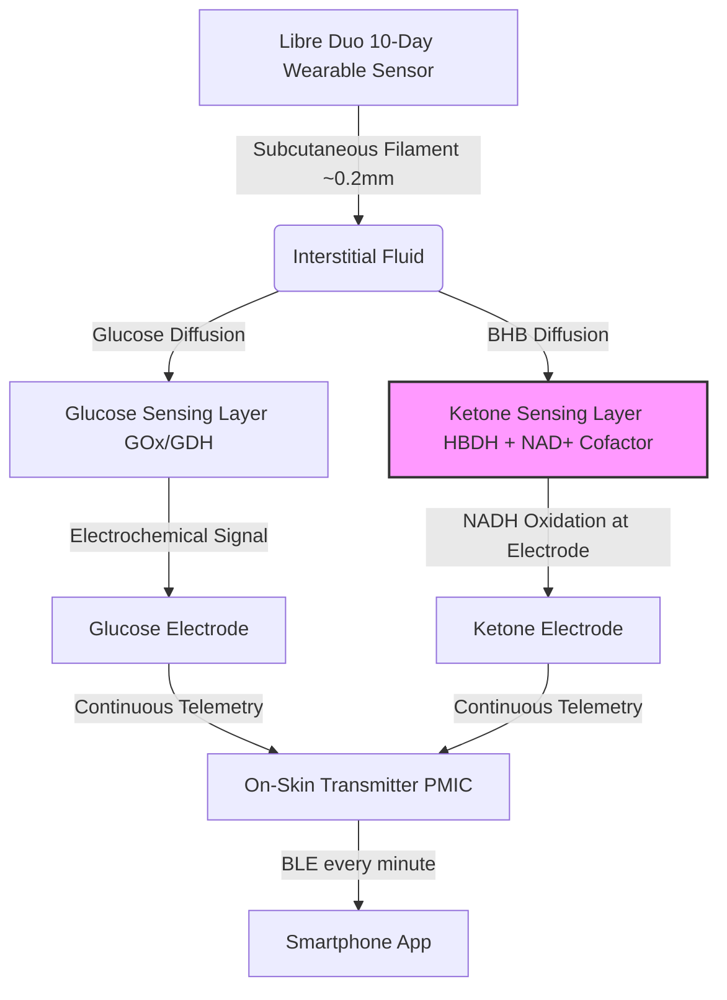

# The Molecular Mirror: Inside Abbott’s Libre Duo FDA Clearance and the New iCGK Bio-Wearable Frontier

##

Silicon Valley has long been obsessed with metabolic tracking. For years, founders, VCs, and biohackers have worn continuous glucose monitors (CGMs) like badges of honor, trying to hack their insulin responses and optimize their daily energy. But glucose is only half the metabolic story. The other half is ketones—the molecules our bodies produce when transitioning from carbohydrate metabolism to fat oxidation. 

On August 25, 2026, the FDA established a historic regulatory milestone by granting De Novo clearance to Abbott’s Libre Duo 10 Day Continuous Dual Glucose Ketone Monitoring System. As the first dual-sensor wearable cleared in the United States, the device measures both glucose and ketone concentrations in interstitial fluid every minute, streaming real-time telemetry to a smartphone application. 

Behind the corporate press releases lies a story of complex electrochemical engineering, a brand-new FDA regulatory pathway, and a brewing cultural clash between medical necessity and the biohacking elite.



### The Engineering Challenge: Tethering Soluble Cofactors in Vivo
To appreciate Abbott's achievement, one must examine the molecular architecture on the sensor's subcutaneous filament. Measuring roughly 0.2 mm in thickness (comparable to the Libre 3), the filament must house two distinct enzymatic electrochemical systems without chemical cross-talk.

Continuous glucose monitoring (CGM) is a mature technology. It typically relies on glucose oxidase ($GOx$) or glucose dehydrogenase ($GDH$) immobilized on a working electrode. The reaction is self-contained and stable, allowing sensors to easily operate for up to two weeks. 

Measuring beta-hydroxybutyrate (BHB), the primary ketone body associated with both nutritional ketosis and diabetic ketoacidosis (DKA), is vastly more difficult. The sensor uses $\beta$-hydroxybutyrate dehydrogenase ($HBDH$) to catalyze the oxidation of BHB to acetoacetate. Unlike $GOx$, $HBDH$ is dependent on the nicotinamide adenine dinucleotide ($NAD^+$) cofactor:
$$\text{BHB} + \text{NAD}^+ \xrightarrow{\text{HBDH}} \text{acetoacetate} + \text{NADH} + \text{H}^+$$
To generate an electrical current, the resulting $NADH$ must be oxidized at the ketone working electrode surface:
$$\text{NADH} \rightarrow \text{NAD}^+ + \text{H}^+ + 2e^-$$
The core engineering hurdle is that $NAD^+$ and $NADH$ are small, highly soluble, and highly mobile molecules. In a subcutaneous environment, they rapidly diffuse (leach) away from the electrode and into the patient's interstitial fluid. This leaching not only degrades sensor sensitivity within hours, causing massive signal drift, but also raises potential in vivo toxicity concerns.

Abbott's proprietary solution, outlined in recent patents, utilizes a multi-layered hydrogel polymer matrix. The $NAD^+$ cofactor is covalently tethered or encapsulated within a cross-linked polymer network alongside $HBDH$ on a secondary working electrode. A protective outer membrane restricts the leaching of these reactive components while allowing glucose, ketones, and oxygen to diffuse freely. 

Powering this dual-sensing chemistry and transmitting BLE telemetry every minute required significant optimization of the transmitter's power-management integrated circuit (PMIC) to ensure the device lasts its full 10-day clinical life on a tiny coin-cell battery.

### The Regulatory Frontier: The iCGK Pathway
The regulatory implications of the Libre Duo clearance are profound. Because no predicate device existed in the U.S. market, the FDA established a new regulatory classification: the **integrated continuous glucose and ketone monitoring (iCGK)** pathway. 

Parallel to the existing iCGM standard, the iCGK classification mandates strict special controls. These controls define specific accuracy benchmarks (MARD), labeling requirements, and clinical trial protocols. Abbott backed its De Novo submission with data from six clinical studies involving over 600 participants. 

The clinical trials also highlighted the mechanical trade-offs of dual-sensing: while 84.1% of sensors in the adult cohort survived the full 10 days, pediatric sensor survival was 68.8%, reflecting the physical challenges of keeping the dual-chemistry sensor adhered to highly active children. By defining the iCGK pathway, the FDA has created a regulatory roadmap. Competitors like Dexcom or metabolic health startups can now reference the Libre Duo 10 Day as a predicate device in 510(k) submissions, accelerating the development of the multi-analyte wearable market.

### A Clinical Paradigm Shift: DKA Prevention
For patients with Type 1 Diabetes (T1D), CKM represents a transition from reactive emergency response to proactive management. Diabetic ketoacidosis (DKA) is a life-threatening emergency that occurs when a lack of insulin forces the body to rapidly metabolize fat, leading to a toxic buildup of ketones that acidifies the blood. 

Traditional ketone monitoring is episodic and lagging. Patients check ketones using fingerstick blood meters or urine strips, usually only *after* they feel ill or observe a glucose reading exceeding 250 mg/dL. This model fails in two critical scenarios:
1. **Urine Ketone Lag**: Urine tests reflect blood chemistry from several hours prior, missing acute metabolic crashes.
2. **Euglycemic DKA**: The growing use of SGLT2 inhibitors (such as Jardiance or Farxiga) can cause patients to develop severe DKA while maintaining normal glucose levels. Standard CGMs provide a false sense of security in these cases.

```
Libre Duo App Ketone Alert Logic:
[< 0.6 mmol/L]   --> Normal metabolic range (Glucose prioritized on screen)
[0.6 - 3.0 mmol/L] --> Elevated ketones (Trend tracking and directional arrows)
[>= 3.0 mmol/L]  --> DKA Danger Zone (Urgent High Ketone Alert triggered)
```

The Libre Duo operates as an automated early warning system. In the background, it continuously tracks ketones. If BHB levels rise between 0.6 and 3.0 mmol/L, the system displays trend arrows. If ketones cross the critical 3.0 mmol/L threshold, the app triggers an urgent high alert, giving patients and clinicians hours of lead time to administer fluids and insulin before emergency hospitalization is required.

### The Market Clash: Medical Necessity vs. The Biohacking Boom
While clinicians celebrate the Libre Duo as a safety breakthrough, the technology is driving intense excitement—and controversy—in the wellness and biohacking communities. Longevity enthusiasts and keto-diet practitioners are eager to track "nutritional ketosis" (typically 0.5 to 1.5 mmol/L) to optimize cognitive performance, mitochondrial health, and metabolic flexibility.

As Dr. Casey Means, Stanford-trained physician and co-founder of Levels, posted on X:
> *"Continuous dual biosensing is the ultimate mirror for our metabolism. By moving beyond glucose to track ketones and lactate in real-time, we are unlocking a new era of metabolic flexibility where we don't just guess our state of fat-burning—we see it. This FDA clearance is a massive win for proactive metabolic health."*

However, the medical community warns of supply chain pressures and alarm fatigue. If healthy consumers seek off-label prescriptions for the Libre Duo, it could strain manufacturing capacity, potentially restricting access for T1D patients who rely on the sensor for survival. 

Furthermore, a socioeconomic gap looms. The Libre Duo 10 Day is approved as a prescription-only (Rx) medical device. Abbott's consumer-facing line, *Lingo*, remains restricted to glucose tracking, with no release date set for consumer ketone or lactate features. While insulin-dependent patients must navigate upcoming insurance and Medicare coverage negotiations to afford the new device, affluent biohackers are already planning to pay out-of-pocket for off-label prescriptions.

As prominent longevity physician Dr. Peter Attia noted on his podcast:
> *"Continuous ketone monitoring is going to be a game-changer for safety in T1D, especially with the rise of SGLT2 inhibitors. But for the general public, we have to be careful about alarm fatigue. Tracking 0.2 mmol/L fluctuations in a healthy person is noise, not signal. We don't want healthy people panicking over physiological ketone shifts."*

Abbott’s Libre Duo marks the beginning of the multi-analyte wearable era. Whether this technology will remain a highly guarded clinical asset for diabetes management or diffuse into the mainstream consumer wellness market will shape the business of metabolic health for the next decade.

***

# 4. Highlight

## 4.1 Key Questions
1. How did Abbott solve the electrochemistry challenge of preventing NAD+ cofactor leaching on a 10-day subcutaneous sensor filament?
2. How will the FDA's new iCGK (integrated continuous glucose and ketone monitoring) regulatory pathway impact competitors like Dexcom?
3. Will insurance gatekeeping restrict the Libre Duo to wealthy, off-label biohackers while leaving low-income Type 1 diabetics vulnerable to DKA?

## 4.2 Highlight Text
The FDA has granted De Novo clearance to Abbott’s Libre Duo 10 Day, the first continuous glucose and ketone monitoring system in the US. By measuring glucose and beta-hydroxybutyrate every minute, the sensor transitions diabetic care from reactive fingersticks to proactive DKA prevention. Yet, a technical and cultural battle is brewing. Abbott solved the complex chemistry of tethering soluble NAD+ cofactors on a hair-thin filament, establishing the FDA's new iCGK regulatory standard. Meanwhile, VCs and biohackers are racing to obtain the prescription-only device for nutritional ketosis tracking, sparking critical debates over clinical supply chain priority and metabolic equity.

## 4.3 Hashtags
#LibreDuo #CKM #MetabolicHealth #FDA #Biohacking #HealthTech #DiabetesCare
