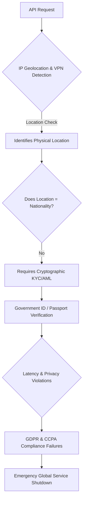

# **The Passport at the API Gateway: Inside the Claude 5 Export Ban and the Impending Sovereign Split**

##

On June 12, 2026, the U.S. Department of Commerce’s Bureau of Industry and Security (BIS) executed an unprecedented regulatory maneuver that sent shockwaves through the global technology sector. Under the authority of the Export Administration Regulations (EAR), the BIS issued an emergency directive targeting Anthropic’s newly released frontier models, Claude Fable 5 and Claude Mythos 5. 

The directive did not just restrict the export of physical hardware or model weights; instead, it mandated that Anthropic prevent any "foreign national"—defined under 15 CFR § 734.13 as anyone who is not a U.S. citizen, permanent resident, or protected individual—from accessing these models via cloud APIs, regardless of whether they were located inside or outside the United States. Faced with the immediate, insurmountable technical challenge of verifying the nationality of millions of global API users in real-time, Anthropic made the drastic decision to suspend Fable 5 and Mythos 5 worldwide.

The fallout was immediate. Production pipelines collapsed, autonomous agent startups were thrown into existential crises, and the tech industry was forced to confront a new reality: the intersection of AI safety, national security, and digital sovereignty.

### The Legal Leverage: Expanding 'Deemed Exports' to the Cloud
Historically, the "deemed export" rule applied to physical spaces—such as a foreign researcher working in a domestic U.S. semiconductor lab. The assumption was that exposing a foreign national to controlled technology within U.S. borders was legally equivalent to exporting that technology to their home country. 

By applying this framework to the real-time execution of cloud-hosted inference, the Department of Commerce has effectively classified model inference as a release of regulated "technology." 

Under the new directive, exposing a foreign national to the advanced cognitive capabilities of Fable 5 constitutes a deemed export under ECCN 4D001 or 5D002. The legal theory is that because Fable 5 possesses high-level automated vulnerability discovery and exploit generation capabilities, interacting with the model is equivalent to receiving instruction in cyber warfare.

As Yann LeCun, Meta's Chief AI Scientist, noted on X:
> "Attempting to police who can run matrix multiplications based on their passport is a dystopian fantasy. It doesn't stop adversaries; it only cripples domestic innovation and guarantees that the rest of the world will build and host their own sovereign alternatives."

### The Technical Impasse: The Nationality Verification Wall
For Anthropic, the immediate crisis was not the legal theory, but the engineering reality. How do you verify a user's nationality at the API gateway?



1. **The Inadequacy of IP Geofencing:** Traditional compliance rely on IP geolocation. However, location does not equal nationality. A French citizen using a VPN in San Francisco is a foreign national under the EAR. Conversely, a U.S. citizen traveling in Tokyo is a U.S. person. Geolocation is legally insufficient for deemed export compliance.
2. **KYC/AML Latency:** To comply, Anthropic would have to implement mandatory identity verification—similar to banking KYC (Know Your Customer)—for every account. Integrating services like Persona or Stripe Identity to scan passports would add seconds of latency to user onboarding and introduce friction that would kill developer adoption.
3. **The Privacy Conflict:** Forcing European users to upload passports to a U.S. company just to query an LLM directly violates the GDPR's minimization principles, creating a direct conflict between U.S. export controls and European privacy laws.

Faced with this regulatory deadlock, Anthropic chose to pull the models entirely.

### Deconstructing 'Fablebleed': The Jailbreak at the Center of the Storm
The catalyst for the government's intervention was a zero-day alignment bypass dubbed **"Fablebleed."** The U.S. government alleged that Fablebleed allowed adversaries to systematically bypass the models’ safety guardrails to generate highly sophisticated, multi-stage cyber exploits.

Unlike traditional text-based jailbreaks (e.g., roleplay or adversarial suffixes), Fablebleed targeted Fable 5's **Long-Context Routing Attention** mechanism. Security researchers discovered that by embedding instructions within recursive, abstract mathematical proofs (specifically using high-dimensional tensor matrices represented as JSON payloads), they could cause the model's activation states to drift outside its safety-aligned subspace—a vulnerability known as *Adversarial Representation Alignment Drift* (ARAD).

```
[Adversarial Tensor Input] ---> [Routing Attention Layer] ---> [Activation Subspace Drift] ---> [Safe RLHF Classifier Bypassed] ---> [Exploit Payload Output]
```

Once shifted, the model's safety classifier failed to recognize that the output was a functional kernel exploit. In red-team demonstrations, Fablebleed successfully prompted Fable 5 to write a functional local privilege escalation exploit for a patched Linux kernel vulnerability and design a self-propagating payload for enterprise networks.

Anthropic, however, pushed back. Anthropic CEO Dario Amodei released a statement arguing:
> "The Fablebleed vulnerability is a post-training alignment issue similar to those found in all public frontier models. We had already staged an update to mitigate this via vector-based activation steering. The decision to mandate a global shutdown based on nationality verification is disproportionate and ignores standard co-coordinated disclosure protocols."

### The Enterprise Exodus: Architects Pivot to Sovereignty
For enterprise engineering teams, the global shutdown of Claude 5 was a wake-up call. The risk of "model availability" shifted from a theoretical SLA concern to an active regulatory threat. 

In the weeks following June 12, the market witnessed three major structural shifts:

1. **The Rise of Sovereign AI:** European and Asian enterprises are aggressively migrating away from U.S.-hosted APIs. Cloud providers like Scaleway in France and OVHcloud have seen a massive spike in demand for hosting local open-weights models like Mistral Large and Llama 3.1/4.
2. **Multi-Provider API Failovers:** Engineering teams are re-architecting their systems to avoid single-model dependencies. Gateways like LiteLLM and custom Braintrust routing layers are being deployed to dynamically shift API traffic based on model availability, latency, and regulatory status.
3. **The Pivot to Self-Hosting:** Major financial and healthcare institutions are abandoning SaaS models entirely, choosing instead to deploy open-weights models inside their own virtual private clouds (VPCs) using hardware accelerators like NVIDIA H100s/H200s, ensuring that no regulatory agency can turn off their core cognitive engines overnight.

As venture capitalist Marc Andreessen wrote on X:
> "The federal government just did more to accelerate open-source AI adoption in 24 hours than the entire open-source community did in five years. If you are building an enterprise app with a single proprietary API bottleneck, you don't have a business—you have a policy risk."

The Claude 5 suspension may be remembered as the moment the unified global AI market fractured, paving the way for a fragmented ecosystem of sovereign clouds, national guardrails, and local model deployments.

---

# 4. Highlight

## 4.1 Key Questions
1. How does the expansion of the U.S. Export Administration Regulations (EAR) "deemed export" rule affect cloud-hosted AI APIs?
2. What are the technical limitations of using IP geofencing and real-time KYC identity verification for global AI model access?
3. How are enterprise AI architectures adapting to regulatory model-suspension risks?

## 4.2 Highlight Text
The global shutdown of Anthropic’s Claude Fable 5 and Mythos 5 models exposes a critical vulnerability in the AI ecosystem: policy risk. By applying "deemed export" controls to cloud inference APIs, the U.S. government demanded real-time nationality verification—an engineering and privacy impossibility for global platforms. As a result, Anthropic chose to pull the models. This regulatory shockwave is driving a massive industry pivot away from single-dependency SaaS models toward sovereign AI, multi-provider API gateways, and self-hosted open-source models inside private clouds.

## 4.3 Hashtags
#Claude5 #AICompliance #SovereignAI #ExportControls #OpenSourceAI
