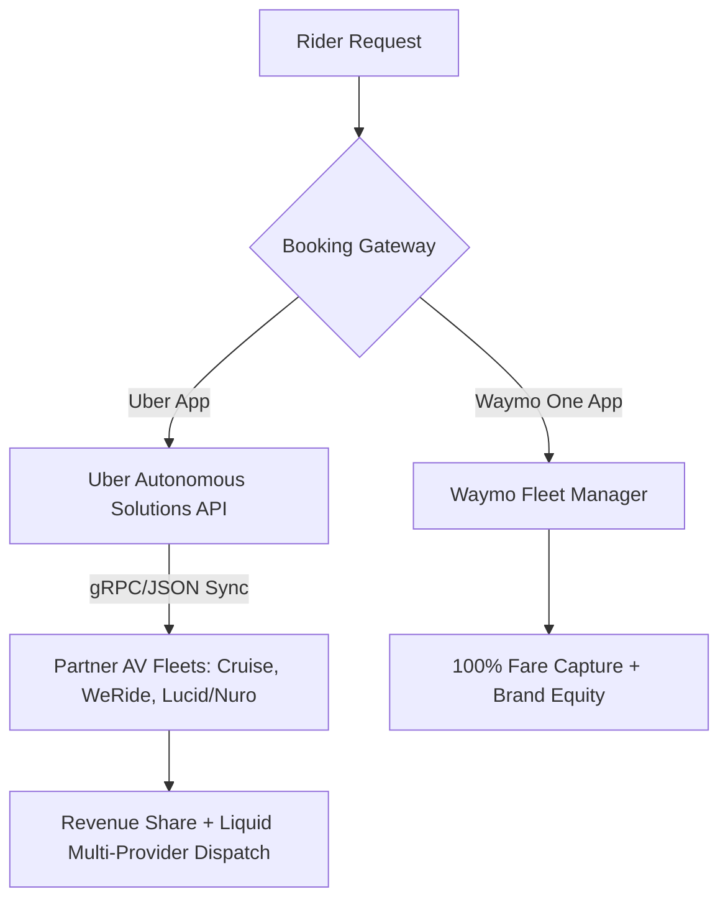

# **The Phoenix Decoupling: Waymo’s First-Party Bet and Uber’s Race to Build the AV Middleware Layer**

##

The quiet conclusion of the Uber and Alphabet’s Waymo robotaxi pilot in Phoenix, Arizona, in May 2026 is a watershed moment for the autonomous vehicle (AV) industry. For three years, Phoenix served as the primary sandbox for multi-platform integration—a place where a consumer could open the Uber app and, by chance or design, hail a fully driverless Waymo Jaguar I-PACE. 

However, both companies confirmed that the Phoenix pilot reached its contracted end date. While the companies maintain active partnerships in Austin and Atlanta, the Phoenix exit exposes a core strategic friction that will define the economics of autonomous transit: **Who owns the customer, and how is the margin distributed?**



### The Strategic Friction: Margin Capture vs. Marketplace Scale
The tension is fundamentally structural. Waymo, having achieved significant density and user trust in Phoenix, is prioritizing its proprietary **Waymo One** app. In high-density markets, paying a marketplace coordinator like Uber a 20% to 30% take rate makes little sense if consumers are willing to open a dedicated app. By keeping the booking first-party, Waymo captures 100% of the fare and cements direct brand equity. 

Conversely, Uber CEO Dara Khosrowshahi has long championed Uber’s role as the indispensable "mission control" and demand aggregator. Speaking to the economics of standalone fleets, Khosrowshahi has repeatedly emphasized:
> *"Utilization is the name of the game. If you build a robotaxi but it only runs 30% of the time because your matching pool is too small, you cannot cover the depreciation of the hardware. Uber provides the global, liquid marketplace that keeps wheels turning."*

Yet, investors are watching closely. Altimeter Capital founder Brad Gerstner, who rotated his portfolio out of Uber in late 2024, pointed out that the autonomy race is ultimately driven by *"price and convenience."* While he praised Waymo’s product experience, he noted that standalone operators historically remained *"subscale,"* raising the critical question of whether Uber can build enough partner supply to out-compete a vertically integrated network.

Meanwhile, former Uber Chief Business Officer Emil Michael has lamented the strategic pivots of the past, pointing to the 2017 ouster of Travis Kalanick as the moment Uber lost its shot at full vertical dominance:
> *"We were just a step behind Waymo [with the Advanced Technologies Group]. Investors wanted short-term margins and forced us out, losing the chance to build a trillion-dollar vertical business. Now, Uber is forced to be a middleware layer."*

---

### Algorithmic Fragmentation: The Cost of Siloed Dispatches
When AV fleets decouple from a unified aggregator like Uber, the operational impact on fleet efficiency is stark.

At the core of ride-hailing economics is the **Fleet Utilization Rate ($U_f$)**, defined as:

$$U_f = \frac{T_{\text{paying}}}{T_{\text{paying}} + T_{\text{deadhead}} + T_{\text{idle}}}$$

Where:
*   $T_{\text{paying}}$: Time spent transporting a paying passenger.
*   $T_{\text{deadhead}}$: Time spent driving empty to a pickup location.
*   $T_{\text{idle}}$: Time spent stationary, waiting for a dispatch.

In a unified marketplace, Uber runs a **dynamic bipartite matching algorithm** over rolling 2-to-5 second batch windows. Instead of matching greedily, it solves a global optimization problem to minimize $T_{\text{deadhead}}$ across both human drivers and multiple AV partner fleets:

$$\max \sum_{i \in I} \sum_{j \in J} w_{ij} x_{ij}$$

Subject to:
$$\sum_{j \in J} x_{ij} \le 1 \quad \forall i \in I$$
$$\sum_{i \in I} x_{ij} \le 1 \quad \forall j \in J$$

Where $I$ represents passenger requests, $J$ represents available vehicles, $x_{ij} \in \{0, 1\}$ is the assignment decision, and $w_{ij}$ is a weight matrix representing ETAs, vehicle compatibility, and system routing costs.

When Waymo operates exclusively on Waymo One, the marketplace splits. A Waymo vehicle and an Uber-partnered vehicle may pass each other going in opposite directions to pick up passengers miles away—a massive operational inefficiency known as "deadheading." On Reddit's r/selfdrivingcars, users frequently debate this fragmentation. One user noted:
> *"Hailing a Waymo directly on Waymo One is a premium, consistent UX. But during rush hour in Tempe, I have to flip between Waymo, Uber, and Lyft to see who has a car closer than 15 minutes. The app fragmentation is a step backward."*

---

### API Engineering: Standardizing the AV-to-Cloud Interface
To counter Waymo’s proprietary vertical, Uber has built **Uber Autonomous Solutions**, a standardized API suite designed to onboard alternative AV providers—most notably the new **Lucid-Nuro partnership**, which integrates Nuro’s Level 4 "Nuro Driver" software stack into Lucid Gravity SUVs.

For this multi-partner network to function, Uber's platform must ingest telemetry and coordinate dispatch asynchronously with millisecond-level latency.

#### 1. Telemetry Ingestion (gRPC Stream)
Uber standardizes state ingestion using a gRPC telemetry stream, allowing partners to push vehicle state updates at 5–10 Hz. Below is an example payload representing the JSON serialization of a telemetry frame:

```json
{
  "vehicle_id": "lucid-gravity-nuro-778X",
  "timestamp": "2026-07-02T23:18:10.000Z",
  "location": {
    "latitude": 33.448376,
    "longitude": -112.074036,
    "bearing_degrees": 182.4,
    "speed_mps": 11.2
  },
  "state": "AVAILABLE",
  "diagnostics": {
    "battery_soc_pct": 82.5,
    "thermal_loop_celsius": 34.0,
    "sensor_status": "NOMINAL"
  }
}
```

#### 2. Booking Lifecycle State Machine
Uber's middleware translates ride requests into standardized gRPC calls sent to the partner's fleet dispatcher (e.g., Nuro's cloud). The state machine transitions as follows:

```
[AVAILABLE] ── DispatchOfferRequest ──> [OFFERED] ── Accept ──> [EN_ROUTE] 
                                                                    │
[COMPLETED] <── TripComplete <── [IN_PROGRESS] <── Arrived <────────┘
```

#### 3. In-Cabin UX State Synchronization
One of the major technical hurdles of the Uber-partner model is maintaining a premium, branded in-cabin experience without direct hardware ownership. Uber solves this via a WebSocket-based sync protocol that bridges the rider’s Uber app, Uber’s backend, and the vehicle’s native infotainment system (Nuro/Lucid).

When a rider changes the climate control or audio inside the Uber app, the request is routed through Uber's AV gateway:

```http
PUT /v1/av/vehicles/lucid-gravity-nuro-778X/cabin/control
Content-Type: application/json

{
  "target_temperature_celsius": 21.0,
  "media": {
    "playback_source": "SPOTIFY",
    "track_id": "spotify:track:4PTG3Z6ehRCoh3"
  },
  "haptic_halo_color": "#FF5500"
}
```

#### 4. Out-of-Domain (OOD) Fallbacks and Rescue Routing
When an AV encounters an Out-of-Domain event it cannot resolve (e.g., localized construction, police roadblocks, or sensor occlusion), it enters a safe stop state. 

Instead of leaving the passenger stranded, Uber’s API standardizes a **Rescue Routing Protocol**. The AV partner sends an immediate exception web hook:

```json
{
  "event_id": "err-9921-nuro",
  "vehicle_id": "lucid-gravity-nuro-778X",
  "error_code": "OOD_MINIMUM_RISK_MANEUVER",
  "passenger_present": true,
  "fallback_requested": "TRIGGER_HUMAN_RESCUE"
}
```

Uber’s dispatch system instantly processes this, cancels the AV trip, and auto-dispatches the nearest human UberX driver to the AV's GPS coordinates, transferring the destination state and fare structure seamlessly.

---

### The Long-Term Viability of Proprietary Networks
Can Waymo maintain a vertical moat, or will Uber’s horizontal middleware inevitably win?

| Dimension | Vertically Integrated (Waymo One) | Open Platform (Uber Autonomous Solutions) |
| :--- | :--- | :--- |
| **Primary Advantage** | Tighter software-hardware integration; 100% margin capture. | Unrivaled demand liquid pool; instant hybrid fallback (human drivers). |
| **Capital Profile** | Heavy; asset ownership or dedicated leasing. | Asset-light; leverages partner fleets (e.g., Lucid/Nuro, Cruise). |
| **UX Consistency** | High; unified native control of vehicle and cabin. | Variable; dependent on partner hardware APIs. |
| **Network Density** | Low/Medium; geographically limited by L4 mapping. | High; ubiquitous coverage via hybrid dispatch. |

Waymo’s decision to transition Phoenix to a first-party model is a bold declaration of independence. By consolidating its fleet, Waymo is betting that its brand and product experience are strong enough to overcome the inconvenience of app-switching. 

However, as Uber scale-tests its gRPC-driven platform with Cruise, WeRide, and the massive Lucid-Nuro fleet, the horizontal network effects will only intensify. In the long run, the winner of the robotaxi war may not be the company with the best driver, but the company with the most efficient dispatch API.

---

# 4. Highlight

## 4.1 Key Questions
1. Why did Waymo transition its Phoenix operations to a first-party model, and what does it mean for Uber's bottom line?
2. How does dispatch fragmentation affect fleet utilization rates ($U_f$) and deadheading metrics?
3. What engineering challenges does Uber face when integrating alternative AV partners like Lucid and Nuro?

## 4.2 Highlight Text
The conclusion of the Uber-Waymo pilot in Phoenix reveals a high-stakes battle for the autonomous vehicle middleware layer. As Waymo transitions mature fleets to its proprietary app to capture 100% of the margins, Uber is racing to standardize its "Uber Autonomous Solutions" API. By onboarding Cruise, WeRide, and the new Lucid-Nuro partnership, Uber aims to prove that dynamic bipartite matching across multiple fleets beats siloed vertical dispatches. The future of AV isn't just about who builds the best driver—it's about who owns the booking gateway.

## 4.3 Hashtags
#Robotaxis #AutonomousVehicles #Uber #Waymo #APIEngineering #SiliconValley
