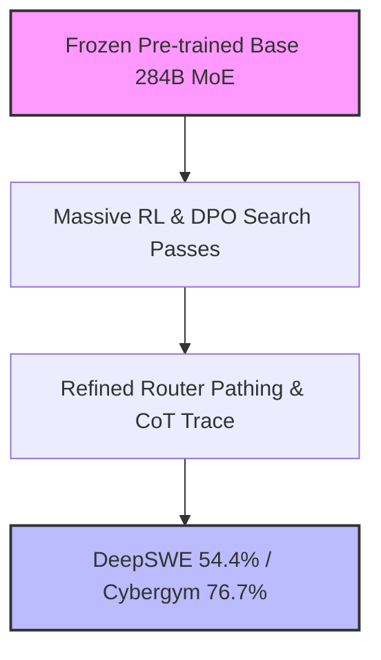

# **The Post-Training Illusion? Inside DeepSeek-V4-Flash’s 600% Jump and the Brutal Math of $0.0028/1M Tokens**

##

On July 31, 2026, the artificial intelligence landscape experienced a quiet but seismic shift. Without altering a single weight layout or modifying the underlying parameter topology of its preview model, DeepSeek released **DeepSeek-V4-Flash-0731**. Boasting 284 billion total parameters and only 13 billion active parameters per token, this Mixture-of-Experts (MoE) architecture achieved a staggering 600% performance surge on the DeepSWE coding benchmark and nearly doubled its score on Cybergym security challenges. 

This release has ignited a fierce debate in Silicon Valley: Are we witnessing the dawn of algorithmic optimization via intensive "re-post-training," or have we entered the era of hyper-optimized benchmark overfitting? Furthermore, behind the technical breakthroughs lies a financial structure that threatens the very survival of venture-backed open-weights startups. At a prompt-cached input rate of **$0.0028 per million tokens**, DeepSeek has established a price floor that defies traditional SaaS margins.

### The "Re-Post-Training" Paradigm: Distillation or Deception?
Historically, frontier AI labs assumed that massive capability jumps required scaling up pre-training compute or executing complex architectural refactors. DeepSeek-V4-Flash challenges this dogma. By keeping the pre-trained base model frozen and executing a massive, iterative post-training run utilizing Reinforcement Learning (RL) and multi-turn Direct Preference Optimization (DPO), DeepSeek unlocked dormant capabilities within the 13B active parameter sub-networks.

The results speak for themselves:
*   **DeepSWE Benchmark**: Soared from a mediocre **7.3%** in the preview build to an enterprise-grade **54.4%** (a 645% relative surge).
*   **Cybergym Security Challenges**: Nearly doubled from **38.7%** to **76.7%**.
*   **Terminal Bench 2.1**: Rose from **61.8** to **82.7**.

This has split the research community. On X.com, prominent AI researcher Andrej Karpathy commented:
> *"We are underestimating the capacity of frozen base representations. Pre-training builds the raw sensory cortex, but post-training RL teaches the model how to focus, write clean code, and debug its own failures. V4-Flash shows that the 'intelligence' is already there; we just didn't know how to query it."*

Conversely, critics argue that these jumps are too steep to be generalizable. Skeptics on Reddit's r/machinelearning suggest that the re-post-training dataset was contaminated with benchmark test cases. Goodhart's law is in full effect: when a benchmark becomes the training target, it ceases to be a reliable metric of generalized reasoning. If a model is trained on synthetic rollouts that mirror the exact environment of DeepSWE and Cybergym, it is effectively memorizing state transitions rather than developing an intrinsic understanding of software architecture or security vulnerabilities.

### Real-World Multi-Agent Performance: V4-Flash vs. GPT-4o
In production environments, multi-agent frameworks (such as AutoGen or custom LangGraph setups) execute hundreds of iterative LLM calls to solve a single ticket. This makes API latency, context window integrity, and cost the defining constraints.

V4-Flash introduces two features designed specifically for agentic loops:
1.  **DSpark Speculative Decoding**: An attached, hardware-aware speculative decoding module that increases inference throughput by up to 85%. By running draft-then-verify routing cycles on MoE routers, DSpark drops Time-to-First-Token (TTFT) and sustains high token-generation speeds.
2.  **Granular `reasoning_effort` Tuning**: The API allows developers to pass parameters (`low`, `medium`, `high`, `max`) to control the internal token budget allocated to the model's chain-of-thought (CoT) trace.

When matched against OpenAI's GPT-4o in multi-agent coding trials, V4-Flash-0731 demonstrates superior speed and cost efficiency on standard terminal automation tasks, reaching an 82.7 on Terminal Bench 2.1. However, GPT-4o retains an edge on highly novel, out-of-distribution debugging tasks where the model cannot rely on templated reasoning paths. V4-Flash's heavy reliance on its cached, structured reasoning trace means that at lower `reasoning_effort` settings, it occasionally falls into repetitive loops—a common pathology of aggressively aligned open-weights models.

### The Brutal Economics of $0.0028/1M Tokens
While developers praise the technical specs, VCs and financial analysts are focused on DeepSeek’s pricing. At $0.14 per 1M input tokens (cache miss) and a discounted rate of **$0.0028 per 1M input tokens (cache hit)**, DeepSeek is pricing its API at a 98% discount for cached prompts.

For a multi-agent application that repeatedly sends a 100K-token system prompt and execution history, this is revolutionary. A cache hit rate of 95% drives effective input costs down to fractions of a cent.

But is this sustainable? 

In June 2026, DeepSeek secured a massive $7.4 billion funding round, backed in part by domestic AI industrial funds. However, the company's ultimate financial moat is its parent company, **High-Flyer**, a quantitative hedge fund. High-Flyer operates a circular investment model: the fund uses massive GPU clusters to train proprietary trading algorithms, which generate billions in capital. That capital is reinvested directly into DeepSeek's compute infrastructure. In turn, DeepSeek's open-weights research optimization improves High-Flyer's quantitative trading stack. The consumer-facing API acts as a high-throughput, low-margin stress test for their hardware, monetizing excess compute capacity.

A prominent Silicon Valley venture capitalist remarked on X:
> *"Silicon Valley AI startups are raising billions at 100x revenue multiples to buy GPU time from Microsoft or AWS. DeepSeek is backed by a hedge fund that prints cash and owns its bare metal. The traditional VC-funded API wrapper model is dead. You cannot compete with a competitor whose cost of capital is effectively zero and whose hardware is subsidized by algorithmic trading."*

| Feature / Metric | DeepSeek-V4-Flash-0731 | OpenAI GPT-4o |
| :--- | :--- | :--- |
| **Total / Active Parameters** | 284B / 13B (MoE) | Dense / Custom MoE (Undisclosed) |
| **Base Input Price (per 1M)** | $0.14 | $2.50 |
| **Cached Input Price (per 1M)**| **$0.0028** | $1.25 |
| **Terminal Bench 2.1 Score** | 82.7 | 88.2 |
| **Reasoning Control** | Granular (`reasoning_effort`) | None (Fixed Latency) |

### Hardware Constraints and the Geopolitical Undercurrent
The sustainability of DeepSeek's pricing must also be viewed through the lens of hardware constraints and export regulations. Prevented from acquiring NVIDIA’s flagship H100 or Blackwell architectures due to trade restrictions, DeepSeek has focused on low-level kernel optimizations. 

By writing custom Triton and assembly kernels, DeepSeek has optimized its MoE models to run on domestic Huawei Ascend clusters and older NVIDIA architectures, achieving hardware-aware global throughput. This necessity-driven engineering has bypassed the need for expensive Western hardware, allowing them to extract maximum utility from every watt of power.

***

# Highlight

## 4.1 Key Questions
1. Does the 600% surge on DeepSWE represent true reasoning capability, or is it the result of benchmark-specific overfitting via synthetic dataset contamination?
2. Can venture-backed AI startups survive in a market where DeepSeek sets a cached input price floor of $0.0028 per million tokens?
3. How sustainable is DeepSeek's circular investment model when constrained by global hardware regulations and export sanctions?

## 4.2 Highlight Text
DeepSeek-V4-Flash-0731’s release marks a critical turning point: a 600% jump on DeepSWE coding benchmarks without architectural modifications, achieved solely through intensive "re-post-training." While researchers debate whether this is genuine reasoning or benchmark gaming, the commercial impact is undeniable. With prompt caching pricing at a brutal $0.0028 per million tokens, DeepSeek has set a price floor that VC-backed API startups cannot match. Backed by the quantitative hedge fund High-Flyer, DeepSeek's circular economic model challenges the traditional Silicon Valley playbook under global hardware constraints.

## 4.3 Hashtags
#AI #DeepSeek #V4Flash #OpenWeights #AICost #TechEconomics
