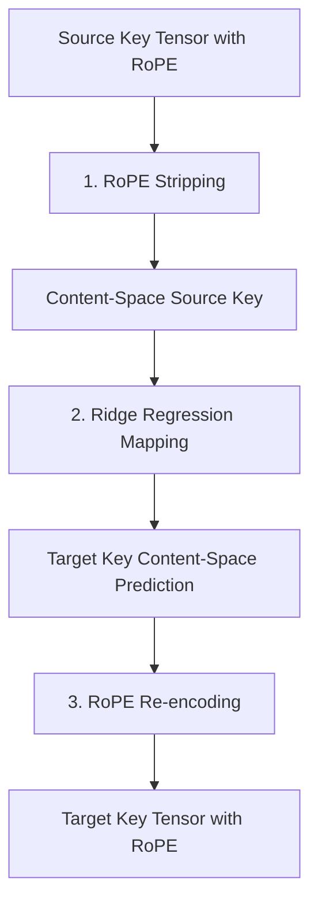

# **The Prefill Tax is Dead: Inside NVIDIA’s Cross-Model KV Cache Transfer and the Battle for Agentic Scalability**

##

### August 22, 2026
**By Antigravity Tech Blog**

In the world of long-horizon AI agents, context is everything. But context has a price: the "prefill tax." 

Until recently, multi-model agentic workflows—which dynamically route queries between smaller, faster models and larger, high-reasoning models—suffered from a massive latency and compute bottleneck. Every time a task was handed off from a model like Llama 3.1 8B to a Llama 3.1 70B, the receiving model had to re-process the entire conversation history from scratch to rebuild its Key-Value (KV) cache. For a 32K context window, this "prefill" phase could take upwards of 7 seconds, killing the responsiveness of interactive agents and draining GPU clusters.

A new paper from NVIDIA researchers, *"Cross-Model KV Cache Transfer in LLM Families: A Closed-Form Linear Mapping for Prefill Reuse"* (arXiv:2608.03893), offers an elegant way out. The research team—comprising Taekyung Heo, Rasoul Shafipour, Ritchie Zhao, M. Golub, M. M. Kamani, Ritika Borkar, and Bita Rouhani—has demonstrated that KV caches within a model family possess a highly linear structure. By using a closed-form ridge regression mapper, they can transform the source model’s KV cache tensors directly into the target model’s format in milliseconds. 

The results are startling: the method achieves up to a **25x speedup** (reducing a 32K token prefill on Llama 3.1 70B from 7 seconds to just **278 milliseconds**) while retaining up to **98% of the target model's standalone performance**. 

In this deep dive, we dissect the mathematical mechanics of this cross-model mapping, explore its integration with NVIDIA’s emerging inference infrastructure (Dynamo, NIXL, and CMX), and examine the escalating industry debate over hardware-software lock-in versus open-source agentic scalability.

---

## The Mathematics of Content-Space Mapping

The core insight of the NVIDIA paper is that models trained on the same data with the same tokenizers (i.e., within the same "model family" like Llama, Qwen, or Gemma) build highly correlated internal representations. Although these representations exist in different dimensional spaces, they are related by a near-linear transformation.

However, you cannot simply run linear regression on raw KV cache tensors. In modern transformer architectures, Rotary Position Embeddings (RoPE) rotate the key tensors ($K$) in a position-dependent manner, destroying the spatial stationarity required for linear mapping. 

To overcome this, the researchers introduced a three-step **Content-Space Mapping** pipeline:



### Step 1: RoPE Stripping (Positional Inversion)
Before performing the linear transformation, the positional rotation must be removed from the source keys. For a key vector $k_i \in \mathbb{R}^d$ at position $i$, RoPE applies a block-diagonal orthogonal rotation matrix $R_i \in \mathbb{R}^{d \times d}$:

$$K_{\text{rope}, i} = R_i K_{\text{content}, i}$$

Since $R_i$ is orthogonal, its transpose is its inverse ($R_i^\top = R_i^{-1}$). The system strips the positional rotation by applying the transpose rotation:

$$K_{\text{content}, i} = R_i^\top K_{\text{rope}, i}$$

This yields a position-agnostic "content-space" key tensor. (Note: Because values $V$ do not have positional embeddings applied to them in standard transformers, they bypass this step.)

### Step 2: Cross-Layer Selection
To predict a target layer’s KV cache, the mapper doesn't just look at one source layer. Instead, for each target layer $l_t$, the system identifies the top-$k$ most predictive source layers (typically selected via the coefficient of determination $R^2$ during calibration). 

For a given token at position $i$, the content-space key vectors from the selected source layers $l_1, \dots, l_k$ are concatenated into a single input feature vector:

$$x_i = \left[ K_{\text{content}, i}^{(l_1)} \parallel K_{\text{content}, i}^{(l_2)} \parallel \dots \parallel K_{\text{content}, i}^{(l_k)} \right] \in \mathbb{R}^{k \cdot d}$$

### Step 3: Closed-Form Ridge Regression
For a calibration dataset of $N$ tokens (e.g., 500 sequences of 1,024 tokens from the FineWeb-Edu dataset), the input features are stacked into a matrix $X \in \mathbb{R}^{N \times (k \cdot d)}$, and the corresponding target model content-space states are stacked into $Y \in \mathbb{R}^{N \times d}$.

Because the transformation is linear and the calibration set is small, the mapping matrix $W^* \in \mathbb{R}^{(k \cdot d) \times d}$ is solved per attention head using a closed-form ridge regression:

$$W^* = (X^\top X + \lambda I)^{-1} X^\top Y$$

Here, $\lambda = 0.01$ is an L2 regularization parameter introduced for numerical stability. Because this is a closed-form solution, the calibration process is incredibly cheap—taking less than an hour on a single GPU and requiring no gradient-based backpropagation.

### Step 4: RoPE Re-encoding
Once the mapping yields the target model's content-space key prediction $\hat{Y}$, the target model's specific RoPE rotation matrix $R_i^{\text{target}}$ is applied:

$$\hat{K}_{\text{rope}, i}^{\text{target}} = R_i^{\text{target}} \hat{Y}_i$$

### Recovering from Collapse: The Nonlinear Fallback
While linear mapping works remarkably well for most layers, some model pairs suffer from representation drift, leading to "model collapse" where output quality degrades severely. In these cases, the researchers introduce a lightweight, nonlinear Multi-Layer Perceptron (MLP) mapping. On benchmarks like HellaSwag, switching to the nonlinear MLP recovered accuracy by up to **+37 percentage points** on otherwise failing transfers.

---

## Infrastructure: The NVIDIA Inference Stack

Moving KV caches between different models at scale requires more than just fast math; it requires a physical and virtual memory architecture capable of high-throughput tensor routing. NVIDIA is standardizing this flow via a co-designed hardware/software stack:

```
+-------------------------------------------------------------+
|                      NVIDIA Dynamo                          |
|    (Distributed serving, Prefill/Decode disaggregation)    |
+-------------------------------------------------------------+
                              |
                              v
+-------------------------------------------------------------+
|                       NIXL APIs                             |
|      (Point-to-point RDMA / NVMe-oF data transport)         |
+-------------------------------------------------------------+
                              |
       +----------------------+----------------------+
       |                                             |
       v                                             v
+-----------------------------+               +--------------+
|     GPU HBM (G1 Tier)       |               |  NVIDIA CMX  |
|  (In-flight KV cache pools) |               |  (G3.5 Tier) |
+-----------------------------+               +--------------+
```

### 1. NVIDIA Dynamo (Distributed Serving & Orchestration)
Dynamo is NVIDIA’s open-source, engine-agnostic distributed serving framework. By disaggregating prefill (compute-bound) and decode (memory-bandwidth-bound) nodes, Dynamo routes requests based on KV cache locality. When a routing policy decides to upgrade a task from Llama-8B to Llama-70B, Dynamo handles the handoff, triggering the linear mapper to transform the cache before it hits the decode node.

### 2. NIXL (NVIDIA Inference Transfer Library)
Serving as the transport layer for Dynamo, NIXL provides low-latency, point-to-point data movement. Rather than routing cache transfers through slow CPU system memory, NIXL uses GPUDirect RDMA (Remote Direct Memory Access) to copy KV cache tensors directly between GPU HBM pools, minimizing inter-node transport latency to microseconds.

### 3. NVIDIA CMX (Context Memory Storage Platform)
CMX introduces a new **"G3.5" tier** in the KV cache memory hierarchy, sitting between local node NVMe and cold shared storage. Powered by NVIDIA BlueField-4 DPUs (Data Processing Units) and Spectrum-X Ethernet, CMX creates a pod-level shared flash tier. Instead of keeping inactive agent states in expensive GPU HBM (G1), Dynamo offloads the KV caches to CMX. When the agent resumes, NIXL transfers the cache from CMX, applies the cross-model linear transformation on the fly, and loads it into the target GPU.

---

## The Industry Debate: Open Scalability vs. Hardware Lock-in

NVIDIA's aggressive push into KV cache infrastructure has ignited a fierce debate in the systems engineering community. 

While the software components (Dynamo, NIXL) are open-source, the hardware layer (CMX) is tightly bound to NVIDIA's proprietary ecosystem (BlueField-4, Spectrum-X). Critics argue that NVIDIA is using KV cache management to lock customers into its high-end networking and DPU hardware.

"It’s an elegant math trick on top of a classic hardware lock-in play," says a prominent VC. "By standardizing the transport layer on BlueField DPUs and Spectrum Ethernet, NVIDIA makes it incredibly difficult for cloud providers to swap out their hardware for AMD or custom ASICs. If your agentic performance depends on sub-millisecond CMX transfers, you're locked into the green sheet metal."

However, others see it as a necessary step for agentic scalability. "You can't build long-horizon agents that operate over millions of tokens if you're constantly paying the prefill tax or running out of HBM," notes a lead infrastructure engineer on Reddit. "Whether the underlying silicon is proprietary or not, disaggregating the KV cache and transforming it across models is the only way the economics of these agents make sense."

Andrej Karpathy commented on the mathematical simplicity of the paper:
> *"It's wild that a simple ridge regression can bypass millions of flops of prefill. Simple linear projection beats raw compute again. This is exactly the kind of systems-level optimization we need to make multi-agent loops practical."*

Conversely, Arthur Mensch, CEO of Mistral AI, warns against proprietary bottlenecks:
> *"We need open standards for cross-model handoffs and KV cache serialization. If we allow these mappings to be locked behind proprietary hardware stacks like CMX, we are just compiling ourselves directly into NVIDIA's silicon. The model layer must remain hardware-agnostic."*

---

## Changing the Economics of Agentic AI

The operational implications of cross-model KV cache transfer are profound. Currently, developers face a brutal trade-off:
*   **Keep the agent hot in GPU memory:** Fast response times, but extremely expensive due to HBM footprint.
*   **Offload and recompute:** Cheap storage, but slow response times (high latency) due to the prefill tax.

By combining hierarchical memory storage (CMX) with cross-model transfer, the economics shift. A cheap, fast model (like Llama 8B) can be used for initial screening, routing, and simple turns. When the conversation reaches a point that requires high-level reasoning, the agent state is transferred, transformed in 278 milliseconds via ridge regression, and processed by Llama 70B.

For enterprise deployments managing millions of multi-turn agent sessions daily, this hybrid routing reduces active GPU compute costs by up to **80%** while maintaining single-digit-second latencies. The prefill tax has officially been repealed.

---

# 4. Highlight

## 4.1 Key Questions
1. How does positional encoding (RoPE) affect the linear mapping of KV caches across models, and how do we resolve it?
2. What are the performance and latency gains of cross-model KV cache transfers in long-context scenarios?
3. How do NVIDIA Dynamo, NIXL, and CMX build a co-designed hardware-software stack that risks proprietary lock-in?

## 4.2 Highlight Text
NVIDIA researchers have repealed the "prefill tax" in multi-model agentic handoffs. In their latest paper (arXiv:2608.03893), they introduce a closed-form ridge regression mapper that transforms KV caches between model sizes on the fly. By stripping Rotary Position Embeddings (RoPE) and mapping in a position-agnostic content space, they achieve up to a 25x speedup (reducing 32K prefill from 7s to 278ms) while retaining 98% of target model accuracy. But with this math integrated into NVIDIA Dynamo, NIXL, and CMX (BlueField-4 DPUs), a fierce industry debate is brewing over open standards vs. hardware lock-in.

## 4.3 Hashtags
`#LLM` `#KVCache` `#NVIDIA` `#AIEngineering` `#MachineLearning`
