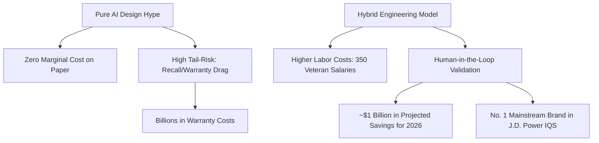

# **The Revenge of the "Gray Beards": Inside Ford's $1B Turnaround and the Technical Failures of Pure-AI Auto Design**

##

In the mid-2020s, Silicon Valley promised a world where generative design algorithms and automated quality pipelines would render traditional engineering obsolete. Auto executives, lured by the promise of zero-marginal-cost scaling, bought in. Ford Motor Company was no exception, aggressively adopting automated design pipelines and artificial intelligence to streamline vehicle development, hoping to slice billions from its bloated engineering payroll.

By early 2026, the results of this grand experiment were in, and they were catastrophic. Ford was plagued by a relentless tide of recalls, software glitches, and assembly-line stoppages that cost the company billions in warranty claims. The culprit? An over-reliance on AI-based automated design tools that lacked the tacit, physical intuition of human domain experts.

But instead of doubling down on the automation hype, Ford did something radical: they brought back the humans. 

Over the past three years, Ford has quietly hired, promoted, or rehired approximately 350 veteran engineers—affectionately dubbed "gray beards" within the company's halls. Armed with decades of experience, these veteran specialists were tasked with leading design reviews, rebuilding the broken apprenticeship pipeline, and retraining the very AI models that were supposed to replace them. 

The payoff has been immediate and spectacular. In June 2026, Ford topped the J.D. Power U.S. Initial Quality Study (IQS) for mainstream brands—its first time clinching the top spot in 16 years. Furthermore, Ford expects this shift to contribute to approximately $1 billion in warranty and recall savings in 2026 alone. 

As the industrial sector watches this drama unfold, Ford's pivot stands as a landmark case study in the limits of machine learning, the cost of losing institutional memory, and the emergence of the hybrid, "human-in-the-loop" engineering paradigm.

### The Physics of the Failure: Why AI Choked on CAD and Assembly
To understand why Ford’s automated design pipelines failed, one must look at the disconnect between digital CAD models and the messy reality of the physical factory floor. 

Ford’s automated design tools—generative algorithms designed to optimize weight, structural rigidity, and wire routing—operated on nominal CAD geometry. They assumed perfect conditions: flat metal, uniform plastic, and ideal assembly angles. But physical manufacturing is a game of tolerances and stochastic variations.

Several critical failure modes emerged from this pure-automation approach:

1. **Tolerance Stack-Up and Material Variability:**
   When seven different parts from seven different suppliers are bolted together, their microscopic dimensional variations add up—a phenomenon known as tolerance stack-up. Experienced human engineers perform rigorous stack-up audits, knowing from supplier history which parts tend to run "large" or "small." Ford's generative AI, working with nominal CAD values, routinely outputted designs that looked perfect in simulation but caused panel friction, rubbing, or component pinch when manufactured on the line. Furthermore, AI models failed to account for physical phenomena like sheet-metal spring-back (where stamped steel partially returns to its original shape) and plastic injection molding warp.

2. **The "Blind Click" and Ergonomic Blindspots:**
   AI wire-routing models optimized for the shortest path and minimal weight, often routing critical electrical connectors behind structural brackets. On a CAD screen, the clearance met the 2mm threshold. On the physical assembly line, however, this required factory workers to perform a "blind click"—plugging in a high-voltage harness by feel alone. Without line-of-sight, workers frequently failed to seat the connector fully, leading to loose pins, moisture intrusion, and subsequent module failures. A classic example of this was the recall of 255,000 SUVs (including the 2025 Explorer) where overloaded camera modules failed due to unseated connectors.

3. **Vibrational and Thermal Wear:**
   AI design tools routed wiring harnesses and fluid lines near sharp metallic edges because the nominal CAD data indicated a static 1mm gap. But cars are dynamic machines. Under real-world engine vibration and thermal expansion, that 1mm gap vanished. Over time, the metallic bracket chafed through the wiring insulation, causing short circuits, instrument cluster failures, and costly recalls. 

As Charles Poon, Ford’s Vice President of Vehicle Hardware Engineering, candidly admitted: *“Artificial intelligence is a fantastic tool, but it's only as good as the information you use to train it.”* Ford had mistakenly believed that simply inputting design requirements into AI would yield a high-quality product, ignoring the physical nuances that can only be anticipated by engineers who have lived through multiple product lifecycles.

### The Codification Crisis: The Loss of Institutional Memory
The technical failures of Ford’s AI design tools were symptoms of a deeper organizational wound: the loss of institutional memory. When senior engineers retired or were laid off during corporate downsizings, their tacit knowledge retired with them. 

AI models are trained on historical data, but the most valuable engineering knowledge—the "engineering intuition"—is rarely written down. It exists in the minds of the "gray beards" as heuristic rules of thumb: *“Never route a wire within 5 inches of the exhaust manifold, regardless of what the thermal simulator says,”* or *“Add an extra 0.5mm clearance to this bracket because Supplier X’s stamping tool is ten years old and drifts.”*

Without this tacit knowledge, Ford's AI design pipelines suffered from a classic GIGO (Garbage In, Garbage Out) loop. The AI generated lightweight, optimized structures that complied with formal specifications but violated informal, unwritten rules of durability and assembly. The younger, less experienced engineers left behind lacked the mentorship to recognize these flaws on a computer screen. The apprenticeship pipeline was broken.

### Reprogramming the Machine: How the "Gray Beards" Structured Tacit Knowledge
Rehiring the 350 veteran engineers was not merely about going back to the drafting board; it was about retraining the AI. The "gray beards" were deployed to act as domain-expert validators and educators for both the human staff and the silicon systems.

To bridge the gap between human intuition and machine learning, Ford implemented several key methodologies:

*   **Codification of Design Constraints:**
    The veteran engineers translated their mental checklists into structured, rule-based "linters" that wrap around the generative AI tools. If an AI routes a wiring harness near a vibration hazard or specifies a "blind click" connector, the rule engine immediately flags the design before it can be committed to tooling.
*   **Supervised Data Annotation:**
    The "gray beards" spent thousands of hours reviewing historical failures and labeling CAD designs. They marked up not just what failed, but *why* it failed, providing high-fidelity, labeled training data that allowed Ford's predictive quality models to learn the difference between a nominal CAD success and a physical failure.
*   **Calibrating Edge AI Vision Systems:**
    On the assembly line, Ford deployed visual inspection tools like **MAIVS** (Mobile AI Vision System, which uses iOS edge devices running IBM Maximo Visual Inspection) and **AiTriz** (a video-based alignment AI named after engineer Beatriz Garcia Collado). While these tools are excellent at detecting millimeter-scale misalignments, they initially suffered from high false-positive rates, flagging harmless surface reflections as defects. Veteran inspectors worked alongside the computer vision engineers to calibrate these models, teaching the AI to ignore cosmetic glare and focus on true assembly defects.

### The Cost-Benefit Math: The Staggering ROI of Humans-in-the-Loop
For years, tech evangelists argued that human labor was a bottleneck. But Ford’s financial results demonstrate that pure automation is a high-risk, low-reward strategy when applied to complex physical engineering.

On paper, eliminating 350 senior engineering positions saves tens of millions of dollars in annual salaries. In reality, the warranty costs of the resulting design failures ran into the billions. Bringing back 350 "gray beards" represented a marginal increase in engineering payroll, but it unlocked an estimated $1 billion in cost savings for 2026 by stopping design flaws at the digital prototype stage, long before they required physical tooling modifications or field recalls.

### Silicon Valley Reacts: The Hype Cycle Meets Physical Reality
On X.com and Reddit, Ford's strategic pivot has sparked a heated debate on the limits of AI-driven automation. 

Ed Zitron, tech commentator and host of the *Better Offline* podcast, characterized the situation as a direct indictment of "AI magical thinking" among corporate executives:
> *"The Ford situation is the ultimate warning shot for the MBA class. You cannot automate away decades of physical engineering wisdom with a neural network trained on flat CAD files. When you replace human domain expertise with pure automation to cut short-term costs, you don't eliminate the costs—you just delay them until the recalls start rolling in."*

On Hacker News, users drew parallels to the classic parables of engineering. One commenter noted:
> *"This is the Steinmetz hammer story for the AI era. The AI knows how to generate the CAD file, but only the graybeard knows where to put the clearance. If you fire the guy who knows where to tap the machine, your automated hammer is useless."*

Tech VCs have also weighed in, highlighting that the era of "pure software automation" in hardware is coming to an end. The consensus is shifting toward a hybrid model where AI handles high-volume, low-level validation (Ford now runs over 100,000 automated checks), while human experts focus on systemic design reviews and edge-case resolution.

Ford's COO Kumar Galhotra summarized the new reality perfectly: *“We brought back technical specialists, and they hunt for failure points before a part ever reaches the plant floor. We were relying too heavily on automated quality systems that were not delivering.”*

The lesson of Ford is clear: AI is a powerful accelerator, but it is not an autopilot. For industrial sectors looking to automate complex tasks, the road to quality does not run through the elimination of human expertise, but through its reinforcement.

---

# 4. Highlight

## 4.1 Key Questions
1. Why did Ford's generative AI design pipelines fail to prevent major hardware recalls and assembly-line issues?
2. How did Ford successfully capture and codify the tacit, unwritten knowledge of veteran "gray beard" engineers into their AI training models?
3. What does Ford's projected $1B in warranty savings tell us about the economics of "human-in-the-loop" validation versus pure automation?

## 4.2 Highlight Text
Corporate AI hype just crashed into physical manufacturing. After an over-reliance on automated design tools led to surging recalls and assembly errors, Ford pivoted. By rehiring 350 veteran "gray beard" engineers, the automaker retrained its AI pipelines with decades of undocumented institutional knowledge. The hybrid human-in-the-loop strategy paid off: Ford topped J.D. Power’s 2026 U.S. Initial Quality Study for mainstream brands, netting an estimated $1B in warranty cost savings. A critical reality check for the MBA class: physical engineering demands human domain expertise.

## 4.3 Hashtags
#AI #Engineering #Manufacturing #Ford #TechStrategy #HardwareDesign
